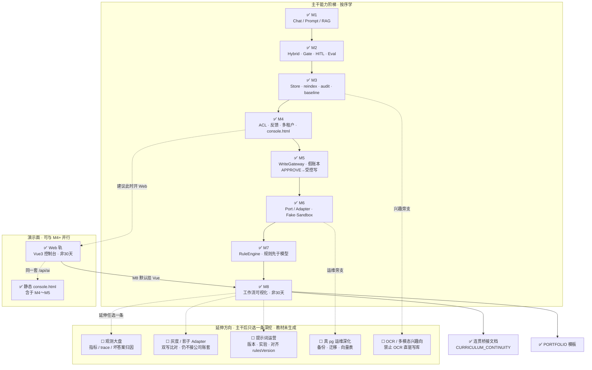

# 全部学习方向总览（含对勾 + 分支图）

> **用途：** 一眼看清「先学什么 → 再学什么 → 延伸可选什么」；**已生成教材打 ✅，未生成打 ☐**。  
> **边界：** 纯学习；不接公司生产库 / SSO / 规则平台 / BPM。  
> **连贯细节：** [lessons/CURRICULUM_CONTINUITY.md](./lessons/CURRICULUM_CONTINUITY.md) · **作品集：** [PORTFOLIO.md](./PORTFOLIO.md)

**图例**

| 标记 | 含义 |
|---|---|
| ✅ | 仓库已有完整讲义（可开读） |
| ☐ | 方向已规划，教材尚未生成 |
| → | 推荐先后顺序（主干） |
| ∥ | 可并行（不替代主干） |
| ⇢ | 延伸分支（主干完成后任选一条） |

---

## 1. 分支总图（推荐阅读顺序）



### 同内容 ASCII 速览（无 Mermaid 时）

```text
主干（已全部 ✅）
  ✅M1 Chat/RAG
    → ✅M2 Hybrid/Gate/HITL/Eval
      → ✅M3 Store/Audit/Baseline
        → ✅M4 ACL/Tenant/Feedback/console.html
          → ✅M5 WriteGateway + 假账本          ← HITL 语义转折点
            → ✅M6 Port/Adapter
              → ✅M7 RuleEngine
                → ✅M8 工作流可视化（非30天）
                      ⇢ ☐观测大盘 | ☐灰度影子 | ☐提示词运营

并行演示面
  M4+ ∥ ✅Web Vue 控制台 ──(M8 默认挂这里)──► M8
       ∥ ✅static/console.html（M4～M5 彩排）

兴趣旁支（勿抢主干）
  M3 ⇢ ☐OCR/多模态（禁止直驱写库）
  M6 ⇢ ☐真 pg 运维深化
```

---

## 2. 全部方向清单（对勾总表）

### 2.1 主干（必须按序）

| 状态 | 方向 | 一句话 | 入口 |
|---|---|---|---|
| ✅ | **M1** Chat / Prompt / RAG | 会生成、会检索、懂 few-shot | [MONTH1.md](./MONTH1.md) |
| ✅ | **M2** Hybrid / Gate / HITL / Eval | 检索更稳、幻觉可拦、人工确认最小流 | [MONTH2.md](./MONTH2.md) |
| ✅ | **M3** Store / reindex / audit / baseline | 可运维、可追溯、可回归 | [MONTH3.md](./MONTH3.md) |
| ✅ | **M4** ACL / 反馈 / 多租户 / console | 可隔离、可反馈、可演示 | [MONTH4.md](./MONTH4.md) |
| ✅ | **M5** 受控写入 / 假账本 | APPROVE 后经 Gateway 写学习假账 | [MONTH5.md](./MONTH5.md) |
| ✅ | **M6** Port / Adapter | 换 ERP 只换适配器，不改编排 | [MONTH6.md](./MONTH6.md) |
| ✅ | **M7** 规则引擎 | 确定性规则外置；规则先于模型 | [MONTH7.md](./MONTH7.md) |
| ✅ | **M8** 工作流可视化 | 把 Flow 画成图；非 30 天完整教材 | [MONTH8.md](./MONTH8.md) |

### 2.2 演示面（与主干并行，不替代）

| 状态 | 方向 | 一句话 | 入口 |
|---|---|---|---|
| ✅ | **Web** Vue3 学习控制台 | proxy + Pinia 身份头；可维护 UI | [WEB.md](./WEB.md) |
| ✅ | **static console.html** | 零前端工程彩排（写在 M4～M5 讲义内） | M4 合订 D22+ |
| ✅ | **连贯桥接** | HITL 时间线 / 双控制台 / 旧菜单对照 | [CURRICULUM_CONTINUITY.md](./lessons/CURRICULUM_CONTINUITY.md) |
| ✅ | **PORTFOLIO** | 作品集按月填证据 | [PORTFOLIO.md](./PORTFOLIO.md) |

### 2.3 延伸分支（主干完成后 · 教材 ☐）

| 状态 | 方向 | 建议前置 | 说明 |
|---|---|---|---|
| ☐ | 观测大盘 | M3 观测字段 + M8 | 指标 / trace / 坏答案归因平台化 |
| ☐ | 灰度 / 影子 Adapter | M6 | 双写比对；仍不接公司真实账套 |
| ☐ | 提示词运营 | M1 Prompt + M7 rulesVersion | 版本、A/B、与规则版本对齐 |
| ☐ | 真 pg 运维深化 | M3 Pg 可选 + M6 | 备份、迁移、向量表运维 |
| ☐ | OCR / 多模态兴趣向 | M3 可选提及 | **禁止** OCR 结果直接驱动写库 |

### 2.4 明确不做（全程 ❌，不是「以后方向」）

| 状态 | 项 |
|---|---|
| ❌ | 接公司生产库 / VPN / 真实账套 / SSO |
| ❌ | 模型持有「无审批写库存/过账」工具 |
| ❌ | 反馈自动改 prompt / 模型上线 |
| ❌ | 前端发明「一键过账」魔法接口 |
| ❌ | 接公司规则平台 / 公司 BPM 当学习主线 |
| ❌ | 前阶段强推 Python 训练/微调 |

---

## 3. 「先学 → 再学 → 延伸」决策简表

| 你现在卡在… | 先学 | 再学 | 不要先跳 |
|---|---|---|---|
| 还不会调 Chat/RAG | ✅M1 | ✅M2 | M5 写入 |
| 幻觉/检索不稳 | ✅M2 Gate/Hybrid | ✅M3 baseline | 规则引擎细节 |
| 改坏了不知道 | ✅M3 eval/baseline | ✅M4 反馈进题集 | 观测大盘（☐） |
| 演示时权限说不清 | ✅M4 ACL/租户 | ✅Web 或 console | 灰度 Adapter |
| 想做「过账」演示 | ✅M5 假账 + HITL | ✅M6 Port | 公司库 |
| 换实现就改遍业务 | ✅M6 | ✅M7 规则外置 | 影子双写（☐） |
| Prompt 与业务规则打架 | ✅M7 | ✅M8 图画清 | 提示词运营平台（☐） |
| 评审看不懂状态机 | ✅M8 + ✅Web | ☐观测 或 ☐灰度（选一） | 同时开三条延伸 |

---

## 4. 能力叠层（读图用）

```text
┌─────────────────────────────────────────────────────────────┐
│ ✅L8  Flow 可视化（图 · 回放 · 演示）                         │
│ ✅L7  RuleEngine（规则 ≥ 模型）                               │
│ ✅L6  Port / Adapter（可替换集成）                            │
│ ✅L5  WriteGateway + 假账本（受控写）                          │
│ ✅L4  ACL / 租户 / 反馈 / 演示台                              │
│ ✅L3  Store / 审计 / baseline                                 │
│ ✅L2  Hybrid / Gate / HITL / Eval                             │
│ ✅L1  Chat / Prompt / RAG                                     │
└─────────────────────────────────────────────────────────────┘
         ∥ ✅Web Vue          ∥ ✅console.html
         ⇢ ☐观测 / ☐灰度 / ☐提示词运营 / ☐pg运维 / ☐OCR
```

---

## 5. 统计（截至本文件修订日）

| 类别 | 数量 |
|---|---|
| ✅ 已生成主干月 | **8**（M1～M8） |
| ✅ 已生成并行轨/支撑 | **4**（Web、console 含于 M4、CONTINUITY、PORTFOLIO） |
| ☐ 延伸方向（未生成讲义） | **5** |
| ❌ 明确不做 | **6** 类（见 §2.4） |

主干 **8/8 已齐**；延伸方向按需再开「完整章节教材」，不必再卡 30 天。

---

## 修订

| 日期 | 说明 |
|---|---|
| 2026-08-15 | 首版：全方向对勾清单 + Mermaid/ASCII 分支图 + 决策简表 |
