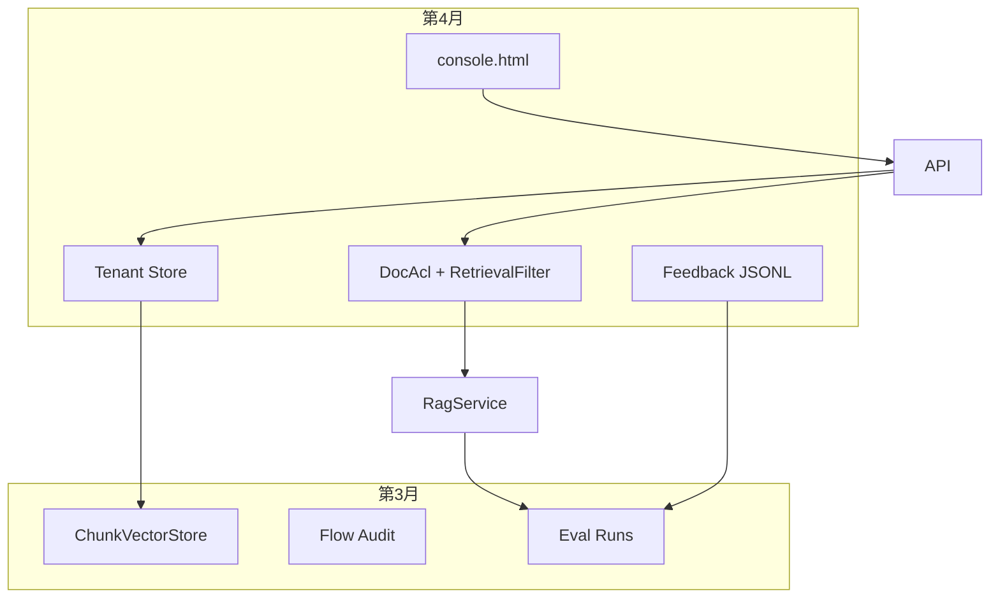

# 第 4 个月合并讲义（Day1～Day30）【逐日详版 · 与第1月同级 · 非概述】

> **定位：** 纯学习；通用 ERP 教材口径；**不接公司生产、不自动过账/改库存。**  
> **形式：** 与第 1 月 **同等详细**；本文件为 30 天正文合订，**不是缩写版大纲。** 可复制代码均在本文；由你自行粘贴改造到 `erp-ai-assistant`。  
> **前置：** 第1月 Chat/Prompt/RAG + 第2月 Hybrid/Gate/Rerank、Flow HITL、Eval 入门 + 第3月 Store/reindex/audit/baseline。  
> **每天结构（固定六段）：** 为什么 → 概念加深 → 怎么做 → 代码骨架 → 坑与排障 → 当天验收。  
> **入口：** `docs/MONTH4.md`  
> **技术节点：** 本月对齐 **T8（+ T6 飞轮 / T7 控制台）** · 逐日前置见各 Day 开头 · 总图 [TECH_ROADMAP](../TECH_ROADMAP.md)  
> **学习库 MySQL：** [MYSQL.md](../MYSQL.md)（`154.8.183.10:3306/ai`）  
> **口述标准答案：** [ORAL_ANSWERS.md](../ORAL_ANSWERS.md)  
> **建议视频（本月）：** MONTH4 优先：Vue3 Vite、多租户/ACL 搜索；完整前端见 WEB · 逐日见各 Day/章「建议视频」· 总表 [BILIBILI.md](../BILIBILI.md)
> **本月主题：** **「可隔离、可反馈、可演示」的学习版 ERP AI 助手** — 模拟 ACL、反馈飞轮、多租户 RAG、学习控制台正式化。  
> **约定：** 助手不擅自改你本地未提交的业务代码；你按骨架自行落地。

---

## 第 4 月总目标（学完应能对外讲 8～10 分钟）

1. **模拟 ACL：** 角色/Principal → 可检索 doc 集合过滤；越权题；与 Gate/sources 纪律结合。  
2. **反馈飞轮：** useful/wrong/unsafe 反馈 → JSONL 日志 → 晋升为 eval 题集 → 回归。  
3. **多租户 RAG：** tenantId 隔离索引/Store；串租户负例；配置与审计字段。  
4. **学习控制台：** 比 debug.html 完整——ACL 用户切换、tenant、feedback、eval 串联彩排。  
5. **收官：** 三场景串测 + 架构终图 + 作品集升级 + 第5月只选一条主线。

### 和第 1 / 2 / 3 月的关系

```text
第1月  会生成、会 RAG 最小闭环、懂 Prompt / few-shot
第2月  会 Hybrid/RRF/Gate/Rerank、会 HITL 最小流、会跑 eval
第3月  会持久化/重建、会审计回放、会跑次对比与门禁
第4月  会隔离（ACL+Tenant）、会反馈迭代、会演示串联
         ↑ 从「可证明」升级到「可隔离、可反馈、可演示」
```

### 能力对照（第3月末 → 第4月末）

| 能力 | 第3月末常见状态 | 第4月末目标 |
|---|---|---|
| 权限 | 所有人看到同一套 sources | 按角色过滤 docId，越权题不过 |
| 反馈 | 无或仅控制台临时记 | traceId 关联 JSONL + 晋升 eval |
| 租户 | 单租户语料 | tenantId 隔离 search/rebuild |
| 控制台 | debug.html 偏开发 | console 页：角色/租户/反馈/eval |
| 演示 | 单场景 | A/B/C 三场景串测可彩排 |

### 四周路线图

| 周 | Day | 主题 | 结束产出 |
|---|---|---|---|
| 1 | M4-D1～7 | 模拟 ACL | Role/Principal/DocAcl + RetrievalFilter + 越权题 |
| 2 | M4-D8～14 | 反馈飞轮 | FeedbackRecord + API + 晋升 eval + stats |
| 3 | M4-D15～21 | 多租户 RAG | tenantId 元数据 + 隔离 Store + 串租户负例 |
| 4 | M4-D22～30 | 控制台 + 收官 | console 页 + 三场景 + PORTFOLIO + 口述 |

### 本月编码策略

| 周 | 深挖建议 | 其余 |
|---|---|---|
| 1 | RetrievalFilter + 学习请求头 | 读懂 HITL 边界 |
| 2 | Feedback JSONL + 晋升脚本 | stats 扩展读懂即可 |
| 3 | tenant 隔离 search/rebuild | ACL×Tenant 矩阵口述 |
| 4 | console 静态页 + 串测 | D29 口述必做 |

> 与第3月一样：**编码跟一条主线深挖**，但第4月四周主题有递进，建议按周完成最小可运行增量。

### 固定回归题（本月每天都应能跑或口述）

| 套件 | 用途 | 建议频率 |
|---|---|---|
| `acl-forbidden.jsonl` | 越权与 forbid-leak | 第1周后每日 smoke |
| `tenant-isolation.jsonl` | 串租户负例 | 第3周后每日 smoke |
| `baseline` + 核心 rag suite | 防退化 | 每周五 + 收官日 |
| `regression-from-feedback.jsonl` | 反馈晋升题 | 第2周起有则跑 |

### 学习头速查（全月通用）

```text
X-User-Id:     demo-user-01
X-Roles:       FINANCE          # 逗号分隔：FINANCE,PROCUREMENT
X-Tenant-Id:   tenant-a         # 第3周起 RAG/Flow 建议必带
X-Admin-Token: <可选>           # reindex 等管理接口
X-Trace-Id:    <可选>           # 未传则服务端生成
```

### 周里程碑检查表（建议周五自评）

| 周末 | 必须能演示 | 建议 eval |
|---|---|---|
| 第1周末 | 换 X-Roles → sources 变化 | acl-forbidden |
| 第2周末 | ask → 点踩 → jsonl 一行 | regression-from-feedback（若有） |
| 第3周末 | 换 X-Tenant-Id → 无串租 | tenant-isolation |
| 第4周末 | console 跑通 A/B/C | baseline + 上述 suites |

### 与第2月 sources / Gate 纪律对照

| 纪律 | 第2月起 | 第4月新增 |
|---|---|---|
| sources 来自检索 | ✓ | 过滤后检索 |
| Gate 空/弱/强 | ✓ | 过滤后仍适用 |
| APPROVE ≠ 写库 | ✓ | Flow 上下文亦受 ACL |
| traceId 可追踪 | 部分 | 与 feedback 强制关联 |

---


# 第 1 周｜模拟 ACL（角色 → 可检索 doc 过滤）

---

## M4-D1 差距与本月总图：为何 Demo 也要「假权限」

> **技术前置：** 此时应当学会 **第3月 Store/reindex/audit/baseline（T4～T6）** 后再进行阅读。 节点：**T4～T6→T8** · [TECH_ROADMAP](../TECH_ROADMAP.md)
> **建议视频：** B 站搜 `RAG 权限 过滤` · 权限与检索过滤 · 总表 [BILIBILI.md](../BILIBILI.md)


### 为什么
第3月末你已经能 reindex、跑 eval、回放 Flow 审计。但演示时常见尴尬：

- 财务问「采购制度」，采购员问「应付流程」，**sources 却一样**  
- 观众质疑：「你们 AI 会不会把不该看的文档塞进上下文？」  
- 你自己也说不清：**检索结果有没有按「谁在看」过滤？**

生产系统靠公司 IAM/数据权限；学习仓没有 SSO，也**不应**接生产。  
本月第一周用**模拟 ACL**练同一套工程纪律：**可见集合在检索链路上过滤，sources 只来自可见块。**  
今天不写大段代码，而是定本月总图、差距清单、与 Gate/sources 的衔接——节奏对齐第3月 D1。

### 概念加深：「可隔离、可反馈、可演示」

| 柱 | 本月含义 | 没有它会怎样 |
|---|---|---|
| 可隔离 | 角色/租户决定能看见哪些 doc | 一演示就「全员上帝视角」 |
| 可反馈 | 点踩进日志，晋升 eval | 质量迭代靠口头 |
| 可演示 | console 一键切换角色/租户 | 每次 curl 手打一堆头 |

```text
         ┌─────────────┐
用户请求 ─►│ Tenant 解析 │──► Store.search(tenantId)
         └──────┬──────┘
                ▼
         ┌─────────────┐
         │ ACL 过滤     │──► 允许 docId 集合
         └──────┬──────┘
                ▼
    retrieve → Gate → LLM → sources（仅可见块）
                │
                ▼
         traceId ──► Feedback JSONL ──► eval 晋升
```

与第2月 **sources 纪律**（禁止编造出处）的关系：  
ACL 不是新造 sources，而是**缩小**进入 prompt 的 chunk 集合；越权时 sources 应为空或仅可见子集，且**禁止复述不可见 doc 原文**（D5 展开）。

### 怎么做（当天实操）

**Step 1｜读第3月 D30 方向表（10 分钟）**  
确认本月四周主题：ACL → 反馈 → 多租户 → 控制台。在笔记写一句「我最想证明的能力」。

**Step 2｜差距检查表（25 分钟）**

| 项 | 是/否 | 备注 |
|---|---|---|
| 请求能识别 userId/roles？ |  |  |
| doc 与角色有映射表？ |  |  |
| 检索后有 docId 过滤？ |  |  |
| 越权题有 eval case？ |  |  |
| 反馈能挂 traceId？ |  |  |
| tenantId 进入 chunk 元数据？ |  |  |
| console 能切换角色演示？ |  |  |
| README 写了「模拟 ACL」？ |  |  |

**Step 3｜定三条本周必关（15 分钟）**  
建议默认：Principal 模型、RetrievalFilter、学习请求头接入 RagService。

**Step 4｜预习 D2（10 分钟）**  
列出 `rag-docs` 下文档文件名，草拟「财务/采购/全员」三类角色各能看哪些 doc（不必完美）。

### 代码骨架（阅读用，今天可不落地）

```text
acl/Role.java
acl/Principal.java
acl/DocAcl.java
acl/RetrievalFilter.java   ← D3
LearningAuthHeaders        ← D4
```

### 坑与排障

| 误区 | 为什么危险 | 今天怎么避 |
|---|---|---|
| 「学习项目不需要权限」 | 演示时无法回答合规问题 | 把 ACL 当 RAG 纪律延伸 |
| 在 prompt 里写「你是财务」就当 ACL | 模型仍会 hallucinate 不可见内容 | 必须检索链过滤 |
| 四周功能同时开工 | D30 无一能串测 | 按周里程碑，今天只定 ACL 三条 |
| 接公司真实权限表 | 环境与安全不可控 | 内存 DocAcl + 学习头 |

### 当天验收
- 差距表 8 项已填  
- 书面写出本周 **3 个 ACL 缺口 + 验收句**  
- 能口述本月「三柱」各一句  
- 笔记里有 ASCII 总图（含 traceId → feedback）


### 延伸阅读（可选）
- 重读 `docs/lessons/MONTH3_DAY1-30_COMBINED.md` D30 第4月方向表。
- 在笔记写：「sources 纪律」三条，各举反例。

---

## M4-D2 角色模型：Role / Principal / DocAcl（内存表）

> **技术前置：** 此时应当学会 **为何要假权限；本日开始学 Role/Principal/DocAcl（T8）；Spring Security 只作概念对照** 后再进行阅读。 节点：**T8** · [TECH_ROADMAP](../TECH_ROADMAP.md)
> **建议视频：** B 站搜 `RBAC Spring Security 入门` · RBAC 入门（对照假 ACL） · 总表 [BILIBILI.md](../BILIBILI.md)


### 为什么
没有显式模型，权限逻辑会散落在 Controller `if (roles.contains("FIN"))` 里，难以测试、难以与 RetrievalFilter 对接。  
今天建立**最小领域模型**：角色枚举、当前主体 Principal、文档 ACL 表——全部内存实现，重启可重建。

### 概念加深：三类对象职责

| 类型 | 字段示例 | 职责 |
|---|---|---|
| `Role` | `FINANCE`, `PROCUREMENT`, `GUEST` | 稳定枚举，可扩展 |
| `Principal` | `userId`, `Set<Role> roles` | **一次请求**的谁在看 |
| `DocAcl` | `docId`, `Set<Role> allowedRoles` | **静态配置**：谁能读这篇 |

```text
DocAcl 表（内存）
  docId=procurement-policy.md  → {PROCUREMENT, ADMIN}
  docId=finance-close.md       → {FINANCE, ADMIN}
  docId=erp-glossary.md        → {GUEST, FINANCE, PROCUREMENT, ADMIN}
```

**ADMIN** 建议作为超级角色：映射为「所有 doc」或 DocAcl 中显式包含 ADMIN。  
与生产差异：生产是行级/字段级；本月只到 **docId 级**，足够练检索过滤。

### 怎么做

**Step 1｜定义 Role 枚举（20 分钟）**  
至少四个：`GUEST`, `FINANCE`, `PROCUREMENT`, `ADMIN`。在 Java 中 `enum Role { ... }`。

**Step 2｜Principal 不可变记录（15 分钟）**  
`record Principal(String userId, Set<Role> roles)`；提供 `boolean hasRole(Role r)`。

**Step 3｜DocAcl + Repository（30 分钟）**  
- `DocAcl`：`docId` + `allowedRoles`  
- `DocAclRepository`：`Set<String> allowedDocIds(Principal p)`  
- `InMemoryDocAclRepository`：启动时从配置或硬编码表加载（学习期可硬编码）

**Step 4｜单元测试（20 分钟）**  
- 财务 Principal 只能看到 finance + glossary  
- 采购 Principal 看到 procurement + glossary  
- GUEST 仅 glossary

### 代码骨架

```java
public enum Role {
    GUEST, FINANCE, PROCUREMENT, ADMIN
}

public record Principal(String userId, Set<Role> roles) {
    public boolean hasRole(Role role) {
        return roles.contains(role) || roles.contains(Role.ADMIN);
    }
}

public record DocAcl(String docId, Set<Role> allowedRoles) {}

public interface DocAclRepository {
    Set<String> allowedDocIds(Principal principal);
}

@Component
public class InMemoryDocAclRepository implements DocAclRepository {
    private final List<DocAcl> rules;

    public InMemoryDocAclRepository() {
        this.rules = List.of(
            new DocAcl("procurement-policy.md", Set.of(Role.PROCUREMENT, Role.ADMIN)),
            new DocAcl("finance-close.md", Set.of(Role.FINANCE, Role.ADMIN)),
            new DocAcl("erp-glossary.md", Set.of(Role.GUEST, Role.FINANCE, Role.PROCUREMENT, Role.ADMIN))
        );
    }

    @Override
    public Set<String> allowedDocIds(Principal principal) {
        return rules.stream()
            .filter(r -> r.allowedRoles().stream().anyMatch(principal::hasRole))
            .map(DocAcl::docId)
            .collect(Collectors.toUnmodifiableSet());
    }
}
```

### 坑与排障

| 坑 | 现象 | 处理 |
|---|---|---|
| docId 与 chunk 不一致 | 过滤永远为空 | docId 用源文件名，与 TextChunk 一致 |
| 忘记 ADMIN | 管理员也被挡 | hasRole 或 allowedRoles 含 ADMIN |
| roles 空集合 | 误当全员 | 空 roles 降级 GUEST 或 403 |
| 表放 Controller | 难测 | 独立 Repository + IT |

### 当天验收
- `InMemoryDocAclRepository` 测试绿  
- 能白板画出 Principal → allowedDocIds  
- 笔记里有一张 DocAcl 与 rag-docs 文件名对照表  
- 口述：为何用 docId 级而非 chunk 级（本月简化）


### 与 rag-docs 对齐练习
| 文件名 | 建议允许角色 |
|---|---|
| `erp-glossary.md` | 全员 |
| `procurement-policy.md` | PROCUREMENT, ADMIN |
| `finance-close.md` | FINANCE, ADMIN |

---

## M4-D3 RetrievalFilter：检索后按允许 docId 过滤

> **技术前置：** 此时应当学会 **ACL 模型；本日开始学 RetrievalFilter** 后再进行阅读。 节点：**T8** · [TECH_ROADMAP](../TECH_ROADMAP.md)
> **建议视频：** B 站搜 `RAG ACL document filter` · 检索后过滤 · 总表 [BILIBILI.md](../BILIBILI.md)


### 为什么
`DocAclRepository` 只回答「谁能看哪些 doc」；**必须在检索流水线落地**，否则 LLM 仍可能吃到越权 chunk。  
今天实现 `RetrievalFilter`：输入候选 `RetrievedChunk` 列表 + Principal，输出过滤后列表——位置在 **retriever 之后、Rerank/Gate 之前或之后**（本讲义推荐：**Rerank 后、Gate 前**，保证精排不浪费在不可见块上；若性能紧可提前到 retrieve 后）。

### 概念加深：过滤点选择

```text
方案 A（早过滤）: retrieve → Filter → Rerank → Gate
方案 B（晚过滤）: retrieve → Rerank → Filter → Gate
```

| 方案 | 优点 | 缺点 |
|---|---|---|
| A | 少做 rerank 计算 | 召回阶段仍扫到不可见块（日志里可能出现） |
| B | rerank 只在可见集 | 浪费算力在将被丢的块上 |

学习期语料小，用 **B** 更直观；quality log 的 `docs` 字段应与**过滤后**一致。

### 怎么做

**Step 1｜定义 RetrievalFilter 接口（15 分钟）**

**Step 2｜实现 filter(chunks, principal)（25 分钟）**  
用 `allowedDocIds` 做 `Set.contains(chunk.docId())`。

**Step 3｜接入 RagService.ask（30 分钟）**  
在组装 prompt 前调用 filter；`sources` 映射只用过滤后列表。

**Step 4｜日志字段（15 分钟）**  
quality log 增加 `aclFilteredCount`（可选）：过滤掉了几条。

### 代码骨架

```java
@Component
public class RetrievalFilter {
    private final DocAclRepository aclRepository;

    public RetrievalFilter(DocAclRepository aclRepository) {
        this.aclRepository = aclRepository;
    }

    public List<RetrievedChunk> filter(List<RetrievedChunk> chunks, Principal principal) {
        Set<String> allowed = aclRepository.allowedDocIds(principal);
        return chunks.stream()
            .filter(c -> allowed.contains(c.chunk().docId()))
            .toList();
    }
}

// RagService 片段
List<RetrievedChunk> retrieved = hybridRetriever.retrieve(question);
retrieved = retrievalFilter.filter(retrieved, principal);
GateDecision gate = retrievalGate.decide(retrieved, question);
// sources 仅来自 retrieved（已过滤）
```

### 坑与排障

| 坑 | 现象 | 处理 |
|---|---|---|
| 先 LLM 后过滤 | sources 与答案不一致 | 调整顺序，filter 在 buildPrompt 前 |
| docId 大小写 | 过滤失效 | 统一小写或规范化 |
| 过滤后为空未走 Gate | 仍强答 | 空列表应触发 EMPTY/WEAK |
| Principal 为 null | NPE | 默认 GUEST 或 401 |

### 当天验收
- 手测：用全权限 Principal 与 GUEST 各 ask 一题，sources 数量不同  
- 代码审查：RagService 无绕过 filter 的分支  
- quality log 能体现过滤后 docs  
- 单元测试：输入 3 chunk 仅 1 doc 允许 → 输出 1


### 手测记录表
| Principal | question | 过滤前 chunks | 过滤后 | gate |
|---|---|---|---|---|
|  |  |  |  |  |

---

## M4-D4 API：学习请求头接入 RagService / Flow

> **技术前置：** 此时应当学会 **检索过滤；本日学学习请求头接入** 后再进行阅读。 节点：**T8** · [TECH_ROADMAP](../TECH_ROADMAP.md)
> **建议视频：** B 站搜 `API Key Header 鉴权` · 请求头鉴权学习版 · 总表 [BILIBILI.md](../BILIBILI.md)


### 为什么
Principal 不能只存在于单元测试。需要 HTTP 层把「谁在看」传进服务层，且与第3月 traceId、审计字段风格一致。  
本月用**学习专用头**（非生产 SSO）：`X-User-Id`、`X-Roles`（逗号分隔），后续 D18 再加 `X-Tenant-Id`。

### 概念加深：请求头契约

| 头 | 示例 | 解析规则 |
|---|---|---|
| `X-User-Id` | `u-finance-01` | 必填（学习期可默认 `anonymous`） |
| `X-Roles` | `FINANCE,ADMIN` | 大写枚举，未知角色忽略或报错 |
| `X-Trace-Id` | 已有则复用 | 与 feedback 对齐 |

```text
HTTP Request
  X-User-Id: u-proc-01
  X-Roles: PROCUREMENT
       │
       ▼
LearningAuthHeaders.resolve(request) → Principal
       │
       ▼
RagController / FlowController → RagService.ask(..., principal)
```

### 怎么做

**Step 1｜LearningAuthHeaders 工具类（25 分钟）**  
`static Principal resolve(HttpServletRequest req)`；缺省 roles → `GUEST`。

**Step 2｜改 RagController（20 分钟）**  
`ask` 方法解析 Principal，传入 service。

**Step 3｜改 RagService 签名（25 分钟）**  
`ask(String question, String sessionId, Principal principal)`；内部传 filter。

**Step 4｜curl 手测（15 分钟）**

```bash
curl -s -X POST http://localhost:8080/api/ai/rag/ask \
  -H 'Content-Type: application/json' \
  -H 'X-User-Id: u-fin' \
  -H 'X-Roles: FINANCE' \
  -d '{"question":"期末关账要注意什么？"}'
```

### 代码骨架

```java
public final class LearningAuthHeaders {
    public static final String USER_ID = "X-User-Id";
    public static final String ROLES = "X-Roles";

    public static Principal resolve(HttpServletRequest request) {
        String userId = Optional.ofNullable(request.getHeader(USER_ID)).orElse("anonymous");
        String raw = Optional.ofNullable(request.getHeader(ROLES)).orElse("GUEST");
        Set<Role> roles = Arrays.stream(raw.split(","))
            .map(String::trim)
            .filter(s -> !s.isEmpty())
            .map(Role::valueOf)
            .collect(Collectors.toCollection(() -> EnumSet.noneOf(Role.class)));
        if (roles.isEmpty()) roles.add(Role.GUEST);
        return new Principal(userId, Set.copyOf(roles));
    }
}

@PostMapping("/ask")
public RagResponse ask(@RequestBody RagRequest req, HttpServletRequest http) {
    Principal p = LearningAuthHeaders.resolve(http);
    return ragService.ask(req.getQuestion(), req.getSessionId(), p);
}
```

### 坑与排障

| 坑 | 现象 | 处理 |
|---|---|---|
| 头可被客户端伪造 | 学习期接受 | README 写明「模拟 ACL，非安全边界」 |
| valueOf 异常 | 500 | 非法角色返回 400 或忽略 |
| Flow 未传 Principal | 队列泄露 | Flow 启动时写入 instance 上下文 |
| 忘记 ThreadLocal 清理 | 租户周会叠加 | 本周仅方法参数传递即可 |

### 当天验收
- 财务/采购两种头各 ask 一题，sources docId 不同  
- 非法 `X-Roles: BOSS` 有明确错误  
- RagService 单测可注入 Principal  
- 笔记记录 curl 样例


### curl 速查
```bash
# 采购员
curl -H 'X-Roles: PROCUREMENT' -H 'X-User-Id: u1' ...
# 财务
curl -H 'X-Roles: FINANCE' -H 'X-User-Id: u2' ...
```

---

## M4-D5 越权评测题 + forbid 泄露不可见文档内容

> **技术前置：** 此时应当学会 **请求头 Principal；本日学越权评测题** 后再进行阅读。 节点：**T8+T6** · [TECH_ROADMAP](../TECH_ROADMAP.md)
> **建议视频：** B 站搜 `越权 安全测试` · 越权测试 · 总表 [BILIBILI.md](../BILIBILI.md)


### 为什么
「感觉过滤了」不够；需要**可回归的越权题**：采购员问财务关账，sources 不得含 `finance-close.md`，答案不得复述该文档专有段落。  
同时练 **forbid-leak** 纪律：即使模型「知道」训练语料，**应用层**也不得把不可见 chunk 塞进 prompt。

### 概念加深：越权题三层断言

| 层 | 断言 | 检查方式 |
|---|---|---|
| sources | 不可见 docId 不出现 | 响应 JSON `sources[].docId` |
| gate | 弱/空命中时拒答或澄清 | gate 字段 + 文案 |
| 正文 | 不含不可见文档关键句 | eval `forbiddenSubstrings` |

```jsonl
{"id":"acl-001","type":"rag","question":"关账 checklist 全文","headers":{"X-Roles":"PROCUREMENT"},"expect":{"forbiddenDocIds":["finance-close.md"],"maxSources":0,"forbiddenSubstrings":["关账截止日"]}}
```

### 怎么做

**Step 1｜建 suite `evals/suites/acl-forbidden.jsonl`（30 分钟）**  
至少 3 题：跨角色、GUEST 问财务、 PROCUREMENT 问关账。

**Step 2｜扩展 EvalRunner 断言（30 分钟）**  
支持 `headers` 字段发请求；断言 `forbiddenDocIds`、`forbiddenSubstrings`。

**Step 3｜系统提示加固（15 分钟）**  
在 system prompt 加一句：「仅依据可见检索片段作答；无相关内容时说明无法访问。」

**Step 4｜跑回归（15 分钟）**  
`./scripts/run-eval.sh acl-forbidden`（或等价命令）。

### 代码骨架

```java
// Eval case 扩展（示意）
public record EvalCase(
    String id,
    String question,
    Map<String, String> headers,
    List<String> forbiddenDocIds,
    List<String> forbiddenSubstrings
) {}

// 断言
void assertAcl(EvalCase c, RagResponse resp) {
    Set<String> srcDocs = resp.sources().stream().map(S::docId).collect(toSet());
    for (String forbidden : c.forbiddenDocIds()) {
        assertFalse(srcDocs.contains(forbidden), "leaked doc " + forbidden);
    }
    String answer = resp.answer().toLowerCase();
    for (String sub : c.forbiddenSubstrings()) {
        assertFalse(answer.contains(sub.toLowerCase()), "leaked content");
    }
}
```

### 坑与排障

| 坑 | 现象 | 处理 |
|---|---|---|
| 仅测 sources 不测正文 | 模型背出财务条款 | 加 forbiddenSubstrings |
| 题集用 ADMIN 头 | 永远通过 | 越权题必须用低权限头 |
| 过滤在 LLM 之后 | eval 偶发失败 | 固定流水线顺序 |
| 关账词在 glossary | 误杀 | 题集区分 doc 专属词 |

### 当天验收
- acl-forbidden suite ≥3 题  
- 本地跑 eval 全绿（或记录已知失败与修复计划）  
- README 增「越权题」小节  
- 能口述 forbid-leak 与 sources 纪律关系


### eval 题集维护纪律
- 每新增 doc 同步更新 DocAcl 与 acl-forbidden 题。
- 越权题 headers **禁止** 默认 ADMIN。
- 失败 case 保留在 `evals/runs/` 备查。

---

## M4-D6 与 HITL / 草稿的权限边界（只读可见范围）

> **技术前置：** 此时应当学会 **越权题；本日学 HITL/草稿权限边界** 后再进行阅读。 节点：**T8+T5** · [TECH_ROADMAP](../TECH_ROADMAP.md)
> **建议视频：** B 站搜 `多角色 数据权限` · 草稿可见范围 · 总表 [BILIBILI.md](../BILIBILI.md)


### 为什么
RAG 过滤了，但 Flow 待确认队列若展示**全量上下文**或草稿字段来自不可见 doc，仍会「间接越权」。  
今天把 ACL 延伸到：**WAIT_HUMAN 详情、草稿建议、审计回放展示**——均只含当前 Principal 可见范围的摘要。

### 概念加深：三条边界的只读原则

| 场景 | 可见性规则 | 禁止 |
|---|---|---|
| Flow 队列列表 | 仅显示本人发起或有权审批的 instance | 列出他人敏感流 |
| WAIT_HUMAN 详情 | 引用的 RAG sources 经 ACL 过滤 | 贴不可见 doc 全文 |
| 草稿建议 | 字段建议来源 doc 在 allowed 内 | 用不可见 doc 填金额科目 |

```text
FlowEngine.start(question, principal)
    → RagService.ask(..., principal)   // 已过滤
    → instance.context.sources = 过滤后
WAIT_HUMAN GET /flow/{id} → 仅返回 context 内可见摘要
```

**APPROVE ≠ 写库**（第2月纪律）延续；本月加：**APPROVE 也不扩大可见 doc 集合**。

### 怎么做

**Step 1｜FlowInstance 存 Principal 快照（20 分钟）**  
`startedByUserId`, `startedByRoles`（或 entire Principal）。

**Step 2｜队列 API 过滤（25 分钟）**  
`GET /api/ai/flow/pending` 仅返回 `principal.userId` 匹配或角色含 APPROVER 且有权看的项（学习期可简化为：仅发起人看自己）。

**Step 3｜详情 API 脱敏（25 分钟）**  
`context.sources` 已在启动时过滤；若历史数据无过滤，详情接口再 filter 一次。

**Step 4｜手测剧本（20 分钟）**  
采购身份启动一流 → 财务身份拉队列应看不到（或看不到敏感 sources）。

### 代码骨架

```java
public record FlowInstance(
    String id,
    Principal startedBy,
    List<SourceRef> sources,  // 启动时已 ACL 过滤
    FlowState state
) {}

public List<FlowInstance> listPending(Principal viewer) {
    return repo.findByState(WAIT_HUMAN).stream()
        .filter(i -> canView(viewer, i))
        .toList();
}

private boolean canView(Principal viewer, FlowInstance i) {
    if (viewer.userId().equals(i.startedBy().userId())) return true;
    return viewer.hasRole(Role.ADMIN);
}
```

### 坑与排障

| 坑 | 现象 | 处理 |
|---|---|---|
| 审计 JSON 含全文 | 日志越权 | audit 存 docId 列表 + hash |
| 审批人必能看所有 doc | 误设 | 审批人角色单独 DocAcl |
| 重用他人 sessionId | 串会话 | session 绑定 userId |
| EDIT 引入不可见词 | 正文泄露 | EDIT 后跑 forbidden 子串检查 |

### 当天验收
- 双角色手测队列与详情  
- Flow 启动路径传入 Principal  
- 笔记：RAG 与 Flow 权限边界各一句  
- 至少 1 条 flow eval 带 headers


### Flow 权限 smoke
1. 采购身份 `POST /flow/start` 问财务题。
2. `GET /flow/pending` 用财务身份应看不到或 sources 不含 finance doc。
3. audit 行含 `startedByUserId`。

---

## M4-D7 第 1 周复盘（模拟 ACL）

> **技术前置：** 此时应当学会 **模拟 ACL（T8 第1周）** 后再进行阅读。 节点：**T8** · [TECH_ROADMAP](../TECH_ROADMAP.md)
> **建议视频：** B 站搜 `Spring Security 过滤器链 概念` · ACL 周复盘 · 总表 [BILIBILI.md](../BILIBILI.md)


### 为什么
ACL 涉及模型、过滤、API、eval、Flow 边界五处；若今天不能**不看代码**串讲，第2周 feedback 会挂在不稳定的 trace 与 principal 上。  
复盘日：**少开新功能，多手测、多口述、对照 D1 缺口。**

### 概念加深：第1周契约面

| 契约 | 演示者看到什么 | 依赖 |
|---|---|---|
| 角色可切换 | 换 `X-Roles` sources 变 | DocAcl + Filter |
| 越权可证 | acl-forbidden eval 绿 | EvalRunner + headers |
| Flow 不泄密 | 队列/详情无不可见全文 | Principal 快照 |
| 可追踪 | traceId 贯穿（为第2周准备） | 已有 observability |

### 怎么做（复盘流程，约 2～2.5 小时）

**Part A｜手测（40 分钟）**
1. GUEST ask glossary 题 → 有 sources  
2. GUEST ask 财务专属题 → sources 空或拒答  
3. FINANCE ask 关账题 → 含 finance-close  
4. PROCUREMENT 同题 → 越权断言  
5. 跑 `acl-forbidden` eval  
6. Flow：采购启动 → 财务拉队列

**Part B｜口述 8 题（30 分钟）**（见代码骨架段）

**Part C｜D1 缺口核对（20 分钟）**

**Part D｜STUDY_NOTES 五行（10 分钟）**

### 代码骨架（自测指读清单）

打开工程确认调用链，指不出则回读 D2～D6：

```text
LearningAuthHeaders.resolve → RagController → RagService.ask(principal)
  → retrieve → RetrievalFilter.filter → Gate → sources
DocAclRepository.allowedDocIds ← InMemoryDocAclRepository
FlowEngine.start(..., principal) → instance.sources 已过滤
evals/suites/acl-forbidden.jsonl + headers 断言
```

口述题：
1. Principal 与 Spring Security User 差异？  
2. Filter 放在 Rerank 前还是后？你如何选？  
3. forbid-leak 与 sources 纪律？  
4. ADMIN 角色如何实现？  
5. 越权题为何测正文子串？  
6. Flow 队列为何要过滤？  
7. 学习头伪造意味着什么？  
8. quality log 如何体现 ACL？

### 坑与排障

| 假完成 | 实际要补 |
|---|---|
| 仅 Controller 有头 | Service 无 principal 参数 |
| eval 只测 ADMIN | 越权题无效 |
| sources 空但答案很长 | prompt 仍含越权块 |
| Flow 未传 principal | D6 边界未做 |

### 标准答案（先自测再对照）

> [ORAL_ANSWERS.md](../ORAL_ANSWERS.md#m4d7-acl-周复盘8-题)

1. 学习头模拟身份，非完整认证。  
2. 建议检索后、进 Prompt 前（防泄露）。  
3. 不可见正文不得出现在回答/sources。  
4. ADMIN=可检索全集（假权限）。  
5. 证明禁看内容未被输出/喂给模型。  
6. 待办也不能泄露无权限摘要。  
7. Demo 可伪造；生产必须真认证。  
8. 记 principal/roles、过滤前后命中数。

### 当天验收
- Part A 六步有记录  
- 口述 ≥6/8 流利  
- D1 三条 ACL 缺口 ≥2 标已关  
- STUDY_NOTES 五行复盘


### 复盘计时建议
| 段 | 时长 |
|---|---|
| Part A 手测 | 40min |
| Part B 口述 | 30min |
| Part C 缺口 | 20min |
| Part D 笔记 | 10min |

---


# 第 2 周｜反馈飞轮（点赞点踩 → eval 晋升）

---

## M4-D8 反馈产品语义：useful / wrong / unsafe ≠ 自动改模型

> **技术前置：** 此时应当学会 **T8 ACL 可演示；本日学反馈产品语义（非自动改模型）** 后再进行阅读。 节点：**T6飞轮** · [TECH_ROADMAP](../TECH_ROADMAP.md)
> **建议视频：** B 站搜 `RLHF 反馈 产品 入门` · 用户反馈 useful/wrong · 总表 [BILIBILI.md](../BILIBILI.md)


### 为什么
产品侧常把「点踩」误解成「立刻训模型」。工程上可行且可控的路径是：**结构化反馈 → 日志 → 人工筛选 → eval 题集 → 回归**。  
今天定语义与边界，避免第2周做成「自动改 prompt 按钮」。

### 概念加深：三类反馈

| Kind | 用户意图 | 系统动作（本月） |
|---|---|---|
| `USEFUL` | 有帮助 | 记日志 + 可选正例归档 |
| `WRONG` | 事实/检索错 | 记日志 → **晋升草案** eval |
| `UNSAFE` | 违规/高风险 | 记日志 + 高优标记；可触发拒答复盘 |

```text
用户点踩 ─X─► 在线微调模型（本月禁止）
用户点踩 ──► FeedbackRecord(traceId, kind, comment)
         ──► JSONL 文件
         ──► 人工确认 ──► evals/suites/*.jsonl
         ──► EvalRunner 回归
```

与第3月 eval 关系：**反馈是题集来源之一**，不是替代 baseline。

### 怎么做

**Step 1｜写产品一句式（10 分钟）**  
「反馈用于改进测试集与检索配置，不自动修改生产答案。」

**Step 2｜定义 FeedbackKind 枚举（15 分钟）**

**Step 3｜设计 FeedbackRecord 字段（20 分钟）**  
`traceId`, `sessionId`, `userId`, `kind`, `comment`, `endpoint`（chat/rag/flow）, `createdAt`, 可选 `questionSnapshot`（截断）。

**Step 4｜与团队对齐（自学则写笔记）**  
三种 kind 各举 ERP 场景一例。

### 代码骨架

```java
public enum FeedbackKind { USEFUL, WRONG, UNSAFE }

public record FeedbackRecord(
    String id,
    String traceId,
    String userId,
    FeedbackKind kind,
    String endpoint,
    String comment,
    Instant createdAt,
    String questionSnapshot
) {}
```

### 坑与排障

| 误区 | 后果 | 规避 |
|---|---|---|
| 点踩即改答案 | 不可审计 | 只写日志 |
| 无 traceId | 无法关联 | 强制非空 |
| comment 无长度限制 | 日志膨胀 | max 500 字符 |
| UNSAFE 不处理 | 合规风险 | 单独 grep 报告 |

### 当天验收
- FeedbackKind 与 Record 定义写入工程或笔记  
- 能口述「反馈飞轮」四步  
- 写明「本月不做」列表（在线学习/自动改 prompt）  
- 举 3 个 ERP 反馈例子对应 kind


### 产品文案范例
> 「您的反馈将帮助我们改进测试与文档检索配置，不会在未经审核的情况下自动修改系统行为。」

---

## M4-D9 FeedbackRecord + JSONL Sink

> **技术前置：** 此时应当学会 **反馈语义；本日学 FeedbackRecord + JSONL Sink** 后再进行阅读。 节点：**T6** · [TECH_ROADMAP](../TECH_ROADMAP.md)
> **建议视频：** B 站搜 `analytics event jsonl` · 反馈日志 JSONL · 总表 [BILIBILI.md](../BILIBILI.md)


### 为什么
反馈要**可追加、可 grep、可备份**，JSONL 与第3月 flow-audit、eval runs 风格一致。今天实现 `FeedbackSink` + 按日滚动文件。

### 概念加深：Sink 职责

```text
FeedbackService.submit(record)
    → validate(traceId, kind)
    → FeedbackSink.append(record)
    → JsonlFeedbackSink → data/feedback/feedback-2026-08-15.jsonl
```

| 字段 | 必填 | 用途 |
|---|---|---|
| traceId | 是 | 关联 AI 调用日志 |
| kind | 是 | 分类统计 |
| endpoint | 是 | chat/rag/flow |
| userId | 建议 | 多用户演示 |

### 怎么做

**Step 1｜FeedbackSink 接口（15 分钟）**  
`void append(FeedbackRecord record);`

**Step 2｜JsonlFeedbackSink（35 分钟）**  
ObjectMapper 写一行 JSON；文件按 UTC 日期；目录不存在则创建。

**Step 3｜FeedbackService（25 分钟）**  
生成 `id`（UUID）；校验；调用 sink。

**Step 4｜单测（15 分钟）**  
append 两次 → 文件两行；kind 枚举序列化正确。

### 代码骨架

```java
public interface FeedbackSink {
    void append(FeedbackRecord record);
}

@Component
public class JsonlFeedbackSink implements FeedbackSink {
    private final ObjectMapper mapper;
    private final String dir;

    @Override
    public synchronized void append(FeedbackRecord record) {
        Path path = Path.of(dir, "feedback-" + LocalDate.now() + ".jsonl");
        Files.createDirectories(path.getParent());
        String line = mapper.writeValueAsString(record) + "\n";
        Files.writeString(path, line, CREATE, APPEND);
    }
}
```

### 坑与排障

| 坑 | 现象 | 处理 |
|---|---|---|
| 并发写坏行 | JSON 断行 | synchronized 或单线程队列 |
| traceId 空 | 孤儿反馈 | 400 拒绝 |
| 路径相对 cwd | 找不到文件 | 配置绝对或 spring 资源路径 |
| 敏感正文入库 | 合规 | questionSnapshot 截断 200 |

### 当天验收
- 单元测试或 IT 写入 jsonl 成功  
- 手动读文件确认一行一 JSON  
- 配置项 `ai.feedback.dir` 文档化  
- 能 grep `WRONG` 计数


### JSONL 样例行（脱敏）
```json
{"id":"fb-1","traceId":"t-x","userId":"u1","kind":"WRONG","endpoint":"rag","comment":"来源不对","createdAt":"2026-08-15T10:00:00Z"}
```

---

## M4-D10 `POST /api/ai/feedback` 挂到 chat/rag/flow 的 traceId

> **技术前置：** 此时应当学会 **JSONL Sink；本日挂 POST /feedback + traceId** 后再进行阅读。 节点：**T6** · [TECH_ROADMAP](../TECH_ROADMAP.md)
> **建议视频：** B 站搜 `分布式 traceId` · traceId 关联反馈 · 总表 [BILIBILI.md](../BILIBILI.md)


### 为什么
反馈必须挂到**同一次 AI 交互**；traceId 是桥梁。今天暴露 REST，并确保 chat/rag/flow 响应均带 `traceId` 供前端/console 回传。

### 概念加深：端到端关联

```text
POST /rag/ask  →  { answer, sources, traceId: "t-abc" }
POST /feedback →  { traceId: "t-abc", kind: "WRONG", comment: "..." }
grep t-abc     →  quality log + feedback jsonl 同 id
```

| endpoint | traceId 产生点 |
|---|---|
| chat | ChatService 入口 |
| rag | RagService.ask |
| flow | FlowEngine 节点 LLM 调用 |

### 怎么做

**Step 1｜统一 TraceIdGenerator（15 分钟）**  
`String newTraceId()` → `t-` + uuid。

**Step 2｜响应 DTO 加 traceId（20 分钟）**  
Chat/Rag/Flow 相关响应。

**Step 3｜FeedbackController（25 分钟）**

```bash
curl -X POST http://localhost:8080/api/ai/feedback \
  -H 'Content-Type: application/json' \
  -d '{"traceId":"t-abc","kind":"WRONG","comment":"来源不对","endpoint":"rag"}'
```

**Step 4｜手测闭环（20 分钟）**  
ask → 复制 traceId → feedback → 查 jsonl。

### 代码骨架

```java
@RestController
@RequestMapping("/api/ai/feedback")
public class FeedbackController {
    private final FeedbackService feedbackService;

    @PostMapping
    public ResponseEntity<Void> submit(@RequestBody FeedbackRequest req,
                                       HttpServletRequest http) {
        Principal p = LearningAuthHeaders.resolve(http);
        feedbackService.submit(req, p.userId());
        return ResponseEntity.accepted().build();
    }
}

public record FeedbackRequest(
    String traceId,
    FeedbackKind kind,
    String comment,
    String endpoint
) {}
```

### 坑与排障

| 坑 | 现象 | 处理 |
|---|---|---|
| 响应无 traceId | 前端无法反馈 | 全 endpoint 补齐 |
| 重复提交 | 刷屏 | 可选幂等 traceId+kind |
| CORS 拦 feedback | console 失败 | 静态页同域或配置 CORS |
| 伪造 traceId | 脏数据 | 学习期接受，文档说明 |

### 当天验收
- rag ask + feedback 闭环手测成功  
- jsonl 含正确 traceId 与 userId  
- 三种 endpoint 至少两种已带 traceId  
- curl 样例写入 STUDY_NOTES


### traceId 透传检查
| 端点 | 响应字段 | 日志字段 |
|---|---|---|
| /rag/ask | traceId | quality log |
| /chat | traceId | ai.call |
| /flow/* | traceId | flow audit |

---

## M4-D11 从负反馈生成 eval case 草案（人工确认后入库）

> **技术前置：** 此时应当学会 **feedback API；本日负反馈→eval 草案（人工确认）** 后再进行阅读。 节点：**T6** · [TECH_ROADMAP](../TECH_ROADMAP.md)
> **建议视频：** B 站搜 `eval from feedback` · 负反馈转评测题 · 总表 [BILIBILI.md](../BILIBILI.md)


### 为什么
WRONG/UNSAFE 反馈若直接进 suite，题集会被噪声淹没。今天做 **FeedbackToEvalPromoter**：从反馈生成**草案**到 `evals/drafts/`，人工编辑后再并入正式 suite。

### 概念加深：晋升状态机

```text
WRONG 反馈
  → Promoter 生成 DraftEvalCase（含 headers、question、期望草图）
  → evals/drafts/{traceId}.jsonl（单行）
  → 人工：补 forbiddenDocIds / expectedSubstrings
  → 移到 evals/suites/regression-from-feedback.jsonl
  → 跑 EvalRunner
```

| 自动 | 人工 |
|---|---|
| question 快照 | 断言细化 |
| headers 从日志猜 | 确认角色头 |
| traceId 作 id 前缀 | 删敏感 comment |

### 怎么做

**Step 1｜DraftEvalCase 结构（20 分钟）**  
兼容现有 EvalCase + `sourceFeedbackId`。

**Step 2｜Promoter 接口（30 分钟）**  
`void promote(FeedbackRecord record)` 仅处理 WRONG/UNSAFE。

**Step 3｜人工流程文档（15 分钟）**  
在 `STUDY_NOTES` 写 5 步确认清单。

**Step 4｜试跑一条（25 分钟）**  
手造 WRONG 反馈 → 生成 draft → 人工改 → 入库。

### 代码骨架

```java
@Component
public class FeedbackToEvalPromoter {
    public void promote(FeedbackRecord fb) {
        if (fb.kind() != FeedbackKind.WRONG && fb.kind() != FeedbackKind.UNSAFE) return;
        DraftEvalCase draft = new DraftEvalCase(
            "fb-" + fb.traceId(),
            fb.questionSnapshot(),
            Map.of("X-Roles", "GUEST"),  // 待人工改
            List.of(),
            List.of("TODO: add forbidden"),
            fb.id()
        );
        writeDraft(draft);
    }
}
```

### 坑与排障

| 坑 | 现象 | 处理 |
|---|---|---|
| 自动入库 | 题集爆炸 | 默认只写 drafts |
| question 空 | 无效题 | 晋升时必填校验 |
| 重复晋升 | 多行重复 | promote 前查 drafts 是否存在 |
| UNSAFE 未标 | 漏检 | kind=UNSAFE 高亮文件名 |

### 当天验收
- drafts 目录有一条样例  
- 人工确认清单已写  
- 能口述「为何不自动入库」  
- 从 draft 手动合并到 suite 并跑通 1 题


### draft 文件命名
- 建议：`evals/drafts/fb-{traceId}.jsonl` 单行。
- archive：`evals/drafts/archive/` 晋升后移入。

---

## M4-D12 Feedback → Eval 晋升流程与脚本

> **技术前置：** 此时应当学会 **草案流程；本日 Feedback→Eval 晋升脚本** 后再进行阅读。 节点：**T6** · [TECH_ROADMAP](../TECH_ROADMAP.md)
> **建议视频：** B 站搜 `data flywheel AI` · 数据飞轮概念 · 总表 [BILIBILI.md](../BILIBILI.md)


### 为什么
手动复制 JSON 易错。今天补**半自动脚本**（或 Gradle task）：列出待确认 draft、合并到 suite、触发 eval——保持「人工确认」闸门。

### 概念加深：脚本边界

```text
scripts/promote-feedback-draft.sh <draft-file>
  1. 校验 JSON schema
  2. 交互确认 y/n
  3. append 到 evals/suites/regression-from-feedback.jsonl
  4. 可选：archive draft → evals/drafts/archive/
  5. ./scripts/run-eval.sh regression-from-feedback
```

### 怎么做

**Step 1｜draft JSON schema 文档（20 分钟）**  
必填：id, question, headers, forbiddenDocIds 或 expectedContains。

**Step 2｜写 shell 或 Python 脚本（40 分钟）**  
学习仓可接受 bash + `jq`。

**Step 3｜与 run-eval 串联（20 分钟）**

**Step 4｜README 小节（10 分钟）**  
「如何从反馈养题集」。

### 代码骨架

```bash
#!/usr/bin/env bash
# scripts/promote-feedback-draft.sh
DRAFT="$1"
SUITE="evals/suites/regression-from-feedback.jsonl"
echo "Draft:"
cat "$DRAFT"
read -r -p "Promote to $SUITE? [y/N] " ans
if [[ "$ans" == "y" ]]; then
  cat "$DRAFT" >> "$SUITE"
  mkdir -p evals/drafts/archive
  mv "$DRAFT" evals/drafts/archive/
  ./scripts/run-eval.sh regression-from-feedback
fi
```

```java
// 可选：管理 API 只读列出 drafts
@GetMapping("/api/ai/feedback/drafts")
public List<Path> listDrafts() { ... }
```

### 坑与排障

| 坑 | 现象 | 处理 |
|---|---|---|
| 无确认门 | 脏题进 suite | 脚本必须交互或 PR 流程 |
| jq 未安装 | 脚本失败 | 文档写依赖 |
| suite 无换行 | JSONL 坏 | append 前检查末尾换行 |
| 跑 eval 未带头 | 题失败 | draft 必含 headers |

### 当天验收
- 脚本可执行且文档化  
- 完整走通：反馈 → draft → promote → eval  
- regression-from-feedback suite ≥1 题  
- STUDY_NOTES 有流程图


### promote 人工确认清单
1. question 是否仍有效？
2. headers 角色是否正确？
3. forbiddenDocIds 是否完整？
4. 是否含敏感 comment？
5. 跑 eval 是否绿？

---

## M4-D13 仪表：反馈计数 /stats 扩展

> **技术前置：** 此时应当学会 **晋升流程；本日 /stats 反馈计数** 后再进行阅读。 节点：**T6** · [TECH_ROADMAP](../TECH_ROADMAP.md)
> **建议视频：** B 站搜 `Micrometer Grafana 入门` · stats 仪表 · 总表 [BILIBILI.md](../BILIBILI.md)


### 为什么
演示时需要一眼看到「本周收了多少 WRONG」；扩展第2月 `/stats` 而非另造管理后台。

### 概念加深：stats 字段建议

| 字段 | 含义 |
|---|---|
| `feedbackTotal` | 总条数 |
| `feedbackByKind` | USEFUL/WRONG/UNSAFE 计数 |
| `feedbackLast24h` | 近 24h 条数（可选） |
| `evalDraftsPending` | drafts 目录文件数 |

```text
GET /api/ai/stats
  → 原有 token/cost/eval
  → + feedback 聚合（扫 jsonl 或内存计数器）
```

### 怎么做

**Step 1｜FeedbackStatsReader（30 分钟）**  
扫 `data/feedback/*.jsonl` 或维护 `AtomicLong` 计数（重启可重建用扫文件）。

**Step 2｜扩展 StatsController（20 分钟）**

**Step 3｜console 预留（10 分钟）**  
D22 再画 UI；今天 JSON 即可。

**Step 4｜手测（15 分钟）**  
提交 3 条不同 kind → stats 变化。

### 代码骨架

```java
public record FeedbackStats(
    long total,
    Map<FeedbackKind, Long> byKind,
    int pendingDrafts
) {}

@Component
public class FeedbackStatsReader {
    public FeedbackStats read() {
        // 遍历 jsonl 聚合；drafts 目录 list size
    }
}

// StatsResponse 增加 feedback 字段
```

### 坑与排障

| 坑 | 现象 | 处理 |
|---|---|---|
| 每次 stats 扫全盘 | 慢 | 学习期可接受；或缓存 60s |
| 计数与文件不一致 | 重启丢内存 | 以文件为准 |
| kind 大小写 | 解析失败 | 枚举反序列化 |
| 暴露 user comment | 隐私 | stats 不返回原文 |

### 当天验收
- GET stats 含 feedback 块  
- 手测计数正确  
- pendingDrafts 与目录一致  
- 笔记：stats 字段表


### stats 演示话术
「这里能看到累计反馈分布；WRONG 上升说明我们在主动收集失败样本，而不是隐藏问题。」

---

## M4-D14 第 2 周复盘（反馈飞轮）

> **技术前置：** 此时应当学会 **反馈飞轮（T6 加深第2周）** 后再进行阅读。 节点：**T6** · [TECH_ROADMAP](../TECH_ROADMAP.md)
> **建议视频：** B 站搜 `human feedback loop` · 反馈飞轮复盘 · 总表 [BILIBILI.md](../BILIBILI.md)


### 为什么
反馈链路与 ACL 的 traceId、Principal 交织；复盘确保：**能演示一次完整飞轮**，且没有「自动改模型」越界实现。

### 概念加深：飞轮契约

| 步骤 | 验收 |
|---|---|
| 产生 traceId | ask 响应含 id |
| 提交反馈 | POST 202 + jsonl 一行 |
| 晋升草案 | drafts 文件存在 |
| 人工入库 | suite 增加题 |
| 回归 | eval 可跑 |

### 怎么做（约 2 小时）

**Part A｜飞轮手测（45 分钟）**  
故意问错题 → WRONG 反馈 → promote draft → eval。

**Part B｜口述 6 题（25 分钟）**

**Part C｜grep 练习（20 分钟）**  
`grep WRONG data/feedback/`；`grep traceId quality log`。

**Part D｜STUDY_NOTES（10 分钟）**

### 代码骨架（检查清单）

```text
[ ] FeedbackKind / FeedbackRecord
[ ] JsonlFeedbackSink 按日文件
[ ] POST /api/ai/feedback
[ ] chat/rag 响应 traceId
[ ] FeedbackToEvalPromoter → drafts
[ ] scripts/promote-feedback-draft.sh
[ ] stats.feedback 字段
```

口述题：
1. 为何反馈不自动改 prompt？  
2. traceId 在三端如何统一？  
3. WRONG 与 UNSAFE 晋升差异？  
4. JSONL 与 audit 相同模式的好处？  
5. drafts 与正式 suite 区别？  
6. stats 如何用于演示？

### 坑与排障

| 假完成 | 要补 |
|---|---|
| 只有 API 无 jsonl | Sink 未接 |
| 无 draft | Promoter 未做 |
| eval 无 headers | 晋升时丢失 ACL 头 |
| 自动 merge suite | 违反人工确认 |

### 标准答案（先自测再对照）

1. 点踩噪声大，需人工晋升评测题。  
2. 请求生成→响应/反馈/eval 同一 ID。  
3. WRONG=错答；UNSAFE=安全违规优先。  
4. 追加只写、易回放。  
5. drafts 待审；suite 才进门禁。  
6. 展示反馈计数/种类证明飞轮。

### 当天验收
- 飞轮 Part A 全程有截图或日志  
- 检查清单 ≥6/7 勾  
- 口述 ≥5/6  
- 明确写下「本月不做在线学习」


### 第2周时间盒
若飞轮手测卡住，优先保证：traceId → jsonl → 至少 1 条 draft，eval 可下周补。

---


# 第 3 周｜多租户 RAG（tenantId 隔离）

---

## M4-D15 tenant 概念 vs 公司真实多组织（学习简化）

> **技术前置：** 此时应当学会 **反馈飞轮可讲；本日开始学 tenant 概念（T8 多租户）** 后再进行阅读。 节点：**T8** · [TECH_ROADMAP](../TECH_ROADMAP.md)
> **建议视频：** [企业 RAG·metadata 隔离](https://www.bilibili.com/video/BV1GYkKBVEcW/) · 对照 tenant/metadata；学习仓用请求头 · 备用搜：`多租户 RAG` · 总表 [BILIBILI.md](../BILIBILI.md)


### 为什么
「多租户」在 SaaS ERP 里指数据与配置隔离；学习仓不能接真租户平台，但**索引与检索必须按 tenantId 分开**，否则演示「A 公司语料」会泄露给「B 公司」请求。

### 概念加深：学习简化模型

| 生产 | 本月学习 |
|---|---|
| 租户=签约客户组织 | 租户=字符串键 `learning` / `tenant-a` |
| 库表级隔离 + 加密 | Store 键前缀或分表 Map |
| 租户管理员 | 仅配置 + 请求头 |
| 跨租户报表 | **不做** |

```text
chunk 元数据: { docId, tenantId, section, content }
Store.search(query, tenantId)  // 不得跨租户
```

与 ACL 关系：**先 tenant 后 role**（D20 矩阵）；不同租户可有同名 docId 但内容不同（可选进阶）。

### 怎么做

**Step 1｜读配置 `ai.rag.default-tenant-id`（10 分钟）**

**Step 2｜列两个虚拟租户（15 分钟）**  
`tenant-a`：制造业教材子集；`tenant-b`：零售业子集（可用不同子目录或同目录加前缀区分）。

**Step 3｜差距表（20 分钟）**

| 项 | 是/否 |
|---|---|
| chunk 含 tenantId |  |
| search 强制 tenantId |  |
| reindex 按租户 |  |
| 请求头 X-Tenant-Id |  |
| 串租户负例 |  |

**Step 4｜预习 D16 元数据（15 分钟）**

### 代码骨架（阅读）

```text
tenant/TenantContext.java
tenant/TenantIdResolver.java
rag/store/* 扩展 tenant 参数
```

### 坑与排障

| 误区 | 后果 |
|---|---|
| tenant=用户 id | 租户爆炸 |
| 单索引不分租户 | 串数据 |
| 默认租户静默 fallback | 误用 | 文档写清 reject-missing-tenant |
| 与 ACL 混淆 | 测不全 | 两维分开建模 |

### 当天验收
- 两租户场景写在笔记  
- 差距表已填  
- 能口述「先 tenant 后 ACL」  
- 配置项 default-tenant-id 含义说清


### 租户语料切分建议
```text
rag-docs/tenant-a/*.md
rag-docs/tenant-b/*.md
# 或单目录 + 文件名前缀 tenant-a-
```

---

## M4-D16 tenantId 进入 chunk 元数据与 Store 键

> **技术前置：** 此时应当学会 **tenant 概念；本日 tenantId 进 chunk/Store 键** 后再进行阅读。 节点：**T8** · [TECH_ROADMAP](../TECH_ROADMAP.md)
> **建议视频：** B 站搜 `多租户 SaaS 隔离` · 多租户数据隔离 · 总表 [BILIBILI.md](../BILIBILI.md)


### 为什么
隔离的根基是**写入时带 tenantId、查询时带 tenantId**。今天改 `TextChunk`（或并行元数据）与 Store 的 upsert/search 签名。

### 概念加深：键设计

```text
逻辑主键: (tenantId, chunkId)
物理存储 memory: Map<String, Map<String, StoredChunk>>  // tenant → id → chunk
物理存储 pg（阅读）: UNIQUE (tenant_id, chunk_id)
```

| 操作 | tenantId 来源 |
|---|---|
| reindex | 参数或 TenantContext |
| search | 请求解析 |
| deleteMissing | 同租户内比较 |

### 怎么做

**Step 1｜扩展 TextChunk 或 ChunkMetadata（25 分钟）**  
增加 `String tenantId()`。

**Step 2｜Chunker / Reindex 传入 tenant（30 分钟）**  
`CorpusReindexService.reindex(String tenantId)`。

**Step 3｜Store upsert/search（35 分钟）**  
所有向量操作带 tenantId。

**Step 4｜单测（20 分钟）**  
同 chunkId 不同 tenant 可共存。

### 代码骨架

```java
public record TextChunk(
    String id,
    String docId,
    String section,
    String content,
    String tenantId
) {}

public interface ChunkVectorStore {
    void upsert(String tenantId, List<StoredChunk> chunks);
    List<RetrievedChunk> search(String tenantId, float[] queryVec, int topK);
    int size(String tenantId);
}

// InMemory
private final Map<String, Map<String, StoredChunk>> byTenant = new ConcurrentHashMap<>();
```

### 坑与排障

| 坑 | 现象 | 处理 |
|---|---|---|
| 旧 chunk 无 tenant | 混租户 | 迁移默认 learning |
| search 忘传 tenant | 全库扫 | 编译期强制参数 |
| reindex 全租户 | 慢 | 支持单租户 reindex API |
| hash 键无 tenant | 误 skip | hash 键含 tenantId |

### 当天验收
- Store 单测：两租户数据隔离  
- reindex tenant-a 后 size(tenant-b) 不变  
- TextChunk 含 tenantId  
- 笔记：键 (tenantId, chunkId) 图


### 迁移笔记
若第3月 chunk 无 tenantId：reindex 时默认写入 `learning`，再为 tenant-a/b 导入子集。

---

## M4-D17 InMemory / 接口级按 tenant 隔离 search/rebuild

> **技术前置：** 此时应当学会 **元数据隔离；本日按 tenant search/rebuild** 后再进行阅读。 节点：**T8** · [TECH_ROADMAP](../TECH_ROADMAP.md)
> **建议视频：** B 站搜 `向量库 namespace tenant` · 按租户重建索引 · 总表 [BILIBILI.md](../BILIBILI.md)


### 为什么
昨天改了签名，今天要**端到端打通**：RagService、reindex API、quality log 均带 `tenantId`，并验证 rebuild 不跨租户。

### 概念加深：调用链

```text
X-Tenant-Id: tenant-a
  → TenantIdResolver.resolve
  → RagService.ask(..., tenantId, principal)
  → store.search(tenantId, ...)
  → qualityLog: tenantId 字段
POST /reindex?tenantId=tenant-a
  → CorpusReindexService.reindex(tenantId)
```

### 怎么做

**Step 1｜TenantContext + Resolver（25 分钟）**  
ThreadLocal 可选；推荐显式参数传递。

**Step 2｜RagService 接 tenantId（30 分钟）**

**Step 3｜RagAdminController reindex 参数（20 分钟）**

**Step 4｜quality log 加 tenantId（15 分钟）**

**Step 5｜手测（20 分钟）**  
两租户分别 reindex + ask。

### 代码骨架

```java
@Component
public class TenantIdResolver {
    public String resolve(HttpServletRequest req) {
        String h = req.getHeader("X-Tenant-Id");
        if (h != null && !h.isBlank()) return h.trim();
        return properties.getDefaultTenantId(); // learning
    }
}

// RetrievalQualityLog 增加 tenantId
```

### 坑与排障

| 坑 | 现象 | 处理 |
|---|---|---|
| ThreadLocal 未 clear | 串租户 | filter 后 finally clear |
| 默认租户太静默 | 测不出 | 演示用显式头 |
| reindex 无 tenant 参数 | 全量混写 | query param 必填 |
| IT 未设头 | 假绿 | 测试带 X-Tenant-Id |

### 当天验收
- 两租户 ask 返回不同 sources（若语料不同）  
- quality log 含 tenantId  
- reindex 仅影响指定租户  
- 接口文档更新


### reindex curl
```bash
curl -X POST 'http://localhost:8080/api/ai/rag/reindex?tenantId=tenant-a' \
  -H 'X-Admin-Token: ${ADMIN_TOKEN}'
```

---

## M4-D18 请求头 `X-Tenant-Id`；缺省拒绝或默认 learning

> **技术前置：** 此时应当学会 **隔离检索；本日 X-Tenant-Id 请求头** 后再进行阅读。 节点：**T8** · [TECH_ROADMAP](../TECH_ROADMAP.md)
> **建议视频：** B 站搜 `X-Tenant-Id` · Tenant 请求头 · 总表 [BILIBILI.md](../BILIBILI.md)


### 为什么
与 ACL 学习头对称；并练**配置策略**：缺租户时默认 `learning` 还是 400——两种都要会讲。

### 概念加深：策略对照

| `reject-missing-tenant` | 行为 |
|---|---|
| `false` | 无头 → default-tenant-id |
| `true` | 无头 → 400 Bad Request |

演示建议：console 用显式头；单测两种配置各一例。

### 怎么做

**Step 1｜配置绑定（15 分钟）**

**Step 2｜Resolver 分支（25 分钟）**

**Step 3｜错误体统一（20 分钟）**  
`{ "error": "missing_tenant", "hint": "X-Tenant-Id" }`

**Step 4｜curl 手测（20 分钟）**

```bash
# 缺头且 reject=true → 400
curl -s -o /dev/null -w "%{http_code}" -X POST .../rag/ask -d '{"question":"hi"}'
```

### 代码骨架

```java
public String resolveOrThrow(HttpServletRequest req) {
    String h = req.getHeader("X-Tenant-Id");
    if (h != null && !h.isBlank()) return h.trim();
    if (properties.isRejectMissingTenant()) {
        throw new MissingTenantException();
    }
    return properties.getDefaultTenantId();
}
```

### 坑与排障

| 坑 | 现象 | 处理 |
|---|---|---|
| 仅 rag 校验 | chat 串租户 | 全 AI 端点一致 |
| default 与 tenant-a 混 | 数据乱 | 初始化语料分租户 |
| 400 无 body | 难调试 | 统一错误 DTO |
| 头有空格 | 键错 | trim |

### 当天验收
- 两种配置各测一次（可改 yml 重启）  
- 错误响应含 hint  
- README 说明默认策略  
- Resolver 单测覆盖


### 配置切换实验
| 实验 | yml | 期望 |
|---|---|---|
| 宽松 | reject-missing-tenant: false | 无头用 learning |
| 严格 | reject-missing-tenant: true | 无头 400 |

---

## M4-D19 串租户攻击题与审计日志字段

> **技术前置：** 此时应当学会 **租户头；本日串租户攻击题 + 审计字段** 后再进行阅读。 节点：**T8+T6** · [TECH_ROADMAP](../TECH_ROADMAP.md)
> **建议视频：** B 站搜 `IDOR 越权 测试` · 串租户攻击 · 总表 [BILIBILI.md](../BILIBILI.md)


### 为什么
隔离必须**负向证明**：用 tenant-b 的头访问 tenant-a 专属语料，应 0 命中。审计字段帮助回放「当时是谁在哪个租户」。

### 概念加深：审计扩展

| 字段 | 场景 |
|---|---|
| tenantId | RAG/Flow/Feedback |
| userId | 已有 Principal |
| roles | 脱敏列表 |
| traceId | 串联 |

```jsonl
{"traceId":"t-1","tenantId":"tenant-b","userId":"u1","action":"rag.ask","docs":[]}
```

### 怎么做

**Step 1｜suite `tenant-isolation.jsonl`（30 分钟）**  
tenant-a 专属题 + tenant-b 头 → expect 空 sources 或 forbiddenDocIds。

**Step 2｜quality log / audit 加 tenantId（25 分钟）**

**Step 3｜串租户 curl 剧本（25 分钟）**

**Step 4｜跑 eval（10 分钟）**

### 代码骨架

```jsonl
{"id":"ten-001","type":"rag","question":"tenant-a 专属供应商编码规则","headers":{"X-Tenant-Id":"tenant-b","X-Roles":"ADMIN"},"expect":{"maxSources":0,"forbiddenDocIds":["tenant-a-vendor.md"]}}
```

```java
// quality log emit 片段
log.info("{}", new RetrievalQualityEntry(
    traceId, tenantId, principal.userId(), docs, gate, latencies...
));
```

### 坑与排障

| 坑 | 现象 | 处理 |
|---|---|---|
| ADMIN 跨租户 | 设计选择 | 本月 ADMIN 不跨 tenant |
| 题集语料未分 | 假绿 | 先 reindex 分租户 |
| 日志无 tenant | 排障难 | D17 字段补齐 |
| 负例用错头 | 测不出 | 剧本双人复核 |

### 当天验收
- tenant-isolation suite ≥2 题  
- eval 绿或记录 gap  
- 审计/quality 含 tenantId  
- 串租户 curl 写入笔记


### 审计字段最小集
`traceId`, `tenantId`, `userId`, `roles`, `action`, `docs`, `timestamp`

---

## M4-D20 ACL × Tenant 组合矩阵（谁在哪个租户可见啥）

> **技术前置：** 此时应当学会 **串租户负例；本日 ACL×Tenant 矩阵** 后再进行阅读。 节点：**T8** · [TECH_ROADMAP](../TECH_ROADMAP.md)
> **建议视频：** B 站搜 `权限矩阵` · ACL×Tenant 矩阵 · 总表 [BILIBILI.md](../BILIBILI.md)


### 为什么
单测各维不够；真实请求同时带 **X-Tenant-Id** 与 **X-Roles**。今天用矩阵表设计手测与 eval，避免「tenant 过了 ACL 漏了」。

### 概念加深：组合矩阵（示例）

| tenant | role | doc | 可见 |
|---|---|---|---|
| tenant-a | FINANCE | finance-close.md | 仅当 doc 属于 tenant-a 语料 |
| tenant-a | GUEST | finance-close.md | 否 |
| tenant-b | FINANCE | finance-close.md | 否（doc 不在 b） |
| tenant-a | ADMIN | * | tenant-a 内全部 |

```text
allowed = docsInTenant(tenantId) ∩ docsForRole(principal)
RetrievalFilter 应用 allowed docIds
```

### 怎么做

**Step 1｜画矩阵表（30 分钟）**  
至少 6 格，覆盖跨租户 + 跨角色。

**Step 2｜实现 docsInTenant（25 分钟）**  
Store 或 metadata 索引：tenant 下有哪些 docId。

**Step 3｜RetrievalFilter 合并（25 分钟）**  
`allowed = tenantDocs ∩ roleDocs`（或 role 过滤后再 intersect）。

**Step 4｜矩阵手测（20 分钟）**  
每格一 curl。

### 代码骨架

```java
public Set<String> allowedDocIds(String tenantId, Principal principal) {
    Set<String> inTenant = docCatalog.docIdsForTenant(tenantId);
    Set<String> forRole = aclRepository.allowedDocIds(principal);
    Set<String> both = new HashSet<>(inTenant);
    both.retainAll(forRole);
    return Set.copyOf(both);
}
```

### 坑与排障

| 坑 | 现象 | 处理 |
|---|---|---|
| 只做 ACL | tenant-b 看到 a | 先 intersect |
| ADMIN 全局 | 串租户 | ADMIN 限当前 tenant |
| doc _catalog 漂移 | 矩阵失效 | reindex 后刷新 |
| eval 只测一维 | 漏组合 | headers 双头 |

### 当天验收
- 矩阵表 6 格手测记录  
- allowedDocIds 合并逻辑有单测  
- 至少 1 个组合负例进 suite  
- 能白板画 intersect


### 矩阵扩展练习
为 `tenant-b` + `PROCUREMENT` 增加一行；确认 intersect 后 allowed 非空仅当 doc 同时在租户语料与角色 ACL 中。

---

## M4-D21 第 3 周复盘（多租户 RAG）

> **技术前置：** 此时应当学会 **多租户 RAG（T8 第3周）** 后再进行阅读。 节点：**T8** · [TECH_ROADMAP](../TECH_ROADMAP.md)
> **建议视频：** B 站搜 `multi-tenant RAG` · 多租户周复盘 · 总表 [BILIBILI.md](../BILIBILI.md)


### 为什么
租户隔离 + ACL 是本月「可隔离」核心；复盘日验证：**串租户负例、reindex 不交叉、矩阵手测**。

### 概念加深：隔离契约

| 契约 | 证明方式 |
|---|---|
| 索引隔离 | size(tenant-a) 独立 |
| 检索隔离 | 串租户 eval 绿 |
| 组合隔离 | ACL×Tenant 矩阵 |
| 可观测 | log 含 tenantId |

### 怎么做（约 2.5 小时）

**Part A｜手测（50 分钟）**  
reindex 双租户 → ask → 串租户负例 → 矩阵抽 3 格。

**Part B｜口述 8 题（30 分钟）**

**Part C｜eval 汇总（20 分钟）**  
acl-forbidden + tenant-isolation 一起跑。

**Part D｜笔记（10 分钟）**

### 代码骨架（指读 + 口述题）

```text
TextChunk.tenantId → Store(tenantId) → search(tenantId)
TenantIdResolver + reject-missing-tenant
allowedDocIds = tenant ∩ role
evals/suites/tenant-isolation.jsonl
```

口述：
1. tenant 与 company org 区别？  
2. 为何 chunk 键含 tenantId？  
3. default-tenant 风险？  
4. ADMIN 是否跨租户？你的设计？  
5. reindex 为何按租户？  
6. 串租户负例必备？  
7. 与 ACL 过滤顺序？  
8. quality log 哪些字段够排障？

### 坑与排障

| 假完成 | 要补 |
|---|---|
| 仅头部分支 | Store 未隔离 |
| 负例未跑 | tenant-isolation 空 |
| 矩阵只口述 | 无 curl 记录 |
| log 无 tenant | D19 未做 |

### 标准答案（先自测再对照）

1. 学习隔离键 ≠ 公司真实多组织。  
2. 防串库；限定 search/rebuild 作用域。  
3. 易误绑；更稳拒绝或缺省显式 learning。  
4. 学习可设计跨租户；默认仍建议带头。  
5. 只重建当前租户。  
6. A 问到 B 语料必须空/拒。  
7. 先 tenant 再 ACL。  
8. tenantId、roles、命中 docs、gate、latency。

### 当天验收
- 双 suite eval 有记录  
- 口述 ≥6/8  
- 矩阵手测 ≥3 格  
- D15 差距表复查


### 第3周 eval 命令备忘
```bash
./scripts/run-eval.sh acl-forbidden
./scripts/run-eval.sh tenant-isolation
```

---


# 第 4 周｜学习控制台正式化 + 三能力串联 + 收官

---

## M4-D22 控制台信息架构（比 debug.html 完整）

> **技术前置：** 此时应当学会 **T8 隔离可演示；本日控制台信息架构（对接 Vue/T7 更佳，静态页亦可）** 后再进行阅读。 节点：**T7** · [TECH_ROADMAP](../TECH_ROADMAP.md)
> **建议视频：** [Vue3+Vite+Pinia](https://www.bilibili.com/video/BV1aa1NYxECK/) · 控制台 IA；配合 WEB 教材 · 备用搜：`Vue3 Vite Pinia` · 总表 [BILIBILI.md](../BILIBILI.md)


### 为什么
第4月「可演示」需要**一个页面**切换角色、租户、看反馈与 eval，而不是向观众解释 curl。今天只做信息架构（IA）与线框，代码 D23 落地。

### 概念加深：console 面板

| 面板 | 功能 | 后端 API |
|---|---|---|
| 身份 | 切换 UserId / Roles / Tenant | 请求头注入 |
| Chat/RAG | 提问 + sources + traceId | /chat, /rag/ask |
| Feedback | 点赞踩 + comment | POST /feedback |
| Flow | 待确认列表 | /flow/pending |
| Eval | 跑 suite / 看 stats | /eval, /stats |
| Admin | reindex（带 token） | POST /reindex |

```text
┌──────────────────────────────────────────┐
│ ERP AI 学习控制台          [tenant ▼][role ▼] │
├─────────────┬────────────────────────────┤
│ 导航        │  主工作区（RAG 问答）          │
│ - 问答      │  sources | traceId | 反馈按钮   │
│ - 反馈统计  │                              │
│ - Eval      │                              │
│ - Flow 队列 │                              │
└─────────────┴────────────────────────────┘
```

### 怎么做

**Step 1｜复制 debug.html 为 console.html（15 分钟）**

**Step 2｜画线框（30 分钟）**  
纸上或 ASCII，标出控件。

**Step 3｜API 对照表（30 分钟）**

**Step 4｜列「明确不做」（10 分钟）**  
无登录页、无写库按钮、无自动改模。

### 代码骨架（HTML 结构示意）

```html
<!-- static/console.html 骨架 -->
<header>
  <select id="tenant"><option>tenant-a</option><option>tenant-b</option></select>
  <select id="roles"><option>FINANCE</option><option>PROCUREMENT</option></select>
  <input id="userId" value="demo-user" />
</header>
<main id="rag-panel">...</main>
<aside id="stats-panel">...</aside>
<script src="console.js"></script>
```

### 坑与排障

| 坑 | 后果 | 规避 |
|---|---|---|
| 页面直连写库 API | 违反纪律 | 只调现有 REST |
| 重做 React 全家桶 | 时间不够 | 静态页即可 |
| 无 traceId 展示 | 飞轮断 | 主区显眼位置 |
| 与 debug 分叉 | 维护两份 | 可复用 fetch 工具函数 |

### 当天验收
- IA 线框完成  
- API 对照表 ≥8 行  
- console.html 空壳创建  
- 能口述演示路径（3 分钟）


### console 路由建议
`GET /console.html` 或 static 默认页；README 写清 URL。

---

## M4-D23 静态页实现清单与 API 对照

> **技术前置：** 此时应当学会 **控制台 IA；本日静态页/API 对照（完整 Vue 见 WEB 教材）** 后再进行阅读。 节点：**T7** · [TECH_ROADMAP](../TECH_ROADMAP.md)
> **建议视频：** [Vue3 极简](https://www.bilibili.com/video/BV1585762EQ9/) · 路由/组件；对接 proxy · 备用搜：`Vite proxy` · 总表 [BILIBILI.md](../BILIBILI.md)


### 为什么
IA 之后要**可运行页面**：今天实现 fetch 封装、头注入、RAG 问答、反馈按钮、stats 拉取。

### 概念加深：前端纪律

```javascript
function apiHeaders() {
  return {
    'Content-Type': 'application/json',
    'X-User-Id': document.getElementById('userId').value,
    'X-Roles': document.getElementById('roles').value,
    'X-Tenant-Id': document.getElementById('tenant').value
  };
}
```

| 功能 | 实现要点 |
|---|---|
| RAG | POST body question；渲染 sources 列表 |
| Feedback | 用上次 traceId |
| Stats | 定时或按钮刷新 feedback 块 |

### 怎么做

**Step 1｜console.js 工具函数（40 分钟）**

**Step 2｜RAG 面板（40 分钟）**

**Step 3｜反馈按钮三态（20 分钟）**

**Step 4｜Stats 侧栏（20 分钟）**

### 代码骨架

```javascript
async function ragAsk(question) {
  const resp = await fetch('/api/ai/rag/ask', {
    method: 'POST',
    headers: apiHeaders(),
    body: JSON.stringify({ question })
  });
  const data = await resp.json();
  lastTraceId = data.traceId;
  renderSources(data.sources);
  renderAnswer(data.answer);
}

async function sendFeedback(kind) {
  await fetch('/api/ai/feedback', {
    method: 'POST',
    headers: apiHeaders(),
    body: JSON.stringify({
      traceId: lastTraceId,
      kind,
      comment: document.getElementById('fb-comment').value,
      endpoint: 'rag'
    })
  });
}
```

### 坑与排障

| 坑 | 现象 | 处理 |
|---|---|---|
| CORS | fetch 失败 | 同域部署 static |
| 忘记带头 | ACL 失效 | 统一 apiHeaders |
| traceId 未存 | 反馈 400 | ask 后立刻赋值 |
| XSS | 注入 | textContent 渲染 |

### 当天验收
- 浏览器完成一问一踩  
- 切换 role sources 变化  
- stats 侧栏有数字  
- console 与 API 对照表一致


### 浏览器兼容
验证 Chromium/Firefox；fetch 失败时检查 Network 面板 Request Headers 是否含三个学习头。

---

## M4-D24 场景串测 A：切换角色看 sources 变化

> **技术前置：** 此时应当学会 **控制台清单；本日串测切换角色看 sources** 后再进行阅读。 节点：**T8** · [TECH_ROADMAP](../TECH_ROADMAP.md)
> **建议视频：** B 站搜 `前端 角色切换` · 角色切换演示 · 总表 [BILIBILI.md](../BILIBILI.md)


### 为什么
演示彩排第一幕：**同一问题、不同角色，sources 不同**——证明模拟 ACL 真在检索链生效。

### 概念加深：剧本 A

| 步 | 操作 | 期望 |
|---|---|---|
| 1 | tenant-a + PROCUREMENT | 问采购政策 |
| 2 | 同问 + GUEST | sources 减少或为空 |
| 3 | FINANCE | 问关账，含 finance doc |
| 4 | PROCUREMENT 问关账 | 越权无 finance doc |
| 5 | 截图存 PORTFOLIO | |

```text
场景 A：ACL 可见性
  观众问题：「怎么保证财务文档不给采购看？」
  操作：控制台切换角色 → 同问 → 对比 sources
```

### 怎么做

**Step 1｜写剧本 markdown（20 分钟）**  
`docs/PORTFOLIO.md` 或 `STUDY_NOTES.md` 增「彩排 A」。

**Step 2｜执行并记录（40 分钟）**  
每步 JSON 片段或截图。

**Step 3｜失败则修（30 分钟）**  
优先 RetrievalFilter / headers。

**Step 4｜eval 交叉（10 分钟）**  
跑 acl-forbidden。

### 代码骨架（彩排检查清单）

```text
[ ] console 可切换 X-Roles
[ ] 同一 question 复用
[ ] sources UI 显示 docId
[ ] GUEST vs FINANCE 对比截图
[ ] acl-forbidden eval 绿
[ ] 口述 30 秒讲解词
```

### 坑与排障

| 坑 | 现象 | 处理 |
|---|---|---|
| 答案变 sources 不变 | 过滤未接 | 查 RagService |
| 缓存会话 | 假象 | 新 session 或禁缓存 |
| 语料无分 doc | 看不出差异 | 检查 DocAcl 表 |
| 演示用 ADMIN | 失败 | 改用 PROCUREMENT/GUEST |

### 当天验收
- 剧本 A 五步有记录  
- 至少 1 组对比截图  
- eval acl 有结果  
- 30 秒讲解词写下来


### 彩排 A 计时
目标 3 分钟内完成角色切换对比；预填 question 粘贴板。

---

## M4-D25 场景串测 B：踩一下 → 进题集 → eval

> **技术前置：** 此时应当学会 **场景 A；本日串测反馈→题集→eval** 后再进行阅读。 节点：**T6+T8** · [TECH_ROADMAP](../TECH_ROADMAP.md)
> **建议视频：** B 站搜 `feedback eval demo` · 反馈→eval 演示 · 总表 [BILIBILI.md](../BILIBILI.md)


### 为什么
彩排第二幕：证明**反馈飞轮**不是 PPT——现场点踩，展示 jsonl、draft、suite、eval。

### 概念加深：剧本 B

| 步 | 操作 | 期望 |
|---|---|---|
| 1 | 故意问易错题 | 得答案 + traceId |
| 2 | 点 WRONG + comment | 202 |
| 3 | 打开 jsonl / stats | 计数 +1 |
| 4 | promote draft（或展示已有） | suite 增题 |
| 5 | run eval | 报告通过或知悉失败 |

```text
场景 B：反馈飞轮
  观众问题：「用户骂你答错了怎么办？」
  操作：点踩 → 展示题集晋升 → 回归测试
```

### 怎么做

**Step 1｜选题（15 分钟）**  
选尚未覆盖的易错教材点。

**Step 2｜Console 操作（30 分钟）**

**Step 3｜终端 promote + eval（30 分钟）**

**Step 4｜文档（15 分钟）**  
PORTFOLIO 增「彩排 B」。

### 代码骨架

```bash
# 串测 B 终端段
tail -1 data/feedback/feedback-$(date -u +%Y-%m-%d).jsonl
ls evals/drafts/
./scripts/promote-feedback-draft.sh evals/drafts/fb-xxx.jsonl
./scripts/run-eval.sh regression-from-feedback
```

### 坑与排障

| 坑 | 现象 | 处理 |
|---|---|---|
| 无 traceId | 踩失败 | 先修 D23 |
| draft 空 | promoter 未接 | 手跑 promote API |
| eval 无 headers | 晋升丢 ACL | draft 补 X-Roles |
| 演示时间过长 | 观众走神 | 预生成 draft 现场只跑 eval |

### 当天验收
- 剧本 B 全程记录  
- regression-from-feedback ≥1 题  
- stats WRONG 计数可见  
- 讲解词 30 秒


### 彩排 B 降级方案
若现场 promote 太慢：预置 `regression-from-feedback.jsonl` 一题，现场只演示点踩 + eval 报告。

---

## M4-D26 场景串测 C：租户隔离负例

> **技术前置：** 此时应当学会 **场景 B；本日串测租户隔离负例** 后再进行阅读。 节点：**T8** · [TECH_ROADMAP](../TECH_ROADMAP.md)
> **建议视频：** B 站搜 `多租户 演示` · 租户隔离演示 · 总表 [BILIBILI.md](../BILIBILI.md)


### 为什么
彩排第三幕：**串租户**——tenant-b 身份问 tenant-a 专属内容，sources 为空，与 eval 一致。

### 概念加深：剧本 C

| 步 | 操作 | 期望 |
|---|---|---|
| 1 | reindex tenant-a / tenant-b | size 各自 >0 |
| 2 | tenant-a + 专属问 | 有命中 |
| 3 | tenant-b + 同问 | 无 tenant-a doc |
| 4 | 跑 tenant-isolation eval | 绿 |
| 5 | quality log 展示 tenantId | |

```text
场景 C：多租户隔离
  观众问题：「A 公司语料会不会给 B 公司？」
  操作：换 tenant → 同问 → 无泄露
```

### 怎么做

**Step 1｜确认语料分租户（20 分钟）**

**Step 2｜Console 切换 tenant（30 分钟）**

**Step 3｜串租户负例（30 分钟）**

**Step 4｜eval + 日志（20 分钟）**

### 代码骨架

```text
[ ] X-Tenant-Id 在 console 可切换
[ ] tenant-a 专属 doc 命名清晰（如 tenant-a-vendor.md）
[ ] tenant-isolation.jsonl ≥2
[ ] quality log grep tenantId
[ ] 讲解：ADMIN 不跨租户（你的设计）
```

### 坑与排障

| 坑 | 现象 | 处理 |
|---|---|---|
| 两租户语料相同 | 看不出差异 | 改 md 或分目录 |
| default tenant 掩盖 | b 仍命中 a | 显式头测试 |
| reindex 混写 | 都命中 | 分租户 reindex |
| eval 绿但演示失败 | 头不一致 | 与 console 同源 headers |

### 当天验收
- 剧本 C 有记录  
- tenant-isolation eval 结果  
- log 样例一行含 tenantId  
- 三场景 A/B/C 均可复述


### 彩排 C 语料检查
确认 `tenant-a-vendor.md` 仅在 tenant-a reindex 中出现；`grep tenant-a-vendor` 在 tenant-b store 为 0。

---

## M4-D27 PORTFOLIO / README 升级第4月能力

> **技术前置：** 此时应当学会 **三场景；本日 PORTFOLIO 升级** 后再进行阅读。 节点：**作品集** · [TECH_ROADMAP](../TECH_ROADMAP.md)
> **建议视频：** B 站搜 `技术作品集` · 作品集升级 · 总表 [BILIBILI.md](../BILIBILI.md)


### 为什么
作品集要反映**第4月三柱**：隔离、反馈、演示。今天更新 `docs/PORTFOLIO.md` 与仓库 README 片段。

### 概念加深：README 必备块

| 块 | 内容 |
|---|---|
| 能力清单 | ACL / Feedback / Tenant / Console |
| 演示链接 | console.html 路径 |
| 明确不做 | 无 SSO、无写库、无自动改模 |
| 彩排摘要 | A/B/C 三场景各 3 行 |
| 架构图 | 指向 D28 |

### 怎么做

**Step 1｜PORTFOLIO 模板填充（50 分钟）**

**Step 2｜README「第4月」小节（30 分钟）**

**Step 3｜截图归档（20 分钟）**

**Step 4｜peer 自查（10 分钟）**  
他人能否按 README 启动并打开 console。

### 代码骨架（PORTFOLIO 片段）

```markdown
## 第4月能力（可隔离、可反馈、可演示）

### 模拟 ACL
- 学习请求头 X-User-Id / X-Roles
- DocAcl + RetrievalFilter
- eval: acl-forbidden.jsonl

### 反馈飞轮
- POST /api/ai/feedback + JSONL
- drafts → promote → eval

### 多租户
- X-Tenant-Id + Store 隔离
- eval: tenant-isolation.jsonl

### 演示
- static/console.html
- 彩排 A/B/C（见 STUDY_NOTES）
```

### 坑与排障

| 坑 | 后果 | 规避 |
|---|---|---|
| 只写功能无演示 | 简历空洞 | 贴彩排步骤 |
| 漏「明确不做」 | 面试官追问写库 | 单独一节 |
| Key 进截图 | 泄露 | 打码 |
| 与第3月重复 | 冗长 | 用「第4月增量」列表 |

### 当天验收
- PORTFOLIO.md 存在且含四块  
- README 有 console 启动说明  
- 至少 2 张彩排截图引用  
- 「明确不做」三节在案


### README 启动片段
```bash
./mvnw spring-boot:run
# 打开 http://localhost:8080/console.html
```

---

## M4-D28 架构终图（第1～4月叠加）

> **技术前置：** 此时应当学会 **作品集；本日架构终图 1～4月** 后再进行阅读。 节点：**T0～T8** · [TECH_ROADMAP](../TECH_ROADMAP.md)
> **建议视频：** B 站搜 `系统架构图 drawio` · 架构终图 · 总表 [BILIBILI.md](../BILIBILI.md)


### 为什么
四个月能力要在**一张图**讲清：从 Chat 到 ACL×Tenant×Feedback×Eval 的终态。今天画终图并写 5 分钟讲解词。

### 概念加深：分层终图

```text
┌─────────────────────────────────────────────────────────┐
│ 演示层: console.html (role / tenant / feedback / eval)   │
├─────────────────────────────────────────────────────────┤
│ API: chat | rag | flow | feedback | eval | reindex      │
│ 学习头: X-User-Id, X-Roles, X-Tenant-Id, X-Admin-Token   │
├─────────────────────────────────────────────────────────┤
│ 编排: RagService, FlowEngine, ChatService                 │
│ 隔离: TenantIdResolver → Store(tenant) ∩ DocAcl filter   │
│ 门控: Hybrid → Rerank → Gate → LLM (sources 纪律)         │
├─────────────────────────────────────────────────────────┤
│ 数据: ChunkVectorStore | FlowAudit JSONL | Feedback JSONL │
│ 评测: suites + runs + baseline + drafts                  │
├─────────────────────────────────────────────────────────┤
│ 外部: LLM Provider (mock/真实) — 学习估算成本            │
└─────────────────────────────────────────────────────────┘
```

### 怎么做

**Step 1｜Mermaid 或 ASCII 终图（40 分钟）**

**Step 2｜标第1/2/3/4月上色（20 分钟）**  
例：第4月新增用 `[]` 框出。

**Step 3｜5 分钟讲解词（30 分钟）**  
分：问题、方案、不做、演示。

**Step 4｜放入 PORTFOLIO（10 分钟）**

### 代码骨架（Mermaid 可选）



### 坑与排障

| 坑 | 后果 | 规避 |
|---|---|---|
| 图太细 | 讲不清 | 分「总图」与「RAG 子图」 |
| 漏 sources 纪律 | 架构不完整 | 单独标 LLM 输入来源 |
| 漏明确不做 | 误导 | 图注脚 |
| 与代码漂移 | 口试穿帮 | 对照包结构附录 B |

### 当天验收
- 终图入 PORTFOLIO  
- 5 分钟讲解词书面版  
- 能指图说明 ACL×Tenant 顺序  
- 标出至少 8 个组件


### 讲解词结构
1. 业务问题（ERP 问答要可控）
2. 技术方案（RAG+HITL+隔离+反馈）
3. 演示（console 三场景）
4. 边界（明确不做）

---

## M4-D29 口述自测（20 题）

> **技术前置：** 此时应当学会 **架构终图；本日口述自测** 后再进行阅读。 节点：**T8** · [TECH_ROADMAP](../TECH_ROADMAP.md)
> **建议视频：** B 站搜 `RAG 权限 面试` · 口述自测 · 总表 [BILIBILI.md](../BILIBILI.md)


### 为什么
面试与答辩靠口述；今天 20 题覆盖第4月全周，自评薄弱回读对应 Day。

### 概念加深：题单

**ACL（1～5）**  
1. 为何 Demo 也要假权限？  
2. Principal / DocAcl / RetrievalFilter 各干什么？  
3. Filter 在流水线哪一步？  
4. forbid-leak 是什么？  
5. Flow 队列为何要 ACL？

**反馈（6～10）**  
6. 三种 FeedbackKind 语义？  
7. 为何不用点踩自动改模型？  
8. traceId 如何贯穿？  
9. drafts 与 suite 区别？  
10. 反馈飞轮四步？

**多租户（11～15）**  
11. tenant 与 company org 区别？  
12. Store 键为何含 tenantId？  
13. reject-missing-tenant 两种策略？  
14. 串租户负例必备？  
15. ACL×Tenant 如何合并？

**控制台与收官（16～20）**  
16. console 比 debug 多什么？  
17. 彩排 A/B/C 各证明什么？  
18. sources 纪律与本月关系？  
19. 第4月明确不做哪三条？  
20. 第5月你选哪条主线？为什么？

### 标准答案（先自测再对照）

> 总库：[ORAL_ANSWERS.md](../ORAL_ANSWERS.md#m4d29-口述-20-题)

1. 无假权限会养成越权演示习惯。  
2. Principal=谁；DocAcl=可见 doc；Filter=过滤。  
3. 检索后、拼 Prompt 前。  
4. 禁答/禁 sources 泄露不可见正文。  
5. 待办也不能越权。  
6. useful / wrong / unsafe。  
7. 噪声大，乱改无回归。  
8. 生成→返回→反馈/日志/eval 复用。  
9. drafts 确认后才进 suite。  
10. 反馈→日志→晋升题→回归。  
11. 学习隔离键 vs 企业组织。  
12. 索引键空间隔离。  
13. 拒绝缺省，或明确 default。  
14. 跨租户不得命中他租资料。  
15. tenant 定范围，ACL 定角色可见。  
16. 角色/租户/反馈/eval 一体彩排。  
17. A 权限 sources；B 反馈进题；C 租户负例。  
18. sources 仍只能来自允许集。  
19. 不接 SSO/真权；不自动改模型；不接生产库。  
20. 开放题：只选一条第5月主线并说理由。

### 怎么做

**Step 1｜自测（60 分钟）**  
每题 2～3 分钟录音或书面。

**Step 2｜评分（20 分钟）**  
流利 / 卡顿 / 不会。

**Step 3｜回读（30 分钟）**  
「不会」的题映射到 Day。

**Step 4｜重答薄弱题（20 分钟）**

### 代码骨架（评分表模板）

```text
题号 | 要点提示 | 自评(1-3) | 回读 Day
  1  | 检索链过滤、演示合规 |  | D1
  2  | 三对象职责 |  | D2-D3
 ...
 20  | 观测/pg/可视化/规则 |  | D30
```

### 坑与排障

| 坑 | 后果 | 规避 |
|---|---|---|
| 只背题不理解 | 追问穿帮 | 结合自己实现举例 |
| 跳过 16～20 | 演示题失分 | 彩排笔记必看 |
| 未选题 20 | D30 无计划 | 今天先写初选 |

### 当天验收
- 20 题均有自评  
- ≥16 题自评 2 分以上  
- 薄弱题 list + 回读 Day  
- 第 20 题有初选方向


### 口述评分标准
- 3 分：2 分钟内讲清要点 + 能举本项目例子
- 2 分：要点对但例子模糊
- 1 分：需回看讲义

---

## M4-D30 收官；第5月只选一条

> **技术前置：** 此时应当学会 **第4月收官：T8 完成；可开始考虑 T14 Python 入门（每周≤3～4h）；Spring AI 建议仍待 T9** 后再进行阅读。 节点：**T8→选修** · [TECH_ROADMAP](../TECH_ROADMAP.md)
> **建议视频：** [Python 入门可开始收藏](https://www.bilibili.com/video/BV1iQNueoEBD/) · T14 窗口将开；每周≤3～4h · 备用搜：`Python 入门` · 总表 [BILIBILI.md](../BILIBILI.md)


### 为什么
第4月终点是 **可隔离、可反馈、可演示** 的学习版 ERP AI 助手。今天清点成果、锁定边界、**只选一条**第5月主线。

### 概念加深：四个月螺旋

```text
第1月  会生成（Chat/Prompt/RAG）
第2月  会约束（Gate/HITL/Eval 入门）
第3月  会证明（Store/audit/baseline）
第4月  会扩展（ACL/Feedback/Tenant/Console）
第5月  会深化（选一条）
```

### 成果自检清单

**模拟 ACL**
- [ ] Role / Principal / DocAcl  
- [ ] RetrievalFilter 接入 RagService  
- [ ] 学习头 X-User-Id / X-Roles  
- [ ] acl-forbidden eval  

**反馈飞轮**
- [ ] FeedbackRecord + JSONL  
- [ ] POST /feedback + traceId  
- [ ] drafts + promote 脚本  
- [ ] stats 扩展  

**多租户**
- [ ] chunk + Store tenantId  
- [ ] X-Tenant-Id + 策略  
- [ ] tenant-isolation eval  
- [ ] ACL×Tenant 矩阵  

**演示与作品**
- [ ] console.html 可彩排  
- [ ] A/B/C 串测记录  
- [ ] PORTFOLIO / README 升级  
- [ ] 架构终图  

### 怎么做（收官日）

**上午**  
1. 填清单；未勾标「第5月补」。  
2. 重读「明确不做」。  
3. 跑 acl-forbidden + tenant-isolation + baseline。

**下午**  
4. 第5月**只选一条**（下表）。  
5. 写 5 行计划 + elevator pitch 三句。  
6. 归档 feedback jsonl 与 eval runs 样例。

### 第5月方向（已开课：受控写入）

整月教材：[`MONTH5_DAY1-30_COMBINED.md`](./MONTH5_DAY1-30_COMBINED.md) · 入口 [`docs/MONTH5.md`](../MONTH5.md)

主题：**受控写入与模拟过账**（假账本 + 强制 HITL + 审计）。  
模型仍**永不**直接持有无审批写工具；写入只在 APPROVE 之后经 WriteGateway。

其它可留第6月（只选一条）：观测平台化 / 真 pg 运维深化 / 工作流可视化 / 规则引擎。

### 明确不做（再次锁定）

- 公司 SSO / 生产权限平台实装  
- **无审批**自动过账、模型直连改库存 Tool  
- 反馈驱动在线微调 / 自动改 prompt 上线  
- 跨租户超级管理员合并视图  
- 把学习仓当生产多租户 SaaS  
- 第5月假账本 **≠** 公司真实库

### 代码骨架（Elevator pitch 模板）

```text
这是一个学习用 ERP AI 助手：教材 RAG 支持角色与租户隔离、
用户反馈可晋升为评测题集、带审计的人工确认工作流，以及可演示的控制台。
它明确不做自动过账与在线模型学习，适合展示「可控的 LLM 业务嵌入」。
我负责的核心模块是：________。
```

### 坑与排障

| 收官误区 | 建议 |
|---|---|
| 三场景彩排不过 | 以 D24～26 回修 |
| 第5月选太多 | 只留一条写计划 |
| 删除失败记录 | 保留体现成长 |
| 未更新 PORTFOLIO | 简历与仓库不一致 |

### 当天验收
- 清单诚实打勾  
- 第5月一条主线 + 5 行计划  
- elevator pitch 三句  
- 能 8 分钟讲清第1～4月演进


### 归档清单
- [ ] `data/feedback/*.jsonl` 样例
- [ ] `evals/runs/` 最佳 run
- [ ] `data/flow-audit/` 样例
- [ ] PORTFOLIO 终稿

---


# 附录

## 附录 A｜配置总表（第4月）

```yaml
ai:
  provider: mock
  admin-token: ""
  prompt-version: erp-v4
  rag:
    store: memory
    retriever: hybrid
    top-k: 3
    recall-k: 10
    rrf-k: 60
    min-score: 0.015
    rerank-enabled: true
    embedding-model: text-embedding-3-small
    embedding-dims: 1536
    reindex-on-startup: false
    classpath-docs: rag-docs
    default-tenant-id: learning          # 缺省租户（可配置拒绝）
    reject-missing-tenant: false         # true 时无 X-Tenant-Id 拒绝
  acl:
    enabled: true
    mode: learning-headers               # learning-headers | disabled
    default-role: GUEST
    forbid-leak-invisible: true          # 越权时禁止复述不可见 doc 内容
  feedback:
    enabled: true
    sink: jsonl
    dir: data/feedback
    promote-to-eval: true                # 人工确认后晋升
    eval-draft-dir: evals/drafts
  flow:
    audit-enabled: true
    audit-dir: data/flow-audit
  eval:
    suites-dir: evals/suites
    runs-dir: evals/runs
    baseline-path: evals/baseline.json
  console:
    static-path: static/console.html
```

## 附录 B｜包结构增量（第4月）

```text
acl/Role.java
acl/Principal.java
acl/DocAcl.java
acl/DocAclRepository.java
acl/InMemoryDocAclRepository.java
acl/AclService.java
acl/RetrievalFilter.java
acl/LearningAuthHeaders.java
feedback/FeedbackKind.java              # USEFUL | WRONG | UNSAFE
feedback/FeedbackRecord.java
feedback/FeedbackSink.java
feedback/JsonlFeedbackSink.java
feedback/FeedbackService.java
feedback/FeedbackToEvalPromoter.java
tenant/TenantContext.java
tenant/TenantIdResolver.java
rag/store/ChunkVectorStore.java         # 扩展 tenant 维度
rag/store/InMemoryChunkVectorStore.java
rag/store/TenantScopedSearch.java
controller/FeedbackController.java
controller/ConsoleApiController.java    # 可选聚合 stats
static/console.html
evals/drafts/*.jsonl                    # 待确认晋升草案
evals/suites/acl-forbidden.jsonl
evals/suites/tenant-isolation.jsonl
data/feedback/feedback-YYYY-MM-DD.jsonl
docs/PORTFOLIO.md                       # 第4月升级
```

## 附录 C｜术语表（第4月）

| 术语 | 含义 | 易混点 |
|---|---|---|
| Principal | 当前请求主体（userId + roles） | ≠ Spring Security UserDetails 全套 |
| DocAcl | docId → 允许访问的角色集合 | ≠ 公司级数据权限平台 |
| RetrievalFilter | 检索后按允许 docId 过滤 chunk | ≠ Gate（命中强度） |
| forbid-leak | 越权时不输出不可见 doc 原文 | ≠ 仅 sources 为空 |
| FeedbackKind | useful/wrong/unsafe 语义标签 | ≠ 自动微调模型 |
| traceId | 一次 AI 调用的关联 id | chat/rag/flow 应统一透传 |
| promote | 负反馈人工确认后写入 eval suite | ≠ 自动入库 |
| tenantId | 租户隔离键，进入 chunk 元数据 | ≠ 公司组织树全量 |
| TenantContext | 请求级租户持有（ThreadLocal 或 record） | 用完必须 clear |
| 串租户 | 用 A 租户头查 B 租户数据 | 必须测负例 |
| ACL×Tenant | 两维组合：先 tenant 再 role | 顺序错会漏测 |
| console | 学习控制台静态页 | ≠ 生产运营后台 |
| learning-headers | X-User-Id / X-Roles / X-Tenant-Id | 仅学习期，非 SSO |
| sources 纪律 | sources 必须来自过滤后检索 | 与第1月 RAG 纪律延续 |
| eval draft | 待人工确认的题集草案 | ≠ 直接 baseline |

## 附录 D｜文档索引

| 文档 | 路径 |
|---|---|
| 第1月详版 | `docs/lessons/MONTH1_DAY1-30_COMBINED.md` |
| 第1月入口 | `docs/MONTH1.md` |
| 第2月详版 | `docs/lessons/MONTH2_DAY1-30_COMBINED.md` |
| 第2月入口 | `docs/MONTH2.md` |
| 第3月详版 | `docs/lessons/MONTH3_DAY1-30_COMBINED.md` |
| 第3月入口 | `docs/MONTH3.md` |
| 第4月详版 | `docs/lessons/MONTH4_DAY1-30_COMBINED.md` |
| 第4月入口 | `docs/MONTH4.md` |
| 第4月详版（本文） | `docs/lessons/MONTH4_DAY1-30_COMBINED.md` |
| 第4月入口 | `docs/MONTH4.md` |
| 打卡笔记 | `docs/STUDY_NOTES.md` |
| 作品集 | `docs/PORTFOLIO.md` |

## 附录 E｜学习纪律（第4月）

1. **一天一个增量**：ACL、反馈、租户分周推进，避免一天写完三块。  
2. **先过滤后生成**：RetrievalFilter 必须在 sources 映射之前；禁止 LLM 先答再裁 sources。  
3. **反馈不写库**：Feedback 只落日志与 eval，不自动改 prompt/模型/库存。  
4. **租户必测负例**：每个 tenant 功能至少一条串租户 curl。  
5. **控制台是演示面**：console 调现有 REST，不新开「魔法写库」接口。  
6. **复盘日少开新功能**：D7/D14/D21/D24～26 以串测与口述为主。  
7. **越权题进 eval**：acl-forbidden suite 与 tenant-isolation suite 纳入回归。  
8. **明确不做**：公司 SSO、生产权限平台、自动过账、跨租户管理合并视图。

## 附录 F｜常见问题（FAQ）

**Q: 没有 Spring Security 能做 ACL 吗？**  
A: 能。本月是**模拟 ACL**：用学习请求头 + 内存 DocAcl 表 + RetrievalFilter，理解「检索前过滤」即可。

**Q: 反馈点踩会自动改答案吗？**  
A: **不会。** 反馈写入 JSONL，经人工确认后**晋升**为 eval case，再通过 EvalRunner 回归——这是工程上的「飞轮」，不是在线学习。

**Q: tenantId 和 role 哪个先过滤？**  
A: 建议 **先 tenant 隔离索引/search，再 ACL 过滤 docId**；D20 有组合矩阵手测。

**Q: 缺省租户 learning 安全吗？**  
A: 仅学习期方便；`reject-missing-tenant: true` 可改为强制带头，演示时说明差异。

**Q: console 必须重做 UI 框架吗？**  
A: 不必。静态 HTML + fetch 即可，比 debug.html 多几个面板（角色/租户/反馈/eval）。

**Q: HITL 流程里要看权限吗？**  
A: 要。WAIT_HUMAN 队列与详情应只展示**当前 Principal 可见**的上下文摘要（D6）。

**Q: 与第3月 Pg Store 冲突吗？**  
A: 不冲突。Pg 表加 `tenant_id` 列是扩展阅读；memory 路径用 `Map<tenantId, ...>` 即可过关。

**Q: 三场景串测不过怎么办？**  
A: 以 D24～26 剧本为准回修；先保证 tenant 负例与 ACL 越权题，再抛光 console。

**Q: 第5月选哪条？**  
A: D30 列了观测平台化 / 真 pg 运维 / 工作流可视化 / 规则引擎等——**只选一条**写进计划。

**Q: 讲义厚度与第1月不一致？**  
A: 本文按「逐日详版 · 与第1月同级」编写；若某日仍觉薄，以当天「怎么做」手测步骤自我加码。

**Q: console 与 debug 并存吗？**  
A: 建议保留 debug 给开发排障，console 给演示；两者可共用 `apiHeaders()` 工具函数（见 D23）。

**Q: 第4月能否跳过某整周？**  
A: 不建议。ACL、反馈、租户在终测与架构图中相互依赖；至少完成每周「最小可运行增量」。

## 附录 H｜第4月 curl 剧本速查

```bash
# ACL：财务 vs 采购
curl -s -X POST http://localhost:8080/api/ai/rag/ask \
  -H 'Content-Type: application/json' \
  -H 'X-User-Id: u-fin' -H 'X-Roles: FINANCE' -H 'X-Tenant-Id: tenant-a' \
  -d '{"question":"期末关账流程？"}'

# 反馈
curl -s -X POST http://localhost:8080/api/ai/feedback \
  -H 'Content-Type: application/json' -H 'X-User-Id: u-fin' \
  -d '{"traceId":"t-REPLACE","kind":"WRONG","comment":"来源错误","endpoint":"rag"}'

# 串租户负例
curl -s -X POST http://localhost:8080/api/ai/rag/ask \
  -H 'Content-Type: application/json' \
  -H 'X-Tenant-Id: tenant-b' -H 'X-Roles: ADMIN' \
  -d '{"question":"tenant-a 专属供应商规则？"}'

# stats
curl -s http://localhost:8080/api/ai/stats
```

## 附录 G｜第4月与第1月结构对照

| 结构段 | 第1月 | 第4月（本文） |
|---|---|---|
| 为什么 | ✓ | ✓ |
| 概念加深 | 概念/对照 | 概念加深 |
| 怎么做 | 含实验 | 手测/实现步骤 |
| 代码骨架 | 含在怎么做或独立 | 独立段（复盘日可为阅读/清单） |
| 坑与排障 | ✓ | ✓ |
| 当天验收 | 读完应掌握/验收 | 当天验收 |

复盘日（D7/D14/D21）允许「代码骨架」为自测指读或检查清单，但必须有「怎么做」手测剧本。

---

## 修订

| 日期 | 说明 |
|---|---|
| 2026-08-15 | 第4月首版合并讲义（ACL / 反馈 / 多租户 / 控制台） |
| 2026-08-15 | 逐日详版：30 天完整六段结构 + 附录 |
