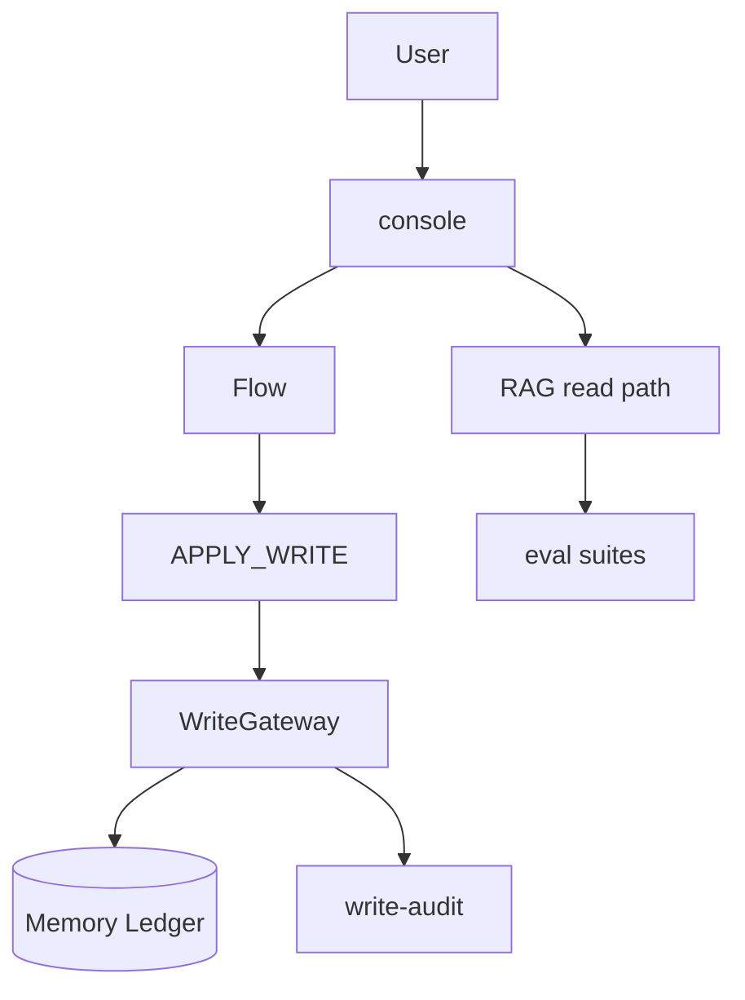

# 第 5 个月合并讲义（Day1～Day30）【逐日详版 · 与第1月同级 · 非概述】

> **定位：** 纯学习；通用 ERP 教材口径；**不接公司生产库、不接 SSO、不直连真实过账接口。**  
> **形式：** 与第 1 月 **同等详细**；本文件为 30 天正文合订，**不是缩写版大纲。** 可复制代码均在本文；由你自行粘贴改造到 `erp-ai-assistant`。  
> **前置：** 第1月 Chat/Prompt/RAG + 第2月 Hybrid/Gate/Rerank、Flow HITL、Eval 入门 + 第3月 Store/reindex/audit/baseline + 第4月 ACL/反馈/多租户/console。  
> **每天结构（固定六段）：** 为什么 → 概念加深 → 怎么做 → 代码骨架 → 坑与排障 → 当天验收。  
> **入口：** `docs/MONTH5.md`  
> **技术节点：** 本月对齐 **T9（受控写入）；完成后可开 T13 Spring AI 对照** · 逐日前置见各 Day 开头 · 总图 [TECH_ROADMAP](../TECH_ROADMAP.md)  
> **学习库 MySQL：** [MYSQL.md](../MYSQL.md)（`154.8.183.10:3306/ai`）  
> **口述标准答案：** [ORAL_ANSWERS.md](../ORAL_ANSWERS.md)  
> **建议视频（本月）：** MONTH5：Tool 视频当反例；收官可开 Spring AI 对照（T13） · 逐日见各 Day/章「建议视频」· 总表 [BILIBILI.md](../BILIBILI.md)
> **本月主题：** **受控写入与模拟过账（假账本 + 强制 HITL + 审计）**  
> **核心产品句（全文反复强调）：**  
> **模型永不直接持有「无审批写库存/过账」工具。写入只发生在 APPROVE 之后，且走受控 WriteGateway + 权限 + 幂等 + 审计。学习仓用内存假账本，不接公司库。**

---

## 第 5 月总目标（学完应能对外讲 8～10 分钟）

1. **写入风险分级：** 读 / 建议 / 受控写 / 禁止；Chat/RAG 路径**禁止写**。  
2. **WriteGateway：** 唯一受控写入口；`WriteCommand` / `WriteResult`；与 Flow `APPROVE` 衔接。  
3. **假账本：** `InMemoryInventoryLedger`（数量 before/after）+ `InMemoryPostingService`（DRAFT→POSTED，期间关闭拒绝）。  
4. **Flow 扩展：** `DRAFT → RISK_CHECK → WAIT_HUMAN → APPLY_WRITE(仅 APPROVE) → DONE`；幂等键；失败进 FAILED + 审计。  
5. **安全与评测：** write-safety suite；越权/关期间负例；审计事件 who/when/what/before/after。  
6. **收官：** console 演示写入链路；三场景串测；PORTFOLIO 升级；架构终图（第1～5月）。

### 和第 1 / 2 / 3 / 4 月的关系

```text
第1月  会生成、会 RAG、懂 Prompt / few-shot
第2月  会 Hybrid/Gate、HITL 最小流、eval 入门
第3月  会持久化/重建、审计回放、baseline 门禁
第4月  会 ACL/租户/反馈/console 演示
第5月  会受控写入：Gateway + 假账本 + APPROVE 后才写 + 审计
         ↑ 从「可隔离、可反馈、可演示」升级到「可证明不写错账」
```

### 能力对照（第4月末 → 第5月末）

| 能力 | 第4月末常见状态 | 第5月末目标 |
|---|---|---|
| 写入 | APPROVE 仍不写库；无写工具 | APPROVE 后经 Gateway 写**假账本** |
| 过账 | 仅概念/口述 | 模拟过账状态机 + 期间关闭拒绝 |
| 模型工具 | 可能含危险 write 名 | 扫描黑名单；写入只经 Gateway |
| 幂等 | 无 | commandId / Idempotency-Key 防双写 |
| 审计 | Flow 审计偏读路径 | WRITE_* 事件含 before/after |
| eval | acl/tenant/baseline | + write-safety suite 进 baseline |
| 演示 | console 读路径 | approve→apply 写入链路可彩排 |

### 四周路线图

| 周 | Day | 主题 | 结束产出 |
|---|---|---|---|
| 1 | M5-D1～7 | 写入风险 + Gateway + 假账本 | WriteGateway 接口 + 双 Ledger + ACL×Write |
| 2 | M5-D8～14 | Flow APPLY_WRITE + 幂等 + 禁直写 | 合法迁移表 + IdempotencyStore + reverse 概念 |
| 3 | M5-D15～21 | write-safety eval + 审计 + baseline | write-safety.jsonl + 审计流水 + 门禁 |
| 4 | M5-D22～30 | console + 串测 + 收官 | 三场景 + PORTFOLIO + 架构终图 + 口述 |

### 本月编码策略

| 周 | 深挖建议 | 其余 |
|---|---|---|
| 1 | WriteGateway + InventoryLedger + PostingService | 读懂 Flow 与 ACL 衔接 |
| 2 | APPLY_WRITE 状态 + 幂等 + 工具扫描 | 补偿概念最小实现 |
| 3 | write-safety eval + 审计事件 | 与反馈飞轮结合读懂即可 |
| 4 | console 写入面板 + 三场景 | D29 口述必做 |

> **纪律：** 编码跟一条主线深挖；**禁止**在 ChatController/RagService 里偷偷 `ledger.adjust()`；**禁止**给 LLM 注册 `writeInventory` 类 tool。

### 固定回归题（本月每天都应能跑或口述）

| 套件 | 用途 | 建议频率 |
|---|---|---|
| `write-safety.jsonl` | 越权写/关期间/无幂等 | 第3周后每日 smoke |
| `acl-forbidden.jsonl` | 读路径越权（延续） | 每周 |
| `tenant-isolation.jsonl` | 租户隔离（延续） | 每周 |
| `baseline` + 核心 rag suite | 防退化 | 每周五 + 收官日 |

### 学习头速查（全月通用）

```text
X-User-Id:         demo-user-01
X-Roles:           FINANCE,INVENTORY_CLERK
X-Tenant-Id:       tenant-a
X-Idempotency-Key: <APPLY_WRITE 强烈建议>
X-Trace-Id:        <可选>
X-Admin-Token:     <期间开关等管理接口>
```

### 周里程碑检查表（建议周五自评）

| 周末 | 必须能演示 | 建议 eval |
|---|---|---|
| 第1周末 | 调 Gateway 改假库存（手测） | before/after 快照 |
| 第2周末 | Flow APPROVE → ledger 变一次 | 重复 APPROVE 不双写 |
| 第3周末 | write-safety 绿 + 审计四事件 | baseline 含 write-safety |
| 4周末 | console A/B/C 三场景 | baseline + write-safety |

### 与第2月 HITL / 第4月 ACL 对照

| 纪律 | 第2/4月起 | 第5月新增 |
|---|---|---|
| APPROVE ≠ 自动写库 | ✓（当时真不写） | APPROVE **触发** Gateway 写假账 |
| sources 来自检索 | ✓ | Chat/RAG **仍禁止写** |
| Principal 过滤读 | ✓ | 写操作校验 `canApplyWrite` |
| traceId 可追踪 | ✓ | 写入审计挂 traceId + commandId |
| 反馈不写库 | ✓ | 错误写入 → write-safety 题 |

### 写入路径 ASCII 总图（全月锚点）

```text
  Chat / RAG ask ──► 只读 retrieve → Gate → LLM（禁止 ledger/posting）

  Flow: DRAFT → RISK_CHECK → WAIT_HUMAN
                    REJECT/EDIT ──► 不写账
                    APPROVE ──► APPLY_WRITE ──► WriteGateway.apply
                         │ 权限 + 幂等 + 期间
                         ▼
              InMemoryInventoryLedger / InMemoryPostingService
                         ▼
              Audit: WRITE_REQUESTED/APPLIED/REJECTED/REVERSED
```

---


# 第 1 周｜写入风险分级 · WriteGateway · 假账本

---


## M5-D1 为何现在才开写；风险不对称；本月边界清单

> **技术前置：** 此时应当学会 **第4月 ACL/反馈/多租户/console（T8 + T6）；本日理解为何现在才开写（T9）** 后再进行阅读。 节点：**T8→T9** · [TECH_ROADMAP](../TECH_ROADMAP.md)
> **建议视频：** [黑马·Tools 段当反例](https://www.bilibili.com/video/BV1MtZnYtEB3/) · 看 FunctionCalling 后记住：无审批禁止写库存 · 备用搜：`Tool Calling 风险` · 总表 [BILIBILI.md](../BILIBILI.md)


### 为什么
第4月末已能 ACL、反馈、console 演示读路径。下一问必为：「审批后会不会改账？」读错可重答，写错是事故。本月用假账本练**受控写入**，且强调：模型永不直接持有无审批写工具。

### 概念加深
**风险不对称：** 读路径 hallucination vs 写路径不可逆。

| 级别 | 示例 | 本月 |
|---|---|---|
| READ | RAG ask | 照旧 |
| SUGGEST | Flow 草稿 | WAIT_HUMAN |
| CONTROLLED_WRITE | 调库存/过账 | Gateway + APPROVE |
| FORBIDDEN | LLM tool 直写 | 扫描拒绝 |

**边界：** 接内存假账；不接公司库/SSO；审计 JSONL。

### 怎么做
1. 填差距表（Flow/HITL、Gateway、假账、幂等、审计、eval、README 声明）。  
2. 写本周三条：WriteGateway 接口、InventoryLedger、风险四级表。  
3. 预习 D2：列出项目中所有「像写」的方法名。  
4. 背诵核心产品句（见文首）。

### 代码骨架
```text
write/WriteRiskLevel.java
write/WriteGateway.java
ledger/InMemoryInventoryLedger.java
posting/InMemoryPostingService.java
```

### 坑与排障

| 误区/现象 | 为什么危险 | 今天怎么避 |
|---|---|---|
| 学习项目随便改库 | 习惯带到生产 | 假账本+边界清单 |
| 先做 LLM write tool | 路径错误 | 先 Gateway 后 Flow |
| 四周同时开工 | D30 无法串测 | 按周里程碑 |

### 当天验收
- 差距表已填
- 3 个写入缺口+验收句
- 能背核心产品句
- 笔记含写入 ASCII 总图

### 延伸阅读
- 重读第4月 D6「APPROVE ≠ 写库」。

### 核心产品句（当日默念）

> 模型永不直接持有「无审批写库存/过账」工具。写入只发生在 APPROVE 之后，且走受控 WriteGateway + 权限 + 幂等 + 审计。学习仓用内存假账本，不接公司库。

### 与上月衔接一句

| 上月（第4月） | 本月（第5月）当日焦点 |
|---|---|
| ACL/租户/反馈/console | 为何现在才开写 |

### 手测记录模板

| 步骤 | 预期 | 实际 | 通过 |
|---|---|---|---|
| 1 |  |  |  |
| 2 |  |  |  |
| 3 |  |  |  |


### 差距检查表（可复制）

| 项 | 是/否 | 备注 |
|---|---|---|
| Flow 有 WAIT_HUMAN？ |  |  |
| APPROVE 后仍不写？ |  | 应如此 |
| WriteGateway 概念？ |  |  |
| 假账本？ |  |  |
| 幂等？ |  |  |
| 写入审计？ |  |  |
| write-safety eval？ |  |  |
| README 声明？ |  |  |


---

## M5-D2 写操作分级（读/建议/受控写/禁止）

> **技术前置：** 此时应当学会 **写入风险不对称；本日学写操作分级** 后再进行阅读。 节点：**T9** · [TECH_ROADMAP](../TECH_ROADMAP.md)
> **建议视频：** B 站搜 `命令查询职责 CQRS 入门` · 写操作分级 · 总表 [BILIBILI.md](../BILIBILI.md)


### 为什么
团队对「AI 能干什么」若不分级，会有人把 RAG 答错与「自动过账」混为一谈。今天建立**写入风险四级**，并明确 Chat/RAG 永远停在 READ。

### 概念加深
| 级别 | 谁触发 | 能否动账本 | 典型接口 |
|---|---|---|---|
| READ | 用户 ask | 否 | `/rag/ask` |
| SUGGEST | Flow/LLM 草案 | 否 | `FlowEngine.start` |
| CONTROLLED_WRITE | 人 APPROVE 后 | 是（假账） | `WriteGateway.apply` |
| FORBIDDEN | 模型 tool | **禁止** | 不得注册 |

```text
Chat/RAG ──► READ only（代码审查一票否决 inject Gateway）
Flow REJECT ──► 不得 enqueue WriteCommand
```

### 怎么做
1. 新建 `WriteRiskLevel` 枚举四类。  
2. 在 README 增「写入分级」表。  
3. 代码审查：`grep -r WriteGateway src/` 不得出现在 rag/chat 包。  
4. 笔记画一张「请求类型→风险级」映射。

### 代码骨架
```java
package com.example.erp.ai.write;

public enum WriteRiskLevel {
    READ,
    SUGGEST,
    CONTROLLED_WRITE,
    FORBIDDEN;

    public boolean mayTouchLedger() {
        return this == CONTROLLED_WRITE;
    }
}
```

### 坑与排障

| 误区/现象 | 为什么危险 | 今天怎么避 |
|---|---|---|
| 把 APPROVE 标成 READ | 审批后不写 | CONTROLLED_WRITE 仅 Gateway |
| RAG 里调 ledger 做 few-shot | 破纪律 | RAG 只返回文本 |

### 当天验收
- `WriteRiskLevel` 已定义
- README 有分级表
- grep 证明 chat/rag 无 Gateway
- 口述四级各一例

### 核心产品句（当日默念）

> 模型永不直接持有「无审批写库存/过账」工具。写入只发生在 APPROVE 之后，且走受控 WriteGateway + 权限 + 幂等 + 审计。学习仓用内存假账本，不接公司库。

### 与上月衔接一句

| 上月（第4月） | 本月（第5月）当日焦点 |
|---|---|
| ACL/租户/反馈/console | 写操作分级（读/建议/受控写/禁止） |

### 手测记录模板

| 步骤 | 预期 | 实际 | 通过 |
|---|---|---|---|
| 1 |  |  |  |
| 2 |  |  |  |
| 3 |  |  |  |


### 代码落地检查（粘贴后）

- [ ] 未修改讲义禁止自动改的 `erp-ai-assistant` 源（自行复制）
- [ ] 新增类在包路径与附录 B 一致
- [ ] 单测覆盖当日主路径
- [ ] `grep` Chat/RAG 包无 `WriteGateway`


### 请求路径 × 风险级对照（贴墙）

| HTTP 路径 | 风险级 | 能否调 Ledger |
|---|---|---|
| POST `/api/ai/rag/ask` | READ | 否 |
| POST `/api/ai/chat` | READ | 否 |
| POST `/api/ai/flow/start` | SUGGEST | 否 |
| POST `.../decide` REJECT | READ | 否 |
| POST `.../decide` APPROVE | CONTROLLED_WRITE | 经 Gateway |
| POST `/api/ai/write/apply` | CONTROLLED_WRITE | 经 Gateway（学习直调） |
| LLM tool `write*` | FORBIDDEN | 不得注册 |


---

## M5-D3 WriteGateway / WriteCommand / WriteResult 接口设计

> **技术前置：** 此时应当学会 **写分级；本日开始学 WriteGateway / WriteCommand / WriteResult（T9）** 后再进行阅读。 节点：**T9** · [TECH_ROADMAP](../TECH_ROADMAP.md)
> **建议视频：** B 站搜 `API Gateway 防腐层` · Gateway 模式 · 总表 [BILIBILI.md](../BILIBILI.md)


### 为什么
散落的 `ledger.add()` 调用无法统一做权限、幂等、审计。Gateway 是**唯一写入口**——与第3月 Store 单一职责同理。

### 概念加深
**命令模式：** 意图 `WriteCommand` → 网关校验 → `WriteResult`。

| 字段 | 用途 |
|---|---|
| commandId | 幂等键 |
| type | ADJUST_QTY / POST_DOCUMENT / REVERSE |
| tenantId | 多租户 |
| payload | sku、delta、documentId |
| requestedBy | Principal |
| traceId | 关联 Flow |

结果：`APPLIED` | `REJECTED` | `DUPLICATE` | `FAILED`。

### 怎么做
1. 定义 `WriteCommand` record（不可变）。  
2. 定义 `WriteResult` record。  
3. 定义 `WriteGateway` 接口单一方法 `apply`。  
4. 写单元测试：空 commandId 应 REJECTED。

### 代码骨架
```java
package com.example.erp.ai.write;

import com.example.erp.ai.acl.Principal;
import java.time.Instant;
import java.util.Map;

public record WriteCommand(
    String commandId,
    String type,
    String tenantId,
    Map<String, Object> payload,
    Principal requestedBy,
    String traceId,
    Instant requestedAt
) {
    public WriteCommand {
        if (commandId == null || commandId.isBlank()) {
            throw new IllegalArgumentException("commandId required");
        }
    }
}

public record WriteResult(
    String commandId,
    Status status,
    String message,
    Map<String, Object> before,
    Map<String, Object> after
) {
    public enum Status { APPLIED, REJECTED, DUPLICATE, FAILED }
}

public interface WriteGateway {
    WriteResult apply(WriteCommand command);
}
```

### 坑与排障

| 误区/现象 | 为什么危险 | 今天怎么避 |
|---|---|---|
| Gateway 多个 apply 重载 | 难审计 | 单一 apply + type |
| payload 用 String 拼 JSON | 难测 | Map 或 typed payload |

### 当天验收
- 三类型已建
- 单测：空 commandId → REJECTED
- 能画 Command→Gateway→Result 序列图

### 核心产品句（当日默念）

> 模型永不直接持有「无审批写库存/过账」工具。写入只发生在 APPROVE 之后，且走受控 WriteGateway + 权限 + 幂等 + 审计。学习仓用内存假账本，不接公司库。

### 与上月衔接一句

| 上月（第4月） | 本月（第5月）当日焦点 |
|---|---|
| ACL/租户/反馈/console | WriteGateway / WriteComm… |

### 手测记录模板

| 步骤 | 预期 | 实际 | 通过 |
|---|---|---|---|
| 1 |  |  |  |
| 2 |  |  |  |
| 3 |  |  |  |


### 代码落地检查（粘贴后）

- [ ] 未修改讲义禁止自动改的 `erp-ai-assistant` 源（自行复制）
- [ ] 新增类在包路径与附录 B 一致
- [ ] 单测覆盖当日主路径
- [ ] `grep` Chat/RAG 包无 `WriteGateway`


### WriteCommand 字段设计备忘

| 字段 | 必填 | 说明 |
|---|---|---|
| commandId | ✓ | 幂等键 |
| type | ✓ | ADJUST_QTY / POST_DOCUMENT / REVERSE |
| tenantId | ✓ | 与第4月租户一致 |
| payload | ✓ | 业务字段 |
| requestedBy | ✓ | Principal |
| traceId | 建议 | 关联 Flow |
| requestedAt | 建议 | Instant |


---

## M5-D4 InMemoryInventoryLedger：改数量（假），带 before/after

> **技术前置：** 此时应当学会 **WriteGateway 接口；本日开始学假账本 InMemoryInventoryLedger** 后再进行阅读。 节点：**T9** · [TECH_ROADMAP](../TECH_ROADMAP.md)
> **建议视频：** B 站搜 `库存 领域驱动 入门` · 账本/库存领域模型 · 总表 [BILIBILI.md](../BILIBILI.md)


### 为什么
库存调整是 ERP 最常演示的「写」。今天在内存里实现**可快照、可 diff** 的假账本，为 eval `expectLedgerDelta` 打基础。

### 概念加深
**Ledger 契约：**
- `snapshot(tenantId)` → 当前 sku→qty
- `adjust(command)` → `LedgerEntry(before, after, delta)`
- 线程安全：`ConcurrentHashMap`

与核心产品句：只有 Gateway 可调 `adjust`。

### 怎么做
1. 实现 `InventoryLedger` 接口。  
2. `InMemoryInventoryLedger` 用 `Map<tenantId, Map<sku, Integer>>`。  
3. `DefaultWriteGateway` 路由 `ADJUST_QTY` 到 ledger。  
4. 手测：SKU-100 从 10 → 15，审计字段含 before/after。

### 代码骨架
```java
package com.example.erp.ai.ledger;

import java.util.Map;
import java.util.concurrent.ConcurrentHashMap;
import java.util.concurrent.atomic.AtomicInteger;

public class InMemoryInventoryLedger implements InventoryLedger {
    private final Map<String, Map<String, AtomicInteger>> store = new ConcurrentHashMap<>();

    @Override
    public Map<String, Integer> snapshot(String tenantId) {
        return store.getOrDefault(tenantId, Map.of()).entrySet().stream()
            .collect(java.util.stream.Collectors.toMap(Map.Entry::getKey, e -> e.getValue().get()));
    }

    @Override
    public LedgerEntry adjust(String tenantId, String sku, int delta) {
        Map<String, AtomicInteger> tenant = store.computeIfAbsent(tenantId, k -> new ConcurrentHashMap<>());
        AtomicInteger qty = tenant.computeIfAbsent(sku, k -> new AtomicInteger(0));
        int before = qty.get();
        int after = qty.addAndGet(delta);
        return new LedgerEntry(sku, before, after, delta);
    }
}

public record LedgerEntry(String sku, int before, int after, int delta) {}
```

### 坑与排障

| 误区/现象 | 为什么危险 | 今天怎么避 |
|---|---|---|
| 允许负库存不声明 | 演示误导 | 文档写明是否允许负值 |
| 无 snapshot API | eval 难断言 | 必须有 snapshot |

### 当天验收
- adjust 手测 before/after 正确
- snapshot API 可 curl
- Gateway 路由 ADJUST_QTY 通

### 核心产品句（当日默念）

> 模型永不直接持有「无审批写库存/过账」工具。写入只发生在 APPROVE 之后，且走受控 WriteGateway + 权限 + 幂等 + 审计。学习仓用内存假账本，不接公司库。

### 与上月衔接一句

| 上月（第4月） | 本月（第5月）当日焦点 |
|---|---|
| ACL/租户/反馈/console | InMemoryInventoryLedger：… |

### 手测记录模板

| 步骤 | 预期 | 实际 | 通过 |
|---|---|---|---|
| 1 |  |  |  |
| 2 |  |  |  |
| 3 |  |  |  |


### 代码落地检查（粘贴后）

- [ ] 未修改讲义禁止自动改的 `erp-ai-assistant` 源（自行复制）
- [ ] 新增类在包路径与附录 B 一致
- [ ] 单测覆盖当日主路径
- [ ] `grep` Chat/RAG 包无 `WriteGateway`


### InventoryLedger 接口（完整）

```java
public interface InventoryLedger {
    Map<String, Integer> snapshot(String tenantId);
    LedgerEntry adjust(String tenantId, String sku, int delta);
    default int getQty(String tenantId, String sku) {
        return snapshot(tenantId).getOrDefault(sku, 0);
    }
}
```

手测 curl 期望：`{"tenantId":"tenant-a","skus":{"SKU-100":15}}`。


---

## M5-D5 InMemoryPostingService：模拟过账状态机（DRAFT→POSTED）

> **技术前置：** 此时应当学会 **假库存；本日开始学模拟过账状态机** 后再进行阅读。 节点：**T9** · [TECH_ROADMAP](../TECH_ROADMAP.md)
> **建议视频：** B 站搜 `单据过账 状态机` · 过账状态机 · 总表 [BILIBILI.md](../BILIBILI.md)


### 为什么
过账比改数量更敏感：涉及期间、单据状态。今天做**内存过账状态机**；期间关闭时拒绝 POST。

### 概念加深
状态：`DRAFT → POSTED`（学习版简化）；`PostingPeriodGuard.open` 为 false 时任意 POST 拒绝。

| 事件 | 状态变化 |
|---|---|
| create | DRAFT |
| post (open) | POSTED |
| post (closed) | 拒绝 |

单据存 `InMemoryPostingLedger`。

### 怎么做
1. 定义 `PostingDocument`、`PostingState`。  
2. 实现 `InMemoryPostingService.post(documentId)`。  
3. `PostingPeriodGuard` 读配置 `posting-period.open`。  
4. Gateway 路由 `POST_DOCUMENT`；关期间手测拒绝。

### 代码骨架
```java
package com.example.erp.ai.posting;

public enum PostingState { DRAFT, POSTED }

public record PostingDocument(String id, String tenantId, PostingState state) {}

public class InMemoryPostingService {
    private final Map<String, PostingDocument> docs = new ConcurrentHashMap<>();
    private final PostingPeriodGuard periodGuard;

    public PostingDocument post(String documentId, String tenantId) {
        if (!periodGuard.isOpen()) {
            throw new PostingPeriodClosedException("Period closed");
        }
        PostingDocument doc = docs.computeIfAbsent(documentId,
            id -> new PostingDocument(id, tenantId, PostingState.DRAFT));
        if (doc.state() == PostingState.POSTED) {
            return doc;
        }
        PostingDocument posted = new PostingDocument(documentId, tenantId, PostingState.POSTED);
        docs.put(documentId, posted);
        return posted;
    }
}
```

### 坑与排障

| 误区/现象 | 为什么危险 | 今天怎么避 |
|---|---|---|
| POST 不检查状态 | 双过账 | 已 POSTED 返回幂等结果 |
| 期间开关散落各处 | 难测 | 集中 PostingPeriodGuard |

### 当天验收
- 开期间 POST 成功
- 关期间 POST 拒
- 审计或异常含 documentId

### 核心产品句（当日默念）

> 模型永不直接持有「无审批写库存/过账」工具。写入只发生在 APPROVE 之后，且走受控 WriteGateway + 权限 + 幂等 + 审计。学习仓用内存假账本，不接公司库。

### 与上月衔接一句

| 上月（第4月） | 本月（第5月）当日焦点 |
|---|---|
| ACL/租户/反馈/console | InMemoryPostingService：模… |

### 手测记录模板

| 步骤 | 预期 | 实际 | 通过 |
|---|---|---|---|
| 1 |  |  |  |
| 2 |  |  |  |
| 3 |  |  |  |


### 代码落地检查（粘贴后）

- [ ] 未修改讲义禁止自动改的 `erp-ai-assistant` 源（自行复制）
- [ ] 新增类在包路径与附录 B 一致
- [ ] 单测覆盖当日主路径
- [ ] `grep` Chat/RAG 包无 `WriteGateway`


### 过账状态机 ASCII

```text
         create
  [无] ─────────► DRAFT
                    │
            post (period open)
                    ▼
                 POSTED
                    │
            post (period closed) ──► REJECTED（异常/审计）
```


---

## M5-D6 ACL×Write：无角色禁止 APPLY；与第4月 Principal 结合

> **技术前置：** 此时应当学会 **假过账；本日学 ACL×Write** 后再进行阅读。 节点：**T9+T8** · [TECH_ROADMAP](../TECH_ROADMAP.md)
> **建议视频：** B 站搜 `RBAC 写权限` · 权限×写 · 总表 [BILIBILI.md](../BILIBILI.md)


### 为什么
第4月 Principal 过滤**读**；本月同一主体必须过滤**写**。无 `INVENTORY_CLERK` / `POSTING` 角色不得 `apply`。

### 概念加深
`WriteAuthorization.canApply(principal, command)`：
- ADJUST_QTY → 需 INVENTORY_CLERK 或 ADMIN
- POST_DOCUMENT → 需 POSTING 或 FINANCE
- 跨 tenant → 拒绝

Flow `decide` 与 Gateway **双重校验**（防直接 curl 越权）。

### 怎么做
1. 实现 `WriteAuthorization`。  
2. `DefaultWriteGateway.apply` 首行校验权限。  
3. eval 草案：GUEST 调 apply → REJECTED。  
4. 与 `LearningAuthHeaders` 联调。

### 代码骨架
```java
package com.example.erp.ai.write;

public class WriteAuthorization {
    public boolean canApply(Principal p, WriteCommand cmd) {
        if (p == null || p.roles().isEmpty()) return false;
        Set<String> roles = p.roles();
        return switch (cmd.type()) {
            case "ADJUST_QTY" -> roles.contains("INVENTORY_CLERK") || roles.contains("ADMIN");
            case "POST_DOCUMENT" -> roles.contains("POSTING") || roles.contains("FINANCE");
            case "REVERSE" -> roles.contains("FINANCE") || roles.contains("ADMIN");
            default -> false;
        };
    }
}
```

### 坑与排障

| 误区/现象 | 为什么危险 | 今天怎么避 |
|---|---|---|
| 只信 Flow 不信 Gateway | 直调 API 越权 | Gateway 必须校验 |
| ADMIN 万能钥匙无审计 | 演示失真 | ADMIN 也记 requestedBy |

### 当天验收
- 无角色 apply → REJECTED
- 有角色 apply → APPLIED
- 口述读/写权限分离

### 核心产品句（当日默念）

> 模型永不直接持有「无审批写库存/过账」工具。写入只发生在 APPROVE 之后，且走受控 WriteGateway + 权限 + 幂等 + 审计。学习仓用内存假账本，不接公司库。

### 与上月衔接一句

| 上月（第4月） | 本月（第5月）当日焦点 |
|---|---|
| ACL/租户/反馈/console | ACL×Write：无角色禁止 APPLY |

### 手测记录模板

| 步骤 | 预期 | 实际 | 通过 |
|---|---|---|---|
| 1 |  |  |  |
| 2 |  |  |  |
| 3 |  |  |  |


### 代码落地检查（粘贴后）

- [ ] 未修改讲义禁止自动改的 `erp-ai-assistant` 源（自行复制）
- [ ] 新增类在包路径与附录 B 一致
- [ ] 单测覆盖当日主路径
- [ ] `grep` Chat/RAG 包无 `WriteGateway`


### 角色 × 写操作矩阵（学习版）

| 角色 | ADJUST_QTY | POST_DOCUMENT | REVERSE |
|---|---|---|---|
| GUEST | ✗ | ✗ | ✗ |
| INVENTORY_CLERK | ✓ | ✗ | ✗ |
| POSTING | ✗ | ✓ | ✗ |
| FINANCE | ✗ | ✓ | ✓ |
| ADMIN | ✓ | ✓ | ✓ |

Flow 审批人角色与 Gateway `requestedBy` 必须一致或可映射（避免「审批人是 mgr、apply 却是 clerk」）。


---

## M5-D7 第 1 周复盘（写入基础 + 假账本）

> **技术前置：** 此时应当学会 **WriteGateway + 假账本（T9 第1周）** 后再进行阅读。 节点：**T9** · [TECH_ROADMAP](../TECH_ROADMAP.md)
> **建议视频：** B 站搜 `Human approval write` · 受控写复盘 · 总表 [BILIBILI.md](../BILIBILI.md)


### 为什么
第1周涉及分级、Gateway、双账本、ACL×Write；复盘日串讲「为何不直写」。

### 概念加深
| 契约 | 演示 |
|---|---|
| 无 APPROVE 不写 | Flow 仅 WAIT |
| Gateway 唯一入口 | grep 无散落 ledger 调用 |
| 假账可快照 | curl snapshot |
| 权限 | 换 Roles 结果变 |

### 怎么做
**Part A 手测（40min）**  
1. snapshot 初值  
2. INVENTORY_CLERK apply +5  
3. GUEST apply 被拒  
4. 开期间 POST  
5. 关期间 POST 被拒  

**Part B 口述 8 题**  
**Part C D1 缺口核对**  
**Part D STUDY_NOTES 五行**

### 代码骨架
```text
WriteGateway.apply → WriteAuthorization → ledger/posting
grep -r "adjust\|post(" --include="*.java" | grep -v write | grep -v test
```

### 坑与排障

| 误区/现象 | 为什么危险 | 今天怎么避 |
|---|---|---|
| 只测 Gateway 不测 POST | 过半周内容 | 关期间必测 |
| 复盘仍开新 eval | 分散 | 先串讲再扩展 |

### 当天验收
- Part A 五步有记录
- 口述 ≥6/8
- D1 缺口 ≥2 已关
- STUDY_NOTES 五行

### 核心产品句（当日默念）

> 模型永不直接持有「无审批写库存/过账」工具。写入只发生在 APPROVE 之后，且走受控 WriteGateway + 权限 + 幂等 + 审计。学习仓用内存假账本，不接公司库。

### 与上月衔接一句

| 上月（第4月） | 本月（第5月）当日焦点 |
|---|---|
| ACL/租户/反馈/console | 第 1 周复盘（写入基础 + 假账本） |

### 手测记录模板

| 步骤 | 预期 | 实际 | 通过 |
|---|---|---|---|
| 1 |  |  |  |
| 2 |  |  |  |
| 3 |  |  |  |


### 口述 8 题（第1周）

1. 为何第5月才开写？
2. 核心产品句？
3. READ 与 CONTROLLED_WRITE 区别？
4. Gateway 为何唯一入口？
5. 假账本与真库边界？
6. ACL 读与写如何分工？
7. Chat 路径为何禁止写？
8. PostingPeriodGuard 作用？

### 复盘计时

| 段 | 时长 |
|---|---|
| Part A | 40min |
| Part B | 30min |
| Part C | 20min |
| Part D | 10min |


---

# 第 2 周｜Flow APPLY_WRITE · 幂等 · 禁止模型直写

---


## M5-D8 Flow 状态增加 APPLY_WRITE；合法迁移表更新

> **技术前置：** 此时应当学会 **T9 基础可讲；本日 Flow 增加 APPLY_WRITE（T5+T9）** 后再进行阅读。 节点：**T5+T9** · [TECH_ROADMAP](../TECH_ROADMAP.md)
> **建议视频：** [Camunda 人工节点对照](https://www.bilibili.com/video/BV1qe4y1m7D7/) · 对照 APPLY_WRITE；仍自研 · 备用搜：`工作流 人工任务` · 总表 [BILIBILI.md](../BILIBILI.md)


### 为什么
第2月 Flow 在 APPROVE 后直达 DONE，**没有写窗口**。今天插入 `APPLY_WRITE`，且仅 `decision=APPROVE` 可进入。

### 概念加深
迁移表（学习版）：

| From | Event | To |
|---|---|---|
| WAIT_HUMAN | APPROVE | APPLY_WRITE |
| WAIT_HUMAN | REJECT | DONE |
| WAIT_HUMAN | EDIT | DRAFT |
| APPLY_WRITE | WRITE_OK | DONE |
| APPLY_WRITE | WRITE_FAIL | FAILED |

REJECT/EDIT **不得**触发 WriteCommand。

### 怎么做
1. `FlowState` 增 `APPLY_WRITE`。  
2. 更新 `FlowTransitionTable` 单测。  
3. 非法迁移（REJECT→APPLY_WRITE）应抛错。  
4. 画状态图贴笔记。

### 代码骨架
```java
public enum FlowState {
    DRAFT, RISK_CHECK, WAIT_HUMAN, APPLY_WRITE, DONE, FAILED
}

public class FlowTransitionTable {
    private static final Map<String, FlowState> TABLE = Map.ofEntries(
        Map.entry(key(WAIT_HUMAN, "APPROVE"), APPLY_WRITE),
        Map.entry(key(WAIT_HUMAN, "REJECT"), DONE),
        Map.entry(key(APPLY_WRITE, "WRITE_OK"), DONE),
        Map.entry(key(APPLY_WRITE, "WRITE_FAIL"), FAILED)
    );
    private static String key(FlowState s, String ev) { return s + ":" + ev; }
    public FlowState next(FlowState s, String event) {
        FlowState n = TABLE.get(key(s, event));
        if (n == null) throw new IllegalTransitionException(s, event);
        return n;
    }
}
```

### 坑与排障

| 误区/现象 | 为什么危险 | 今天怎么避 |
|---|---|---|
| APPROVE 直达 DONE | 跳过写审计 | 必须经 APPLY_WRITE |
| FAILED 不可达 | 静默吞异常 | WRITE_FAIL 进 FAILED |

### 标准答案（先自测再对照）

> [ORAL_ANSWERS.md](../ORAL_ANSWERS.md#m5d7--d14--d21--d29)

1. 先有 RAG/HITL/评测/ACL。  
2. 模型永不直接持有无审批写库存工具；写只经 APPROVE→Gateway。  
3. READ 只查；CONTROLLED_WRITE 审批后写假账。  
4. 统一鉴权/幂等/审计。  
5. 内存假账；不接公司库。  
6. 读看 DocAcl；写看写角色+Gateway。  
7. Chat 无写命令通道。  
8. 关期间拒绝过账类写。

### 当天验收
- 迁移表单测全绿
- 非法迁移抛错
- 状态图已贴

### 核心产品句（当日默念）

> 模型永不直接持有「无审批写库存/过账」工具。写入只发生在 APPROVE 之后，且走受控 WriteGateway + 权限 + 幂等 + 审计。学习仓用内存假账本，不接公司库。

### 与上月衔接一句

| 上月（第4月） | 本月（第5月）当日焦点 |
|---|---|
| ACL/租户/反馈/console | Flow 状态增加 APPLY_WRITE |

### 手测记录模板

| 步骤 | 预期 | 实际 | 通过 |
|---|---|---|---|
| 1 |  |  |  |
| 2 |  |  |  |
| 3 |  |  |  |


### 代码落地检查（粘贴后）

- [ ] 未修改讲义禁止自动改的 `erp-ai-assistant` 源（自行复制）
- [ ] 新增类在包路径与附录 B 一致
- [ ] 单测覆盖当日主路径
- [ ] `grep` Chat/RAG 包无 `WriteGateway`


### Flow 全状态一览（第5月）

```text
DRAFT → RISK_CHECK → WAIT_HUMAN → APPLY_WRITE → DONE
              │            │            │
              └────────────┴── REJECT ────┴──► DONE（不写）
                           EDIT ──────────► DRAFT
                           WRITE_FAIL ────► FAILED
```

单测必覆盖：`WAIT_HUMAN+REJECT` 不得出现 `APPLY_WRITE`。


---

## M5-D9 decide(APPROVE) 才 enqueue WriteCommand；REJECT/EDIT 不写

> **技术前置：** 此时应当学会 **APPLY_WRITE 节点；本日 decide(APPROVE) 才写** 后再进行阅读。 节点：**T9** · [TECH_ROADMAP](../TECH_ROADMAP.md)
> **建议视频：** B 站搜 `saga 审批 执行` · 审批后才执行 · 总表 [BILIBILI.md](../BILIBILI.md)


### 为什么
产品最易翻车：REJECT 也改库存。今天把 **decide 分支**写死：仅 APPROVE 构造 `WriteCommand` 并入队。

### 概念加深
```text
decide(APPROVE):
  cmd = WriteCommand.from(flowInstance)
  result = gateway.apply(cmd)
  event = result.ok ? WRITE_OK : WRITE_FAIL
decide(REJECT/EDIT):
  // 严禁 gateway.apply
```

### 怎么做
1. `ApplyWriteHandler` 从 Flow 上下文组装 Command。  
2. `FlowEngine.decide` 分支实现。  
3. 单测：REJECT 后 snapshot 不变。  
4. 集成：APPROVE 后 snapshot 变。

### 代码骨架
```java
public class ApplyWriteHandler {
    private final WriteGateway gateway;
    public FlowTransitionResult handle(FlowInstance inst, Principal approver) {
        WriteCommand cmd = WriteCommand.fromFlow(inst, approver);
        WriteResult result = gateway.apply(cmd);
        String event = result.status() == WriteResult.Status.APPLIED ? "WRITE_OK" : "WRITE_FAIL";
        return new FlowTransitionResult(event, result);
    }
}

// FlowEngine.decide excerpt
if ("APPROVE".equals(decision)) {
    return applyWriteHandler.handle(instance, principal);
} else {
    return transitionWithoutWrite(instance, decision);
}
```

### 坑与排障

| 误区/现象 | 为什么危险 | 今天怎么避 |
|---|---|---|
| APPROVE 与 Command 字段不一致 | 审计对不上 | fromFlow 统一映射 |
| EDIT 也 apply | 违背 HITL | EDIT 回 DRAFT 不写 |

### 当天验收
- REJECT 不写单测绿
- APPROVE 写入单测绿
- flow-audit 有 APPROVE 记录

### 核心产品句（当日默念）

> 模型永不直接持有「无审批写库存/过账」工具。写入只发生在 APPROVE 之后，且走受控 WriteGateway + 权限 + 幂等 + 审计。学习仓用内存假账本，不接公司库。

### 与上月衔接一句

| 上月（第4月） | 本月（第5月）当日焦点 |
|---|---|
| ACL/租户/反馈/console | decide(APPROVE) 才 enqueue WriteCommand |

### 手测记录模板

| 步骤 | 预期 | 实际 | 通过 |
|---|---|---|---|
| 1 |  |  |  |
| 2 |  |  |  |
| 3 |  |  |  |


### 代码落地检查（粘贴后）

- [ ] 未修改讲义禁止自动改的 `erp-ai-assistant` 源（自行复制）
- [ ] 新增类在包路径与附录 B 一致
- [ ] 单测覆盖当日主路径
- [ ] `grep` Chat/RAG 包无 `WriteGateway`


### WriteCommand.fromFlow 映射示例

```java
public static WriteCommand fromFlow(FlowInstance inst, Principal approver) {
    return new WriteCommand(
        inst.id() + "-approve",
        inst.payload().get("writeType").toString(),
        inst.tenantId(),
        inst.payload(),
        approver,
        inst.traceId(),
        Instant.now()
    );
}
```

Flow 启动时 payload 应含 `writeType`/`sku`/`delta` 等，但**不得**预写账本。


---

## M5-D10 幂等：Idempotency-Key / commandId；重复 APPROVE 不双写

> **技术前置：** 此时应当学会 **APPROVE 写窗口；本日开始学幂等键** 后再进行阅读。 节点：**T9** · [TECH_ROADMAP](../TECH_ROADMAP.md)
> **建议视频：** B 站搜 `Idempotency-Key HTTP` · 幂等键 · 总表 [BILIBILI.md](../BILIBILI.md)


### 为什么
网络重试、双击审批会导致**双写**。本月用 `commandId` + `IdempotencyStore` 保证 at-most-once。

### 概念加深
策略：
- 首次 apply：处理并记录 `commandId → result`
- 重复：返回 `DUPLICATE`，ledger 不再变

建议：`commandId = flowInstanceId + "-approve"` 或 header `X-Idempotency-Key`。

### 怎么做
1. `IdempotencyStore` 接口 + 内存实现。  
2. `DefaultWriteGateway` 在业务前查 store。  
3. 单测：连续两次 apply 同 commandId，qty 只变一次。  
4. Flow 重复 APPROVE 手测。

### 代码骨架
```java
public interface IdempotencyStore {
    Optional<WriteResult> find(String commandId);
    void put(String commandId, WriteResult result);
}

public class DefaultWriteGateway implements WriteGateway {
    public WriteResult apply(WriteCommand cmd) {
        var cached = idempotency.find(cmd.commandId());
        if (cached.isPresent()) {
            return cached.get().withStatus(Status.DUPLICATE);
        }
        WriteResult result = doApply(cmd);
        idempotency.put(cmd.commandId(), result);
        return result;
    }
}
```

### 坑与排障

| 误区/现象 | 为什么危险 | 今天怎么避 |
|---|---|---|
| 只用 traceId 幂等 | 一 trace 多命令 | commandId 唯一 |
| DUPLICATE 当 FAILED | eval 误判 | DUPLICATE 不断言 delta |

### 当天验收
- 双写单测绿
- DUPLICATE 状态明确
- 笔记写 commandId 生成规则

### 核心产品句（当日默念）

> 模型永不直接持有「无审批写库存/过账」工具。写入只发生在 APPROVE 之后，且走受控 WriteGateway + 权限 + 幂等 + 审计。学习仓用内存假账本，不接公司库。

### 与上月衔接一句

| 上月（第4月） | 本月（第5月）当日焦点 |
|---|---|
| ACL/租户/反馈/console | 幂等：Idempotency-Key / commandId |

### 手测记录模板

| 步骤 | 预期 | 实际 | 通过 |
|---|---|---|---|
| 1 |  |  |  |
| 2 |  |  |  |
| 3 |  |  |  |


### 代码落地检查（粘贴后）

- [ ] 未修改讲义禁止自动改的 `erp-ai-assistant` 源（自行复制）
- [ ] 新增类在包路径与附录 B 一致
- [ ] 单测覆盖当日主路径
- [ ] `grep` Chat/RAG 包无 `WriteGateway`


### 幂等键生成规范（建议）

```text
直调 Gateway：X-Idempotency-Key: cmd-{uuid}
Flow APPROVE：flow-{instanceId}-approve
REVERSE：reverse-{originalCommandId}
```

重复请求行为：第二次起返回 `DUPLICATE`，HTTP 可用 200 但 status 字段须明示。


---

## M5-D11 超时与部分失败；失败进 FAILED + 审计；禁止静默成功

> **技术前置：** 此时应当学会 **幂等；本日超时/部分失败→FAILED+审计** 后再进行阅读。 节点：**T9** · [TECH_ROADMAP](../TECH_ROADMAP.md)
> **建议视频：** B 站搜 `分布式事务 补偿` · 部分失败与补偿 · 总表 [BILIBILI.md](../BILIBILI.md)


### 为什么
写路径可能抛异常或业务拒绝。任何失败必须：**Flow→FAILED** + `WRITE_REJECTED` 审计，禁止 HTTP 200 但账没变。

### 概念加深
| 场景 | Flow | 审计 |
|---|---|---|
| 权限拒 | FAILED | WRITE_REJECTED |
| 期间关 | FAILED | WRITE_REJECTED |
| 重复键 | DONE | DUPLICATE（可选记） |
| 内部错 | FAILED | WRITE_FAILED |

### 怎么做
1. Gateway 捕获异常 → `Status.FAILED`。  
2. `ApplyWriteHandler` 映射 WRITE_FAIL。  
3. 审计 sink 写 JSONL。  
4. 负例：关期间 APPROVE → FAILED + 审计行。

### 代码骨架
```java
public WriteResult apply(WriteCommand cmd) {
    try {
        if (!auth.canApply(cmd.requestedBy(), cmd)) {
            WriteResult r = reject(cmd, "FORBIDDEN");
            audit.emit(WriteAuditEvent.rejected(cmd, r));
            return r;
        }
        // ...
    } catch (Exception ex) {
        WriteResult r = WriteResult.failed(cmd.commandId(), ex.getMessage());
        audit.emit(WriteAuditEvent.failed(cmd, ex));
        return r;
    }
}
```

### 坑与排障

| 误区/现象 | 为什么危险 | 今天怎么避 |
|---|---|---|
| catch 后返回 APPLIED | 最严重 | 失败必 FAILED |
| 无审计静默拒 | 无法复盘 | 每条拒写必 emit |

### 当天验收
- 失败场景 Flow=FAILED
- write-audit 有 REJECTED
- 无「假 200」

### 核心产品句（当日默念）

> 模型永不直接持有「无审批写库存/过账」工具。写入只发生在 APPROVE 之后，且走受控 WriteGateway + 权限 + 幂等 + 审计。学习仓用内存假账本，不接公司库。

### 与上月衔接一句

| 上月（第4月） | 本月（第5月）当日焦点 |
|---|---|
| ACL/租户/反馈/console | 超时与部分失败 |

### 手测记录模板

| 步骤 | 预期 | 实际 | 通过 |
|---|---|---|---|
| 1 |  |  |  |
| 2 |  |  |  |
| 3 |  |  |  |


### 代码落地检查（粘贴后）

- [ ] 未修改讲义禁止自动改的 `erp-ai-assistant` 源（自行复制）
- [ ] 新增类在包路径与附录 B 一致
- [ ] 单测覆盖当日主路径
- [ ] `grep` Chat/RAG 包无 `WriteGateway`


### 失败路径序列（禁止静默成功）

```text
Gateway REJECTED
  → ApplyWriteHandler 收 WRITE_FAIL
  → FlowTransition FAILED
  → write-audit: WRITE_REJECTED
  → HTTP 可 200 但 body 含 failed=true（或 409，团队统一即可）
  → eval: expectNoLedgerChange
```


---

## M5-D12 禁止 Llm Tool 直接 write；工具白名单扫描 + Write* 黑名单

> **技术前置：** 此时应当学会 **失败可见；本日禁止 LLM Tool 直写 + 黑名单扫描** 后再进行阅读。 节点：**T9** · [TECH_ROADMAP](../TECH_ROADMAP.md)
> **建议视频：** B 站搜 `LLM tool security` · Tool 黑名单扫描 · 总表 [BILIBILI.md](../BILIBILI.md)


### 为什么
模型若持有 `writeInventory` tool，全月纪律崩塌。今天加**静态扫描测试** + 运行时 tool 注册审查。

### 概念加深
黑名单前缀/片段：`write`, `post`, `adjust`, `ledger`, `applyWrite`。

允许：`searchDocs`, `startFlow`, `suggestDraft`（SUGGEST 级，不写账）。

写入只经 Gateway，且 Gateway 不在 LLM tool 列表。

### 怎么做
1. 测试 `LlmToolRegistrySafetyTest` 扫描类名/bean。  
2. 配置 `tool-scan-blacklist`。  
3. Code review checklist 增一条。  
4. 文档写「FORBIDDEN 级工具零注册」。

### 代码骨架
```java
@Test
void llmToolsMustNotExposeDirectWrite() {
    List<String> tools = toolRegistry.listRegisteredTools();
    List<String> forbidden = List.of("write", "post", "adjust", "ledger");
    for (String t : tools) {
        String lower = t.toLowerCase();
        for (String f : forbidden) {
            assertFalse(lower.contains(f), "Forbidden tool: " + t);
        }
    }
}
```

### 坑与排障

| 误区/现象 | 为什么危险 | 今天怎么避 |
|---|---|---|
| suggestWrite 内部 apply | 仍 forbidden | 只能创建 Flow |
| 测试只扫名称不扫 bean | 漏网 | 扫 @Bean Tool 方法 |

### 当天验收
- 扫描测试绿
- README 有黑名单说明
- 能口述为何模型无 write tool

### 核心产品句（当日默念）

> 模型永不直接持有「无审批写库存/过账」工具。写入只发生在 APPROVE 之后，且走受控 WriteGateway + 权限 + 幂等 + 审计。学习仓用内存假账本，不接公司库。

### 与上月衔接一句

| 上月（第4月） | 本月（第5月）当日焦点 |
|---|---|
| ACL/租户/反馈/console | 禁止 Llm Tool 直接 write |

### 手测记录模板

| 步骤 | 预期 | 实际 | 通过 |
|---|---|---|---|
| 1 |  |  |  |
| 2 |  |  |  |
| 3 |  |  |  |


### 代码落地检查（粘贴后）

- [ ] 未修改讲义禁止自动改的 `erp-ai-assistant` 源（自行复制）
- [ ] 新增类在包路径与附录 B 一致
- [ ] 单测覆盖当日主路径
- [ ] `grep` Chat/RAG 包无 `WriteGateway`


### 允许 vs 禁止的 LLM Tool 命名

| 允许（SUGGEST/READ） | 禁止（FORBIDDEN） |
|---|---|
| `searchDocs` | `writeInventory` |
| `startFlow` | `postDocument` |
| `getLedgerSnapshot`（只读） | `applyWrite` |
| `suggestAdjustment`（仅返回文本） | `adjustStock` |

`suggest*` 实现：返回 Markdown 建议，或调用 `FlowEngine.start`，**内部不得** `gateway.apply`。


---

## M5-D13 补偿/回滚学习版：reverse command（概念+最小实现）

> **技术前置：** 此时应当学会 **禁直写；本日补偿/回滚学习版** 后再进行阅读。 节点：**T9** · [TECH_ROADMAP](../TECH_ROADMAP.md)
> **建议视频：** B 站搜 `补偿事务 compensating` · 补偿命令 · 总表 [BILIBILI.md](../BILIBILI.md)


### 为什么
真分布式回滚很复杂；学习版用 **REVERSE command** 冲销：记录原 commandId，写相反 delta，审计 `WRITE_REVERSED`。

### 概念加深
`type=REVERSE`, payload: `{ "originalCommandId": "..." }`

规则：仅 FINANCE/ADMIN；原命令必须 APPLIED；不可重复 reverse。

### 怎么做
1. `WriteCommand` 支持 REVERSE。  
2. Gateway 查原结果，写相反 delta。  
3. 审计 `WRITE_REVERSED` 含 link。  
4. 手测：+5 后 reverse → 回原值。

### 代码骨架
```java
private WriteResult applyReverse(WriteCommand cmd) {
    String origId = (String) cmd.payload().get("originalCommandId");
    WriteResult orig = idempotency.find(origId).orElseThrow();
    int delta = (int) orig.after().get("delta") * -1;
    LedgerEntry entry = ledger.adjust(cmd.tenantId(), (String) orig.after().get("sku"), delta);
    audit.emit(WriteAuditEvent.reversed(cmd, origId, entry));
    return WriteResult.applied(cmd.commandId(), entry.before(), entry.after());
}
```

### 坑与排障

| 误区/现象 | 为什么危险 | 今天怎么避 |
|---|---|---|
| reverse 不链审计 | 无法追溯 | link originalCommandId |
| 任意角色 reverse | 越权 | FINANCE only |

### 当天验收
- reverse 手测账回原值
- 审计 REVERSED 含 link
- 口述与 DB 事务回滚区别

### 核心产品句（当日默念）

> 模型永不直接持有「无审批写库存/过账」工具。写入只发生在 APPROVE 之后，且走受控 WriteGateway + 权限 + 幂等 + 审计。学习仓用内存假账本，不接公司库。

### 与上月衔接一句

| 上月（第4月） | 本月（第5月）当日焦点 |
|---|---|
| ACL/租户/反馈/console | 补偿/回滚学习版：reverse command… |

### 手测记录模板

| 步骤 | 预期 | 实际 | 通过 |
|---|---|---|---|
| 1 |  |  |  |
| 2 |  |  |  |
| 3 |  |  |  |


### 代码落地检查（粘贴后）

- [ ] 未修改讲义禁止自动改的 `erp-ai-assistant` 源（自行复制）
- [ ] 新增类在包路径与附录 B 一致
- [ ] 单测覆盖当日主路径
- [ ] `grep` Chat/RAG 包无 `WriteGateway`


---

## M5-D14 第 2 周复盘（Flow 写窗口 + 幂等 + 禁直写）

> **技术前置：** 此时应当学会 **Flow 写窗口 + 幂等 + 禁直写（T9 第2周）** 后再进行阅读。 节点：**T9** · [TECH_ROADMAP](../TECH_ROADMAP.md)
> **建议视频：** B 站搜 `幂等 审批` · 写窗口复盘 · 总表 [BILIBILI.md](../BILIBILI.md)


### 为什么
串测：APPROVE 写、REJECT 不写、双写幂等、工具扫描。

### 概念加深
周末契约：APPLY_WRITE 仅 APPROVE；Idempotency 有效；LLM 无 write tool。

### 怎么做
Part A：Flow 全链路 APPROVE  
Part B：重复 APPROVE  
Part C：工具扫描测试  
Part D：口述 8 题（幂等/HITL/FAILED）

### 代码骨架
```text
FlowEngine.decide → ApplyWriteHandler → WriteGateway → IdempotencyStore
```

### 坑与排障

| 误区/现象 | 为什么危险 | 今天怎么避 |
|---|---|---|
| 复盘跳过幂等 | 第3周 eval 翻车 | 双写必测 |

### 当天验收
- 全链路手测记录
- 口述 ≥6/8
- 工具扫描绿

### 核心产品句（当日默念）

> 模型永不直接持有「无审批写库存/过账」工具。写入只发生在 APPROVE 之后，且走受控 WriteGateway + 权限 + 幂等 + 审计。学习仓用内存假账本，不接公司库。

### 与上月衔接一句

| 上月（第4月） | 本月（第5月）当日焦点 |
|---|---|
| ACL/租户/反馈/console | 第 2 周复盘（Flow 写窗口 + 幂等 + … |

### 手测记录模板

| 步骤 | 预期 | 实际 | 通过 |
|---|---|---|---|
| 1 |  |  |  |
| 2 |  |  |  |
| 3 |  |  |  |


### 口述 8 题（第2周）

1. APPLY_WRITE 谁能进入？
2. REJECT 为何绝不调 Gateway？
3. DUPLICATE 与 FAILED 区别？
4. 工具扫描测什么？
5. IdempotencyStore 放哪层？
6. WRITE_FAIL 后 Flow 哪状态？
7. suggest tool 与 write tool？
8. reverse 谁可执行？


---

# 第 3 周｜write-safety 评测 · 审计 · baseline 门禁

---


## M5-D15 write-safety.jsonl 题集设计

> **技术前置：** 此时应当学会 **T9 写路径可控；本日 write-safety 题集（T6）** 后再进行阅读。 节点：**T6+T9** · [TECH_ROADMAP](../TECH_ROADMAP.md)
> **建议视频：** B 站搜 `safety eval suite` · write-safety 题集 · 总表 [BILIBILI.md](../BILIBILI.md)


### 为什么
读路径有 acl-forbidden；写路径需要 **write-safety**：越权、关期间、无幂等、双写期望。

### 概念加深
题集字段建议：
- `id`, `description`, `headers`, `steps[]`, `assert`

类型：`forbidden-write`, `period-closed`, `missing-idempotency`, `happy-approve`。

### 怎么做
1. 建 `evals/suites/write-safety.jsonl`。  
2. 至少 8 题：4 负例 + 4 正例。  
3. 每题绑定 headers + 期望 ledger/posting。  
4. README 增 suite 说明。

### 代码骨架
```json
{"id":"ws-001","type":"forbidden-write","headers":{"X-Roles":"GUEST"},
 "step":{"action":"apply","body":{"commandId":"ws-001","type":"ADJUST_QTY","sku":"S1","delta":1}},
 "assert":"expectRejected"}
{"id":"ws-008","type":"happy-approve","flowDecision":"APPROVE",
 "assert":"expectLedgerDelta","sku":"S1","delta":3}
```

### 坑与排障

| 误区/现象 | 为什么危险 | 今天怎么避 |
|---|---|---|
| 题集只有 happy path | 测不出越权 | 负例 ≥50% |
| assert 含糊 | 难自动 | 用命名断言 |

### 标准答案（先自测再对照）

1. 合法迁移且 APPROVE 后。  
2. REJECT 不 enqueue 写。  
3. DUPLICATE=幂等已成功；FAILED=执行失败。  
4. 禁止 write 类 Tool 名。  
5. Gateway/幂等层，随 commandId。  
6. Flow→FAILED + 审计。  
7. suggest 建议；write 改账（禁直出）。  
8. 仅受控补偿路径+权限。

### 当天验收
- jsonl ≥8 题
- 含关期间/越权/幂等
- 题集 README 说明

### 核心产品句（当日默念）

> 模型永不直接持有「无审批写库存/过账」工具。写入只发生在 APPROVE 之后，且走受控 WriteGateway + 权限 + 幂等 + 审计。学习仓用内存假账本，不接公司库。

### 与上月衔接一句

| 上月（第4月） | 本月（第5月）当日焦点 |
|---|---|
| ACL/租户/反馈/console | write-safety.jsonl 题集设计 |

### 手测记录模板

| 步骤 | 预期 | 实际 | 通过 |
|---|---|---|---|
| 1 |  |  |  |
| 2 |  |  |  |
| 3 |  |  |  |


### 代码落地检查（粘贴后）

- [ ] 未修改讲义禁止自动改的 `erp-ai-assistant` 源（自行复制）
- [ ] 新增类在包路径与附录 B 一致
- [ ] 单测覆盖当日主路径
- [ ] `grep` Chat/RAG 包无 `WriteGateway`


### write-safety 题集类型清单

| type | 最少题数 | 断言 |
|---|---|---|
| forbidden-write | 2 | expectRejected + noChange |
| period-closed | 1 | expectRejected + noChange |
| missing-idempotency | 1 | expectRejected |
| duplicate-approve | 1 | DUPLICATE + noChange |
| happy-approve | 2 | expectLedgerDelta |
| happy-post | 1 | expectPostingState POSTED |


---

## M5-D16 Eval 断言：expectNoLedgerChange / expectLedgerDelta / expectPostingState

> **技术前置：** 此时应当学会 **write-safety 题；本日 Eval 断言 ledger/posting** 后再进行阅读。 节点：**T6+T9** · [TECH_ROADMAP](../TECH_ROADMAP.md)
> **建议视频：** B 站搜 `property based testing 入门` · 账本断言 · 总表 [BILIBILI.md](../BILIBILI.md)


### 为什么
写路径 eval 需要读**账本快照**而非仅比字符串。今天实现三类断言 helper。

### 概念加深
| 断言 | 何时 |
|---|---|
| expectNoLedgerChange | REJECT/越权/关期间 |
| expectLedgerDelta | 合法 APPROVE |
| expectPostingState | POSTED/DRAFT |

### 怎么做
1. `WriteSafetyAssertions` 工具类。  
2. EvalRunner 在 step 前后调 snapshot。  
3. 跑 ws-001 应绿。  
4. 文档写断言 API。

### 代码骨架
```java
public final class WriteSafetyAssertions {
    public static void expectNoLedgerChange(Map<String,Integer> before, Map<String,Integer> after) {
        assertEquals(before, after, "Ledger must not change");
    }
    public static void expectLedgerDelta(Map<String,Integer> before, Map<String,Integer> after,
                                         String sku, int delta) {
        int b = before.getOrDefault(sku, 0);
        int a = after.getOrDefault(sku, 0);
        assertEquals(b + delta, a);
    }
    public static void expectPostingState(PostingDocument doc, PostingState expected) {
        assertEquals(expected, doc.state());
    }
}
```

### 坑与排障

| 误区/现象 | 为什么危险 | 今天怎么避 |
|---|---|---|
| 只比 HTTP status | 假绿 | 必须比 ledger |
| delta 符号反 | 误报 | 负例用 noChange |

### 当天验收
- 三断言实现完成
- ws-001/008 跑通
- 断言 API 文档

### 核心产品句（当日默念）

> 模型永不直接持有「无审批写库存/过账」工具。写入只发生在 APPROVE 之后，且走受控 WriteGateway + 权限 + 幂等 + 审计。学习仓用内存假账本，不接公司库。

### 与上月衔接一句

| 上月（第4月） | 本月（第5月）当日焦点 |
|---|---|
| ACL/租户/反馈/console | Eval 断言：expectNoLedgerCh… |

### 手测记录模板

| 步骤 | 预期 | 实际 | 通过 |
|---|---|---|---|
| 1 |  |  |  |
| 2 |  |  |  |
| 3 |  |  |  |


### 代码落地检查（粘贴后）

- [ ] 未修改讲义禁止自动改的 `erp-ai-assistant` 源（自行复制）
- [ ] 新增类在包路径与附录 B 一致
- [ ] 单测覆盖当日主路径
- [ ] `grep` Chat/RAG 包无 `WriteGateway`


---

## M5-D17 期间关闭、缺权限、缺幂等键负例

> **技术前置：** 此时应当学会 **写断言；本日期间关闭/缺权/缺幂等负例** 后再进行阅读。 节点：**T9** · [TECH_ROADMAP](../TECH_ROADMAP.md)
> **建议视频：** B 站搜 `negative test cases` · 负例测试 · 总表 [BILIBILI.md](../BILIBILI.md)


### 为什么
负例日：三条必须红（或按设计 DUPLICATE/REJECTED），且 **ledger 不变**。

### 概念加深
| 负例 | 期望 |
|---|---|
| 关期间 POST | REJECTED, noChange |
| GUEST apply | REJECTED |
| 缺 commandId | REJECTED |
| 重复 commandId | DUPLICATE, noChange |

### 怎么做
1. 增 jsonl 题 ws-002～ws-005。  
2. 自动化跑 suite。  
3. 人工关期间 curl 对照。  
4. 失败截图/日志归档。

### 代码骨架
```bash
# 缺幂等键
curl -s -X POST .../write/apply   -H 'X-Roles: INVENTORY_CLERK'   -d '{"type":"ADJUST_QTY","sku":"S1","delta":1}'
# 期望 400 或 REJECTED + noChange
```

### 坑与排障

| 误区/现象 | 为什么危险 | 今天怎么避 |
|---|---|---|
| 负例过绿 | suite 无效 | 先写断言再写题 |
| 关期间未恢复 | 污染后续 | try/finally 重开 |

### 当天验收
- 4 负例全绿
- 每次 noChange 验证
- 日志有 REJECTED

### 核心产品句（当日默念）

> 模型永不直接持有「无审批写库存/过账」工具。写入只发生在 APPROVE 之后，且走受控 WriteGateway + 权限 + 幂等 + 审计。学习仓用内存假账本，不接公司库。

### 与上月衔接一句

| 上月（第4月） | 本月（第5月）当日焦点 |
|---|---|
| ACL/租户/反馈/console | 期间关闭、缺权限、缺幂等键负例 |

### 手测记录模板

| 步骤 | 预期 | 实际 | 通过 |
|---|---|---|---|
| 1 |  |  |  |
| 2 |  |  |  |
| 3 |  |  |  |


### 代码落地检查（粘贴后）

- [ ] 未修改讲义禁止自动改的 `erp-ai-assistant` 源（自行复制）
- [ ] 新增类在包路径与附录 B 一致
- [ ] 单测覆盖当日主路径
- [ ] `grep` Chat/RAG 包无 `WriteGateway`


---

## M5-D18 审计流水：WRITE_REQUESTED / APPLIED / REJECTED / REVERSED

> **技术前置：** 此时应当学会 **负例；本日写审计事件流水** 后再进行阅读。 节点：**T5+T9** · [TECH_ROADMAP](../TECH_ROADMAP.md)
> **建议视频：** B 站搜 `audit trail` · 审计 who/when/what · 总表 [BILIBILI.md](../BILIBILI.md)


### 为什么
合规问：谁何时改了什么？审计事件必须含 **who/when/what/before/after**。

### 概念加深
事件类型：
- WRITE_REQUESTED（可选，入队时）
- WRITE_APPLIED
- WRITE_REJECTED
- WRITE_REVERSED

字段：timestamp, principal, commandId, traceId, type, before, after, reason。

### 怎么做
1. `WriteAuditEvent` record。  
2. `JsonlWriteAuditSink` 按日滚动。  
3. Gateway 各分支 emit。  
4. 手测一条 APPROVE 链 ≥3 事件。

### 代码骨架
```java
public record WriteAuditEvent(
    Instant at, String kind, String commandId, String traceId,
    String userId, String tenantId, String type,
    Map<String,Object> before, Map<String,Object> after, String reason
) {
    public static WriteAuditEvent applied(WriteCommand cmd, Map<String,Object> before, Map<String,Object> after) {
        return new WriteAuditEvent(Instant.now(), "WRITE_APPLIED", cmd.commandId(),
            cmd.traceId(), cmd.requestedBy().userId(), cmd.tenantId(), cmd.type(), before, after, null);
    }
}
```

### 坑与排障

| 误区/现象 | 为什么危险 | 今天怎么避 |
|---|---|---|
| 只记成功 | 拒写无迹 | REJECTED 必记 |
| before/after 空 | 无法 diff | 从 LedgerEntry 填 |

### 当天验收
- JSONL 有四类事件样例
- 字段含 who/when/what/before/after
- 能回放一条 APPROVE

### 核心产品句（当日默念）

> 模型永不直接持有「无审批写库存/过账」工具。写入只发生在 APPROVE 之后，且走受控 WriteGateway + 权限 + 幂等 + 审计。学习仓用内存假账本，不接公司库。

### 与上月衔接一句

| 上月（第4月） | 本月（第5月）当日焦点 |
|---|---|
| ACL/租户/反馈/console | 审计流水：WRITE_REQUESTED / A… |

### 手测记录模板

| 步骤 | 预期 | 实际 | 通过 |
|---|---|---|---|
| 1 |  |  |  |
| 2 |  |  |  |
| 3 |  |  |  |


### 代码落地检查（粘贴后）

- [ ] 未修改讲义禁止自动改的 `erp-ai-assistant` 源（自行复制）
- [ ] 新增类在包路径与附录 B 一致
- [ ] 单测覆盖当日主路径
- [ ] `grep` Chat/RAG 包无 `WriteGateway`


### 审计 JSONL 样例（一行）

```json
{"at":"2026-08-15T10:00:00Z","kind":"WRITE_APPLIED","commandId":"cmd-1","traceId":"t-1","userId":"mgr-01","tenantId":"tenant-a","type":"ADJUST_QTY","before":{"S1":10},"after":{"S1":13},"reason":null}
```


---

## M5-D19 baseline 纳入 write-safety；门禁演示

> **技术前置：** 此时应当学会 **写审计；本日 baseline 纳入 write-safety** 后再进行阅读。 节点：**T6** · [TECH_ROADMAP](../TECH_ROADMAP.md)
> **建议视频：** B 站搜 `security regression` · baseline 纳入安全套件 · 总表 [BILIBILI.md](../BILIBILI.md)


### 为什么
第3月 baseline 门禁本月扩展：**write-safety 不过 = 不过门禁**。

### 概念加深
`evals/baseline.json` 增：
```json
"suite": "write-safety", "minPassRate": 1.0
```
与 rag/acl 并列。

### 怎么做
1. 更新 baseline.json。  
2. CI/local 脚本 `run-baseline.sh` 含 write-safety。  
3. 故意弄红一题演示门禁。  
4. 修复后全绿截图。

### 代码骨架
```json
{
  "suites": [
    {"name": "core-rag", "minPassRate": 0.9},
    {"name": "acl-forbidden", "minPassRate": 1.0},
    {"name": "write-safety", "minPassRate": 1.0}
  ]
}
```

### 坑与排障

| 误区/现象 | 为什么危险 | 今天怎么避 |
|---|---|---|
| 门禁只跑读路径 | 写回归漏 | write-safety 必含 |
| minPassRate 过低 | 形同虚设 | 写安全建议 1.0 |

### 当天验收
- baseline 含 write-safety
- 门禁演示一红一绿
- 脚本一键跑

### 核心产品句（当日默念）

> 模型永不直接持有「无审批写库存/过账」工具。写入只发生在 APPROVE 之后，且走受控 WriteGateway + 权限 + 幂等 + 审计。学习仓用内存假账本，不接公司库。

### 与上月衔接一句

| 上月（第4月） | 本月（第5月）当日焦点 |
|---|---|
| ACL/租户/反馈/console | baseline 纳入 write-safety |

### 手测记录模板

| 步骤 | 预期 | 实际 | 通过 |
|---|---|---|---|
| 1 |  |  |  |
| 2 |  |  |  |
| 3 |  |  |  |


### 代码落地检查（粘贴后）

- [ ] 未修改讲义禁止自动改的 `erp-ai-assistant` 源（自行复制）
- [ ] 新增类在包路径与附录 B 一致
- [ ] 单测覆盖当日主路径
- [ ] `grep` Chat/RAG 包无 `WriteGateway`


---

## M5-D20 与反馈飞轮结合：错误写入相关踩 → 题集

> **技术前置：** 此时应当学会 **baseline；本日反馈飞轮×错误写入** 后再进行阅读。 节点：**T6** · [TECH_ROADMAP](../TECH_ROADMAP.md)
> **建议视频：** B 站搜 `incident feedback loop` · 错误写入反馈 · 总表 [BILIBILI.md](../BILIBILI.md)


### 为什么
第4月反馈晋升 eval；本月把 **UNSAFE 写入尝试** 晋升为 write-safety 题。

### 概念加深
流程：feedback(UNSAFE) → 人工确认 → 写入 write-safety.jsonl → baseline。

### 怎么做
1. 定义「写入类 UNSAFE」标签规范。  
2. `FeedbackToEvalPromoter` 增 write 类型路由。  
3. 手工晋升 1 条样例。  
4. 回归确认新题绿。

### 代码骨架
```java
// 晋升时自动加 tags: ["write-safety", "from-feedback"]
if (feedback.kind() == UNSAFE && feedback.comment().contains("写入")) {
    draft.suite("write-safety").assertion("expectNoLedgerChange");
}
```

### 坑与排障

| 误区/现象 | 为什么危险 | 今天怎么避 |
|---|---|---|
| 自动晋升无人工 | 误杀 | 保持人工确认 |
| 晋升进 rag suite | 断言不对 | 写题进 write-safety |

### 当天验收
- 1 条反馈晋升样例
- 新题纳入 suite
- 飞轮图更新

### 核心产品句（当日默念）

> 模型永不直接持有「无审批写库存/过账」工具。写入只发生在 APPROVE 之后，且走受控 WriteGateway + 权限 + 幂等 + 审计。学习仓用内存假账本，不接公司库。

### 与上月衔接一句

| 上月（第4月） | 本月（第5月）当日焦点 |
|---|---|
| ACL/租户/反馈/console | 与反馈飞轮结合：错误写入相关踩 → 题集 |

### 手测记录模板

| 步骤 | 预期 | 实际 | 通过 |
|---|---|---|---|
| 1 |  |  |  |
| 2 |  |  |  |
| 3 |  |  |  |


### 代码落地检查（粘贴后）

- [ ] 未修改讲义禁止自动改的 `erp-ai-assistant` 源（自行复制）
- [ ] 新增类在包路径与附录 B 一致
- [ ] 单测覆盖当日主路径
- [ ] `grep` Chat/RAG 包无 `WriteGateway`


---

## M5-D21 第 3 周复盘（write-safety + 审计 + baseline）

> **技术前置：** 此时应当学会 **write-safety + 审计 + baseline（T9 第3周）** 后再进行阅读。 节点：**T9+T6** · [TECH_ROADMAP](../TECH_ROADMAP.md)
> **建议视频：** B 站搜 `AI 写入 安全` · write-safety 复盘 · 总表 [BILIBILI.md](../BILIBILI.md)


### 为什么
跑 write-safety 全量 + 抽查 audit JSONL + baseline 门禁。

### 概念加深
周末：suite≥8；断言齐全；audit 四类；baseline 含 write-safety。

### 怎么做
Part A：run write-safety  
Part B：grep WRITE_APPLIED 样例  
Part C：baseline 门禁  
Part D：口述审计字段 8 题

### 代码骨架
```bash
jq -c 'select(.kind=="WRITE_APPLIED")' data/write-audit/*.jsonl | head
```

### 坑与排障

| 误区/现象 | 为什么危险 | 今天怎么避 |
|---|---|---|
| 审计文件未滚动 | 单文件巨大 | 按日切分 |

### 当天验收
- suite 全绿
- 审计样例可查
- baseline 门禁过

### 核心产品句（当日默念）

> 模型永不直接持有「无审批写库存/过账」工具。写入只发生在 APPROVE 之后，且走受控 WriteGateway + 权限 + 幂等 + 审计。学习仓用内存假账本，不接公司库。

### 与上月衔接一句

| 上月（第4月） | 本月（第5月）当日焦点 |
|---|---|
| ACL/租户/反馈/console | 第 3 周复盘（write-safety + 审… |

### 手测记录模板

| 步骤 | 预期 | 实际 | 通过 |
|---|---|---|---|
| 1 |  |  |  |
| 2 |  |  |  |
| 3 |  |  |  |


### 第3周口述 8 题

1. write-safety 测什么？
2. expectNoLedgerChange 何时用？
3. baseline 为何纳入写安全？
4. WRITE_REJECTED 必填字段？
5. 反馈晋升写题流程？
6. 关期间断言？
7. 读 eval 与写 eval 分工？
8. 审计与 flow-audit 区别？


---

# 第 4 周｜console 演示 · 三场景串测 · 收官

---


## M5-D22 console：展示 ledger 快照、approve→apply 动画/步骤

> **技术前置：** 此时应当学会 **门禁可演示；本日 console 展示 ledger/approve 步骤（T7）** 后再进行阅读。 节点：**T7+T9** · [TECH_ROADMAP](../TECH_ROADMAP.md)
> **建议视频：** [Vue 演示写链路](https://www.bilibili.com/video/BV1aa1NYxECK/) · console 步骤条 · 备用搜：`Vue 步骤条` · 总表 [BILIBILI.md](../BILIBILI.md)


### 为什么
第4月 console 偏读；本月加 **写入演示面**：快照、审批、apply 结果、审计 link。

### 概念加深
面板建议：
- Ledger 快照表（sku/qty）
- Flow 卡片：当前状态
- 按钮：仅演示 APPROVE（不可跳过 WAIT_HUMAN）
- 步骤条：WAIT → APPROVE → APPLY_WRITE → DONE

### 怎么做
1. console.html 增 ledger 面板。  
2. fetch `/ledger/snapshot` 定时刷新。  
3. APPROVE 后高亮 APPLY_WRITE 步骤。  
4. 展示最近一条 write-audit。

### 代码骨架
```javascript
async function refreshLedger() {
  const r = await fetch('/api/ai/ledger/snapshot', { headers: apiHeaders() });
  const data = await r.json();
  renderTable(data.skus);
}
async function approveFlow(id) {
  await fetch(`/api/ai/flow/instances/${id}/decide`, {
    method: 'POST', headers: { ...apiHeaders(), 'X-Idempotency-Key': `flow-${id}-approve` },
    body: JSON.stringify({ decision: 'APPROVE' })
  });
  await refreshLedger();
}
```

### 坑与排障

| 误区/现象 | 为什么危险 | 今天怎么避 |
|---|---|---|
| console 直调 apply 无 Flow | 违背叙事 | 演示走 Flow |
| 跳过 WAIT_HUMAN | 假 HITL | 强制队列 |

### 标准答案（先自测再对照）

1. 未审批不写、越权/关期间拒绝、幂等不双写等。  
2. 负例路径账本不变。  
3. 写安全回归门禁。  
4. who/when/what/reason（+commandId）。  
5. 反馈→人工确认→write-safety 题。  
6. expect 关期间错误码/拒写。  
7. 读评测看答案；写评测看账本副作用。  
8. 写审计事件 vs Flow 迁移审计。

### 当天验收
- console 见快照
- APPROVE 步骤可视
- 审计 snippet 可见

### 核心产品句（当日默念）

> 模型永不直接持有「无审批写库存/过账」工具。写入只发生在 APPROVE 之后，且走受控 WriteGateway + 权限 + 幂等 + 审计。学习仓用内存假账本，不接公司库。

### 与上月衔接一句

| 上月（第4月） | 本月（第5月）当日焦点 |
|---|---|
| ACL/租户/反馈/console | console：展示 ledger 快照、app… |

### 手测记录模板

| 步骤 | 预期 | 实际 | 通过 |
|---|---|---|---|
| 1 |  |  |  |
| 2 |  |  |  |
| 3 |  |  |  |


### 代码落地检查（粘贴后）

- [ ] 未修改讲义禁止自动改的 `erp-ai-assistant` 源（自行复制）
- [ ] 新增类在包路径与附录 B 一致
- [ ] 单测覆盖当日主路径
- [ ] `grep` Chat/RAG 包无 `WriteGateway`


### console 写入面板 wireframe（ASCII）

```text
┌─────────────────────────────────────────┐
│ Ledger 快照          │ Flow #42 状态    │
│ SKU-100: 10          │ WAIT_HUMAN       │
├──────────────────────┴──────────────────┤
│ [Approve] [Reject]  ← 无 Skip HITL      │
├─────────────────────────────────────────┤
│ Steps: ●Wait ○Apply ○Done               │
├─────────────────────────────────────────┤
│ Last audit: WRITE_APPLIED cmd-...       │
└─────────────────────────────────────────┘
```


---

## M5-D23 串测 A：合法 APPROVE 改假库存

> **技术前置：** 此时应当学会 **console；本日串测合法 APPROVE 改假库存** 后再进行阅读。 节点：**T9** · [TECH_ROADMAP](../TECH_ROADMAP.md)
> **建议视频：** B 站搜 `演示 脚本` · 合法过账演示 · 总表 [BILIBILI.md](../BILIBILI.md)


### 为什么
场景 A：采购申请加库存，经理 APPROVE，qty 正确变化，审计完整。

### 概念加深
剧本：
1. 初始 snapshot S1=10  
2. start Flow（delta=+3）  
3. WAIT_HUMAN  
4. APPROVE  
5. expectLedgerDelta +3  
6. WRITE_APPLIED 审计

### 怎么做
1. 写 `docs/scenarios/M5-A.md` 剧本。  
2. 按步 curl 或 console 执行。  
3. 归档日志。  
4. 纳入演示 checklist。

### 代码骨架
```markdown
## 场景 A 合法 APPROVE
- 角色：clerk 发起，mgr FINANCE 审批
- 期望：S1: 10→13
- 幂等键：flow-{id}-approve
```

### 坑与排障

| 误区/现象 | 为什么危险 | 今天怎么避 |
|---|---|---|
| 跳过 Flow 直 apply | A 场景失真 | 必须完整 HITL |

### 当天验收
- 场景 A 文档+执行记录
- delta 正确
- 审计齐全

### 核心产品句（当日默念）

> 模型永不直接持有「无审批写库存/过账」工具。写入只发生在 APPROVE 之后，且走受控 WriteGateway + 权限 + 幂等 + 审计。学习仓用内存假账本，不接公司库。

### 与上月衔接一句

| 上月（第4月） | 本月（第5月）当日焦点 |
|---|---|
| ACL/租户/反馈/console | 串测 A：合法 APPROVE 改假库存 |

### 手测记录模板

| 步骤 | 预期 | 实际 | 通过 |
|---|---|---|---|
| 1 |  |  |  |
| 2 |  |  |  |
| 3 |  |  |  |


### 代码落地检查（粘贴后）

- [ ] 未修改讲义禁止自动改的 `erp-ai-assistant` 源（自行复制）
- [ ] 新增类在包路径与附录 B 一致
- [ ] 单测覆盖当日主路径
- [ ] `grep` Chat/RAG 包无 `WriteGateway`


### 场景 A 逐步 curl（模板）

```bash
# 0. 快照
curl -s /api/ai/ledger/snapshot -H 'X-Tenant-Id: tenant-a'
# 1. 启动 Flow
curl -s -X POST /api/ai/flow/start -H 'Content-Type: application/json' \
  -d '{"template":"adjust-stock","payload":{"writeType":"ADJUST_QTY","sku":"S1","delta":3}}'
# 2. APPROVE
curl -s -X POST /api/ai/flow/instances/{id}/decide \
  -d '{"decision":"APPROVE"}' -H 'X-Idempotency-Key: flow-{id}-approve'
# 3. 再快照，断言 +3
```


---

## M5-D24 串测 B：未审批路径无法改账

> **技术前置：** 此时应当学会 **场景 A；本日串测未审批无法改账** 后再进行阅读。 节点：**T9** · [TECH_ROADMAP](../TECH_ROADMAP.md)
> **建议视频：** B 站搜 `安全演示` · 未审批不可写演示 · 总表 [BILIBILI.md](../BILIBILI.md)


### 为什么
场景 B：REJECT 或停在 WAIT 时，任何路径 ledger 不变；恶意 curl apply 也被拒。

### 概念加深
子场景：
- B1：REJECT 后 noChange  
- B2：仅 start 未 APPROVE  
- B3：GUEST 直调 apply

### 怎么做
1. 剧本 `M5-B.md`。  
2. 每子场景 expectNoLedgerChange。  
3. console 演示 REJECT 按钮。  
4. eval 交叉引用 ws 负例。

### 代码骨架
```java
@Test void rejectDoesNotChangeLedger() {
    var before = ledger.snapshot("tenant-a");
    flow.decide(id, "REJECT", principal);
    assertEquals(before, ledger.snapshot("tenant-a"));
}
```

### 坑与排障

| 误区/现象 | 为什么危险 | 今天怎么避 |
|---|---|---|
| WAIT 状态偷偷 apply | 纪律破坏 | Gateway 仍需 Flow 上下文可选校验 |

### 当天验收
- B1～B3 全过
- 文档归档
- console REJECT 可演示

### 核心产品句（当日默念）

> 模型永不直接持有「无审批写库存/过账」工具。写入只发生在 APPROVE 之后，且走受控 WriteGateway + 权限 + 幂等 + 审计。学习仓用内存假账本，不接公司库。

### 与上月衔接一句

| 上月（第4月） | 本月（第5月）当日焦点 |
|---|---|
| ACL/租户/反馈/console | 串测 B：未审批路径无法改账 |

### 手测记录模板

| 步骤 | 预期 | 实际 | 通过 |
|---|---|---|---|
| 1 |  |  |  |
| 2 |  |  |  |
| 3 |  |  |  |


### 代码落地检查（粘贴后）

- [ ] 未修改讲义禁止自动改的 `erp-ai-assistant` 源（自行复制）
- [ ] 新增类在包路径与附录 B 一致
- [ ] 单测覆盖当日主路径
- [ ] `grep` Chat/RAG 包无 `WriteGateway`


---

## M5-D25 串测 C：越权/关期间拒绝

> **技术前置：** 此时应当学会 **场景 B；本日串测越权/关期间拒绝** 后再进行阅读。 节点：**T8+T9** · [TECH_ROADMAP](../TECH_ROADMAP.md)
> **建议视频：** B 站搜 `期间关闭 过账` · 越权/关期间演示 · 总表 [BILIBILI.md](../BILIBILI.md)


### 为什么
场景 C：关账期间 POST 拒；越权角色 apply 拒；FAILED + REJECTED 审计。

### 概念加深
C1：关期间 POST  
C2：GUEST adjust  
C3：跨 tenant（若实现）

### 怎么做
1. `M5-C.md` 剧本。  
2. 关期间 → APPROVE → Flow FAILED。  
3. 恢复期间。  
4. baseline write-safety 对照。

### 代码骨架
```text
关期间 → POST → REJECTED → Flow FAILED → ledger noChange
```

### 坑与排障

| 误区/现象 | 为什么危险 | 今天怎么避 |
|---|---|---|
| 关期间未恢复 | 阻塞后续 | finally 重开 |
| FAILED 未展示 | 观众不知 | console 标红 |

### 当天验收
- C1～C3 记录
- FAILED 可见
- 期间恢复

### 核心产品句（当日默念）

> 模型永不直接持有「无审批写库存/过账」工具。写入只发生在 APPROVE 之后，且走受控 WriteGateway + 权限 + 幂等 + 审计。学习仓用内存假账本，不接公司库。

### 与上月衔接一句

| 上月（第4月） | 本月（第5月）当日焦点 |
|---|---|
| ACL/租户/反馈/console | 串测 C：越权/关期间拒绝 |

### 手测记录模板

| 步骤 | 预期 | 实际 | 通过 |
|---|---|---|---|
| 1 |  |  |  |
| 2 |  |  |  |
| 3 |  |  |  |


### 代码落地检查（粘贴后）

- [ ] 未修改讲义禁止自动改的 `erp-ai-assistant` 源（自行复制）
- [ ] 新增类在包路径与附录 B 一致
- [ ] 单测覆盖当日主路径
- [ ] `grep` Chat/RAG 包无 `WriteGateway`


---

## M5-D26 PORTFOLIO「受控写入」章节模板

> **技术前置：** 此时应当学会 **三场景；本日 PORTFOLIO 受控写入** 后再进行阅读。 节点：**作品集** · [TECH_ROADMAP](../TECH_ROADMAP.md)
> **建议视频：** B 站搜 `简历 项目 安全设计` · PORTFOLIO 受控写入 · 总表 [BILIBILI.md](../BILIBILI.md)


### 为什么
作品集升级：用招聘官能读懂的语言写清 **为何不直写 + 如何证明**。

### 概念加深
章节：问题 → 方案 → 证据（suite/审计/console）→ 明确不做。

### 怎么做
1. 打开 `docs/PORTFOLIO.md`。  
2. 增「第5月：受控写入」章。  
3. 贴核心产品句 + 架构小图。  
4. 列 write-safety 与场景 A/B/C。

### 代码骨架
```markdown
## 受控写入（第5月）
- **原则：** 模型无直写 tool；APPROVE 后经 WriteGateway
- **证据：** write-safety.jsonl 100%；audit WRITE_*
- **演示：** console approve→apply
- **不做：** 生产库、SSO、静默写
```

### 坑与排障

| 误区/现象 | 为什么危险 | 今天怎么避 |
|---|---|---|
| PORTFOLIO 与代码漂移 | 面试穿帮 | 以 eval 为准 |

### 当天验收
- PORTFOLIO 新章完成
- 含证据与不做
- 与 README 一致

### 核心产品句（当日默念）

> 模型永不直接持有「无审批写库存/过账」工具。写入只发生在 APPROVE 之后，且走受控 WriteGateway + 权限 + 幂等 + 审计。学习仓用内存假账本，不接公司库。

### 与上月衔接一句

| 上月（第4月） | 本月（第5月）当日焦点 |
|---|---|
| ACL/租户/反馈/console | PORTFOLIO「受控写入」章节模板 |

### 手测记录模板

| 步骤 | 预期 | 实际 | 通过 |
|---|---|---|---|
| 1 |  |  |  |
| 2 |  |  |  |
| 3 |  |  |  |


### 代码落地检查（粘贴后）

- [ ] 未修改讲义禁止自动改的 `erp-ai-assistant` 源（自行复制）
- [ ] 新增类在包路径与附录 B 一致
- [ ] 单测覆盖当日主路径
- [ ] `grep` Chat/RAG 包无 `WriteGateway`


---

## M5-D27 架构终图（叠加第1～5月）

> **技术前置：** 此时应当学会 **作品集；本日架构终图 1～5月** 后再进行阅读。 节点：**T0～T9** · [TECH_ROADMAP](../TECH_ROADMAP.md)
> **建议视频：** B 站搜 `架构演进` · 架构 1～5 月 · 总表 [BILIBILI.md](../BILIBILI.md)


### 为什么
一张图讲清五个月演进：RAG → HITL → 运维 eval → ACL/租户 → **受控写入**。

### 概念加深
层次：体验层(console) → 编排(Flow) → AI(RAG/LLM) → **写域(Gateway/Ledger)** → 证据(eval/audit)

### 怎么做
1. 画 ASCII 或 mermaid 终图。  
2. 标出「禁止直写」红线。  
3. 对照第4月图增写域。  
4. 口述 5 分钟走图。

### 代码骨架
```text
[User] → console / API
           ├─ read:  RAG + ACL + Tenant
           └─ write: Flow HITL → APPLY_WRITE → WriteGateway
                                    ├─ Idempotency
                                    ├─ Authorization
                                    └─ Ledger/Posting (memory)
           evidence: eval suites + write-audit + flow-audit
```

### 坑与排障

| 误区/现象 | 为什么危险 | 今天怎么避 |
|---|---|---|
| 图里 Chat 连 Ledger | 架构错误 | 红线分隔 |

### 当天验收
- 终图入 PORTFOLIO
- 5 分钟口述录屏或笔记
- 与第4月图可对照

### 核心产品句（当日默念）

> 模型永不直接持有「无审批写库存/过账」工具。写入只发生在 APPROVE 之后，且走受控 WriteGateway + 权限 + 幂等 + 审计。学习仓用内存假账本，不接公司库。

### 与上月衔接一句

| 上月（第4月） | 本月（第5月）当日焦点 |
|---|---|
| ACL/租户/反馈/console | 架构终图（叠加第1～5月） |

### 手测记录模板

| 步骤 | 预期 | 实际 | 通过 |
|---|---|---|---|
| 1 |  |  |  |
| 2 |  |  |  |
| 3 |  |  |  |


### 代码落地检查（粘贴后）

- [ ] 未修改讲义禁止自动改的 `erp-ai-assistant` 源（自行复制）
- [ ] 新增类在包路径与附录 B 一致
- [ ] 单测覆盖当日主路径
- [ ] `grep` Chat/RAG 包无 `WriteGateway`


### mermaid 终图（可选）




---

## M5-D28 安全对照总表

> **技术前置：** 此时应当学会 **架构；本日安全对照总表** 后再进行阅读。 节点：**T9** · [TECH_ROADMAP](../TECH_ROADMAP.md)
> **建议视频：** B 站搜 `威胁建模 STRIDE 入门` · 安全对照表 · 总表 [BILIBILI.md](../BILIBILI.md)


### 为什么
把读安全与写安全放在一张表，面试常问「AI 怎么防越权写」。

### 概念加深
| 威胁 | 读路径 | 写路径 |
|---|---|---|
| 越权 | ACL filter | WriteAuthorization |
| 绕过 HITL | N/A | 禁 LLM write tool |
| 双写 | N/A | Idempotency |
| 关期间 | N/A | PostingPeriodGuard |
| 无审计 | traceId | WRITE_* JSONL |

### 怎么做
1. 制表入 PORTFOLIO。  
2. 每格链到 eval 题号。  
3. 与第4月 ACL 表合并展示。  
4. 准备面试 3 分钟版。

### 代码骨架
```markdown
| 控制 | 实现 | 证明 |
| 禁直写 | tool 扫描 | LlmToolRegistrySafetyTest |
| 审批写 | APPLY_WRITE | 场景 A |
| 防双写 | IdempotencyStore | ws-duplicate |
```

### 坑与排障

| 误区/现象 | 为什么危险 | 今天怎么避 |
|---|---|---|
| 只列读安全 | 写问挂 | 写列必全 |

### 当天验收
- 总表完成
- 链到 eval/场景
- 3 分钟面试版

### 核心产品句（当日默念）

> 模型永不直接持有「无审批写库存/过账」工具。写入只发生在 APPROVE 之后，且走受控 WriteGateway + 权限 + 幂等 + 审计。学习仓用内存假账本，不接公司库。

### 与上月衔接一句

| 上月（第4月） | 本月（第5月）当日焦点 |
|---|---|
| ACL/租户/反馈/console | 安全对照总表 |

### 手测记录模板

| 步骤 | 预期 | 实际 | 通过 |
|---|---|---|---|
| 1 |  |  |  |
| 2 |  |  |  |
| 3 |  |  |  |


### 代码落地检查（粘贴后）

- [ ] 未修改讲义禁止自动改的 `erp-ai-assistant` 源（自行复制）
- [ ] 新增类在包路径与附录 B 一致
- [ ] 单测覆盖当日主路径
- [ ] `grep` Chat/RAG 包无 `WriteGateway`


---

## M5-D29 口述自测（20 题）

> **技术前置：** 此时应当学会 **安全总表；本日口述自测** 后再进行阅读。 节点：**T9** · [TECH_ROADMAP](../TECH_ROADMAP.md)
> **建议视频：** B 站搜 `幂等 面试题` · 口述自测 · 总表 [BILIBILI.md](../BILIBILI.md)


### 为什么
收官前口述：WriteGateway、幂等、APPLY_WRITE、假账、审计、禁 tool。

### 概念加深
题池示例：  
1. 为何第5月才开写？  
2. 核心产品句？  
3. Chat 为何禁止写？  
4. APPROVE 与 APPLY_WRITE？  
5. commandId 与 traceId？  
…（共 20 题，见骨架）

### 怎么做
1. 自抽 20 题回答。  
2. 薄弱回读对应 Day。  
3. 结对互问。  
4. 记录得分 ≥16/20。

### 代码骨架
```text
6. DUPLICATE 算成功吗？
7. reverse 与 DB rollback？
8. write-safety vs acl-forbidden？
9. 关期间失败 Flow 状态？
10. 模型 suggest 与 write 区别？
11. Principal 写权限谁定？
12. before/after 从哪来？
13. console 为何不能直 apply？
14. baseline 为何 1.0？
15. 反馈如何进 write-safety？
16. PostingState 有哪些？
17. FAILED 与 REJECTED 审计？
18. 假账丢数据行吗？
19. 第6月方向你选哪条？
20. 8 分钟 elevator pitch？
```

### 坑与排障

| 误区/现象 | 为什么危险 | 今天怎么避 |
|---|---|---|
| 背题不看原理 | 追问挂 | 理解路径 |

### 当天验收
- 20 题自测 ≥16
- 薄弱日标记
- pitch 提纲

### 核心产品句（当日默念）

> 模型永不直接持有「无审批写库存/过账」工具。写入只发生在 APPROVE 之后，且走受控 WriteGateway + 权限 + 幂等 + 审计。学习仓用内存假账本，不接公司库。

### 与上月衔接一句

| 上月（第4月） | 本月（第5月）当日焦点 |
|---|---|
| ACL/租户/反馈/console | 口述自测（20 题） |

### 手测记录模板

| 步骤 | 预期 | 实际 | 通过 |
|---|---|---|---|
| 1 |  |  |  |
| 2 |  |  |  |
| 3 |  |  |  |


### 口述 20 题完整清单

1. 为何第5月才开写？ 2. 核心产品句？ 3. Chat 为何禁止写？ 4. APPROVE 与 APPLY_WRITE？ 5. commandId 与 traceId？ 6. DUPLICATE 算成功吗？ 7. reverse 与 DB rollback？ 8. write-safety vs acl-forbidden？ 9. 关期间失败 Flow 状态？ 10. suggest 与 write 区别？ 11. 写权限谁定？ 12. before/after 从哪来？ 13. console 为何不能直 apply？ 14. baseline 为何 1.0？ 15. 反馈如何进 write-safety？ 16. PostingState？ 17. FAILED 与 REJECTED 审计？ 18. 假账丢数据行吗？ 19. 第6月选哪条？ 20. 8 分钟 pitch？

评分：16/20 为过关；薄弱题回读对应 Day。

### 标准答案（先自测再对照）

> 完整版：[ORAL_ANSWERS.md](../ORAL_ANSWERS.md#m5d7--d14--d21--d29)

1. 先有 RAG/HITL/评测/ACL 才敢写。  
2. **模型永不直接持有无审批写库存工具；写只经 APPROVE→Gateway。**  
3. Chat 路径无写命令通道，防绕过 Gateway。  
4. APPROVE 推进 HITL；**APPLY_WRITE** 才调 Gateway 写假账。  
5. **commandId** 幂等业务键；**traceId** 观测关联。  
6. **DUPLICATE** 对账本算成功（不双写）。  
7. reverse 是受控补偿路径+权限；≠ DB 事务自动 rollback。  
8. write-safety 测写副作用；acl-forbidden 测读越权。  
9. 关期间 → **FAILED** + WRITE_REJECTED。  
10. suggest 给建议；write 改账（禁模型直出写工具）。  
11. 写角色/权限在 **Gateway** 校验。  
12. before/after 来自假账本执行结果。  
13. console 只能 **decide**，不能绕过 Gateway 直 apply。  
14. 写安全不允许「差不多」；门禁常要求全过（baseline 1.0）。  
15. 错误写入反馈 → 人工确认 → 晋升 write-safety 题。  
16. PostingState：按实现（如 DRAFT/POSTED/CLOSED）；关期间拒绝过账。  
17. FAILED=执行失败审计；REJECTED=人拒/拒写审计（分清）。  
18. 假账重启可丢数据行，学习期可接受。  
19. 开放：第6月常选 Port/Adapter 稳定化（说清理由即可）。  
20. **8 分钟 pitch**：假账本 + HITL + 禁写工具 + 幂等/审计；APPROVE≠过账；不接真实库存写。


---

## M5-D30 收官；第6月只选一条

> **技术前置：** 此时应当学会 **第5月收官：T9 完成；建议窗口：可对照学 Spring AI（T13）；主交付仍自封装** 后再进行阅读。 节点：**T9→T13窗口** · [TECH_ROADMAP](../TECH_ROADMAP.md)
> **建议视频：** [Spring AI 对照窗口打开](https://www.bilibili.com/video/BV1fm4yzVEpa/) · 可开始 T13 对照学；保留自封装 profile · 备用搜：`Spring AI ChatClient` · 总表 [BILIBILI.md](../BILIBILI.md)


### 为什么
填收官清单；跑全量 eval；第6月**只选一条**主线。

### 概念加深
第6月方向（已开课：**真适配器接口稳定化**）：

整月教材：[`MONTH6_DAY1-30_COMBINED.md`](./MONTH6_DAY1-30_COMBINED.md) · 入口 [`docs/MONTH6.md`](../MONTH6.md)

主题：Port/Adapter 稳定契约 + Fake/Sandbox + 契约测试；换 ERP 只换适配器，不改主编排；**仍不接公司生产**。

其它可留第7月（只选一条）：观测大盘 / 规则引擎 / 灰度演练 / 工作流可视化。

### 怎么做
上午：清单+baseline+三场景  
下午：选第6月一条+5行计划+pitch 三句

### 代码骨架
```text
这是一个学习用 ERP AI 助手：读路径 RAG+ACL+租户；
写路径强制 HITL，APPROVE 后经 WriteGateway 写内存假账，
具幂等、期间校验与 WRITE 审计，模型无直写工具。
我负责：________。
```

### 坑与排障

| 误区/现象 | 为什么危险 | 今天怎么避 |
|---|---|---|
| 第6月选太多 | 做不深 | 只留一条 |
| 删除失败 eval | 失真 | 保留成长 |

### 当天验收
- 清单诚实打勾
- 第6月一条+5行计划
- pitch 三句
- 8 分钟讲清1～5月

### 核心产品句（当日默念）

> 模型永不直接持有「无审批写库存/过账」工具。写入只发生在 APPROVE 之后，且走受控 WriteGateway + 权限 + 幂等 + 审计。学习仓用内存假账本，不接公司库。

### 与上月衔接一句

| 上月（第4月） | 本月（第5月）当日焦点 |
|---|---|
| ACL/租户/反馈/console | 收官 |

### 手测记录模板

| 步骤 | 预期 | 实际 | 通过 |
|---|---|---|---|
| 1 |  |  |  |
| 2 |  |  |  |
| 3 |  |  |  |


### 明确不做（再次锁定）

- 公司 SSO / 生产库 / 真过账接口
- LLM 直写 tool / Chat 隐式写
- 无审计静默写 / 跳过 HITL 的 console 按钮
- 反馈自动改库存

### 归档清单

- [ ] `data/write-audit/*.jsonl` 样例
- [ ] `evals/suites/write-safety.jsonl`
- [ ] `evals/runs/` 最佳 run
- [ ] 场景 A/B/C 剧本
- [ ] PORTFOLIO 第5月章


---


# 附录

## 附录 A｜配置总表（第5月）

```yaml
ai:
  provider: mock
  admin-token: ""
  prompt-version: erp-v5
  rag:
    store: memory
    default-tenant-id: learning
    reject-missing-tenant: false
  acl:
    enabled: true
    mode: learning-headers
  feedback:
    enabled: true
    sink: jsonl
    dir: data/feedback
  flow:
    audit-enabled: true
    audit-dir: data/flow-audit
    write-on-approve: true              # 仅学习仓；仍经 Gateway
    apply-write-state: APPLY_WRITE
  write:
    gateway-enabled: true
    ledger: in-memory                   # in-memory | （不接生产）
    posting: in-memory
    require-idempotency-key: true
    idempotency-ttl-hours: 72
    audit-dir: data/write-audit
    tool-scan-blacklist:                # LLM 工具名扫描
      - write
      - post
      - adjust
      - ledger
      - inventory
  posting-period:
    open: true                          # false 时拒绝 POST
    fiscal-period: 2026-08
  eval:
    suites-dir: evals/suites
    runs-dir: evals/runs
    baseline-path: evals/baseline.json
  console:
    static-path: static/console.html
    show-ledger-snapshot: true
```

## 附录 B｜包结构增量（第5月）

```text
write/WriteRiskLevel.java
write/WriteCommand.java
write/WriteResult.java
write/WriteGateway.java
write/DefaultWriteGateway.java
write/WriteAuthorization.java
write/IdempotencyStore.java
write/InMemoryIdempotencyStore.java
write/WriteAuditEvent.java
write/WriteAuditSink.java
write/JsonlWriteAuditSink.java
ledger/InventorySnapshot.java
ledger/InventoryLedger.java
ledger/InMemoryInventoryLedger.java
ledger/LedgerEntry.java
posting/PostingDocument.java
posting/PostingState.java
posting/PostingPeriodGuard.java
posting/InMemoryPostingService.java
posting/InMemoryPostingLedger.java
flow/FlowState.java                    # 增 APPLY_WRITE
flow/FlowTransitionTable.java
flow/ApplyWriteHandler.java
flow/FlowEngine.java                   # APPROVE 后 enqueue WriteCommand
controller/WriteGatewayController.java # 学习用直调 Gateway（需角色）
controller/PostingPeriodController.java
controller/LedgerSnapshotController.java
evals/suites/write-safety.jsonl
evals/assertions/WriteSafetyAssertions.java
data/write-audit/write-audit-YYYY-MM-DD.jsonl
static/console.html                    # 增 ledger / approve→apply 面板
docs/PORTFOLIO.md                      # 第5月「受控写入」章
```

## 附录 C｜术语表（第5月）

| 术语 | 含义 | 易混点 |
|---|---|---|
| WriteGateway | 唯一受控写入口 | ≠ LLM tool 直调 |
| WriteCommand | 不可变写意图（含 commandId） | ≠ Flow 草稿 JSON |
| WriteResult | applied / rejected / duplicate | ≠ HTTP 200 就算成功 |
| InventoryLedger | 假库存账本（内存） | ≠ 公司 WMS/ERP 实库 |
| PostingService | 模拟过账状态机 | ≠ 真财务过账接口 |
| APPLY_WRITE | Flow 中仅 APPROVE 可进入的写状态 | ≠ WAIT_HUMAN |
| Idempotency-Key | 防重复 APPROVE 双写 | ≠ traceId |
| commandId | 命令唯一标识，常等于幂等键 | 业务层生成 |
| PostingPeriodGuard | 期间开关，关则拒绝 POST | ≠ 日历 UI |
| WRITE_APPLIED | 审计事件：写已成功 | 须含 before/after |
| reverse command | 学习版补偿，冲销原 command | ≠ 数据库事务回滚全套 |
| write-safety suite | 写路径安全评测题集 | ≠ 仅读路径 acl |
| expectNoLedgerChange | eval 断言：账本不变 | 越权/拒绝场景 |
| expectLedgerDelta | eval 断言：数量变化 | 合法 APPROVE 场景 |
| forbid-direct-write | 禁止 Chat/RAG 调 Gateway | 架构纪律 |
| HITL | 人工在环，本月写前必过 | APPROVE 才写 |

## 附录 D｜文档索引

| 文档 | 路径 |
|---|---|
| 第1月详版 | `docs/lessons/MONTH1_DAY1-30_COMBINED.md` |
| 第1月入口 | `docs/MONTH1.md` |
| 第2月详版 | `docs/lessons/MONTH2_DAY1-30_COMBINED.md` |
| 第2月入口 | `docs/MONTH2.md` |
| 第3月详版 | `docs/lessons/MONTH3_DAY1-30_COMBINED.md` |
| 第3月入口 | `docs/MONTH3.md` |
| 第4月详版 | `docs/lessons/MONTH4_DAY1-30_COMBINED.md` |
| 第4月入口 | `docs/MONTH4.md` |
| 第5月详版 | `docs/lessons/MONTH5_DAY1-30_COMBINED.md` |
| 第5月入口 | `docs/MONTH5.md` |
| 打卡笔记 | `docs/STUDY_NOTES.md` |
| 作品集 | `docs/PORTFOLIO.md` |

## 附录 E｜学习纪律（第5月）

1. **模型无直写工具：** 注册给 LLM 的 tool 列表不得含 write/post/adjust 类；写入只经 Flow APPROVE → Gateway。  
2. **Chat/RAG 只读：** `RagService` / `ChatService` 不注入 `WriteGateway`。  
3. **假账本 only：** `InMemoryInventoryLedger` / `InMemoryPostingService`；不接公司生产库。  
4. **幂等必测：** 重复 APPROVE 或重复 HTTP 不得双写；eval 必含 duplicate 场景。  
5. **失败可审计：** 拒绝/异常进 `WRITE_REJECTED` 或 Flow `FAILED`；禁止静默成功。  
6. **期间关闭要测：** `PostingPeriodGuard.open=false` 时 POST 必须拒。  
7. **write-safety 进 baseline：** 第3周末起纳入回归门禁。  
8. **明确不做：** 公司 SSO、生产过账接口、LLM 自动写库、无审计写操作。

## 附录 F｜常见问题（FAQ）

**Q: APPROVE 后可以不写吗？**  
A: 学习仓配置 `write-on-approve: true` 时，APPROVE 应触发 `APPLY_WRITE`；若业务上「仅记录审批」，须在 Flow 定义里区分 decision 类型——但**不能**让模型绕过 Gateway 偷偷写。

**Q: 能否给 LLM 一个 `suggestWrite` tool？**  
A: 可以返回**建议**（SUGGEST 级），但 tool 实现只能生成 `WriteCommand` 草案进 Flow，**不得**调用 `gateway.apply`。

**Q: 假账本数据重启丢失可以吗？**  
A: 可以。本月重点是**路径与纪律**；持久化假账是第6月可选方向。

**Q: Idempotency-Key 放 header 还是 body？**  
A: 建议 header `X-Idempotency-Key`，与 commandId 一致；Flow 内部也应持久化已处理 commandId。

**Q: 与第4月 ACL 冲突吗？**  
A: 不冲突。读用 `RetrievalFilter`；写用 `WriteAuthorization.canApply(principal, command)`。

**Q: console 能否一键「强制过账」跳过审批？**  
A: **禁止。** 演示必须走 WAIT_HUMAN → APPROVE → APPLY_WRITE，否则违背本月主题。

**Q: write-safety 与 acl-forbidden 区别？**  
A: acl 测**读**越权；write-safety 测**写**越权、关期间、无幂等、双写等。

**Q: 补偿 reverse 要做到生产级吗？**  
A: 不必。理解「冲销命令 + 审计 REVERSED」即可；真分布式 saga 是进阶阅读。

**Q: 第6月选哪条？**  
A: D30 列了观测大盘 / 真适配器接口 / 规则引擎 / 灰度演练等——**只选一条**。

**Q: 讲义代码能直接改 `erp-ai-assistant` 吗？**  
A: 本文仅为 MD 骨架；**不要**让助手自动改你仓库 Java 源——自行复制粘贴改造。

## 附录 G｜第5月 curl 剧本速查

```bash
# 假库存快照
curl -s http://localhost:8080/api/ai/ledger/snapshot   -H 'X-Tenant-Id: tenant-a'

# 学习用直调 Gateway（需 INVENTORY_CLERK；生产形态应只走 Flow）
curl -s -X POST http://localhost:8080/api/ai/write/apply   -H 'Content-Type: application/json'   -H 'X-User-Id: clerk-01' -H 'X-Roles: INVENTORY_CLERK'   -H 'X-Tenant-Id: tenant-a' -H 'X-Idempotency-Key: cmd-demo-001'   -d '{"commandId":"cmd-demo-001","type":"ADJUST_QTY","sku":"SKU-100","delta":5,"reason":"学习手测"}'

# Flow APPROVE（示例路径以你项目为准）
curl -s -X POST http://localhost:8080/api/ai/flow/instances/{id}/decide   -H 'Content-Type: application/json'   -H 'X-User-Id: mgr-01' -H 'X-Roles: FINANCE'   -H 'X-Idempotency-Key: flow-{id}-approve'   -d '{"decision":"APPROVE","comment":"同意调整"}'

# 关期间 POST 负例
curl -s -X POST http://localhost:8080/api/ai/admin/posting-period/close   -H 'X-Admin-Token: YOUR_TOKEN'
curl -s -X POST http://localhost:8080/api/ai/write/apply   -H 'Content-Type: application/json' -H 'X-Roles: POSTING'   -d '{"commandId":"cmd-post-1","type":"POST_DOCUMENT","documentId":"PO-001"}'

# write-safety eval
curl -s -X POST http://localhost:8080/api/ai/eval/run   -H 'Content-Type: application/json'   -d '{"suite":"write-safety"}'
```

## 附录 H｜第5月与第1月结构对照

| 结构段 | 第1月 | 第5月（本文） |
|---|---|---|
| 为什么 | ✓ | ✓ |
| 概念加深 | 概念/对照 | 概念加深 |
| 怎么做 | 含实验 | 手测/实现步骤 |
| 代码骨架 | 含在怎么做或独立 | 独立段（Java 可粘贴） |
| 坑与排障 | ✓ | ✓ |
| 当天验收 | 读完应掌握/验收 | 当天验收 |

复盘日（D7/D14/D21）允许「代码骨架」为自测指读或检查清单，但必须有「怎么做」手测剧本。

## 附录 I｜DefaultWriteGateway 完整骨架（参考）

```java
package com.example.erp.ai.write;

public class DefaultWriteGateway implements WriteGateway {
    private final WriteAuthorization auth;
    private final IdempotencyStore idempotency;
    private final InventoryLedger inventoryLedger;
    private final InMemoryPostingService postingService;
    private final PostingPeriodGuard periodGuard;
    private final WriteAuditSink audit;

    @Override
    public WriteResult apply(WriteCommand cmd) {
        audit.emit(WriteAuditEvent.requested(cmd));
        return idempotency.find(cmd.commandId())
            .map(r -> r.withStatus(WriteResult.Status.DUPLICATE))
            .orElseGet(() -> {
                if (!auth.canApply(cmd.requestedBy(), cmd)) {
                    WriteResult r = WriteResult.rejected(cmd.commandId(), "FORBIDDEN");
                    audit.emit(WriteAuditEvent.rejected(cmd, r));
                    return storeAndReturn(cmd, r);
                }
                try {
                    WriteResult r = dispatch(cmd);
                    audit.emit(r.status() == WriteResult.Status.APPLIED
                        ? WriteAuditEvent.applied(cmd, r.before(), r.after())
                        : WriteAuditEvent.rejected(cmd, r));
                    return storeAndReturn(cmd, r);
                } catch (Exception ex) {
                    WriteResult r = WriteResult.failed(cmd.commandId(), ex.getMessage());
                    audit.emit(WriteAuditEvent.failed(cmd, ex));
                    return storeAndReturn(cmd, r);
                }
            });
    }

    private WriteResult dispatch(WriteCommand cmd) {
        return switch (cmd.type()) {
            case "ADJUST_QTY" -> applyAdjust(cmd);
            case "POST_DOCUMENT" -> applyPost(cmd);
            case "REVERSE" -> applyReverse(cmd);
            default -> WriteResult.rejected(cmd.commandId(), "UNKNOWN_TYPE");
        };
    }
    // applyAdjust / applyPost / applyReverse 见 D4/D5/D13
}
```

## 附录 J｜第5月单测清单（建议）

| 测试类 | 覆盖 |
|---|---|
| `WriteGatewayTest` | 权限/幂等/路由 |
| `FlowTransitionTableTest` | APPLY_WRITE 迁移 |
| `ApplyWriteHandlerTest` | APPROVE 写 / REJECT 不写 |
| `LlmToolRegistrySafetyTest` | 无 write tool |
| `PostingPeriodGuardTest` | 关期间拒 POST |
| `WriteSafetyEvalIT` | jsonl 套件集成 |

---

## 修订

| 日期 | 说明 |
|---|---|
| 2026-08-15 | 第5月首版合并讲义（受控写入 / 假账本 / HITL / 审计） |
| 2026-08-15 | 逐日详版：30 天完整六段结构 + 附录 |
