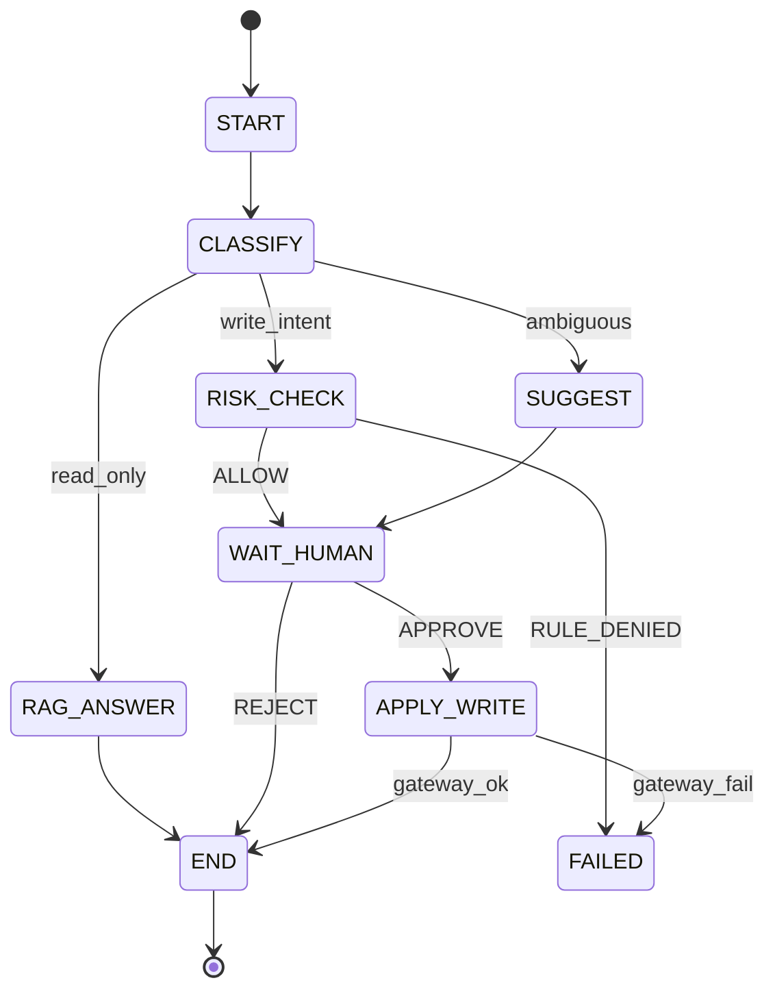
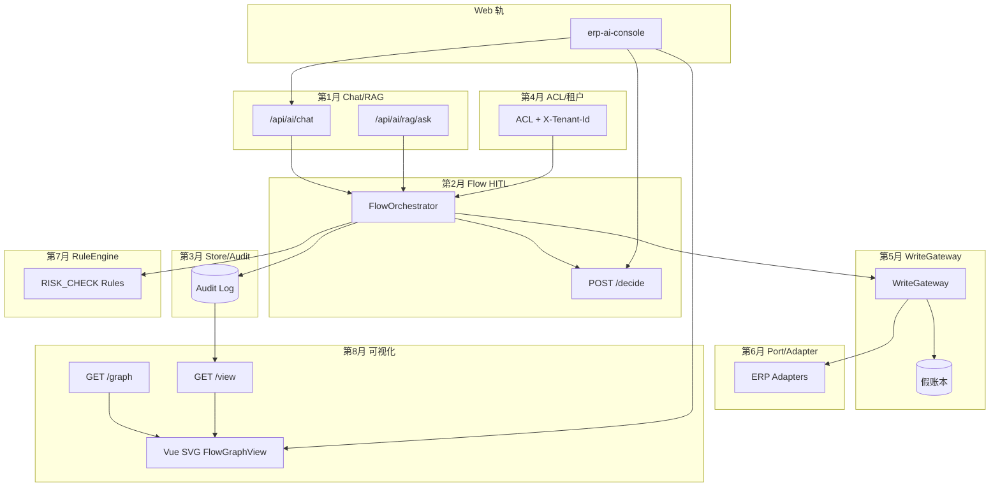

# 第 8 个月完整教材：工作流可视化

【完整教材 · 非 30 天合订 · 与第1月同等详细深度】

> **重要说明：** 本文是连续章节式完整教材，不是按天拆分的 30 天课程，也不是大纲摘要。
>
> **定位：** 纯学习；通用 ERP AI 助手**工作流可视化**教材；**不接公司生产、不接管公司 BPM 平台、不在前端发明状态迁移。**
>
> **产品句（全文关键处重复，非每段复读）：**
> **把 Flow 状态机画成可读图：节点、合法边、当前高亮、审计回放。可视化是理解与演示工具，不是放开 Agent 乱跳状态。APPROVE≠写库；写入仍经规则/Gateway。本月不接公司 BPM 平台。**
>
> **技术栈：** Java 17+ Spring Boot 学习期 REST + Vue 3 Vite 手写 SVG；Vite proxy → `http://localhost:8080` `/api`
>
> **代码约定：** 骨架在 Markdown，粘贴到笔记工程；**勿**直接改仓库 `erp-ai-assistant/`、`erp-ai-console/` 应用源码。
>
> **前置：** 第1～7月 + [Web 控制台](../WEB.md)
>
> **入口：** [docs/MONTH8.md](../MONTH8.md)
> **技术节点：** 本月对齐 **T12（工作流可视化）**；需 **T7 Vue** + **T5 Flow** · [TECH_ROADMAP](../TECH_ROADMAP.md)
> **建议视频（本月）：** MONTH8：Vue + SVG；Camunda 只对照，不接设计器 · 逐日见各 Day/章「建议视频」· 总表 [BILIBILI.md](../BILIBILI.md)

---

## 目录

1. [定位与总目标：学习可视化 vs BPMN 生产平台](#1-定位与总目标学习可视化-vs-bpmn-生产平台)
2. [领域模型 DTOs：FlowGraph / NodeDef / EdgeDef / FlowInstanceView / AuditEventView](#2-领域模型-dtosflowgraph--nodedef--edgedef--flowinstanceview--auditeventview)
3. [后端三 API：graph / view / audit（Controller + Service 骨架）](#3-后端三-apigraph--view--auditcontroller--service-骨架)
4. [合法迁移表驱动可画边与禁用边（与 FlowTransitions 对齐）](#4-合法迁移表驱动可画边与禁用边与-flowtransitions-对齐)
5. [渲染选型：手写 SVG 优先；Canvas / 轻量库利弊](#5-渲染选型手写-svg-优先canvas--轻量库利弊)
6. [布局：手工坐标 JSON + 分层布局可运行算法](#6-布局手工坐标-json--分层布局可运行算法)
7. [高亮当前态、历史路径、FAILED 样式（CSS 变量完整）](#7-高亮当前态历史路径failed-样式css-变量完整)
8. [HITL：图上选中 → decide 面板；APPROVE≠写库文案](#8-hitl图上选中--decide-面板approve写库文案)
9. [审计回放播放器（完整 Vue 逻辑）](#9-审计回放播放器完整-vue-逻辑)
10. [规则引擎标注：RISK_CHECK 与 RULE_DENIED 徽标](#10-规则引擎标注risk_check-与-rule_denied-徽标)
11. [APPLY_WRITE 与假账本侧栏](#11-apply_write-与假账本侧栏)
12. [多实例列表绑定](#12-多实例列表绑定)
13. [接入 erp-ai-console：路由、Pinia、文件树、proxy](#13-接入-erp-ai-consolerouterpinia文件树proxy)
14. [节点耗时与 traceId 标注](#14-节点耗时与-traceid-标注)
15. [a11y 与只读演示模式](#15-a11y-与只读演示模式)
16. [4 个端到端彩排剧本（逐步可打勾）](#16-4-个端到端彩排剧本逐步可打勾)
17. [PORTFOLIO 完整可粘贴章节](#17-portfolio-完整可粘贴章节)
18. [1～8 月架构终图](#18-18-月架构终图)
19. [口述 20 题 + 能力清单](#19-口述-20-题--能力清单)
20. [明确不做 + 第9月方向](#20-明确不做--第9月方向)
- [附录 A：配置参考](#附录-a配置参考)
- [附录 B：推荐文件树](#附录-b推荐文件树)
- [附录 C：API 对照表](#附录-capi-对照表)
- [附录 D：术语表 Glossary](#附录-d术语表-glossary)
- [附录 E：FAQ](#附录-efaq)
- [附录 F：工程纪律](#附录-f工程纪律)
- [附录 G：与 MONTH1～7 / WEB 交叉索引](#附录-g与-month17--web-交叉索引)
- [附录 H：分层布局细则](#附录-h分层布局细则)
- [附录 I：贝塞尔边命中检测](#附录-i贝塞尔边命中检测)
- [附录 J：curl 联调脚本](#附录-jcurl-联调脚本)
- [附录 K：修订记录](#附录-k修订记录)

---

## 阅读路线（连续章节，非按天）

| 阶段 | 章节 | 产出 |
|------|------|------|
| 边界 | 1 | 能区分 BPM vs 学习可视化 |
| 契约 | 2～4 | DTO + 三读 API + legalTransitions |
| 渲染 | 5～7 | SVG 拓扑 + 样式 |
| 交互 | 8～12 | HITL、回放、规则、写入、列表 |
| 集成 | 13～15 | 控制台、a11y、demo |
| 交付 | 16～20 | 彩排、PORTFOLIO、架构、口述 |

**联调环境：** 终端 A `cd erp-ai-assistant && mvn spring-boot:run`；终端 B `cd erp-ai-console && npm run dev`。所有 API 路径写 `/api/...` 走 Vite proxy。

---

# 1. 定位与总目标：学习可视化 vs BPMN 生产平台

> **技术前置：** 此时应当学会 **第1～7月能力 + Vue 3 / Vite 控制台基础（T7）+ Flow HITL（T5）** 后再进行阅读。 节点：**T5+T7→T12** · [TECH_ROADMAP](../TECH_ROADMAP.md)
> **建议视频：** [Camunda 介绍（对照 BPM vs 学习可视化）](https://www.bilibili.com/video/BV1qe4y1m7D7/) · 强调：本月手写 SVG，不接 BPM · 备用搜：`BPMN 可视化` · 总表 [BILIBILI.md](../BILIBILI.md)


## 为什么需要「工作流可视化」

第 2～7 月你已经实现或理解了：Flow 状态机、HITL、`RISK_CHECK` 规则引擎、`APPLY_WRITE` + WriteGateway、Port/Adapter、审计事件。评审与同伴在浏览器里 30 秒内会问三个问题：

1. **当前实例卡在哪？** 是 `WAIT_HUMAN` 等人，还是 `RISK_CHECK` 被拒，还是 `APPLY_WRITE` 写假账本失败？
2. **状态怎么跳的？** 有没有「前端拖一条边就改状态」的越权？
3. **APPROVE 是不是写库？** 若回答「是」，说明 Flow 与 Gateway 边界没讲清。

**工作流可视化**把后端权威状态机投影为 SVG 图：静态拓扑 + 动态高亮 + 审计回放。它是**理解与演示工具**，不是第二套编排器，更不是 Camunda/Activiti 替代品。

> **产品句：** 把 Flow 状态机画成可读图：节点、合法边、当前高亮、审计回放。可视化是理解与演示工具，不是放开 Agent 乱跳状态。APPROVE≠写库；写入仍经规则/Gateway。本月不接公司 BPM 平台。

## 学习可视化 vs 公司 BPMN 生产平台

| 维度 | 本月学习可视化 | 公司 BPMN / 流程平台 |
|------|----------------|----------------------|
| 拓扑来源 | 后端 `GET /graph` 静态 JSON | 设计器建模 + 部署包 |
| 实例推进 | `FlowOrchestrator` / decide API | 引擎 TaskService / 外部回调 |
| 前端能否拖边改状态 | **禁止** | 常见（管理员） |
| 合法迁移权威 | `legalTransitions` / `FlowTransitions` | 引擎定义 + 网关条件 |
| 写 ERP | 仅 `APPLY_WRITE` → Gateway（假账本） | 可能 ServiceTask 直连 |
| 审计 | `GET /audit` 时间线 + 回放 UI | 引擎历史表 + 运维台 |
| 范围 | 单学习 Flow 图 | 全公司流程资产 |
| 交付物 | Vue SVG + 三读 API 骨架 | 平台许可 + 集成项目 |

### 三个「绝不」

1. **绝不**在前端根据按钮猜测下一节点 — 只读 `view.currentNodeId` 与 `legalTransitions`。
2. **绝不**把可视化面板当成 BPM 设计器 — 无 save topology、无 deploy。
3. **绝不**在演示文案里把 APPROVE 说成「已过账」 — 写库结果看 `APPLY_WRITE` 节点徽标与假账本侧栏。

## 本月总目标（连续章节，非 30 天）

| # | 能力 | 验收 |
|---|------|------|
| 1 | 三读 API：`graph` / `view` / `audit` | curl + Network 200 |
| 2 | SVG 渲染节点边 + 合法/禁用边样式 | 非法边灰虚线不可点 |
| 3 | 当前态高亮 + 历史路径 | 与 view DTO 一致 |
| 4 | HITL：点 `WAIT_HUMAN` → decide 面板 | POST decide 后 refresh view |
| 5 | 审计回放逐步点亮边 | 播放器 cursor 驱动边 class |
| 6 | `RULE_DENIED` / `WRITE_RESULT` 图上标注 | 侧栏 + 徽标 |
| 7 | 接入 `erp-ai-console` 路由 | `/flow-viz/:id?` |
| 8 | 4 个彩排剧本 + PORTFOLIO | 8 分钟口述 |

## 学习 Flow 拓扑（与第 2/5/7 月对齐）

```text
                    ┌─────────────┐
                    │   START     │
                    └──────┬──────┘
                           ▼
                    ┌─────────────┐
              ┌─────│  CLASSIFY   │─────┐
              │     └─────────────┘     │
              ▼                         ▼
       ┌─────────────┐          ┌─────────────┐
       │ RAG_ANSWER  │          │  RISK_CHECK │
       └──────┬──────┘          └───┬────┬────┘
              │                     │    │
              │              allow  │    │ deny
              │                     ▼    ▼
              │              ┌─────────────┐  ┌────────┐
              │              │ WAIT_HUMAN  │  │ FAILED │
              │              └──────┬──────┘  └────────┘
              │                     │ APPROVE
              │                     ▼
              │              ┌─────────────┐
              └─────────────►│ APPLY_WRITE │──► END
                             └─────────────┘
```



## 架构分层：谁读、谁写

```text
┌─────────────────────────────────────────────────────────┐
│  Vue FlowGraphView（只读投影 + HITL 触发 decide）          │
│    GET graph / view / audit     POST decide（已有 API）    │
└───────────────────────────┬─────────────────────────────┘
                            │ REST
┌───────────────────────────▼─────────────────────────────┐
│  FlowGraphController + FlowGraphService（本月新增骨架）    │
│    静态拓扑 catalog + 实例视图组装 + 审计投影              │
└───────────────────────────┬─────────────────────────────┘
                            │
┌───────────────────────────▼─────────────────────────────┐
│  已有：FlowOrchestrator / RuleEngine / WriteGateway       │
│  改状态、写库 — 不在可视化 Controller 内实现               │
└─────────────────────────────────────────────────────────┘
```

## 怎么做（本章落地步骤）

1. **白板**画出上拓扑，标出 HITL 与 WRITE 节点 — 与后端节点 id 字符串一致（大写下划线）。
2. **阅读** [WEB_VUE_COMPLETE.md](./WEB_VUE_COMPLETE.md) 第 11 章 Flow HITL — 可视化是 HITL 的「空间视图」。
3. **创建笔记目录** `erp-ai-console/src/views/FlowVizView.vue`（本章只规划，第 13 章接入）。
4. **在后端笔记包**规划 `com.erp.ai.learn.flowviz` — 第 3 章粘贴 Controller。
5. **写演示三句纪律**（贴显示器旁）：
   - 图是只读投影，改状态走 decide。
   - APPROVE 只过 HITL，写库看 APPLY_WRITE。
   - 不接公司 BPM，legalTransitions 是权威。

## 代码心智模型（第 1 章仅预览）

```java
// 可视化三读 — 不含 POST start/decide 的实现细节（沿用第 2 月）
@RestController
@RequestMapping("/api/ai/flow")
public class FlowGraphController {
  private final FlowGraphService graphService;

  @GetMapping("/graph")
  public FlowGraphDto graph(@RequestHeader(value = "X-Tenant-Id", required = false) String tenant) {
    return graphService.staticGraph(tenant);
  }

  @GetMapping("/{id}/view")
  public FlowInstanceViewDto view(@PathVariable String id) {
    return graphService.buildView(id);
  }

  @GetMapping("/{id}/audit")
  public List<AuditEventViewDto> audit(@PathVariable String id) {
    return graphService.auditTrail(id);
  }
}
```

```vue
<!-- FlowGraphView.vue — 根组件数据流 -->
<script setup>
import { watch } from 'vue'
import { useFlowViz } from '@/composables/useFlowViz'

const props = defineProps({ instanceId: String, readOnly: { type: Boolean, default: false } })
const { graph, view, audit, reload, loading, error } = useFlowViz(() => props.instanceId)

watch(() => props.instanceId, () => reload(), { immediate: true })
</script>
```

## 本章专属坑与排障

| 坑 | 典型现象 | 根因 | 处理 |
|----|----------|------|------|
| 范围蔓延 | 讨论 Camunda 集成 | 混淆学习可视化与 BPM | 回到产品句，只做三读 API |
| 前端编排 | 点击边弹出「确认迁移」 | 误学 BPM 设计器 | 边不可拖拽；仅 HITL 节点打开 decide |
| 节点名漂移 | SVG 有节点 API 无 | CLASSIFY vs Classify | 全链路大写常量，与 FlowTransitions 一致 |
| 双源真相 | view 与 pending 列表不一致 | 只刷新了列表 | decide 后 `reload()` graph+view+audit |
| 演示口误 | 「点批准就写进 ERP」 | HITL 与 Gateway 未分 | 侧栏固定 APPROVE≠写库 文案 |

## 验收检查

- [ ] 能在白板上画出 START→…→END 全拓扑
- [ ] 能对比 BPM 与本月的 4 条差异（表内任选）
- [ ] 能口述三句纪律而不卡壳
- [ ] 能指出「写状态」与「读图」分别由哪些 API 负责

## 与后续章节关系

| 后续章 | 本章铺垫 |
|--------|----------|
| 第 2 章 | DTO 字段含义 |
| 第 3 章 | 三读 API 实现 |
| 第 4 章 | legalTransitions 驱动边 |
| 第 13 章 | 控制台路由挂载 |

**口述 1 分钟（第 1 章）：** 说明可视化如何帮助评审理解 Flow，以及为何它不是 BPM 平台。

---


## 评审常问速答（第 1 章补充）

| 问题 | 推荐答法 |
|------|----------|
| 这是 BPM 吗？ | 不是；这是 AI 学习 Flow 的只读 SVG 投影。 |
| 为何不用 Camunda Modeler？ | 学习期拓扑固定在后端 JSON；无需部署 BPMN XML。 |
| 前端能改流程吗？ | 不能；改 Flow 定义是后端发版，不是拖图。 |
| 和生产流程平台关系？ | 无集成；纪律明确不接公司 BPM。 |
| 价值在哪？ | 8 分钟内向非后端观众证明 HITL/规则/Gateway 边界。 |

## 学习笔记模板

```text
日期：
拓扑节点清单（与后端 id 核对）：
今日演示对象（角色/租户）：
三句纪律（手写）：
开放问题：
```
# 2. 领域模型 DTOs：FlowGraph / NodeDef / EdgeDef / FlowInstanceView / AuditEventView

> **技术前置：** 此时应当学会 **可视化定位边界（T12）；本章开始学 FlowGraph DTO 契约** 后再进行阅读。 节点：**T12** · [TECH_ROADMAP](../TECH_ROADMAP.md)
> **建议视频：** B 站搜 `graph JSON visualization` · 图 DTO / 拓扑 JSON · 总表 [BILIBILI.md](../BILIBILI.md)


## 为什么静态图与动态实例必须分离

若把「节点坐标」和「当前在哪个节点」塞进同一个 JSON，会出现三类工程问题：

1. **缓存策略冲突** — 拓扑几乎不变，实例每秒变；合并后无法 CDN/内存缓存 graph。
2. **版本升级困难** — 发新版布局不应迁移历史实例字段。
3. **前端渲染抖动** — 轮询 view 时误覆盖手工 layout。

因此：**FlowGraphDto**（静态）与 **FlowInstanceViewDto**（动态）分离；**AuditEventViewDto**（时间序列）第三次投影，供回放播放器消费。

## ER 与职责

```text
FlowGraphDto (1) ──< (N) FlowInstanceViewDto
FlowInstance (domain) ──< (N) AuditEventViewDto
EdgeDef 引用 NodeDef.id；view 引用 currentNodeId + visitedEdgeIds
```

### NodeDef.kind 枚举（驱动 SVG 形状）

| kind | 含义 | SVG 形状建议 | 交互 |
|------|------|--------------|------|
| START | 入口 | 圆角小圆 | 只读 |
| TASK | 自动任务 | 矩形 | 只读 |
| GATE | 网关/分支 | 菱形 | 只读 |
| HITL | 人工卡点 | 双边框矩形 | 可点击 → decide |
| WRITE | 写库节点 | 矩形 + 数据库图标 | 只读；展示 WRITE_RESULT |
| END | 终止 | 双圆 | 只读 |

## 完整 Java Records（粘贴到笔记包）

```java
package com.erp.ai.learn.flowviz.dto;

import com.fasterxml.jackson.annotation.JsonInclude;
import java.time.Instant;
import java.util.List;
import java.util.Map;
import java.util.Set;

/** 静态拓扑：全实例共享，带 layout 与合法迁移表 */
public record FlowGraphDto(
    String graphId,
    String version,
    List<NodeDefDto> nodes,
    List<EdgeDefDto> edges,
    Map<String, Set<String>> legalTransitions,
    Map<String, String> meta
) {}

/** 单个节点定义 — 坐标可来自 layout JSON 覆盖 */
public record NodeDefDto(
    String id,
    String label,
    String kind,
    double x,
    double y,
    Map<String, String> meta
) {}

/** 有向边 — id 稳定，供 visitedEdgeIds 引用 */
public record EdgeDefDto(
    String id,
    String from,
    String to,
    String label,
    boolean enabledByDefault,
    Map<String, String> meta
) {}

/** 实例运行时视图 — 前端高亮唯一依据 */
@JsonInclude(JsonInclude.Include.NON_NULL)
public record FlowInstanceViewDto(
    String instanceId,
    String graphId,
    String graphVersion,
    String currentNodeId,
    String status,
    List<String> visitedNodeIds,
    List<String> visitedEdgeIds,
    String traceId,
    Instant updatedAt,
    Map<String, NodeAnnotationDto> nodeAnnotations
) {}

/** 节点上的动态徽标：规则拒绝、写入结果、耗时 */
public record NodeAnnotationDto(
    String badge,
    String tone,
    String detail,
    Long durationMs,
    Map<String, Object> extras
) {}

/** 审计时间线 — seq 全局递增 */
public record AuditEventViewDto(
    long seq,
    Instant at,
    String type,
    String nodeId,
    String edgeId,
    String message,
    String traceId,
    Map<String, Object> payload
) {}
```

## 完整 graph JSON 样例

```json
{
  "graphId": "erp-ai-learn-flow",
  "version": "2026.08.1",
  "meta": { "title": "ERP AI 学习 Flow", "locale": "zh-CN" },
  "nodes": [
    { "id": "START", "label": "开始", "kind": "START", "x": 60, "y": 260, "meta": {} },
    { "id": "CLASSIFY", "label": "意图分类", "kind": "TASK", "x": 200, "y": 260, "meta": {} },
    { "id": "RAG_ANSWER", "label": "RAG 只读答", "kind": "TASK", "x": 360, "y": 140, "meta": {} },
    { "id": "RISK_CHECK", "label": "规则风控", "kind": "GATE", "x": 360, "y": 260, "meta": {} },
    { "id": "SUGGEST", "label": "澄清建议", "kind": "TASK", "x": 360, "y": 380, "meta": {} },
    { "id": "FAILED", "label": "失败", "kind": "END", "x": 520, "y": 140, "meta": { "terminal": "failure" } },
    { "id": "WAIT_HUMAN", "label": "人工审批", "kind": "HITL", "x": 520, "y": 260, "meta": {} },
    { "id": "APPLY_WRITE", "label": "Gateway 写入", "kind": "WRITE", "x": 700, "y": 260, "meta": {} },
    { "id": "END", "label": "结束", "kind": "END", "x": 860, "y": 260, "meta": { "terminal": "success" } }
  ],
  "edges": [
    { "id": "e-start-classify", "from": "START", "to": "CLASSIFY", "label": "", "enabledByDefault": true, "meta": {} },
    { "id": "e-classify-rag", "from": "CLASSIFY", "to": "RAG_ANSWER", "label": "read", "enabledByDefault": true, "meta": {} },
    { "id": "e-classify-risk", "from": "CLASSIFY", "to": "RISK_CHECK", "label": "write", "enabledByDefault": true, "meta": {} },
    { "id": "e-classify-suggest", "from": "CLASSIFY", "to": "SUGGEST", "label": "?", "enabledByDefault": true, "meta": {} },
    { "id": "e-rag-end", "from": "RAG_ANSWER", "to": "END", "label": "", "enabledByDefault": true, "meta": {} },
    { "id": "e-risk-wait", "from": "RISK_CHECK", "to": "WAIT_HUMAN", "label": "ALLOW", "enabledByDefault": true, "meta": {} },
    { "id": "e-risk-failed", "from": "RISK_CHECK", "to": "FAILED", "label": "DENY", "enabledByDefault": true, "meta": {} },
    { "id": "e-suggest-wait", "from": "SUGGEST", "to": "WAIT_HUMAN", "label": "", "enabledByDefault": true, "meta": {} },
    { "id": "e-wait-apply", "from": "WAIT_HUMAN", "to": "APPLY_WRITE", "label": "APPROVE", "enabledByDefault": true, "meta": {} },
    { "id": "e-wait-end", "from": "WAIT_HUMAN", "to": "END", "label": "REJECT", "enabledByDefault": true, "meta": {} },
    { "id": "e-apply-end", "from": "APPLY_WRITE", "to": "END", "label": "ok", "enabledByDefault": true, "meta": {} },
    { "id": "e-apply-failed", "from": "APPLY_WRITE", "to": "FAILED", "label": "fail", "enabledByDefault": true, "meta": {} }
  ],
  "legalTransitions": {
    "START": ["CLASSIFY"],
    "CLASSIFY": ["RAG_ANSWER", "RISK_CHECK", "SUGGEST"],
    "RAG_ANSWER": ["END"],
    "RISK_CHECK": ["WAIT_HUMAN", "FAILED"],
    "SUGGEST": ["WAIT_HUMAN"],
    "WAIT_HUMAN": ["APPLY_WRITE", "END"],
    "APPLY_WRITE": ["END", "FAILED"],
    "FAILED": [],
    "END": []
  }
}
```

## view JSON 样例（HITL 等待中）

```json
{
  "instanceId": "flow-7f3a2c",
  "graphId": "erp-ai-learn-flow",
  "graphVersion": "2026.08.1",
  "currentNodeId": "WAIT_HUMAN",
  "status": "RUNNING",
  "visitedNodeIds": ["START", "CLASSIFY", "RISK_CHECK", "WAIT_HUMAN"],
  "visitedEdgeIds": ["e-start-classify", "e-classify-risk", "e-risk-wait"],
  "traceId": "tr-20260815-abc",
  "updatedAt": "2026-08-15T03:12:00Z",
  "nodeAnnotations": {
    "RISK_CHECK": {
      "badge": "RULE_ALLOW",
      "tone": "ok",
      "detail": "规则集 v3 通过",
      "durationMs": 42,
      "extras": { "rulePack": "write-guard-v3" }
    }
  }
}
```

## audit JSON 样例（片段）

```json
[
  {
    "seq": 1,
    "at": "2026-08-15T03:11:50Z",
    "type": "NODE_ENTER",
    "nodeId": "START",
    "edgeId": null,
    "message": "实例创建",
    "traceId": "tr-20260815-abc",
    "payload": { "tenantId": "tenant-a" }
  },
  {
    "seq": 4,
    "at": "2026-08-15T03:12:00Z",
    "type": "NODE_ENTER",
    "nodeId": "WAIT_HUMAN",
    "edgeId": "e-risk-wait",
    "message": "等待人工",
    "traceId": "tr-20260815-abc",
    "payload": { "draftPreview": "..." }
  }
]
```

## TypeScript 类型（前端 `types/flow-viz.ts`）

```typescript
export type NodeKind = 'START' | 'TASK' | 'GATE' | 'HITL' | 'WRITE' | 'END'

export interface FlowGraph {
  graphId: string
  version: string
  nodes: NodeDef[]
  edges: EdgeDef[]
  legalTransitions: Record<string, string[]>
  meta?: Record<string, string>
}

export interface NodeDef {
  id: string
  label: string
  kind: NodeKind
  x: number
  y: number
  meta?: Record<string, string>
}

export interface EdgeDef {
  id: string
  from: string
  to: string
  label: string
  enabledByDefault: boolean
  meta?: Record<string, string>
}

export interface FlowInstanceView {
  instanceId: string
  graphId: string
  graphVersion: string
  currentNodeId: string
  status: string
  visitedNodeIds: string[]
  visitedEdgeIds: string[]
  traceId: string
  updatedAt: string
  nodeAnnotations?: Record<string, NodeAnnotation>
}

export interface NodeAnnotation {
  badge: string
  tone: 'ok' | 'warn' | 'error' | 'neutral'
  detail?: string
  durationMs?: number
  extras?: Record<string, unknown>
}

export interface AuditEventView {
  seq: number
  at: string
  type: string
  nodeId?: string
  edgeId?: string
  message: string
  traceId: string
  payload?: Record<string, unknown>
}
```

## 怎么做

1. 在笔记后端创建 `dto` 包，粘贴 records。
2. 用 `FlowGraphCatalog` 常量类持有上 JSON（或 `classpath:flow/learn-graph.json`）。
3. 前端创建 `types/flow-viz.ts`，并在 `useFlowViz` 里标注返回类型。
4. 写单测：`ObjectMapper` 反序列化 graph JSON → 断言 `legalTransitions.get("WAIT_HUMAN")` 含 `APPLY_WRITE`。
5. 对照第 5 月 `FlowTransitions` 类 — 字段集合必须一致（第 4 章细讲）。

## 本章专属坑与排障

| 坑 | 现象 | 处理 |
|----|------|------|
| edgeId 不稳定 | 回放无法点亮边 | 边 id 用语义化常量，非随机 UUID |
| visited 顺序 | 历史路径箭头方向错 | 后端按时间 append；前端按 edge 列表顺序画 |
| graphVersion 缺失 | 升级 layout 后旧实例错位 | view 带 graphVersion；不匹配时提示 |
| annotation 过大 | JSON 膨胀 | 详情放 audit payload；view 只留 badge |
| Instant 序列化 | 前端 NaN 时间 | 统一 ISO-8601；Spring 配 Jackson JavaTime |

## 验收检查

- [ ] records + TS 类型与 JSON 样例字段一致
- [ ] 能解释 graph / view / audit 三者分工
- [ ] 能手写 `WAIT_HUMAN` 的 legalTransitions 后继集合

---


## Jackson 反序列化单测（第 2 章补充）

```java
@Test
void deserializeGraphJson() throws Exception {
  var json = getClass().getResourceAsStream("/flow/learn-graph.json");
  var dto = new ObjectMapper().registerModule(new JavaTimeModule())
      .readValue(json, FlowGraphDto.class);
  assertEquals("erp-ai-learn-flow", dto.graphId());
  assertTrue(dto.legalTransitions().containsKey("WAIT_HUMAN"));
  assertEquals(Set.of("APPLY_WRITE", "END"), dto.legalTransitions().get("WAIT_HUMAN"));
}
```

## view 字段演进策略

| 字段 | 新增版本 | 兼容 |
|------|----------|------|
| graphVersion | 2026.08.1 | 旧前端忽略 |
| nodeAnnotations | 2026.08.1 | 空 map 默认 |
| durationMs in annotation | 2026.08.1 | 可选 |
# 3. 后端三 API：graph / view / audit（Controller + Service 骨架）

> **技术前置：** 此时应当学会 **DTO 契约；本章开始学 graph/view/audit 三读 API** 后再进行阅读。 节点：**T12** · [TECH_ROADMAP](../TECH_ROADMAP.md)
> **建议视频：** B 站搜 `REST 只读 资源` · 只读 API 设计 · 总表 [BILIBILI.md](../BILIBILI.md)


## 为什么可视化只新增「三读」

第 2 月已有 `POST /start`、`POST /{id}/decide`、`GET /pending`。本月**不重复**写状态机，只新增三个**投影**端点，把已有 `FlowInstance` + 审计表组装成 DTO。写路径仍走 orchestrator — Controller 内禁止出现 `writeGateway.apply()`。

## 端点契约

| 方法 | 路径 | 说明 | 缓存 |
|------|------|------|------|
| GET | `/api/ai/flow/graph` | 静态拓扑 + legalTransitions | 可短缓存 |
| GET | `/api/ai/flow/{id}/view` | 实例快照 | no-store |
| GET | `/api/ai/flow/{id}/audit` | 审计序列 | no-store |

### 请求头（与 WEB 轨道一致）

```
X-Tenant-Id: tenant-a
X-User-Id: reviewer-1
X-Roles: FLOW_REVIEWER
X-Trace-Id: tr-demo-001   # 可选，便于与图上网关对齐
```

## FlowGraphController 完整骨架

```java
package com.erp.ai.learn.flowviz.web;

import com.erp.ai.learn.flowviz.dto.*;
import com.erp.ai.learn.flowviz.service.FlowGraphService;
import org.springframework.http.CacheControl;
import org.springframework.http.ResponseEntity;
import org.springframework.web.bind.annotation.*;

import java.util.List;
import java.util.concurrent.TimeUnit;

@RestController
@RequestMapping("/api/ai/flow")
public class FlowGraphController {

  private final FlowGraphService graphService;

  public FlowGraphController(FlowGraphService graphService) {
    this.graphService = graphService;
  }

  @GetMapping("/graph")
  public ResponseEntity<FlowGraphDto> graph(
      @RequestHeader(value = "X-Tenant-Id", required = false, defaultValue = "default") String tenant) {
    FlowGraphDto dto = graphService.staticGraph(tenant);
    return ResponseEntity.ok()
        .cacheControl(CacheControl.maxAge(60, TimeUnit.SECONDS).cachePublic())
        .body(dto);
  }

  @GetMapping("/{id}/view")
  public FlowInstanceViewDto view(@PathVariable("id") String instanceId) {
    return graphService.buildView(instanceId);
  }

  @GetMapping("/{id}/audit")
  public List<AuditEventViewDto> audit(@PathVariable("id") String instanceId) {
    return graphService.auditTrail(instanceId);
  }
}
```

## FlowGraphService 完整骨架

```java
package com.erp.ai.learn.flowviz.service;

import com.erp.ai.learn.flowviz.catalog.FlowGraphCatalog;
import com.erp.ai.learn.flowviz.dto.*;
import com.erp.ai.learn.flowviz.repo.AuditReadPort;
import com.erp.ai.learn.flowviz.repo.FlowInstanceReadPort;
import org.springframework.stereotype.Service;

import java.util.Comparator;
import java.util.List;
import java.util.Map;
import java.util.stream.Collectors;

@Service
public class FlowGraphService {

  private final FlowInstanceReadPort instances;
  private final AuditReadPort auditReader;
  private final NodeAnnotationBuilder annotationBuilder;

  public FlowGraphService(
      FlowInstanceReadPort instances,
      AuditReadPort auditReader,
      NodeAnnotationBuilder annotationBuilder) {
    this.instances = instances;
    this.auditReader = auditReader;
    this.annotationBuilder = annotationBuilder;
  }

  public FlowGraphDto staticGraph(String tenantId) {
    // 学习期：各租户同一拓扑；meta 可写入 tenant 皮肤
    FlowGraphDto base = FlowGraphCatalog.LEARN_GRAPH_V2026_08;
    if ("default".equals(tenantId)) return base;
    return new FlowGraphDto(
        base.graphId(), base.version(), base.nodes(), base.edges(),
        base.legalTransitions(),
        Map.of("tenantId", tenantId, "title", base.meta().get("title")));
  }

  public FlowInstanceViewDto buildView(String instanceId) {
    var inst = instances.requireById(instanceId);
    var graph = staticGraph(inst.tenantId());
    var annotations = annotationBuilder.fromInstance(inst);
    return new FlowInstanceViewDto(
        inst.id(),
        graph.graphId(),
        graph.version(),
        inst.currentNodeId(),
        inst.status(),
        inst.visitedNodeIds(),
        inst.visitedEdgeIds(),
        inst.traceId(),
        inst.updatedAt(),
        annotations);
  }

  public List<AuditEventViewDto> auditTrail(String instanceId) {
    instances.requireById(instanceId); // 404 if missing
    return auditReader.listByInstance(instanceId).stream()
        .sorted(Comparator.comparingLong(AuditEventViewDto::seq))
        .collect(Collectors.toList());
  }
}
```

## NodeAnnotationBuilder（连接第 7/5 月）

```java
@Service
public class NodeAnnotationBuilder {
  public Map<String, NodeAnnotationDto> fromInstance(FlowInstanceSnapshot inst) {
    var map = new java.util.HashMap<String, NodeAnnotationDto>();
    if (inst.lastRuleDecision() != null) {
      map.put("RISK_CHECK", new NodeAnnotationDto(
          inst.lastRuleDecision().allowed() ? "RULE_ALLOW" : "RULE_DENIED",
          inst.lastRuleDecision().allowed() ? "ok" : "error",
          inst.lastRuleDecision().message(),
          inst.lastRuleDecision().durationMs(),
          Map.of("ruleIds", inst.lastRuleDecision().firedRuleIds())));
    }
    if (inst.writeResult() != null) {
      map.put("APPLY_WRITE", new NodeAnnotationDto(
          inst.writeResult().success() ? "WRITE_OK" : "WRITE_FAIL",
          inst.writeResult().success() ? "ok" : "error",
          inst.writeResult().ledgerRef(),
          inst.writeResult().durationMs(),
          Map.of("idempotencyKey", inst.writeResult().idempotencyKey())));
    }
    inst.nodeDurations().forEach((nodeId, ms) ->
        map.merge(nodeId, new NodeAnnotationDto(null, "neutral", null, ms, Map.of()),
            (a, b) -> new NodeAnnotationDto(a.badge(), a.tone(), a.detail(), b.durationMs(), a.extras())));
    return map;
  }
}
```

## FlowGraphCatalog 常量

```java
public final class FlowGraphCatalog {
  private FlowGraphCatalog() {}

  public static final FlowGraphDto LEARN_GRAPH_V2026_08 = FlowGraphJsonLoader.load("flow/learn-graph.json");

  /** 与第 5 月 FlowTransitions 保持同一数据源（可 refactor 共用） */
  public static Map<String, Set<String>> legalTransitions() {
    return LEARN_GRAPH_V2026_08.legalTransitions();
  }
}
```

## 异常与 HTTP 映射

| 异常 | HTTP | 前端处理 |
|------|------|----------|
| InstanceNotFoundException | 404 | 空态「实例不存在」 |
| TenantForbiddenException | 403 | toast + 切租户 |
| AuditNotReadyException | 503 | 重试按钮 |

```java
@ControllerAdvice
public class FlowVizExceptionHandler {
  @ExceptionHandler(InstanceNotFoundException.class)
  @ResponseStatus(HttpStatus.NOT_FOUND)
  public Map<String, String> notFound(InstanceNotFoundException ex) {
    return Map.of("error", "INSTANCE_NOT_FOUND", "message", ex.getMessage());
  }
}
```

## curl 验证（单实例）

```bash
BASE=http://localhost:8080
HDR=(-H 'X-Tenant-Id: tenant-a' -H 'X-User-Id: u1')

curl -s "${HDR[@]}" "$BASE/api/ai/flow/graph" | jq '.graphId,.version,(.legalTransitions.WAIT_HUMAN|join(","))'

# 先 start 拿 id
FID=$(curl -s "${HDR[@]}" -X POST "$BASE/api/ai/flow/start" \
  -H 'Content-Type: application/json' \
  -d '{"question":"把 PO-1001 收货数量改为 50"}' | jq -r '.flowId // .instanceId // .id')

curl -s "${HDR[@]}" "$BASE/api/ai/flow/$FID/view" | jq '{current:.currentNodeId,visited:.visitedEdgeIds}'

curl -s "${HDR[@]}" "$BASE/api/ai/flow/$FID/audit" | jq 'map({seq,type,nodeId,edgeId})'
```

## 怎么做

1. 粘贴 Controller + Service 到笔记 Spring Boot 工程。
2. 实现 `FlowInstanceReadPort` 适配已有 `FlowInstanceRepository`（只读）。
3. 实现 `AuditReadPort` 适配第 3 月 audit 表 — 映射为 `AuditEventViewDto`。
4. 启动后端，跑 curl 三件套；确认 audit `seq` 单调递增。
5. **代码审查清单**：Controller 无 `@PostMapping` 改状态；无 Gateway 注入。

## 本章专属坑与排障

| 坑 | 现象 | 处理 |
|----|------|------|
| 404 路径冲突 | `/graph` 被 `/{id}` 吃掉 | `@GetMapping("/graph")` 声明在 `{id}` 之前或使用更具体路径 |
| view  stale | decide 后图不变 | 前端 decide 后调 `reload()`；后端 view 读最新实例 |
| audit 无序 | 回放跳跃 | Service 层 `sorted(Comparator.comparingLong(seq))` |
| 泄露内部字段 | payload 含 PII | `@JsonInclude` + 投影层脱敏 |
| 缓存 graph 过 long | 发版后前端旧拓扑 | version 变更加 Cache-Control no-cache 一次 |

## 验收检查

- [ ] 三端点 200 + JSON 字段齐全
- [ ] Controller 无写状态逻辑
- [ ] curl 脚本可复制运行
- [ ] audit seq 与 orchestrator 日志一致

---


## MockMvc 切片测试（第 3 章补充）

```java
@WebMvcTest(FlowGraphController.class)
class FlowGraphControllerTest {
  @Autowired MockMvc mvc;
  @MockBean FlowGraphService graphService;

  @Test
  void graphReturns200() throws Exception {
    when(graphService.staticGraph(any())).thenReturn(FlowGraphCatalog.LEARN_GRAPH_V2026_08);
    mvc.perform(get("/api/ai/flow/graph").header("X-Tenant-Id", "tenant-a"))
        .andExpect(status().isOk())
        .andExpect(jsonPath("$.graphId").value("erp-ai-learn-flow"));
  }
}
```

## 读端口适配清单

| 端口 | 适配来源 | 方法 |
|------|----------|------|
| FlowInstanceReadPort | FlowInstanceRepository | findById |
| AuditReadPort | AuditLogRepository | listByFlowId |
# 4. 合法迁移表驱动可画边与禁用边（与 FlowTransitions 对齐）

> **技术前置：** 此时应当学会 **三读 API；本章开始学 legalTransitions 驱动可画边（T5）** 后再进行阅读。 节点：**T5+T12** · [TECH_ROADMAP](../TECH_ROADMAP.md)
> **建议视频：** B 站搜 `状态图 合法迁移` · 合法边/状态图 · 总表 [BILIBILI.md](../BILIBILI.md)


## 为什么 legalTransitions 是「可画边」的唯一权威

前端**不能**根据 edge 列表「看起来能连」就允许交互。第 5 月 `FlowTransitions` / `LegalTransitionMatrix` 在后端 decide 与 orchestrator 推进时校验；可视化层必须消费**同一张表**，否则会出现「图画能走、API 409」或「图画不能走、其实合法」的双源真相。

## 与 FlowTransitions 对齐（Java）

```java
/** 第 5 月已有 — 可视化 catalog 与之同源 */
public final class FlowTransitions {
  public static final Map<String, Set<String>> LEGAL = Map.ofEntries(
      Map.entry("START", Set.of("CLASSIFY")),
      Map.entry("CLASSIFY", Set.of("RAG_ANSWER", "RISK_CHECK", "SUGGEST")),
      Map.entry("RAG_ANSWER", Set.of("END")),
      Map.entry("RISK_CHECK", Set.of("WAIT_HUMAN", "FAILED")),
      Map.entry("SUGGEST", Set.of("WAIT_HUMAN")),
      Map.entry("WAIT_HUMAN", Set.of("APPLY_WRITE", "END")),
      Map.entry("APPLY_WRITE", Set.of("END", "FAILED")),
      Map.entry("FAILED", Set.of()),
      Map.entry("END", Set.of())
  );

  public static void assertLegal(String from, String to) {
    if (!LEGAL.getOrDefault(from, Set.of()).contains(to))
      throw new IllegalTransitionException(from, to);
  }
}
```

**纪律：** `FlowGraphCatalog.LEARN_GRAPH_V2026_08.legalTransitions()` 与 `FlowTransitions.LEGAL` 字节级一致。单测：

```java
@Test
void graphLegalMatchesFlowTransitions() {
  assertEquals(FlowTransitions.LEGAL, FlowGraphCatalog.legalTransitions());
}
```

## 边的三类视觉状态

| 状态 | 条件 | SVG class | 交互 |
|------|------|-----------|------|
| idle | 在 graph.edges 中，未访问 | `edge idle` | 无 |
| history | edge.id ∈ view.visitedEdgeIds | `edge lit` | 无 |
| next-hop | from=current 且 to∈legalTransitions[current] | `edge next` | 仅展示；**不可点击迁移** |
| disabled | 在 edges 中但非法 | `edge disabled` | pointer-events:none |

## 前端边分类 composable

```javascript
// composables/useEdgeStates.js
export function useEdgeStates(graph, view) {
  function classify(edge) {
    if (!graph.value || !view.value) return 'idle'
    const visited = new Set(view.value.visitedEdgeIds ?? [])
    if (visited.has(edge.id)) return 'history'
    const next = graph.value.legalTransitions?.[view.value.currentNodeId] ?? []
    if (edge.from === view.value.currentNodeId && next.includes(edge.to))
      return 'next'
    if (!isLegalEdge(edge, graph.value)) return 'disabled'
    return 'idle'
  }

  function isLegalEdge(edge, g) {
    const allowed = g.legalTransitions?.[edge.from] ?? []
    return allowed.includes(edge.to)
  }

  function isNextHop(edge, g, v) {
    const next = g.legalTransitions?.[v.currentNodeId] ?? []
    return v.currentNodeId === edge.from && next.includes(edge.to)
  }

  return { classify, isLegalEdge, isNextHop }
}
```

## FlowEdges.vue 完整骨架

```vue
<script setup>
import { computed } from 'vue'
import { useEdgeStates } from '@/composables/useEdgeStates'
import { bezierPath } from '@/utils/bezier'

const props = defineProps({
  graph: { type: Object, required: true },
  view: { type: Object, default: null },
  nodesById: { type: Object, required: true },
  replayEdgeIds: { type: Set, default: () => new Set() },
})

const { classify } = useEdgeStates(computed(() => props.graph), computed(() => props.view))

function path(edge) {
  const a = props.nodesById[edge.from]
  const b = props.nodesById[edge.to]
  if (!a || !b) return ''
  return bezierPath(a.x, a.y, b.x, b.y)
}

function edgeClass(edge) {
  if (props.replayEdgeIds.size && !props.replayEdgeIds.has(edge.id)) return 'edge replay-dim'
  const base = classify(edge)
  return `edge ${base}`
}
</script>

<template>
  <g class="edges" aria-hidden="true">
    <path
      v-for="e in graph.edges"
      :key="e.id"
      :d="path(e)"
      :class="edgeClass(e)"
      :data-edge-id="e.id"
      :data-from="e.from"
      :data-to="e.to"
    />
    <text
      v-for="e in graph.edges"
      :key="e.id + '-lbl'"
      v-show="e.label"
      :x="(nodesById[e.from].x + nodesById[e.to].x) / 2"
      :y="(nodesById[e.from].y + nodesById[e.to].y) / 2 - 6"
      class="edge-label"
    >{{ e.label }}</text>
  </g>
</template>

<style scoped>
.edge { fill: none; stroke: var(--edge-idle); stroke-width: 2; }
.edge.lit { stroke: var(--edge-history); stroke-width: 3; }
.edge.next { stroke: var(--edge-next); stroke-width: 2.5; stroke-dasharray: none; }
.edge.disabled {
  stroke: var(--edge-disabled);
  stroke-dasharray: 6 4;
  opacity: 0.45;
  pointer-events: none;
}
.edge.replay-dim { opacity: 0.2; }
.edge-label { font-size: 11px; fill: var(--color-muted); text-anchor: middle; }
</style>
```

## 后端 409 与前端 toast

当有人绕过 UI 用 curl 乱调 orchestrator（非 decide 正规路径）时，仍可能 `IllegalTransitionException`：

```json
{ "error": "ILLEGAL_TRANSITION", "from": "WAIT_HUMAN", "to": "FAILED" }
```

前端**不应**尝试 POST 改边；若集成测试误触，toast 展示 message，并 `reload()` view。

## 拓扑边 vs 合法边

`graph.edges` 可包含**全量**有向边（含 disabled 展示）；`legalTransitions` 定义运行时允许集合。例如 `WAIT_HUMAN → END`（REJECT）在 edges 中存在且合法；`WAIT_HUMAN → FAILED` 若不在 LEGAL 中，应：

- 要么不画此边；
- 要么画为 disabled（教学：展示「不可能路径」）。

推荐学习期：**只画 LEGAL 中出现的边 + 必要的 CLASSIFY 分支边**。

## 怎么做

1. 单测对齐 `FlowTransitions` 与 graph JSON。
2. 实现 `useEdgeStates` + `FlowEdges.vue`。
3. 启动实例到 `WAIT_HUMAN`，确认 `e-wait-apply` 为 `next`，`e-wait-end` 为 `next`（两条后继），`e-risk-failed` 为 history 或 idle。
4. 人为改 JSON 制造非法边，确认 disabled 样式。

## 本章专属坑与排障

| 坑 | 现象 | 处理 |
|----|------|------|
| 把 next 做成可点击 | 用户以为能拖 | next 仅高亮；迁移靠 decide |
| edges 少画 | 图不完整 | edges 列表与 teach 拓扑一致 |
| REJECT 边缺失 | 评审问拒绝去哪 | WAIT_HUMAN→END 必须存在 |
| 双向边 | CLASSIFY↔RISK | Flow 有向；检查 from/to |
| 回放与 history 冲突 | 边同时 lit 与 dim | replay 模式优先 replayEdgeIds |

## 验收检查

- [ ] LEGAL 表与第 5 月单测一致
- [ ] 三种边样式 Network 无关（纯 CSS）
- [ ] 非法边不可 hover 出手指针

---


## Property-based 检查（第 4 章补充）

对每个 `legalTransitions` 条目 `(from, to)`：

1. 应存在 `edges` 中某条 edge 满足 `from→to`，或 teaching 选择不画 disabled 边。
2. `FlowTransitions.assertLegal(from, to)` 不抛。
3. 前端 `isLegalEdge` 返回 true。

```java
@ParameterizedTest
@MethodSource("legalPairs")
void eachLegalPairHasEdgeOrIsTeachOnly(String from, String to) {
  var g = FlowGraphCatalog.LEARN_GRAPH_V2026_08;
  FlowTransitions.assertLegal(from, to);
  boolean hasEdge = g.edges().stream().anyMatch(e -> e.from().equals(from) && e.to().equals(to));
  assertTrue(hasEdge, () -> "missing edge " + from + "->" + to);
}
```
# 5. 渲染选型：手写 SVG 优先；Canvas / 轻量库利弊

> **技术前置：** 此时应当学会 **合法边模型；本章开始学手写 SVG 渲染（勿先上重型图编辑器）** 后再进行阅读。 节点：**T12** · [TECH_ROADMAP](../TECH_ROADMAP.md)
> **建议视频：** B 站搜 `SVG 入门 教程` · 手写 SVG 入门 · 总表 [BILIBILI.md](../BILIBILI.md)


## 为什么先手写 SVG

工作流图的学习目标是：**坐标系、命中检测、状态 class、审计回放** — 这些用 SVG + DOM 事件最透明。Canvas 或 `@vue-flow/core` 等库能加速，但会遮挡「边如何从 view DTO 变色」这一评审重点。

## 三种方案对比（本 Flow 规模：≤15 节点）

| 方案 | 包大小 | 命中检测 | a11y | 回放动画 | 布局算法 | 适用 |
|------|--------|----------|------|----------|----------|------|
| 手写 SVG | 0 | 元素级 `pointer-events` | `<title>` / aria | CSS transition | 自写 | **本月首选** |
| Canvas 2D | 0 | 需自写几何 | 差 | 自写帧 | 自写 | 100+ 节点 |
| vue-flow / dagre | 80KB+ | 内置 | 部分 | 插件 | 内置 | 快速 POC |

## SVG 组件树

```text
FlowGraphView.vue
├── FlowSvgRenderer.vue      # viewBox、zoom、defs（箭头标记）
│   ├── FlowEdges.vue
│   └── FlowNodes.vue
├── AuditReplay.vue
├── HitlDecidePanel.vue
└── WriteResultSidebar.vue
```

## FlowSvgRenderer.vue

```vue
<script setup>
import { computed } from 'vue'
import FlowEdges from './FlowEdges.vue'
import FlowNodes from './FlowNodes.vue'

const props = defineProps({
  graph: Object,
  view: Object,
  nodesById: Object,
  replayEdgeIds: { type: Set, default: () => new Set() },
  readOnly: Boolean,
})

const emit = defineEmits(['node-click'])

const vb = computed(() => {
  const ns = props.graph?.nodes ?? []
  if (!ns.length) return '0 0 960 540'
  const xs = ns.map(n => n.x), ys = ns.map(n => n.y)
  const pad = 48
  const minX = Math.min(...xs) - pad, maxX = Math.max(...xs) + pad
  const minY = Math.min(...ys) - pad, maxY = Math.max(...ys) + pad
  return `${minX} ${minY} ${maxX - minX} ${maxY - minY}`
})
</script>

<template>
  <svg
    :viewBox="vb"
    class="flow-svg"
    role="img"
    :aria-label="graph?.meta?.title ?? 'Flow 状态图'"
  >
    <defs>
      <marker id="arrow" markerWidth="8" markerHeight="8" refX="6" refY="3" orient="auto">
        <path d="M0,0 L6,3 L0,6 Z" fill="var(--edge-idle)" />
      </marker>
    </defs>
    <FlowEdges
      :graph="graph"
      :view="view"
      :nodes-by-id="nodesById"
      :replay-edge-ids="replayEdgeIds"
    />
    <FlowNodes
      :graph="graph"
      :view="view"
      :read-only="readOnly"
      @node-click="emit('node-click', $event)"
    />
  </svg>
</template>

<style scoped>
.flow-svg {
  width: 100%;
  height: min(62vh, 540px);
  background: var(--surface-canvas);
  border: 1px solid var(--border-subtle);
  border-radius: var(--radius-md);
}
</style>
```

## Canvas 方案草图（不采用，供对比）

```javascript
// 仅说明 — 本月不实现
function drawEdge(ctx, x1, y1, x2, y2, color) {
  ctx.strokeStyle = color
  ctx.beginPath()
  ctx.moveTo(x1, y1)
  ctx.bezierCurveTo(x1 + 80, y1, x2 - 80, y2, x2, y2)
  ctx.stroke()
}
// 命中：每次 click 遍历所有边做 distance-to-bezier — 见附录 I
```

## 轻量库（vue-flow）若选用的代价

```bash
# 仅评估 — 本月讲义不安装
npm i @vue-flow/core @vue-flow/background
```

| 失去 | 得到 |
|------|------|
| 手写 bezier 教学 | 内置 pan/zoom |
| 完全控制 CSS 变量 | NodeResizer  temptation |
| 与 PORTFOLIO「手写 SVG」叙事 | 更快 mini demo |

**结论：** PORTFOLIO 写「手写 SVG + legalTransitions 驱动边 class」— 与第 1 月 Java 手写风格一致。

## FlowNodes.vue 形状分支

```vue
<script setup>
const props = defineProps({ graph: Object, view: Object, readOnly: Boolean })
const emit = defineEmits(['node-click'])

function nodeState(id) {
  if (!props.view) return 'idle'
  if (props.view.currentNodeId === id) return 'current'
  if (props.view.visitedNodeIds?.includes(id)) return 'visited'
  return 'idle'
}

function shape(kind) {
  return ({ START: 'circle', GATE: 'diamond', HITL: 'hitl', WRITE: 'write' }[kind]) ?? 'rect'
}

function onClick(node) {
  if (props.readOnly) return
  if (node.kind === 'HITL') emit('node-click', node)
}
</script>

<template>
  <g v-for="n in graph.nodes" :key="n.id" :transform="`translate(${n.x},${n.y})`" @click="onClick(n)">
    <!-- 见第 7 章样式 class 绑定 nodeState(n.id) -->
    <rect v-if="shape(n.kind)==='rect'" :class="['node', nodeState(n.id), n.kind]" x="-44" y="-22" width="88" height="44" rx="6" />
    <!-- ... 其他形状 -->
    <text class="node-label" y="4" text-anchor="middle">{{ n.label }}</text>
  </g>
</template>
```

## 性能备注

15 节点 × 12 边，SVG DOM < 100 元素；`view` 轮询 2s 一次仍可行。若未来 500 节点，再评估 Canvas/WebGL — 超出本月范围。

## 怎么做

1. 创建 `FlowSvgRenderer` / `FlowEdges` / `FlowNodes` 三文件。
2. 用静态 `learn-graph.json` 在 Story 式路由 `/dev/flow-static` 渲染（无 instance）。
3. 对比 DevTools Performance：SVG 一次 repaint vs 库额外开销。
4. 在笔记本写一段「为何不选 BPMN 库」— 引用第 1 章表。

## 本章专属坑与排障

| 坑 | 现象 | 处理 |
|----|------|------|
| viewBox 裁剪 | 节点被切 | 动态 vb 含 padding |
| marker 颜色不随 class 变 | 箭头灰色不对 | CSS 无法改 marker；用 defs 多色或 stroke 不用 marker |
| 库版本锁定 | 与 Vite 冲突 | 本月零依赖图库 |
| retina 模糊 | 线糊 | SVG 矢量无此问题；检查 transform scale |
| 过大 SVG | 移动端卡 | max-height + 横向 scroll |

## 验收检查

- [ ] 零图库依赖下渲染全拓扑
- [ ] 能解释 SVG vs Canvas 命中差异
- [ ] HITL 节点可点击，其他节点不 emit

---


## SVG zoom/pan 可选增强（第 5 章补充）

```javascript
// composables/useSvgPan.js — 演示大图为可选
export function useSvgPan(svgRef) {
  const scale = ref(1)
  const tx = ref(0), ty = ref(0)
  function onWheel(e) {
    e.preventDefault()
    scale.value = Math.min(2, Math.max(0.5, scale.value - e.deltaY * 0.001))
  }
  return { scale, tx, ty, onWheel }
}
```

学习期默认不实现 pan，避免喧宾夺主；PORTFOLIO 提一句「可扩展」。
# 6. 布局：手工坐标 JSON + 分层布局可运行算法

> **技术前置：** 此时应当学会 **SVG 渲染基础；本章学布局坐标 JSON / 分层算法** 后再进行阅读。 节点：**T12** · [TECH_ROADMAP](../TECH_ROADMAP.md)
> **建议视频：** B 站搜 `graph layout layered` · 分层布局算法 · 总表 [BILIBILI.md](../BILIBILI.md)


## 为什么学习期用手工坐标为主

自动布局（Sugiyama / dagre）很诱人，但评审常问：「WAIT_HUMAN 为什么在中间？」—— 手工 `flow-layout.json` 可**讲故事**（从左到右：分类 → 风控 → 人审 → 写库）。算法作为**补充**：当新增节点时一键生成初稿，再人工微调 JSON。

## flow-layout.json（坐标覆盖）

```json
{
  "graphId": "erp-ai-learn-flow",
  "version": "2026.08.1",
  "defaults": { "nodeWidth": 88, "nodeHeight": 44, "layerGapX": 140, "rowGapY": 120 },
  "nodes": {
    "START": { "x": 60, "y": 260 },
    "CLASSIFY": { "x": 200, "y": 260 },
    "RAG_ANSWER": { "x": 360, "y": 140 },
    "RISK_CHECK": { "x": 360, "y": 260 },
    "SUGGEST": { "x": 360, "y": 380 },
    "FAILED": { "x": 520, "y": 140 },
    "WAIT_HUMAN": { "x": 520, "y": 260 },
    "APPLY_WRITE": { "x": 700, "y": 260 },
    "END": { "x": 860, "y": 260 }
  }
}
```

后端 `LayoutLoader` 合并进 `FlowGraphDto`：

```java
public final class LayoutLoader {
  public static List<NodeDefDto> applyLayout(List<NodeDefDto> nodes, String classpathJson) {
    var layout = JsonLoader.readMap(classpathJson);
    @SuppressWarnings("unchecked")
    var coords = (Map<String, Map<String, Number>>) layout.get("nodes");
    return nodes.stream().map(n -> {
      var c = coords.get(n.id());
      if (c == null) return n;
      return new NodeDefDto(n.id(), n.label(), n.kind(),
          c.get("x").doubleValue(), c.get("y").doubleValue(), n.meta());
    }).toList();
  }
}
```

## 分层布局可运行算法（JavaScript）

适用于分支较多的扩展图；输入 `legalTransitions` + `START`，输出 `{ nodeId: {x,y} }`。

```javascript
// scripts/layerLayout.js — 可在 Node 下跑：node scripts/layerLayout.js
const LEGAL = {
  START: ['CLASSIFY'],
  CLASSIFY: ['RAG_ANSWER', 'RISK_CHECK', 'SUGGEST'],
  RAG_ANSWER: ['END'],
  RISK_CHECK: ['WAIT_HUMAN', 'FAILED'],
  SUGGEST: ['WAIT_HUMAN'],
  WAIT_HUMAN: ['APPLY_WRITE', 'END'],
  APPLY_WRITE: ['END', 'FAILED'],
  FAILED: [],
  END: [],
}

const layerGapX = 140
const rowGapY = 120
const originX = 60
const originY = 260

function layerLayout(legal, start = 'START') {
  const layerOf = {}
  const layers = []
  const queue = [[start, 0]]
  const seen = new Set([start])
  while (queue.length) {
    const [id, L] = queue.shift()
    layerOf[id] = L
    if (!layers[L]) layers[L] = []
    layers[L].push(id)
    for (const next of legal[id] ?? []) {
      if (!seen.has(next)) {
        seen.add(next)
        queue.push([next, L + 1])
      }
    }
  }
  const pos = {}
  layers.forEach((ids, L) => {
    const offset = (ids.length - 1) / 2
    ids.forEach((id, i) => {
      pos[id] = {
        x: originX + L * layerGapX,
        y: originY + (i - offset) * rowGapY,
      }
    })
  })
  return pos
}

console.log(JSON.stringify(layerLayout(LEGAL), null, 2))
```

运行输出可粘贴回 `flow-layout.json` 再微调 FAILED 与 RAG 分支 y 值。

## 分层与业务叙事对应

| 层 index | 节点 | 叙事 |
|----------|------|------|
| 0 | START | 入口 |
| 1 | CLASSIFY | 意图 |
| 2 | RAG / RISK / SUGGEST | 三分支 |
| 3 | WAIT_HUMAN / FAILED | 人审或失败 |
| 4 | APPLY_WRITE | 写库 |
| 5 | END | 终态 |

## 前端合并 layout（Vite import）

```javascript
import layout from '@/assets/flow/flow-layout.json'

export function mergeLayout(graph) {
  const coords = layout.nodes ?? {}
  return {
    ...graph,
    nodes: graph.nodes.map(n => {
      const c = coords[n.id]
      return c ? { ...n, x: c.x, y: c.y } : n
    }),
  }
}
```

## 怎么做

1. 创建 `src/assets/flow/flow-layout.json`。
2. 跑 `layerLayout.js`，对比手工坐标差异。
3. 在后端 catalog 加载 layout；前端 `mergeLayout` 作为双保险。
4. 调整 `FAILED` 在 RISK 正上方，避免与 WAIT 重叠。
5. screenshot 保存 PORTFOLIO。

## 本章专属坑与排障

| 坑 | 现象 | 处理 |
|----|------|------|
| 同层节点重叠 | 文字叠 | 增大 rowGapY 或手工 y |
| 反向边 | 布局循环 | Flow 无环；检查 LEGAL |
| 坐标系 y 向下 | 与数学相反 | SVG 标准；layout 脚本一致 |
| 只改前端 layout | 与后端 graph 不一致 | 以服务端 graph 为准 |
| version 未 bump | 缓存旧坐标 | 改 layout 时升 graph.version |

## 验收检查

- [ ] layout JSON 覆盖全部 node id
- [ ] layerLayout 脚本可运行并输出坐标
- [ ] 全图在 viewBox 内无裁剪

---


## 坐标回归快照（第 6 章补充）

```javascript
// tests/layout.snapshot.test.js
import { layerLayout } from '../scripts/layerLayout.js'
import LEGAL from '../fixtures/legal.json'

test('layerLayout snapshot', () => {
  expect(layerLayout(LEGAL)).toMatchSnapshot()
})
```

改 LEGAL 或 gap 常数时会失败 — 提醒 review 坐标 diff。
# 7. 高亮当前态、历史路径、FAILED 样式（CSS 变量完整）

> **技术前置：** 此时应当学会 **布局；本章学当前态/历史路径/FAILED 样式** 后再进行阅读。 节点：**T12** · [TECH_ROADMAP](../TECH_ROADMAP.md)
> **建议视频：** B 站搜 `CSS variables 主题` · CSS 变量主题 · 总表 [BILIBILI.md](../BILIBILI.md)


## 原则：样式只来自 view DTO

禁止前端写 `if (userClickedApprove) highlight(APPLY_WRITE)`。所有 `current` / `visited` / `failed` class 来自：

- `view.currentNodeId`
- `view.visitedNodeIds` / `view.visitedEdgeIds`
- `view.status === 'FAILED'` 或当前节点 `FAILED`

## flow-viz-tokens.css（完整）

```css
:root {
  /* 画布 */
  --surface-canvas: #f4f6f9;
  --border-subtle: #d8dee6;

  /* 节点态 */
  --node-idle-fill: #eef1f5;
  --node-idle-stroke: #8b9cb3;
  --node-visited-fill: #e3f2fd;
  --node-visited-stroke: #5a9fd4;
  --node-current-fill: #fff8e6;
  --node-current-stroke: #e6a23c;
  --node-current-glow: rgba(230, 162, 60, 0.35);
  --node-failed-fill: #fdecea;
  --node-failed-stroke: #e85d5d;
  --node-failed-glow: rgba(232, 93, 93, 0.35);

  /* 边 */
  --edge-idle: #9aa5b1;
  --edge-history: #2b7a4b;
  --edge-next: #3d9ed6;
  --edge-disabled: #c5ccd3;

  /* 徽标 */
  --badge-ok-bg: #e8f5e9;
  --badge-ok-fg: #2e7d32;
  --badge-warn-bg: #fff3e0;
  --badge-warn-fg: #ef6c00;
  --badge-err-bg: #ffebee;
  --badge-err-fg: #c62828;

  --color-muted: #6b7280;
  --color-warn: #b45309;
  --font-mono: ui-monospace, 'Cascadia Code', monospace;
}
```

## 节点 class 绑定

```javascript
export function nodeVisualState(nodeId, view) {
  if (!view) return 'idle'
  if (view.currentNodeId === nodeId) {
    if (nodeId === 'FAILED' || view.status === 'FAILED') return 'failed-current'
    return 'current'
  }
  if (view.visitedNodeIds?.includes(nodeId)) {
    if (nodeId === 'FAILED') return 'failed-visited'
    return 'visited'
  }
  return 'idle'
}
```

```css
.node.idle { fill: var(--node-idle-fill); stroke: var(--node-idle-stroke); }
.node.visited { fill: var(--node-visited-fill); stroke: var(--node-visited-stroke); }
.node.current {
  fill: var(--node-current-fill);
  stroke: var(--node-current-stroke);
  filter: drop-shadow(0 0 6px var(--node-current-glow));
}
.node.failed-current,
.node.failed-visited {
  fill: var(--node-failed-fill);
  stroke: var(--node-failed-stroke);
  filter: drop-shadow(0 0 6px var(--node-failed-glow));
}
.node.HITL.current { stroke-width: 3; stroke-dasharray: none; }
.node.HITL { stroke-dasharray: 4 2; /* 等待人审暗示 */ }
```

## 历史路径：边 vs 节点

| 元素 | 数据来源 | 样式 |
|------|----------|------|
| 历史边 | visitedEdgeIds | `edge lit` 绿色加粗 |
| 当前后继边 | next-hop 规则 | `edge next` 蓝色 |
| 已访问非当前节点 | visitedNodeIds | `node visited` 浅蓝 |

**注意：** 当前节点同时是 visited — `nodeVisualState` 优先返回 `current`。

## FAILED 全图态势

当 `view.status === 'FAILED'`：

1. 当前节点若为 `FAILED` — 红色 glow。
2. 侧栏顶部固定条：`流程已失败 — 不可再 decide`。
3. HITL 面板隐藏或 disabled。
4. 仍允许审计回放 — 教学「如何走到 FAILED」。

```vue
<div v-if="view?.status === 'FAILED'" class="banner banner--fail" role="alert">
  实例已失败。可视化只读；请查看 RISK_CHECK 或 APPLY_WRITE 节点徽标。
</div>
```

## 怎么做

1. 在 `main.js` import `flow-viz-tokens.css`（在 tokens.css 之后）。
2. 实现 `nodeVisualState`，单测纯函数（Vitest 可选）。
3. 制造三条实例：RUNNING@WAIT、DONE@END、FAILED@FAILED — 截图对比。
4. 检查暗色模式（可选）：仅调整 CSS 变量，不改组件。

## 本章专属坑与排障

| 坑 | 现象 | 处理 |
|----|------|------|
| 全节点 visited | 后端 list 含未来节点 | visited 仅含历史 |
| current 无 glow | filter 被父级 clip | SVG 勿 overflow:hidden |
| FAILED 仍显示 APPROVE | 未读 status | v-if status !== FAILED |
| 边 lit 但节点 idle | 只走了边未 enter 节点 | 审计 NODE_ENTER 应对齐 |
| CSS 变量未加载 | 全黑节点 | import 顺序 |

## 验收检查

- [ ] 三实例截图风格明显区分
- [ ] FAILED banner 与节点红色一致
- [ ] 样式零硬编码 hex 在 Vue 内

---


## 暗色主题变量覆盖（第 7 章补充）

```css
@media (prefers-color-scheme: dark) {
  :root {
    --surface-canvas: #1a1f28;
    --node-idle-fill: #2a3140;
    --node-idle-stroke: #6b7a90;
    --node-current-fill: #3d3520;
    --node-failed-fill: #3d2020;
    --edge-idle: #5a6573;
  }
}
```

节点 label 改用 `fill: var(--text-primary)` 保证对比度。
# 8. HITL：图上选中 → decide 面板；APPROVE≠写库文案

> **技术前置：** 此时应当学会 **高亮样式；本章学图上 HITL decide（APPROVE≠写库）（T5+T9）** 后再进行阅读。 节点：**T5+T9+T12** · [TECH_ROADMAP](../TECH_ROADMAP.md)
> **建议视频：** [Vue 交互面板](https://www.bilibili.com/video/BV1aa1NYxECK/) · 选中节点→侧栏 · 备用搜：`Vue 组件通信` · 总表 [BILIBILI.md](../BILIBILI.md)


## 交互模型

```text
用户点击 HITL 节点 (WAIT_HUMAN)
    → 选中态描边 + 右侧 HitlDecidePanel 展开
    → 用户点 APPROVE / REJECT / EDIT
    → POST /api/ai/flow/{id}/decide  （已有 API，第 2 月）
    → emit('decided') → reload view + audit
    → 若 APPROVE：current 移到 APPLY_WRITE（后端推进，非前端指定）
```

**关键：** 前端 POST body **只有** decision + comment，**没有** targetNodeId。

## HitlDecidePanel.vue（完整）

```vue
<script setup>
import { ref, computed } from 'vue'
import { apiFetch } from '@/api/http'

const props = defineProps({
  instanceId: { type: String, required: true },
  view: { type: Object, default: null },
  disabled: { type: Boolean, default: false },
})
const emit = defineEmits(['decided', 'error'])

const comment = ref('')
const busy = ref(false)

const canDecide = computed(() =>
  props.view?.currentNodeId === 'WAIT_HUMAN' &&
  props.view?.status === 'RUNNING' &&
  !props.disabled
)

async function decide(decision) {
  if (!canDecide.value) return
  busy.value = true
  try {
    await apiFetch(`/api/ai/flow/${props.instanceId}/decide`, {
      method: 'POST',
      body: JSON.stringify({ decision, comment: comment.value }),
    })
    comment.value = ''
    emit('decided')
  } catch (e) {
    emit('error', e)
  } finally {
    busy.value = false
  }
}
</script>

<template>
  <aside class="hitl-panel" aria-label="人工决策面板">
    <h3>人工审批 · {{ instanceId }}</h3>

    <div class="callout callout--warn" role="note">
      <strong>APPROVE ≠ 写库。</strong>
      APPROVE 仅表示人允许 Flow 继续；真实写入发生在
      <code>APPLY_WRITE</code> 节点，经 WriteGateway 与规则引擎。
      请看节点徽标与假账本侧栏的 WRITE_RESULT。
    </div>

    <p v-if="!canDecide" class="muted">
      当前不在 WAIT_HUMAN 或流程已结束 — 面板只读。
    </p>

    <label class="field">
      <span>备注（可选）</span>
      <textarea v-model="comment" rows="3" :disabled="!canDecide || busy" />
    </label>

    <div class="actions">
      <button type="button" :disabled="!canDecide || busy" @click="decide('APPROVE')">
        APPROVE
      </button>
      <button type="button" class="btn-ghost" :disabled="!canDecide || busy" @click="decide('REJECT')">
        REJECT
      </button>
      <button type="button" class="btn-ghost" :disabled="!canDecide || busy" @click="decide('EDIT')">
        EDIT
      </button>
    </div>
  </aside>
</template>

<style scoped>
.hitl-panel { padding: 1rem; border-left: 1px solid var(--border-subtle); max-width: 320px; }
.callout--warn { background: var(--badge-warn-bg); color: var(--badge-warn-fg); padding: 0.75rem; border-radius: 6px; font-size: 0.875rem; }
.callout code { font-family: var(--font-mono); font-size: 0.8125rem; }
.muted { color: var(--color-muted); font-size: 0.875rem; }
.actions { display: flex; gap: 0.5rem; margin-top: 0.75rem; }
.btn-ghost { background: transparent; border: 1px solid var(--border-subtle); }
</style>
```

## FlowGraphView 编排

```vue
<script setup>
import { ref } from 'vue'
import HitlDecidePanel from './HitlDecidePanel.vue'
import { useFlowViz } from '@/composables/useFlowViz'

const props = defineProps({ instanceId: String, readOnly: Boolean })
const selected = ref(null)
const { view, reload, /* ... */ } = useFlowViz(() => props.instanceId)

function onNodeClick(node) {
  if (props.readOnly || node.kind !== 'HITL') return
  selected.value = node.id
}

async function onDecided() {
  await reload()
  selected.value = null
}
</script>

<template>
  <div class="layout">
    <FlowSvgRenderer @node-click="onNodeClick" /* ... */ />
    <HitlDecidePanel
      v-if="selected === 'WAIT_HUMAN'"
      :instance-id="instanceId"
      :view="view"
      :disabled="readOnly"
      @decided="onDecided"
    />
  </div>
</template>
```

## EDIT 决策的 UX

EDIT 通常将实例退回 DRAFT/CLASSIFY（依后端实现）。图上应：

1. decide 后 reload；
2. 若 current 离开 WAIT_HUMAN，关闭面板；
3. toast：「已请求修改，等待重新分类」— **不说「已修改 ERP」**。

## 怎么做

1. 从 WEB 第 11 章复制 `apiFetch` 模式。
2. 联调：start → 点 WAIT_HUMAN → APPROVE → 看 current 是否到 APPLY_WRITE。
3. 在 Network 确认 decide POST 无多余字段。
4. 演示 rehearsal：口播 callout 文案。

## 本章专属坑与排障

| 坑 | 现象 | 处理 |
|----|------|------|
| 非 WAIT 仍可点 | IllegalState | canDecide 计算属性 |
| APPROVE 口误 | 评审误解 | callout 固定可见 |
| 面板不刷新 | 旧 current | decided → reload |
| 双击 APPROVE | 重复 decide | busy 旗标 + 后端幂等 |
| EDIT 后图断 | 未画 CLASSIFY 边 | visited 应含回退路径 |

## 验收检查

- [ ] 仅 HITL 节点打开面板
- [ ] callout 含 APPROVE≠写库
- [ ] decide 后 view.currentNodeId 来自后端

---


## decide 错误映射（第 8 章补充）

| HTTP | body.error | UI |
|------|------------|-----|
| 400 | INVALID_DECISION | toast 非法决策 |
| 409 | ILLEGAL_STATE | toast 非 WAIT_HUMAN |
| 403 | ACL_DENIED | 换角色提示 |

```javascript
catch (e) {
  const msg = e.body?.error ?? e.message
  toast.error(`决策失败：${msg}`)
}
```
# 9. 审计回放播放器（完整 Vue 逻辑）

> **技术前置：** 此时应当学会 **HITL 面板；本章开始学审计回放播放器（T5）** 后再进行阅读。 节点：**T5+T12** · [TECH_ROADMAP](../TECH_ROADMAP.md)
> **建议视频：** B 站搜 `timeline 组件` · 时间轴/回放 UI · 总表 [BILIBILI.md](../BILIBILI.md)


## 目标

把 `GET /audit` 序列变成「时间轴 + 播放/步进/复位」，驱动：

1. 时间轴列表高亮当前 seq；
2. `replayEdgeIds` / `replayNodeIds` 传递给 SVG；
3. 可选：自动 pan 到当前节点。

## 事件类型与视觉映射

| type | 含义 | 点亮 |
|------|------|------|
| NODE_ENTER | 进入节点 | 该节点 + 入边 |
| EDGE_TRAVERSE | 经过边 | 该边 |
| DECISION | HITL 决策 | WAIT_HUMAN 节点 pulse |
| RULE_FIRED / RULE_DENIED | 规则 | RISK_CHECK 徽标 |
| WRITE_RESULT | 写库结果 | APPLY_WRITE 徽标 |

## AuditReplay.vue（完整）

```vue
<script setup>
import { ref, computed, watch, onUnmounted } from 'vue'

const props = defineProps({
  audit: { type: Array, default: () => [] },
  speedMs: { type: Number, default: 700 },
})
const emit = defineEmits(['cursor-change', 'replay-state'])

const cursor = ref(0)
const playing = ref(false)
let timer = null

const sorted = computed(() =>
  [...props.audit].sort((a, b) => a.seq - b.seq))

const visibleEvents = computed(() => sorted.value.slice(0, cursor.value))

const replayEdgeIds = computed(() => {
  const set = new Set()
  for (const e of visibleEvents.value) {
    if (e.edgeId) set.add(e.edgeId)
  }
  return set
})

const replayNodeIds = computed(() => {
  const set = new Set()
  for (const e of visibleEvents.value) {
    if (e.nodeId) set.add(e.nodeId)
  }
  return set
})

watch(cursor, v => {
  emit('cursor-change', { cursor: v, replayEdgeIds: replayEdgeIds.value, replayNodeIds: replayNodeIds.value })
  emit('replay-state', { playing: playing.value, total: sorted.value.length })
})

function step() {
  if (cursor.value < sorted.value.length) cursor.value++
}

function play() {
  if (playing.value) return
  playing.value = true
  timer = setInterval(() => {
    step()
    if (cursor.value >= sorted.value.length) pause()
  }, props.speedMs)
}

function pause() {
  playing.value = false
  clearInterval(timer)
  timer = null
}

function reset() {
  pause()
  cursor.value = 0
}

function seek(seq) {
  pause()
  const idx = sorted.value.findIndex(e => e.seq === seq)
  cursor.value = idx >= 0 ? idx + 1 : 0
}

onUnmounted(pause)

defineExpose({ replayEdgeIds, replayNodeIds, seek, reset })
</script>

<template>
  <div class="audit-replay" aria-label="审计回放控制器">
    <div class="toolbar">
      <button type="button" @click="playing ? pause() : play()">{{ playing ? '暂停' : '播放' }}</button>
      <button type="button" @click="step">步进</button>
      <button type="button" @click="reset">复位</button>
      <label>
        速度
        <select :value="speedMs" @change="$emit('update:speedMs', Number($event.target.value))">
          <option :value="400">快</option>
          <option :value="700">中</option>
          <option :value="1200">慢</option>
        </select>
      </label>
      <span class="mono">{{ cursor }} / {{ sorted.length }}</span>
    </div>

    <ol class="timeline">
      <li
        v-for="(e, i) in sorted"
        :key="e.seq"
        :class="{ active: i < cursor, current: i === cursor - 1 }"
        @click="seek(e.seq)"
      >
        <span class="mono">#{{ e.seq }}</span>
        <span class="type">{{ e.type }}</span>
        <span class="target">{{ e.nodeId || e.edgeId || '—' }}</span>
        <span class="msg">{{ e.message }}</span>
      </li>
    </ol>
  </div>
</template>

<style scoped>
.audit-replay { border-top: 1px solid var(--border-subtle); padding: 0.75rem; max-height: 220px; overflow: auto; }
.toolbar { display: flex; gap: 0.5rem; align-items: center; flex-wrap: wrap; margin-bottom: 0.5rem; }
.timeline { list-style: none; padding: 0; margin: 0; font-size: 0.8125rem; }
.timeline li { padding: 0.35rem 0.5rem; border-radius: 4px; cursor: pointer; display: grid; grid-template-columns: 4rem 7rem 6rem 1fr; gap: 0.5rem; }
.timeline li.active { background: var(--node-visited-fill); }
.timeline li.current { outline: 2px solid var(--node-current-stroke); }
.mono { font-family: var(--font-mono); }
.type { font-weight: 600; }
.msg { color: var(--color-muted); overflow: hidden; text-overflow: ellipsis; white-space: nowrap; }
</style>
```

## 父组件绑定回放态

```vue
<script setup>
const replayEdgeIds = ref(new Set())
function onCursorChange({ replayEdgeIds: edges }) {
  replayEdgeIds.value = edges
}
</script>

<template>
  <FlowSvgRenderer :replay-edge-ids="replayEdgeIds" /* 回放时 dim 非 replay 边 */ />
  <AuditReplay :audit="audit" @cursor-change="onCursorChange" />
</template>
```

## 与 live view 的模式切换

| 模式 | 边/节点样式来源 |
|------|-----------------|
| live | view.visited* |
| replay | replayEdgeIds 覆盖；view 可选隐藏 |

```javascript
const displayEdges = computed(() =>
  replayActive.value ? replayEdgeIds.value : new Set(view.value?.visitedEdgeIds ?? []))
```

## 怎么做

1. 粘贴 AuditReplay.vue。
2. 用静态 audit JSON fixture 单测 replayEdgeIds 累积。
3. 联调真实实例：播放应逐步点亮 START→…→WAIT。
4. 在 FAILED 实例上演示 RULE_DENIED 事件高亮。

## 本章专属坑与排障

| 坑 | 现象 | 处理 |
|----|------|------|
| seq 不连续 | seek 跳错 | 用 seq 排序，非 array index 当 seq |
| 播放泄漏 | 路由切换仍 tick | onUnmounted pause |
| 边不亮 | audit 缺 edgeId | 后端 EDGE_TRAVERSE 填 edgeId |
| live+replay 打架 | 双重 lit | replayActive 时忽略 view visited |
| 过快看不清 | 700ms 仍快 | 调 speed 或步进 |

## 验收检查

- [ ] 播放到 end 自动 pause
- [ ] 点击时间轴 seek 有效
- [ ] 复位后 SVG 回到初始暗态

---


## 回放与 live 切换开关（第 9 章补充）

```vue
<button @click="replayActive = !replayActive">
  {{ replayActive ? '退出回放' : '进入回放' }}
</button>
```

退出回放时 `reset()` 并恢复 view.visited 样式。
# 10. 规则引擎标注：RISK_CHECK 与 RULE_DENIED 徽标

> **技术前置：** 此时应当学会 **审计回放；本章学规则标注 RULE_DENIED（T11）** 后再进行阅读。 节点：**T11+T12** · [TECH_ROADMAP](../TECH_ROADMAP.md)
> **建议视频：** B 站搜 `badge UI` · 节点徽标标注 · 总表 [BILIBILI.md](../BILIBILI.md)


## 与第 7 月对齐

规则引擎在 `RISK_CHECK` 节点产出：

- **ALLOW** → 审计 `RULE_FIRED`（可选）+ 迁移到 `WAIT_HUMAN`
- **DENY** → 审计 `RULE_DENIED` + 迁移到 `FAILED`

可视化通过 `view.nodeAnnotations.RISK_CHECK` 与 audit payload 双通道展示。

## NodeAnnotation 映射

| badge | tone | 场景 |
|-------|------|------|
| RULE_ALLOW | ok | 规则通过 |
| RULE_DENIED | error | 规则拒绝 |
| RULE_PENDING | warn |  Rare：规则超时 |

```vue
<!-- FlowNodeBadge.vue -->
<script setup>
defineProps({
  annotation: { type: Object, default: null },
})
</script>

<template>
  <g v-if="annotation?.badge" class="node-badge" transform="translate(28, -28)">
    <rect rx="4" width="72" height="18" :class="'badge tone-' + (annotation.tone ?? 'neutral')" />
    <text x="36" y="13" text-anchor="middle" class="badge-text">{{ annotation.badge }}</text>
  </g>
</template>

<style scoped>
.badge.tone-ok { fill: var(--badge-ok-bg); stroke: var(--badge-ok-fg); }
.badge.tone-error { fill: var(--badge-err-bg); stroke: var(--badge-err-fg); }
.badge-text { font-size: 9px; fill: #1a1a1a; font-weight: 700; }
</style>
```

## RULE_DENIED 详情侧栏

```vue
<aside v-if="view?.nodeAnnotations?.RISK_CHECK?.badge === 'RULE_DENIED'" class="rule-deny-panel">
  <h4>规则拒绝</h4>
  <p>{{ view.nodeAnnotations.RISK_CHECK.detail }}</p>
  <ul>
    <li v-for="id in view.nodeAnnotations.RISK_CHECK.extras?.ruleIds ?? []" :key="id">
      规则 {{ id }}
    </li>
  </ul>
  <p class="muted">Flow 已进入 FAILED；不可 APPROVE。请修改意图或走只读 RAG 路径。</p>
</aside>
```

## 审计 payload 样例

```json
{
  "seq": 3,
  "type": "RULE_DENIED",
  "nodeId": "RISK_CHECK",
  "edgeId": "e-risk-failed",
  "message": "write-guard: amount exceeds threshold",
  "payload": {
    "ruleIds": ["RG-001", "RG-014"],
    "decision": "DENY",
    "inputSummary": { "poId": "PO-1001", "qty": 5000 }
  }
}
```

回放时该事件应：

1. 点亮 `e-risk-failed`；
2. 显示 FAILED 节点红色；
3. 时间轴该项 `type` 加粗。

## 后端 annotationBuilder 补充

```java
if ("RULE_DENIED".equals(inst.lastAuditType())) {
  map.put("RISK_CHECK", new NodeAnnotationDto(
      "RULE_DENIED", "error", inst.lastAuditMessage(), inst.ruleDurationMs(),
      Map.of("ruleIds", inst.firedRuleIds())));
}
```

## 怎么做

1. start 一条会触发 DENY 的实例（如超大数量）。
2. 确认 RISK_CHECK 节点徽标 RULE_DENIED。
3. 播放 audit 到 RULE_DENIED 事件 — 边与节点同步。
4. 口述：规则在 Gateway 之前，APPROVE 救不了 DENY。

## 本章专属坑与排障

| 坑 | 现象 | 处理 |
|----|------|------|
| 仅 FAILED 无徽标 | annotation 未填 | buildView 读规则结果 |
| RULE_FIRED 未展示 | 可选省略 | ALLOW 时 badge RULE_ALLOW |
| 徽标遮挡 label | 位置重叠 | translate(28,-28) |
| payload 泄露 | 显示完整 PII | 侧栏只显示 summary |
| 与 WRITE_FAIL 混淆 | 都叫 error 红 | badge 文本区分 |

## 验收检查

- [ ] DENY 实例 RISK_CHECK 徽标可见
- [ ] 侧栏列出 ruleIds
- [ ] 回放 RULE_DENIED 事件边亮

---


## RULE_FIRED 与 RULE_DENIED 同屏（第 10 章补充）

演示时准备两条实例截图对比：

| 实例 | RISK_CHECK 徽标 | 后继 |
|------|-----------------|------|
| allow-1 | RULE_ALLOW 绿 | WAIT_HUMAN |
| deny-1 | RULE_DENIED 红 | FAILED |

口述：同一节点 shape，不同 badge — 规则结果可视化。
# 11. APPLY_WRITE 与假账本侧栏

> **技术前置：** 此时应当学会 **规则标注；本章学 APPLY_WRITE / 假账本侧栏（T9）** 后再进行阅读。 节点：**T9+T12** · [TECH_ROADMAP](../TECH_ROADMAP.md)
> **建议视频：** B 站搜 `drawer 侧栏 Vue` · 侧栏详情 · 总表 [BILIBILI.md](../BILIBILI.md)


## 边界回顾

| 阶段 | 动作 | 是否写 ERP |
|------|------|------------|
| WAIT_HUMAN + APPROVE | HITL 决策 | 否 |
| APPLY_WRITE | WriteGateway.apply | 是（学习期：假账本） |
| END | 终态 | 否 |

可视化在 **WRITE** 节点展示 `WRITE_OK` / `WRITE_FAIL` 徽标；侧栏展示 `ledgerRef`、幂等键、traceId。

## WriteResultSidebar.vue

```vue
<script setup>
import { computed } from 'vue'

const props = defineProps({
  view: { type: Object, default: null },
  audit: { type: Array, default: () => [] },
})

const writeAnnotation = computed(() => props.view?.nodeAnnotations?.APPLY_WRITE)

const writeAudit = computed(() =>
  [...props.audit].reverse().find(e => e.type === 'WRITE_RESULT'))

const headline = computed(() => {
  if (!writeAnnotation.value) return '尚未执行写入'
  return writeAnnotation.value.badge === 'WRITE_OK' ? '假账本写入成功' : '假账本写入失败'
})
</script>

<template>
  <aside class="write-sidebar" aria-label="写入结果">
    <h3>{{ headline }}</h3>

    <div v-if="writeAnnotation" class="card" :class="'tone-' + writeAnnotation.tone">
      <dl>
        <dt>节点</dt><dd>APPLY_WRITE</dd>
        <dt>结果</dt><dd>{{ writeAnnotation.badge }}</dd>
        <dt>账本引用</dt><dd class="mono">{{ writeAnnotation.detail ?? '—' }}</dd>
        <dt>耗时</dt><dd>{{ writeAnnotation.durationMs ?? '—' }} ms</dd>
        <dt>幂等键</dt>
        <dd class="mono">{{ writeAnnotation.extras?.idempotencyKey ?? '—' }}</dd>
      </dl>
    </div>

    <div v-if="writeAudit" class="audit-snippet">
      <h4>审计 WRITE_RESULT</h4>
      <pre class="mono">{{ JSON.stringify(writeAudit.payload, null, 2) }}</pre>
    </div>

    <p class="callout">
      此为 <strong>WriteGateway → 假账本</strong> 的学习投影，非公司生产过账。
    </p>
  </aside>
</template>

<style scoped>
.write-sidebar { padding: 1rem; background: var(--surface-canvas); border-left: 1px solid var(--border-subtle); }
.card.tone-ok { border-left: 4px solid var(--badge-ok-fg); }
.card.tone-error { border-left: 4px solid var(--badge-err-fg); }
dl { display: grid; grid-template-columns: 5rem 1fr; gap: 0.25rem 0.5rem; font-size: 0.875rem; }
.mono { font-family: var(--font-mono); font-size: 0.8125rem; }
.audit-snippet pre { max-height: 160px; overflow: auto; background: #1e1e1e; color: #d4d4d4; padding: 0.5rem; border-radius: 4px; }
.callout { font-size: 0.8125rem; color: var(--color-muted); margin-top: 1rem; }
</style>
```

## APPLY_WRITE 节点动画

写入进行中（若 view 暴露 `status=RUNNING` 且 current=APPLY_WRITE）：

```css
.node.WRITE.current.is-pending {
  animation: write-pulse 1.2s ease-in-out infinite;
}
@keyframes write-pulse {
  0%, 100% { stroke: var(--node-current-stroke); }
  50% { stroke: var(--edge-next); }
}
```

## WRITE_RESULT audit payload

```json
{
  "seq": 8,
  "type": "WRITE_RESULT",
  "nodeId": "APPLY_WRITE",
  "edgeId": "e-apply-end",
  "message": "FakeLedgerAdapter applied",
  "payload": {
    "success": true,
    "ledgerRef": "FL-20260815-001",
    "idempotencyKey": "idem-flow-7f3a2c-write",
    "adapter": "FakeLedgerAdapter"
  }
}
```

## 三列布局

```text
┌────────────────┬──────────────────┬─────────────────┐
│ Flow SVG       │ HITL / Replay    │ WriteResult     │
│ (主图)         │ (决策/时间轴)    │ (假账本)        │
└────────────────┴──────────────────┴─────────────────┘
```

## 怎么做

1. APPROVE 后观察 current 进入 APPLY_WRITE — 应有 pending 动画。
2. 完成后徽标 WRITE_OK + 侧栏 ledgerRef。
3. 构造 Gateway fail（如幂等冲突）— WRITE_FAIL 红色。
4. 演示时口播：「APPROVE 已过，这里是 Gateway 真写假账本」。

## 本章专属坑与排障

| 坑 | 现象 | 处理 |
|----|------|------|
| APPROVE 后直接 END | 跳过 WRITE 节点 | 检查 Flow 定义 |
| 侧栏空白 | annotation 未构建 | NodeAnnotationBuilder |
| 泄露真 ERP URL | payload 含 prod host | 假账本仅 FL- ref |
| 重复 WRITE_RESULT | 幂等 replay | 侧栏取最新 audit |
| 动画不停 | status 未更新 | reload after write |

## 验收检查

- [ ] 成功/失败两种 WRITE 截图
- [ ] 侧栏含 idempotencyKey
- [ ] 假账本 disclaimer 可见

---


## 幂等重复 APPROVE 观察（第 11 章补充）

同一 instance 若误 double APPROVE，WriteGateway 应 idempotent：

- 侧栏 idempotencyKey 不变；
- audit 可能两条 WRITE_RESULT 或第二条标记 duplicate；
- 图仍 WRITE_OK — 口播幂等设计。
# 12. 多实例列表绑定

> **技术前置：** 此时应当学会 **写入侧栏；本章学多实例列表绑定** 后再进行阅读。 节点：**T12** · [TECH_ROADMAP](../TECH_ROADMAP.md)
> **建议视频：** B 站搜 `master detail Vue` · 列表+详情联动 · 总表 [BILIBILI.md](../BILIBILI.md)


## 场景

演示时需要切换多条 Flow 实例：一條在 WAIT_HUMAN，一條 FAILED，一條 DONE。图组件应 **watch instanceId** 全量 reload，不残留上一实例的 replay 态。

## 数据来源

| 列表 | API | 字段 |
|------|-----|------|
| 待办 | GET `/api/ai/flow/pending` | flowId, status, questionPreview |
| 全量（可选） | GET `/api/ai/flow/instances?limit=20` | 学习期扩展 |

## FlowInstanceList.vue

```vue
<script setup>
import { ref, computed, onMounted, watch } from 'vue'
import { apiFetch } from '@/api/http'

const props = defineProps({
  modelValue: { type: String, default: null },
})
const emit = defineEmits(['update:modelValue'])

const rows = ref([])
const loading = ref(false)
const filter = ref('all')

async function load() {
  loading.value = true
  try {
    rows.value = await apiFetch('/api/ai/flow/pending')
  } finally {
    loading.value = false
  }
}

const filtered = computed(() => {
  if (filter.value === 'all') return rows.value
  return rows.value.filter(r => r.status === filter.value)
})

function select(id) {
  emit('update:modelValue', id)
}

onMounted(load)
watch(() => props.modelValue, () => { /* 列表可 refresh 选中态 */ })
</script>

<template>
  <div class="instance-list">
    <div class="header">
      <h3>Flow 实例</h3>
      <button type="button" @click="load" :disabled="loading">刷新</button>
    </div>
    <select v-model="filter">
      <option value="all">全部</option>
      <option value="RUNNING">进行中</option>
      <option value="DONE">完成</option>
      <option value="FAILED">失败</option>
    </select>
    <ul>
      <li
        v-for="r in filtered"
        :key="r.flowId ?? r.instanceId"
        :class="{ active: (r.flowId ?? r.instanceId) === modelValue }"
        @click="select(r.flowId ?? r.instanceId)"
      >
        <span class="mono">{{ r.flowId ?? r.instanceId }}</span>
        <span class="status">{{ r.status }}</span>
        <span class="preview">{{ r.questionPreview ?? r.question }}</span>
      </li>
    </ul>
  </div>
</template>
```

## FlowVizPage 绑定

```vue
<script setup>
import { ref, watch } from 'vue'
import { useRoute, useRouter } from 'vue-router'

const route = useRoute()
const router = useRouter()
const instanceId = ref(route.params.id ?? null)

watch(instanceId, id => {
  router.replace({ name: 'flow-viz', params: { id: id ?? '_' } })
  replayReset() // 来自第 9 章
})
</script>

<template>
  <div class="page-flow-viz">
    <FlowInstanceList v-model="instanceId" />
    <FlowGraphView v-if="instanceId" :key="instanceId" :instance-id="instanceId" />
    <EmptyState v-else message="请选择实例" />
  </div>
</template>
```

**`:key="instanceId"`** 强制销毁 replay 定时器与 SVG 态。

## 列表行内 mini 状态点

```css
.status[data-status="WAIT_HUMAN"]::before { content: ''; display: inline-block; width: 8px; height: 8px; border-radius: 50%; background: var(--node-current-stroke); }
.status[data-status="FAILED"]::before { background: var(--node-failed-stroke); }
```

## 怎么做

1. 连续 start 三条实例。
2. 列表切换 — Network 应重新请求 view+audit。
3. 验证切换后 replay cursor 归零。
4. 深链接 `/flow-viz/flow-abc` 可分享。

## 本章专属坑与排障

| 坑 | 现象 | 处理 |
|----|------|------|
| 图不刷新 | 无 watch instanceId | useFlowViz immediate |
| replay 残留 | 未 :key | 父级 key=instanceId |
| id 字段不一 | flowId vs instanceId | 列表 normalize |
| pending 无 FAILED | 仅待办 API | 加 history tab 或手动输入 id |
| 路由 id 空 | 404 | EmptyState |

## 验收检查

- [ ] 切换实例 < 1s 内图更新
- [ ] URL 与选中一致
- [ ] replay 复位

---


## 深链接与空 id（第 12 章补充）

```javascript
// router guard
if (to.params.id === '_') {
  return true // 显示列表选实例
}
if (to.params.id && !(await instanceExists(to.params.id))) {
  return { name: 'flow-viz', params: { id: '_' }, query: { missing: to.params.id } }
}
```
# 13. 接入 erp-ai-console：路由、Pinia、文件树、proxy

> **技术前置：** 此时应当学会 **多实例；本章接入 erp-ai-console 路由/Pinia/proxy（T7）** 后再进行阅读。 节点：**T7+T12** · [TECH_ROADMAP](../TECH_ROADMAP.md)
> **建议视频：** [Vue Router + Pinia + Vite proxy](https://www.bilibili.com/video/BV1aa1NYxECK/) · 接入 console；另见 WEB 教材 · 备用搜：`Vite proxy Vue Router` · 总表 [BILIBILI.md](../BILIBILI.md)


## 推荐文件树

```text
erp-ai-console/
  src/
    api/http.js
    assets/flow/
      flow-layout.json
    composables/
      useFlowViz.js
      useEdgeStates.js
    components/flow/
      FlowGraphView.vue
      FlowSvgRenderer.vue
      FlowNodes.vue
      FlowEdges.vue
      FlowNodeBadge.vue
      AuditReplay.vue
      HitlDecidePanel.vue
      WriteResultSidebar.vue
      FlowInstanceList.vue
    styles/
      tokens.css
      flow-viz-tokens.css
    types/
      flow-viz.ts
    views/
      FlowVizView.vue
    router/index.js
```

## router/index.js 追加

```javascript
{
  path: '/flow-viz/:id?',
  name: 'flow-viz',
  component: () => import('@/views/FlowVizView.vue'),
  meta: { title: 'Flow 可视化', section: 'governance' },
}
```

## FlowVizView.vue

```vue
<script setup>
import FlowGraphView from '@/components/flow/FlowGraphView.vue'
import { useRoute } from 'vue-router'
import { computed } from 'vue'

const route = useRoute()
const instanceId = computed(() => route.params.id && route.params.id !== '_' ? route.params.id : null)
const readOnly = computed(() => route.query.demo === '1')
</script>

<template>
  <FlowGraphView :instance-id="instanceId" :read-only="readOnly" />
</template>
```

## Pinia identity（已有 store 复用）

```javascript
// stores/identity.js — 与 WEB 第 7 章一致
export const useIdentityStore = defineStore('identity', {
  state: () => ({
    userId: 'reviewer-1',
    roles: ['FLOW_REVIEWER'],
    tenantId: 'tenant-a',
  }),
})
```

`api/http.js` 自动附加头 — 可视化 GET 同样带 `X-Tenant-Id`，便于后端 tenant 皮肤 meta。

## vite.config.js proxy

```javascript
export default defineConfig({
  server: {
    proxy: {
      '/api': {
        target: 'http://localhost:8080',
        changeOrigin: true,
      },
    },
  },
})
```

## AppShell 导航

```vue
<RouterLink to="/flow-viz/_">Flow 图</RouterLink>
```

## 怎么做

1. 按文件树创建空文件，从本教材各章粘贴。
2. `npm run dev` + 后端启动。
3. 导航进入 `/flow-viz/_`，选实例。
4. `?demo=1` 验证只读（第 15 章）。

## 本章专属坑与排障

| 坑 | 现象 | 处理 |
|----|------|------|
| 502 proxy | 后端未起 | mvn spring-boot:run |
| 组件路径错 | import fail | @ 别名与 WEB 一致 |
| 未注册路由 | 404 | router index 追加 |
| CORS 直连 | 浏览器拦 | 只用 /api proxy |
| static 部署 404 | base 错 | base: './' |

## 验收检查

- [ ] 从 AppShell 可进 Flow 图
- [ ] 身份头在 Network 可见
- [ ] 文件树与附录 B 一致

---


## Nav 分组建议（第 13 章补充）

```text
治理
  ├── /flow        待办列表（WEB 11）
  └── /flow-viz    状态图（M8）
```

避免用户只找到列表不知道有图。
# 14. 节点耗时与 traceId 标注

> **技术前置：** 此时应当学会 **控制台接入；本章学节点耗时与 traceId（T6）** 后再进行阅读。 节点：**T6+T12** · [TECH_ROADMAP](../TECH_ROADMAP.md)
> **建议视频：** B 站搜 `performance timing UI` · 耗时火焰/标注 · 总表 [BILIBILI.md](../BILIBILI.md)


## 可观测性目标

评审问「慢在哪？」— 在节点右下角显示 `durationMs`（来自 annotation 或 audit 聚合）；右上角显示 `traceId` 短码，点击复制完整 trace。

## traceId 条

```vue
<div class="trace-bar" v-if="view?.traceId">
  <span>traceId</span>
  <code class="mono" :title="view.traceId" @click="copyTrace">{{ shortTrace(view.traceId) }}</code>
</div>

<script setup>
function shortTrace(t) { return t.length > 12 ? t.slice(0, 8) + '…' : t }
async function copyTrace() {
  await navigator.clipboard.writeText(view.traceId)
}
</script>
```

## 节点 duration 标签

```vue
<text
  v-if="annotation?.durationMs != null"
  class="duration-label"
  x="0"
  y="32"
  text-anchor="middle"
>{{ annotation.durationMs }}ms</text>
```

```css
.duration-label { font-size: 9px; fill: var(--color-muted); font-family: var(--font-mono); }
```

## 后端聚合（AuditReadPort）

```java
public Map<String, Long> sumDurationByNode(List<AuditEventViewDto> events) {
  var map = new HashMap<String, Long>();
  for (var e : events) {
    if (e.nodeId() == null) continue
    var d = e.payload() == null ? null : (Number) e.payload().get("durationMs");
    if (d != null) map.merge(e.nodeId(), d.longValue(), Long::sum);
  }
  return map;
}
```

## 与 stats 面板关系

WEB 第 13 章 `/api/ai/stats` 给全局指标；节点 duration 是 **单实例排障** 粒度 — 不冲突。

## 热点阈值（视觉）

```javascript
function durationClass(ms) {
  if (ms == null) return ''
  if (ms > 2000) return 'duration-slow'
  if (ms > 500) return 'duration-warn'
  return 'duration-ok'
}
```

```css
.duration-slow { fill: var(--badge-err-fg); font-weight: 700; }
```

## 怎么做

1. 在 audit NODE_ENTER payload 加 `durationMs`（后端 orchestrator 打点）。
2. buildView 合并到 nodeAnnotations。
3. 复制 traceId 到 Feedback 面板（可选联动）。
4. 口述：trace 串联 Chat/RAG/Flow/Write。

## 本章专属坑与排障

| 坑 | 现象 | 处理 |
|----|------|------|
| 重复累计 | 同一节点多次 enter | 取最后一次或 sum 看产品 |
| 无 trace | 难排障 | start 必须生成 traceId |
| 复制失败 | 非 HTTPS | fallback prompt |
| duration 挡 label | y 偏移 | y=32 外侧 |
| 单位混乱 | s vs ms | 统一 ms |

## 验收检查

- [ ] traceId 可复制
- [ ] RISK_CHECK 显示 duration
- [ ] >2s 红色标注

---


## OpenTelemetry 对齐（概念，第 14 章补充）

若后端 span 名 `flow.node.RISK_CHECK`，则 traceId 与 spanId 可在侧栏链接到 Jaeger（学习期仅文案占位）：

```text
traceId tr-abc → （未来）/jaeger/trace/tr-abc
```
# 15. a11y 与只读演示模式

> **技术前置：** 此时应当学会 **观测标注；本章学 a11y 与只读 demo 模式** 后再进行阅读。 节点：**T12** · [TECH_ROADMAP](../TECH_ROADMAP.md)
> **建议视频：** B 站搜 `Vue a11y aria` · 无障碍 a11y · 总表 [BILIBILI.md](../BILIBILI.md)


## 无障碍要求

控制台演示可能面对审计/合规 — SVG 图必须：

1. 有 `role="img"` + `aria-label`；
2. 关键态变化有 `aria-live="polite"` 区域；
3. 键盘能聚焦 HITL 与回放控件；
4. 不仅靠颜色区分态（形状 + 文字 badge）。

## aria-live 状态区

```vue
<div class="sr-live" aria-live="polite" aria-atomic="true">
  {{ liveSummary }}
</div>

<script setup>
const liveSummary = computed(() => {
  if (!view.value) return '未加载实例'
  return `当前节点 ${view.value.currentNodeId}，状态 ${view.value.status}`
})
</script>

<style>
.sr-live {
  position: absolute;
  width: 1px; height: 1px;
  padding: 0; margin: -1px;
  overflow: hidden; clip: rect(0,0,0,0);
  white-space: nowrap; border: 0;
}
</style>
```

## 键盘：HITL 节点

```vue
<rect
  tabindex="0"
  role="button"
  :aria-label="`${n.label} 人工审批节点`"
  @keydown.enter="onClick(n)"
  @keydown.space.prevent="onClick(n)"
/>
```

## 只读演示模式 `?demo=1`

| 能力 | live | demo=1 |
|------|------|--------|
| 看 graph/view/audit | ✓ | ✓ |
| 点 HITL decide | ✓ | ✗ |
| 审计回放 | ✓ | ✓ |
| start 新实例 | ✓ | ✗（按钮隐藏） |

```vue
<script setup>
const readOnly = computed(() => route.query.demo === '1')
</script>

<template>
  <div v-if="readOnly" class="demo-banner" role="status">
    只读演示模式 — 不可审批或改状态
  </div>
  <HitlDecidePanel v-if="!readOnly" /* ... */ />
</template>
```

## 对比度

| 元素 | 前景 | 背景 | 对比度目标 |
|------|------|------|------------|
| node label | #1a1a1a | idle fill | ≥ 4.5:1 |
| badge error | #c62828 | #ffebee | ≥ 4.5:1 |
| edge history | #2b7a4b | canvas | ≥ 3:1 非文本 |

## 怎么做

1. Lighthouse a11y 扫描 Flow 页。
2. Tab 键走一遍：列表 → SVG HITL → 回放按钮。
3. 开 demo=1 投屏，观众见 banner。
4. 录屏含 screen reader 抽样（可选）。

## 本章专属坑与排障

| 坑 | 现象 | 处理 |
|----|------|------|
| SVG 无 focus | 键盘进不去 | tabindex on HITL |
| live 太吵 | 每次 poll 报 | 仅 current 变时更新 |
| demo 仍可调 decide | 安全 | readOnly 禁 POST |
| 仅靠红色 | 色盲 | badge 文字 RULE_DENIED |
| aria-label 空 | 图无意义 | meta.title |

## 验收检查

- [ ] Lighthouse a11y ≥ 90
- [ ] demo=1 无 decide POST
- [ ] screen reader 能读 current 节点

---


## 焦点顺序（第 15 章补充）

```text
1. 实例列表第一项
2. SVG 内 WAIT_HUMAN（若存在）
3. 回放 播放按钮
4. HITL APPROVE（非 demo）
5. Write 侧栏 ledgerRef 复制
```
# 16. 4 个端到端彩排剧本（逐步可打勾）

> **技术前置：** 此时应当学会 **a11y/demo；本章跑 4 个端到端彩排剧本** 后再进行阅读。 节点：**T12** · [TECH_ROADMAP](../TECH_ROADMAP.md)
> **建议视频：** B 站搜 `产品演示 剧本` · 演示彩排 · 总表 [BILIBILI.md](../BILIBILI.md)


## 彩排环境检查（共用 preamble）

```bash
# 终端 A
cd erp-ai-assistant && mvn spring-boot:run

# 终端 B
cd erp-ai-console && npm run dev
# 打开 http://localhost:5173/flow-viz/_
```

- [ ] 身份：tenant-a / reviewer-1 / FLOW_REVIEWER
- [ ] Network 无 CORS 直连 8080
- [ ] 产品句能口播

---

## 剧本 A：只读 RAG 短路（CLASSIFY → RAG_ANSWER → END）

**故事：** 用户问「PO-1001 当前状态？」— 不写库，走 RAG。

| 步骤 | 操作 | 期望 |
|------|------|------|
| A1 | Flow start，问题含「查询/状态」 | 实例创建 |
| A2 | 打开 Flow 图，选该实例 | current=CLASSIFY 或快速到 RAG |
| A3 | 等待完成 | current=END，无 WAIT_HUMAN |
| A4 | 历史边含 e-classify-rag → e-rag-end | 绿色 lit |
| A5 | 无 HITL 面板 | WAIT 未访问 |
| A6 | 回放 audit | 无 RULE_DENIED / WRITE_RESULT |

**口播要点：** 只读意图不触发 WRITE 路径；图证明无 APPLY_WRITE。

- [ ] A1–A6 全勾

---

## 剧本 B：规则拒绝（CLASSIFY → RISK_CHECK → FAILED）

**故事：** 用户要求「把收货量改为 99999」— 规则 DENY。

| 步骤 | 操作 | 期望 |
|------|------|------|
| B1 | start 超大数量修改 | — |
| B2 | 图 current 到 FAILED | 红色 FAILED 节点 |
| B3 | RISK_CHECK 徽标 RULE_DENIED | 侧栏 ruleIds |
| B4 | 无 APPROVE 按钮可用 | canDecide=false |
| B5 | 回放停在 RULE_DENIED 事件 | e-risk-failed 亮 |
| B6 | curl view 见 status=FAILED | JSON 一致 |

**口播要点：** 规则在 HITL 之前；APPROVE 救不了 RULE_DENIED。

- [ ] B1–B6 全勾

---

## 剧本 C：HITL APPROVE + 假账本成功

**故事：** 正常修改，人 approve，Gateway 写假账本成功。

| 步骤 | 操作 | 期望 |
|------|------|------|
| C1 | start 合理修改 | 到 WAIT_HUMAN |
| C2 | 点击 WAIT_HUMAN 节点 | 面板展开 + warn 文案 |
| C3 | 口播 APPROVE≠写库 | 指侧栏 callout |
| C4 | APPROVE | POST decide 200 |
| C5 | current=APPLY_WRITE 再 END | WRITE 节点动画→OK |
| C6 | WriteResult 侧栏 ledgerRef | WRITE_OK |
| C7 | 回放见 DECISION + WRITE_RESULT | 顺序正确 |

- [ ] C1–C7 全勾

---

## 剧本 D：只读演示模式 + 多实例切换

**故事：** 投屏给观众，防误点 approve。

| 步骤 | 操作 | 期望 |
|------|------|------|
| D1 | 准备实例：一条 WAIT + 一条 FAILED | 列表可见 |
| D2 | 打开 `?demo=1` | 只读 banner |
| D3 | 点击 HITL | 无 decide 面板或 disabled |
| D4 | 审计回放仍可用 | 播放 OK |
| D5 | 关 demo，切换 FAILED 实例 | 图立即切换 |
| D6 | URL 更新 `/flow-viz/{id}` | 可刷新 |

- [ ] D1–D6 全勾

---

## 彩排时间预算（8～10 分钟）

| 段落 | 时间 |
|------|------|
| 开场产品句 + 拓扑 | 1 min |
| 剧本 B FAILED | 2 min |
| 剧本 C HITL+WRITE | 3 min |
| 回放 + traceId | 1 min |
| Q&A 纪律 | 2 min |

## 失败后快速排障

| 症状 | 查 |
|------|-----|
| 图空 | graph API |
| 边不亮 | visitedEdgeIds |
| APPROVE 无效 | decide 409/400 |
| 无 WRITE 侧栏 | annotation APPLY_WRITE |

---


## 彩排计时表（第 16 章补充）

| 剧本 | 目标时长 | 超时则砍 |
|------|----------|----------|
| B FAILED | 2 min | 砍 replay 细节 |
| C HITL+WRITE | 3 min | 砍 RAG 对比 |
| D demo | 1 min | 只展示 banner |
# 17. PORTFOLIO 完整可粘贴章节

> **技术前置：** 此时应当学会 **彩排通过；本章写 PORTFOLIO** 后再进行阅读。 节点：**作品集** · [TECH_ROADMAP](../TECH_ROADMAP.md)
> **建议视频：** B 站搜 `技术作品集 PORTFOLIO` · 作品集写作 · 总表 [BILIBILI.md](../BILIBILI.md)


## 使用说明

将以下 Markdown **原样粘贴**到作品集 `PORTFOLIO.md` 的「第 8 月：工作流可视化」章节。替换截图路径为你的仓库相对路径。

---

## PORTFOLIO 正文（可粘贴）

### 第 8 月：工作流可视化

**一句话：** 把 ERP AI 学习 Flow 状态机投影为 SVG 图（节点、合法边、当前高亮、审计回放），对接已有 HITL/decide 与 WriteGateway 假账本；可视化只读，不替代 BPM。

**问题：** 后端 Flow/规则/Gateway 能力在 CLI 与 JSON 里不可见，评审误以为 APPROVE 等于写库，或以为前端可任意改状态。

**做法：**

1. **三读 API：** `GET /graph`、`/{id}/view`、`/{id}/audit` — Java DTO 投影，不改 orchestrator。
2. **legalTransitions 驱动边样式：** 与 `FlowTransitions` 同源；非法边灰虚线不可交互。
3. **Vue 3 手写 SVG：** 节点 kind 形状、CSS 变量高亮 current/visited/FAILED。
4. **HITL：** 点击 `WAIT_HUMAN` 打开 decide 面板，固定文案 **APPROVE≠写库**。
5. **审计回放：** AuditReplay 播放器逐步点亮边；支持 RULE_DENIED 与 WRITE_RESULT 事件。
6. **假账本侧栏：** `APPLY_WRITE` 节点徽标 + WriteResult 展示 ledgerRef / 幂等键。
7. **控制台集成：** `erp-ai-console` 路由 `/flow-viz/:id`，Pinia 身份头 + Vite proxy。

**非目标：** 不接 Camunda/Activiti；无前端拖边改状态；不做生产 BPM 设计器。

**截图清单：**

| 文件 | 内容 |
|------|------|
| `docs/img/m8-failed-rule.png` | RULE_DENIED + FAILED 红节点 |
| `docs/img/m8-hitl-panel.png` | WAIT_HUMAN + APPROVE≠写库 callout |
| `docs/img/m8-write-ok.png` | APPLY_WRITE WRITE_OK + 侧栏 |
| `docs/img/m8-replay.png` | 审计回放时间轴 |

**架构图：** 见第 18 章 mermaid。

**口述链接：** 第 19 章 20 题择 5 题背熟。

**纪律复述：** 把 Flow 状态机画成可读图…（产品句全文）

---

## 简历 bullet 版本（可选）

- 设计 Flow 可视化三读 REST 与 `FlowGraphDto`/`FlowInstanceViewDto` 投影，legalTransitions 与状态机表对齐，避免前端双源真相。
- 实现 Vue 3 SVG 状态图：HITL decide 集成、审计回放播放器、RULE_DENIED/WRITE_RESULT 节点徽标与假账本侧栏。
- 8 分钟 demo 剧本覆盖 RAG 短路、规则拒绝、HITL+Gateway 成功与只读演示模式。

## GitHub README 段落（可选）

```markdown
## Workflow Visualization (Month 8)

Learning-only Flow graph UI: SVG nodes/edges, legal transition highlighting,
audit replay, HITL panel (APPROVE ≠ ledger write). See `docs/lessons/MONTH8_WORKFLOW_VIZ_COMPLETE.md`.
```

## 截图拍摄清单

1. 浏览器 Network 显示 graph/view/audit 200
2. FAILED 实例全图
3. HITL callout 特写
4. replay 中间态（半亮边）
5. demo=1 banner

---


## LinkedIn 短帖（可选，第 17 章补充）

> Built a read-only SVG workflow visualizer for an ERP AI learning Flow —
> HITL, rule denials, and fake-ledger write results on the graph.
> APPROVE ≠ post to ledger. No BPM engine, just clear boundaries.
# 18. 1～8 月架构终图

> **技术前置：** 此时应当学会 **作品集；本章 1～8 月架构终图** 后再进行阅读。 节点：**T0～T12** · [TECH_ROADMAP](../TECH_ROADMAP.md)
> **建议视频：** B 站搜 `架构演进图` · 架构终图 1～8 · 总表 [BILIBILI.md](../BILIBILI.md)


## 全景（能力叠加）



## 数据流：一次 write 意图

```text
用户问题
  → Chat/Flow start
  → CLASSIFY
  → RISK_CHECK ──DENY──► FAILED (图红)
  → RISK_CHECK ──ALLOW──► WAIT_HUMAN (图黄 current)
  → 人 APPROVE (decide API，不写库)
  → APPLY_WRITE ──Gateway──► 假账本 (图 WRITE_OK 徽标)
  → END
```

## 第 8 月边界（竖切）

```text
         │ 已有 orchestrator │ 本月新增          │
─────────┼──────────────────┼───────────────────┤
  改状态 │ start/decide     │ 不实现            │
  读拓扑 │ —                │ GET /graph        │
  读实例 │ GET instance?    │ GET /view         │
  读审计 │ GET /audit       │ 投影 DTO          │
  展示   │ —                │ Vue SVG 全套      │
```

## 与 Web 轨合并后控制台模块

| 路由 | 模块 | 月份 |
|------|------|------|
| /chat | Chat | 1 + Web |
| /rag | RAG | 1 + Web |
| /flow | HITL 列表 | 2 + Web |
| /flow-viz | 状态图 | **8** |
| /eval | Eval | 2 + Web |

## ASCII 部署（学习期）

```text
[Browser :5173 erp-ai-console]
        │ proxy /api
        ▼
[Spring Boot :8080 erp-ai-assistant]
        │
        ├── FlowOrchestrator
        ├── RuleEngine
        ├── WriteGateway → FakeLedger
        └── AuditStore
```

---


## 月份依赖矩阵（第 18 章补充）

|  | 1 | 2 | 3 | 4 | 5 | 6 | 7 | 8 |
|--|---|---|---|---|---|---|---|---|
| 8 依赖 | ✓ | ✓ | ✓ | ✓ | ✓ | ○ | ✓ | — |

○：Port/Adapter 与 WRITE 结果展示间接相关。
# 19. 口述 20 题 + 能力清单

> **技术前置：** 此时应当学会 **架构终图；本章口述 20 题 + 能力清单** 后再进行阅读。 节点：**T12** · [TECH_ROADMAP](../TECH_ROADMAP.md)
> **建议视频：** B 站搜 `工作流 可视化 面试` · 口述自测 · 总表 [BILIBILI.md](../BILIBILI.md)


## 口述题（自测）

1. 工作流可视化与 BPMN 平台最大区别是什么？
2. 为什么 graph 与 view 要分两个 API？
3. `legalTransitions` 与 `FlowTransitions` 关系？
4. 前端能否拖边改状态？为什么？
5. APPROVE 是否写库？正确表述？
6. RULE_DENIED 发生在哪个节点？之后能 APPROVE 吗？
7. APPLY_WRITE 做什么？与 Gateway 关系？
8. 审计回放播放器如何驱动边高亮？
9. `visitedEdgeIds` 与 audit `edgeId` 如何对齐？
10. 为什么 HAND 写 SVG 而非 Canvas？
11. HITL 面板打开条件？
12. 只读 demo 模式禁什么？
13. traceId 在排障中的作用？
14. 多实例切换为什么要 `:key="instanceId"`？
15. 假账本侧栏展示哪些字段？
16. 节点 kind HITL 与 WRITE 形状区别？
17. 409 ILLEGAL_TRANSITION 在前端如何处理？
18. 第 8 月不改 orchestrator 的理由？
19. 列表 pending API 与 view API 分工？
20. 第 9 月可做什么（见第 20 章）？

## 参考答法（摘要）

| # | 要点 |
|---|------|
| 1 | 只读投影 vs 设计器+引擎；本月不接 BPM |
| 2 | 静态拓扑可缓存；实例动态频繁变 |
| 3 | 必须同源；单测 assertEquals |
| 4 | 禁止；改状态仅 decide/orchestrator |
| 5 | 否；APPROVE 继续 Flow；写库看 APPLY_WRITE |
| 6 | RISK_CHECK；否，已 FAILED |
| 7 | 调 WriteGateway；假账本/适配器 |
| 8 | replayEdgeIds 累积 audit 可见事件 |
| 9 | 后端稳定 edge id；审计填 edgeId |
| 10 | a11y/命中/教学透明 |
| 11 | current=WAIT_HUMAN 且 RUNNING 且非 readOnly |
| 12 | decide/start；回放可看 |
| 13 | 串联 Chat/Flow/Write 日志 |
| 14 | 清 replay 态与 composable |
| 15 | ledgerRef、idempotencyKey、WRITE_OK/FAIL |
| 16 | HITL 双边框可点；WRITE 数据库图标只读 |
| 17 | toast + reload；不 POST 改边 |
| 18 | 职责分离；可视化是投影层 |
| 19 | pending 列表；view 单实例快照 |
| 20 | 实时 WS、大图、多图版本 |

## 能力清单（打完勾 = 本月毕业）

### 后端

- [ ] 三读 Controller 无写逻辑
- [ ] DTO records + JSON 样例
- [ ] legalTransitions 与 FlowTransitions 单测
- [ ] Audit 投影 seq 有序
- [ ] NodeAnnotationBuilder 含 RULE + WRITE

### 前端

- [ ] SVG 全拓扑渲染
- [ ] 边四类样式 idle/history/next/disabled
- [ ] current/visited/FAILED CSS 变量
- [ ] HITL decide + APPROVE≠写库
- [ ] AuditReplay 播放/步进/seek
- [ ] WriteResult 侧栏
- [ ] 实例列表 + 路由
- [ ] traceId + duration 标注
- [ ] a11y + demo 模式

### 演示

- [ ] 4 剧本彩排通过
- [ ] PORTFOLIO 章节粘贴
- [ ] 8 分钟口述流畅

---


## 5 题快问快答模式（第 19 章补充）

面試 5 分钟版：必答 4、5、6、8、15 — 覆盖边界、写库、规则、回放、侧栏。
# 20. 明确不做 + 第9月方向

> **技术前置：** 此时应当学会 **口述通过；本章明确不做 + 第9月方向；闸门 A + T8～T12 后可深挖 T13/T14** 后再进行阅读。 节点：**T12→选修** · [TECH_ROADMAP](../TECH_ROADMAP.md)
> **建议视频：** [Spring AI / Python 选修窗口](https://www.bilibili.com/video/BV1h8G96vEck/) · T13/T14 可开；主仓仍 Java · 备用搜：`Spring AI LangChain4j` · 总表 [BILIBILI.md](../BILIBILI.md)


## 明确不做（范围守卫）

| 不做 | 原因 |
|------|------|
| 接 Camunda/Activiti/Flowable | 学习期；产品句禁止 |
| 前端 BPMN 设计器 | 非编排源 |
| 拖边改 legalTransitions | 双源真相 |
| SVG 内 POST 迁移 | 越权 |
| APPROVE 直调 WriteGateway | 破坏 HITL 边界 |
| 生产 ERP 真写 | 假账本 only |
| WebSocket 实时（本月） | 复杂度；polling 足够 |
| 3D/力导向大图 | 非教学重点 |
| 改 `erp-ai-assistant/` 仓库源码 | 纪律：Markdown 骨架 |

## 与 BPM 销售话术切割

若被问「能否替公司 BPM」：

> 本月是 **Flow 状态机的只读投影**，用于学习/demo/排障。生产 BPM 管全公司流程资产、权限与部署；我们只做 AI Agent 学习 Flow，且写入经 RuleEngine + WriteGateway，不接 BPM 引擎。

## 第 9 月可选方向（不承诺）

1. **实时推送：** SSE/WebSocket 刷 view，减 polling。
2. **多图版本：** graphId 切换（采购 Flow vs 销售 Flow）。
3. **子流程折叠：** 大图分组 collapse。
4. **导出：** PNG/SVG 导出用于文档。
5. **对比视图：** 两实例 visited 路径 diff。
6. **国际化：** 节点 label en/zh 切换。
7. **权限：** 图级 ACL，哪些租户可见哪些 graph。

## 移交清单（给未来自己）

```text
docs/lessons/MONTH8_WORKFLOW_VIZ_COMPLETE.md  ← 本教材
docs/MONTH8.md                                  ← 入口
erp-ai-console/src/components/flow/*            ← 你的粘贴产物
笔记 Spring Boot com.erp.ai.learn.flowviz/*   ← 后端骨架
docs/img/m8-*.png                               ← PORTFOLIO 截图
```

## 最后一遍产品句

> 把 Flow 状态机画成可读图：节点、合法边、当前高亮、审计回放。可视化是理解与演示工具，不是放开 Agent 乱跳状态。APPROVE≠写库；写入仍经规则/Gateway。本月不接公司 BPM 平台。

**恭喜完成第 8 月。** 带着 PORTFOLIO 截图与 4 个彩排剧本，回到 Web 控制台整页演示 — 你是少数能把「状态机 + 规则 + 写入 + 图」讲清的人。

---


## 技术债登记（第 20 章补充）

| 债 | 还债方向 |
|----|----------|
| polling view | 第 9 月 SSE |
| 单 graph | 多 graphId |
| 手工 layout | 半自动 + 人工微调 |
# 附录 A：配置参考

## application.yml（笔记工程片段）

```yaml
erp:
  ai:
    flow:
      graph:
        classpath: flow/learn-graph.json
        cache-seconds: 60
      viz:
        expose-duration: true
        expose-trace: true
```

## 环境变量

| 变量 | 默认 | 说明 |
|------|------|------|
| SERVER_PORT | 8080 | 后端 |
| VITE_API_PROXY | http://localhost:8080 | Vite |

---

# 附录 B：推荐文件树

（完整树见第 13 章；此处含后端笔记包）

```text
notes-backend/
  com/erp/ai/learn/flowviz/
    dto/*.java
    catalog/FlowGraphCatalog.java
    service/FlowGraphService.java
    web/FlowGraphController.java
  resources/flow/learn-graph.json

erp-ai-console/
  src/components/flow/   # 8 个 Vue 文件
  src/composables/useFlowViz.js
  src/assets/flow/flow-layout.json
  src/styles/flow-viz-tokens.css
```

---

# 附录 C：API 对照表

| 能力 | 方法 | 路径 | 请求体 | 响应要点 |
|------|------|------|--------|----------|
| 静态图 | GET | /api/ai/flow/graph | — | graphId, nodes, edges, legalTransitions |
| 实例视图 | GET | /api/ai/flow/{id}/view | — | currentNodeId, visited*, annotations |
| 审计 | GET | /api/ai/flow/{id}/audit | — | seq, type, nodeId, edgeId |
| 启动 | POST | /api/ai/flow/start | {question} | flowId |
| 待办 | GET | /api/ai/flow/pending | — | 列表 |
| 决策 | POST | /api/ai/flow/{id}/decide | {decision,comment?} | 新状态 |

## 响应示例速查

### GET /graph（HTTP 200）

```json
{
  "graphId": "erp-ai-learn-flow",
  "version": "2026.08.1",
  "legalTransitions": {
    "WAIT_HUMAN": ["APPLY_WRITE", "END"]
  }
}
```

### GET /{id}/view（WAIT_HUMAN）

```json
{
  "instanceId": "flow-7f3a2c",
  "currentNodeId": "WAIT_HUMAN",
  "status": "RUNNING",
  "visitedEdgeIds": ["e-start-classify", "e-classify-risk", "e-risk-wait"],
  "traceId": "tr-20260815-abc"
}
```

### GET /{id}/audit（片段）

```json
[
  { "seq": 1, "type": "NODE_ENTER", "nodeId": "START" },
  { "seq": 4, "type": "NODE_ENTER", "nodeId": "WAIT_HUMAN", "edgeId": "e-risk-wait" }
]
```

## 错误码

| HTTP | error | 说明 |
|------|-------|------|
| 404 | INSTANCE_NOT_FOUND | instanceId 不存在 |
| 403 | TENANT_FORBIDDEN | 租户无权 |
| 409 | ILLEGAL_TRANSITION | orchestrator 拒绝迁移 |
| 400 | INVALID_DECISION | decide 枚举无效 |

---

# 附录 D：术语表 Glossary

| 术语 | 含义 |
|------|------|
| legalTransitions | 节点 id → 合法后继节点 id 集合 |
| HITL | Human-in-the-loop，WAIT_HUMAN |
| APPROVE | 人工允许继续 Flow，非写库 |
| APPLY_WRITE | Flow 节点，调 WriteGateway |
| RULE_DENIED | 规则拒绝审计类型 |
| replayEdgeIds | 回放累积边集合 |
| 假账本 | FakeLedgerAdapter，学习写入 |

---

# 附录 E：FAQ

**Q：能否在图上点 FAILED 重试？**  
A：不行。重试需新 start 或后端业务 API，图只读。

**Q：graph 与 layout JSON 以谁为准？**  
A：服务端 graph 为准；layout 是坐标 overlay。

**Q：decide 后图不更新？**  
A：调 reload view+audit；查 Network 200。

**Q：要不要 vue-flow？**  
A：学习期手写 SVG；库可选 POC，PORTFOLIO 写手写。

---

# 附录 F：工程纪律

1. 骨架 Markdown 粘贴，勿直接改仓库应用树。
2. 可视化三读 REST，改状态走 decide。
3. legalTransitions 与 FlowTransitions 同源单测。
4. APPROVE≠写库文案固定展示。
5. 不接公司 BPM。
6. 演示用假账本 disclaimer。
7. demo=1 禁止 POST decide。
8. audit seq 单调。
9. edgeId 稳定。
10. commit 前跑 4 彩排剧本。

---

# 附录 G：与 MONTH1～7 / WEB 交叉索引

| 主题 | 文档 |
|------|------|
| Flow HITL | MONTH2, WEB 第11章 |
| Audit | MONTH3 |
| ACL/租户 | MONTH4, WEB Pinia |
| WriteGateway | MONTH5 |
| Port/Adapter | MONTH6 |
| RuleEngine | MONTH7 |
| HTTP/proxy | WEB 第3、6章 |
| 可视化全本 | 本文 |

---

# 附录 H：分层布局细则

## 层 assignment 规则

1. BFS 从 START，边 OUT 方向 layer+1。
2. 同层节点按 id 字母序排 row，避免抖动。
3. 回边（学习 Flow 无）需特殊处理 — 不在此讨论。
4. layerGapX 140、rowGapY 120 为默认；宽屏可 160。

## 微调 checklist

- [ ] FAILED 与 RAG 分支不重叠
- [ ] END 在最右层
- [ ] WAIT_HUMAN 与 RISK_CHECK 水平对齐叙事

---

# 附录 I：贝塞尔边命中检测

## path 生成

```javascript
export function bezierPath(x1, y1, x2, y2) {
  const dx = Math.max(60, Math.abs(x2 - x1) * 0.4)
  return `M ${x1} ${y1} C ${x1 + dx} ${y1}, ${x2 - dx} ${y2}, ${x2} ${y2}`
}
```

## 命中（可选 implement）

```javascript
// 采样 20 点近似 distance
export function hitTestBezier(x, y, x1, y1, x2, y2, threshold = 8) {
  for (let t = 0; t <= 1; t += 0.05) {
    const px = cubic(x1, x1 + 60, x2 - 60, x2, t)
    const py = cubic(y1, y1, y2, y2, t)
    if (Math.hypot(px - x, py - y) < threshold) return true
  }
  return false
}
function cubic(a, b, c, d, t) {
  const u = 1 - t
  return u * u * u * a + 3 * u * u * t * b + 3 * u * t * t * c + t * t * t * d
}
```

本月边默认不可点击 — 命中用于 tooltip hover 可选。

---

# 附录 J：curl 联调脚本

```bash
#!/usr/bin/env bash
set -euo pipefail
BASE="${BASE:-http://localhost:8080}"
HDR=(-H 'X-Tenant-Id: tenant-a' -H 'X-User-Id: reviewer-1' -H 'Content-Type: application/json')

echo "=== graph ==="
curl -s "${HDR[@]}" "$BASE/api/ai/flow/graph" | jq '{id:.graphId,ver:.version,n:(.nodes|length),e:(.edges|length)}'

echo "=== start ==="
RESP=$(curl -s "${HDR[@]}" -X POST "$BASE/api/ai/flow/start" -d '{"question":"demo viz"}')
FID=$(echo "$RESP" | jq -r '.flowId // .instanceId // .id')
echo "instance=$FID"

echo "=== view ==="
curl -s "${HDR[@]}" "$BASE/api/ai/flow/$FID/view" | jq '{current:.currentNodeId,status:.status,edges:.visitedEdgeIds}'

echo "=== audit ==="
curl -s "${HDR[@]}" "$BASE/api/ai/flow/$FID/audit" | jq 'length'

echo "=== decide (if WAIT) ==="
CUR=$(curl -s "${HDR[@]}" "$BASE/api/ai/flow/$FID/view" | jq -r '.currentNodeId')
if [[ "$CUR" == "WAIT_HUMAN" ]]; then
  curl -s "${HDR[@]}" -X POST "$BASE/api/ai/flow/$FID/decide" -d '{"decision":"APPROVE","comment":"curl"}' | jq .
fi
```

---

# 附录 K：修订记录

| 版本 | 日期 | 说明 |
|------|------|------|
| 2026.08.1 | 2026-08-15 | 完整章节式教材首发；取代 filler 版；20 章 + 附录 A–K |
| — | — | 与 FlowGraphCatalog version 对齐 |

---

*本文结束。入口：[MONTH8.md](../MONTH8.md) · 前置：[WEB.md](../WEB.md)*
