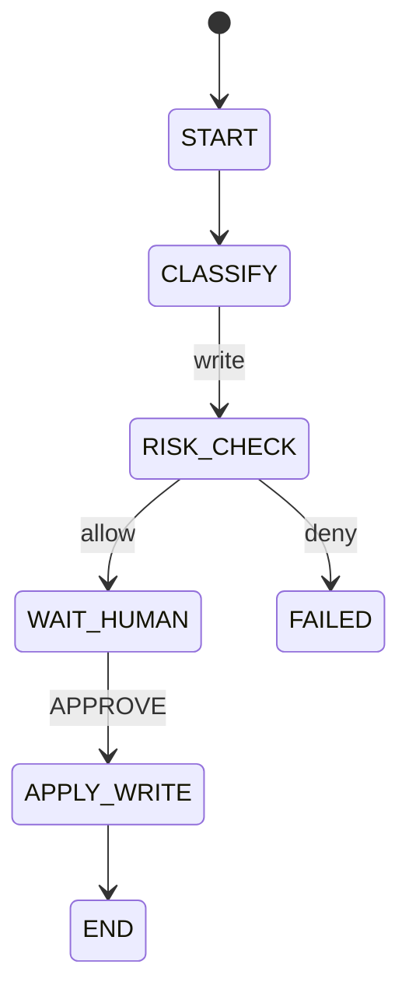
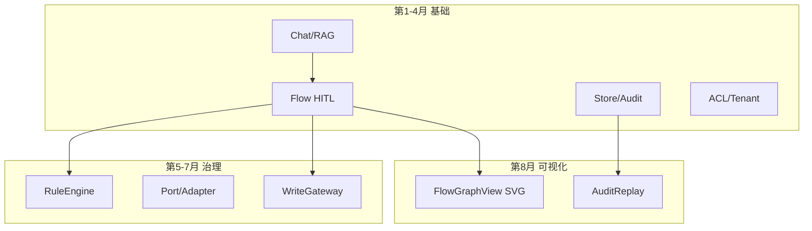

# 第 8 个月完整教材：工作流可视化

【完整教材 · 非 30 天合订 · 与第1月同等详细深度】

> **重要说明：** 本文是连续章节式完整教材，不是按天拆分的 30 天课程，也不是大纲摘要。
>
> **定位：** 纯学习；通用 ERP AI 助手**工作流可视化**教材；**不接公司生产、不接管公司 BPM 平台、不在前端发明状态迁移。**
>
> **产品句（全文反复强调）：**
> **把 Flow 状态机画成可读图：节点、合法边、当前高亮、审计回放。可视化是理解与演示工具，不是放开 Agent 乱跳状态。APPROVE≠写库；写入仍经规则/Gateway。本月不接公司 BPM 平台。**
>
> **技术栈：** Java 17+ Spring Boot 学习期 REST + Vue 3 Vite 手写 SVG；Vite proxy → `http://localhost:8080` `/api`
>
> **代码约定：** 骨架在 Markdown，粘贴到笔记工程；**勿**直接改仓库 `erp-ai-assistant/`、`erp-ai-console/` 应用源码。
>
> **前置：** 第1～7月 + [Web 控制台](../WEB.md)
>
> **入口：** [docs/MONTH8.md](../MONTH8.md)

---

## 目录

1. [定位与总目标：为何可视化；与 BPMN 生产平台差别](#1-定位与总目标)
2. [领域模型：FlowGraph / NodeDef / EdgeDef / FlowInstanceView / AuditEventView](#2-领域模型)
3. [后端：图定义 API（静态拓扑）+ 实例状态 API + 审计时间线 API](#3-后端)
4. [合法迁移表如何驱动「可画的边」与「禁用边」](#4-合法迁移表如何驱动「可画的边」与「禁用边」)
5. [前端渲染选型：纯 SVG vs Canvas vs 轻量库概念](#5-前端渲染选型)
6. [布局算法学习版：分层/手工坐标；节点坐标配置](#6-布局算法学习版)
7. [当前状态高亮、历史路径、失败态样式](#7-当前状态高亮、历史路径、失败态样式)
8. [HITL 节点交互：在图上点 WAIT_HUMAN → decide 面板](#8-HITL-节点交互)
9. [审计回放：按事件逐步点亮边（播放器 UI）](#9-审计回放)
10. [与第7月规则引擎：RISK_CHECK/规则拒绝在图上标注](#10-与第7月规则引擎)
11. [与第5/6月写入：APPLY_WRITE 节点与假账本结果侧栏](#11-与第56月写入)
12. [多实例列表 + 选中实例绑定到图](#12-多实例列表--选中实例绑定到图)
13. [Vue 面板接入 erp-ai-console 的推荐路由/组件结构](#13-Vue-面板接入-erp-ai-console-的推荐路由组件结构)
14. [可观测：traceId、耗时标注在节点上](#14-可观测)
15. [无障碍与只读演示模式](#15-无障碍与只读演示模式)
16. [端到端彩排剧本（3～4 个）](#16-端到端彩排剧本3～4-个)
17. [作品集 PORTFOLIO 章节模板](#17-作品集-PORTFOLIO-章节模板)
18. [架构终图（1～8月叠加）](#18-架构终图1～8月叠加)
19. [口述提纲与能力清单](#19-口述提纲与能力清单)
20. [明确不做与第9月可选方向](#20-明确不做与第9月可选方向)
- [附录 A：配置参考](#附录-a配置参考)
- [附录 B：推荐文件树](#附录-b推荐文件树)
- [附录 C：API 对照表](#附录-cAPI)
- [附录 D：术语表 Glossary](#附录-d术语表-glossary)
- [附录 E：FAQ](#附录-eFAQ)
- [附录 F：工程纪律](#附录-f工程纪律)
- [附录 G：与 MONTH1～7 / WEB 交叉索引](#附录-g与)
- [附录 H：修订记录](#附录-h修订记录)

---

# 1. 定位与总目标：为何可视化；与 BPMN 生产平台差别

## 为什么

后端月份教会你 Flow 状态机、HITL、规则与 Gateway，但评审常在 30 秒内问：「状态怎么跳的？APPROVE 是不是直接写库？」**工作流可视化**把抽象状态机变成可读图，是演示与排障的「共同语言」，不是第二套编排器。

> **产品句：** 把 Flow 状态机画成可读图：节点、合法边、当前高亮、审计回放。可视化是理解与演示工具，不是放开 Agent 乱跳状态。APPROVE≠写库；写入仍经规则/Gateway。本月不接公司 BPM 平台。

## 概念

### 学习可视化 vs 公司 BPMN 平台

| 维度 | 本月 | 生产 BPM |
|------|------|----------|
| 改拓扑 | 后端配置发版 | 设计器+部署 |
| 改实例状态 | FlowOrchestrator | 引擎 API |
| 前端拖边 | **禁止** | 常见 |
| 写库 | Gateway+规则 | 可能直连 ERP |

### 本月总目标

1. 三读 API：`graph` / `view` / `audit`
2. SVG 高亮当前态与历史路径
3. HITL 面板对接 `/decide`
4. 审计回放逐步点亮边
5. 规则拒绝与写入结果在图上有标注
6. 8 分钟演示剧本 + PORTFOLIO

### ASCII 拓扑

```text
START → CLASSIFY → RISK_CHECK → WAIT_HUMAN → APPLY_WRITE → END
              ↘ RAG_ANSWER ↗              ↘ FAILED
```

### mermaid



## 怎么做

1. 通读全章建立边界。
2. 白板画拓扑。
3. 对照第2月 Flow 节点名。
4. 列出演示时要说的三句纪律。

## 代码骨架

```java
package com.erp.ai.learn.flowviz;

import java.time.Instant;
import java.util.List;
import java.util.Map;
import java.util.Set;

public record FlowGraphDto(
    String graphId, String version,
    List<NodeDefDto> nodes, List<EdgeDefDto> edges,
    Map<String, Set<String>> legalTransitions) {}

public record NodeDefDto(
    String id, String label, String kind,
    double x, double y, Map<String, String> meta) {}

public record EdgeDefDto(
    String id, String from, String to,
    String label, boolean enabledByDefault) {}

public record FlowInstanceViewDto(
    String instanceId, String graphId, String currentNodeId,
    String status, List<String> visitedNodeIds, List<String> visitedEdgeIds,
    String traceId, Instant updatedAt, Map<String, Object> nodeAnnotations) {}

public record AuditEventViewDto(
    long seq, Instant at, String type,
    String nodeId, String edgeId, String message,
    String traceId, Map<String, Object> payload) {}
```

```java
@RestController
@RequestMapping("/api/ai/flow")
public class FlowGraphController {
  @GetMapping("/graph") public FlowGraphDto graph() {}
  @GetMapping("/{id}/view") public FlowInstanceViewDto view(@PathVariable String id) {}
  @GetMapping("/{id}/audit") public List<AuditEventViewDto> audit(@PathVariable String id) {}
}
```

```vue
<!-- FlowGraphView.vue 根组件骨架 -->
<script setup>
import { ref, watch } from 'vue'
import { apiFetch } from '@/api/http'
const props = defineProps({ instanceId: String })
const graph = ref(null), view = ref(null)
watch(() => props.instanceId, async id => {
  if (!id) return
  graph.value = await apiFetch('/api/ai/flow/graph')
  view.value = await apiFetch(`/api/ai/flow/${id}/view`)
}, { immediate: true })
</script>
<template>
  <svg v-if="graph" viewBox="0 0 960 540" role="img" aria-label="Flow 图">
    <!-- FlowNode / FlowEdges 子组件 -->
  </svg>
</template>
```

## 坑与排障

| 坑 | 现象 | 处理 |
|----|------|------|
| 接 BPM | 范围失控 | 本月只画学习 Flow |
| 前端拖边 | 非法迁移 | 只读 legalTransitions |
| APPROVE=写库 | 误解 | 侧栏 WRITE_RESULT |

## 验收检查

- [ ] 能画 START→END 拓扑
- [ ] 能说出可视化三条纪律
- [ ] 能区分 BPM 与本月范围

**口述 1 分钟（第 1 章）：** 说明本章如何守住「可视化不越权改状态」。

---

# 2. 领域模型：FlowGraph / NodeDef / EdgeDef / FlowInstanceView / AuditEventView

## 为什么

静态图与动态实例分离是可视化架构基石。

> **产品句：** 把 Flow 状态机画成可读图：节点、合法边、当前高亮、审计回放。可视化是理解与演示工具，不是放开 Agent 乱跳状态。APPROVE≠写库；写入仍经规则/Gateway。本月不接公司 BPM 平台。

## 概念

#### ER 关系
```text
FlowGraph 1──* FlowInstanceView
FlowInstance 1──* AuditEventView
```

#### NodeDef.kind
`START|TASK|GATE|HITL|WRITE|END` — 驱动形状与颜色。

#### 样例 graph JSON
```json
{"graphId":"erp-ai-learn-flow","version":"2026.08.1","nodes":[{"id":"WAIT_HUMAN","kind":"HITL","x":580,"y":260}],"legalTransitions":{"WAIT_HUMAN":["APPLY_WRITE","END"]}}
```

## 怎么做

1. 阅读概念。
2. 阅读概念。
3. 阅读概念。
4. 粘贴骨架并联调。
5. 粘贴骨架并联调。

## 代码骨架

```java
package com.erp.ai.learn.flowviz;

import java.time.Instant;
import java.util.List;
import java.util.Map;
import java.util.Set;

public record FlowGraphDto(
    String graphId, String version,
    List<NodeDefDto> nodes, List<EdgeDefDto> edges,
    Map<String, Set<String>> legalTransitions) {}

public record NodeDefDto(
    String id, String label, String kind,
    double x, double y, Map<String, String> meta) {}

public record EdgeDefDto(
    String id, String from, String to,
    String label, boolean enabledByDefault) {}

public record FlowInstanceViewDto(
    String instanceId, String graphId, String currentNodeId,
    String status, List<String> visitedNodeIds, List<String> visitedEdgeIds,
    String traceId, Instant updatedAt, Map<String, Object> nodeAnnotations) {}

public record AuditEventViewDto(
    long seq, Instant at, String type,
    String nodeId, String edgeId, String message,
    String traceId, Map<String, Object> payload) {}
```

```vue
<!-- 第2章: types/flow-viz.ts -->
<script setup>
// 见附录 B 文件树
</script>
```

## 坑与排障

| 坑 | 现象 | 处理 |
|----|------|------|
| 状态不同步 | decide 后图不变 | 刷新 view+audit |
| 非法边可点 | 409 | legalTransitions 过滤 |
| 版本漂移 | 节点缺失 | 校验 graph.version |

## 验收检查

- [ ] 完成 领域模型 骨架
- [ ] curl 或 Network 验证
- [ ] 能 1 分钟口述 领域模型

**口述 1 分钟（第 2 章）：** 说明本章如何守住「可视化不越权改状态」。

---

# 3. 后端：图定义 API（静态拓扑）+ 实例状态 API + 审计时间线 API

## 为什么

可视化消费只读 API；写路径仍走 start/decide。

> **产品句：** 把 Flow 状态机画成可读图：节点、合法边、当前高亮、审计回放。可视化是理解与演示工具，不是放开 Agent 乱跳状态。APPROVE≠写库；写入仍经规则/Gateway。本月不接公司 BPM 平台。

## 概念

#### 端点
- `GET /api/ai/flow/graph`
- `GET /api/ai/flow/{id}/view`
- `GET /api/ai/flow/{id}/audit`

#### 响应契约
graph 带 version；view 带 currentNodeId；audit 按 seq 升序。

#### curl
```bash
curl -s localhost:8080/api/ai/flow/graph -H 'X-Tenant-Id: tenant-a' | jq .
```

## 怎么做

1. 阅读概念。
2. 阅读概念。
3. 阅读概念。
4. 粘贴骨架并联调。
5. 粘贴骨架并联调。

## 代码骨架

```java
package com.erp.ai.learn.flowviz;

import java.time.Instant;
import java.util.List;
import java.util.Map;
import java.util.Set;

public record FlowGraphDto(
    String graphId, String version,
    List<NodeDefDto> nodes, List<EdgeDefDto> edges,
    Map<String, Set<String>> legalTransitions) {}

public record NodeDefDto(
    String id, String label, String kind,
    double x, double y, Map<String, String> meta) {}

public record EdgeDefDto(
    String id, String from, String to,
    String label, boolean enabledByDefault) {}

public record FlowInstanceViewDto(
    String instanceId, String graphId, String currentNodeId,
    String status, List<String> visitedNodeIds, List<String> visitedEdgeIds,
    String traceId, Instant updatedAt, Map<String, Object> nodeAnnotations) {}

public record AuditEventViewDto(
    long seq, Instant at, String type,
    String nodeId, String edgeId, String message,
    String traceId, Map<String, Object> payload) {}
```

```vue
<!-- 第3章: composables/useFlowViz.js -->
<script setup>
// 见附录 B 文件树
</script>
```

## 坑与排障

| 坑 | 现象 | 处理 |
|----|------|------|
| 状态不同步 | decide 后图不变 | 刷新 view+audit |
| 非法边可点 | 409 | legalTransitions 过滤 |
| 版本漂移 | 节点缺失 | 校验 graph.version |

## 验收检查

- [ ] 完成 后端三 API 骨架
- [ ] curl 或 Network 验证
- [ ] 能 1 分钟口述 后端三 API

**口述 1 分钟（第 3 章）：** 说明本章如何守住「可视化不越权改状态」。

---

# 4. 合法迁移表如何驱动「可画的边」与「禁用边」

## 为什么

legalTransitions 是「可画边」的唯一权威。

> **产品句：** 把 Flow 状态机画成可读图：节点、合法边、当前高亮、审计回放。可视化是理解与演示工具，不是放开 Agent 乱跳状态。APPROVE≠写库；写入仍经规则/Gateway。本月不接公司 BPM 平台。

## 概念

```javascript
function isNextHop(edge, view, graph) {
  const next = graph.legalTransitions[view.currentNodeId] ?? []
  return view.currentNodeId === edge.from && next.includes(edge.to)
}
```

非法边：灰色虚线、`pointer-events: none`。

后端 409：`IllegalTransitionException` — 前端 toast 展示。

## 怎么做

1. 阅读概念。
2. 阅读概念。
3. 阅读概念。
4. 粘贴骨架并联调。
5. 粘贴骨架并联调。

## 代码骨架

```java
package com.erp.ai.learn.flowviz;

import java.time.Instant;
import java.util.List;
import java.util.Map;
import java.util.Set;

public record FlowGraphDto(
    String graphId, String version,
    List<NodeDefDto> nodes, List<EdgeDefDto> edges,
    Map<String, Set<String>> legalTransitions) {}

public record NodeDefDto(
    String id, String label, String kind,
    double x, double y, Map<String, String> meta) {}

public record EdgeDefDto(
    String id, String from, String to,
    String label, boolean enabledByDefault) {}

public record FlowInstanceViewDto(
    String instanceId, String graphId, String currentNodeId,
    String status, List<String> visitedNodeIds, List<String> visitedEdgeIds,
    String traceId, Instant updatedAt, Map<String, Object> nodeAnnotations) {}

public record AuditEventViewDto(
    long seq, Instant at, String type,
    String nodeId, String edgeId, String message,
    String traceId, Map<String, Object> payload) {}
```

```vue
<!-- 第4章: FlowEdges.vue -->
<script setup>
// 见附录 B 文件树
</script>
```

## 坑与排障

| 坑 | 现象 | 处理 |
|----|------|------|
| 状态不同步 | decide 后图不变 | 刷新 view+audit |
| 非法边可点 | 409 | legalTransitions 过滤 |
| 版本漂移 | 节点缺失 | 校验 graph.version |

## 验收检查

- [ ] 完成 合法迁移表 骨架
- [ ] curl 或 Network 验证
- [ ] 能 1 分钟口述 合法迁移表

**口述 1 分钟（第 4 章）：** 说明本章如何守住「可视化不越权改状态」。

---

# 5. 前端渲染选型：纯 SVG vs Canvas vs 轻量库概念

## 为什么

先手写 SVG 建立坐标与事件模型，再评估 Canvas/库。

> **产品句：** 把 Flow 状态机画成可读图：节点、合法边、当前高亮、审计回放。可视化是理解与演示工具，不是放开 Agent 乱跳状态。APPROVE≠写库；写入仍经规则/Gateway。本月不接公司 BPM 平台。

## 概念

| 方案 | 优点 | 缺点 |
| SVG | a11y/事件 | 大图性能 |
| Canvas | 性能 | 命中难 |
| 库 | 布局快 | 学习成本 |

推荐：`<g>` 节点 + 贝塞尔边 + CSS 变量。

## 怎么做

1. 阅读概念。
2. 阅读概念。
3. 阅读概念。
4. 粘贴骨架并联调。
5. 粘贴骨架并联调。

## 代码骨架

```java
// 第5章焦点: N/A（前端章）
// 在 FlowGraphService 或注解构建器中扩展
```

```vue
<!-- 第5章: FlowSvgRenderer.vue -->
<script setup>
// 见附录 B 文件树
</script>
```

## 坑与排障

| 坑 | 现象 | 处理 |
|----|------|------|
| 状态不同步 | decide 后图不变 | 刷新 view+audit |
| 非法边可点 | 409 | legalTransitions 过滤 |
| 版本漂移 | 节点缺失 | 校验 graph.version |

## 验收检查

- [ ] 完成 渲染选型 骨架
- [ ] curl 或 Network 验证
- [ ] 能 1 分钟口述 渲染选型

**口述 1 分钟（第 5 章）：** 说明本章如何守住「可视化不越权改状态」。

---

# 6. 布局算法学习版：分层/手工坐标；节点坐标配置

## 为什么

学习期用手工坐标 + 分层算法即可。

> **产品句：** 把 Flow 状态机画成可读图：节点、合法边、当前高亮、审计回放。可视化是理解与演示工具，不是放开 Agent 乱跳状态。APPROVE≠写库；写入仍经规则/Gateway。本月不接公司 BPM 平台。

## 概念

#### flow-layout.json 覆盖坐标

#### 分层伪代码
```text
层0: START
层1: CLASSIFY
层2: RAG / RISK / SUGGEST
```

viewBox padding 40px。

## 怎么做

1. 阅读概念。
2. 阅读概念。
3. 阅读概念。
4. 粘贴骨架并联调。
5. 粘贴骨架并联调。

## 代码骨架

```java
// 第6章焦点: LayoutLoader.java
// 在 FlowGraphService 或注解构建器中扩展
```

```vue
<!-- 第6章: assets/flow/flow-layout.json -->
<script setup>
// 见附录 B 文件树
</script>
```

## 坑与排障

| 坑 | 现象 | 处理 |
|----|------|------|
| 状态不同步 | decide 后图不变 | 刷新 view+audit |
| 非法边可点 | 409 | legalTransitions 过滤 |
| 版本漂移 | 节点缺失 | 校验 graph.version |

## 验收检查

- [ ] 完成 布局 骨架
- [ ] curl 或 Network 验证
- [ ] 能 1 分钟口述 布局

**口述 1 分钟（第 6 章）：** 说明本章如何守住「可视化不越权改状态」。

---

# 7. 当前状态高亮、历史路径、失败态样式

## 为什么

状态样式只来自 view DTO，禁止前端猜。

> **产品句：** 把 Flow 状态机画成可读图：节点、合法边、当前高亮、审计回放。可视化是理解与演示工具，不是放开 Agent 乱跳状态。APPROVE≠写库；写入仍经规则/Gateway。本月不接公司 BPM 平台。

## 概念

```css
:root {
  --node-received:#8b9cb3; --node-running:#3d9ed6;
  --node-wait:#e6a23c; --node-done:#4caf82; --node-failed:#e85d5d;
}
```

历史边 `--edge-history`；当前边加粗。

## 怎么做

1. 阅读概念。
2. 阅读概念。
3. 阅读概念。
4. 粘贴骨架并联调。
5. 粘贴骨架并联调。

## 代码骨架

```java
// 第7章焦点: NodeStateResolver.java
// 在 FlowGraphService 或注解构建器中扩展
```

```vue
<!-- 第7章: FlowNode.vue -->
<script setup>
// 见附录 B 文件树
</script>
```

## 坑与排障

| 坑 | 现象 | 处理 |
|----|------|------|
| 状态不同步 | decide 后图不变 | 刷新 view+audit |
| 非法边可点 | 409 | legalTransitions 过滤 |
| 版本漂移 | 节点缺失 | 校验 graph.version |

## 验收检查

- [ ] 完成 高亮样式 骨架
- [ ] curl 或 Network 验证
- [ ] 能 1 分钟口述 高亮样式

**口述 1 分钟（第 7 章）：** 说明本章如何守住「可视化不越权改状态」。

---

# 8. HITL 节点交互：在图上点 WAIT_HUMAN → decide 面板

## 为什么

点击 WAIT_HUMAN 打开 decide；仍调 POST `/decide`。

> **产品句：** 把 Flow 状态机画成可读图：节点、合法边、当前高亮、审计回放。可视化是理解与演示工具，不是放开 Agent 乱跳状态。APPROVE≠写库；写入仍经规则/Gateway。本月不接公司 BPM 平台。

## 概念

```vue
<button @click="decide('APPROVE')">APPROVE</button>
<p class="hint">APPROVE 仅 Flow 决策，写库看 APPLY_WRITE 结果</p>
```

决策后 `loadAll(id)` 刷新 view+audit。

## 怎么做

1. 阅读概念。
2. 阅读概念。
3. 阅读概念。
4. 粘贴骨架并联调。
5. 粘贴骨架并联调。

## 代码骨架

```java
// 第8章焦点: 沿用 FlowOrchestrator
// 在 FlowGraphService 或注解构建器中扩展
```

```vue
<!-- 第8章: HitlDecidePanel.vue -->
<script setup>
// 见附录 B 文件树
</script>
```

## 坑与排障

| 坑 | 现象 | 处理 |
|----|------|------|
| 状态不同步 | decide 后图不变 | 刷新 view+audit |
| 非法边可点 | 409 | legalTransitions 过滤 |
| 版本漂移 | 节点缺失 | 校验 graph.version |

## 验收检查

- [ ] 完成 HITL 交互 骨架
- [ ] curl 或 Network 验证
- [ ] 能 1 分钟口述 HITL 交互

**口述 1 分钟（第 8 章）：** 说明本章如何守住「可视化不越权改状态」。

---

# 9. 审计回放：按事件逐步点亮边（播放器 UI）

## 为什么

audit seq 驱动播放器；不篡改顺序。

> **产品句：** 把 Flow 状态机画成可读图：节点、合法边、当前高亮、审计回放。可视化是理解与演示工具，不是放开 Agent 乱跳状态。APPROVE≠写库；写入仍经规则/Gateway。本月不接公司 BPM 平台。

## 概念

```text
IDLE → PLAYING → PAUSED
visible = audit.slice(0, cursor)
```

时间轴点击跳转到对应 seq。

## 怎么做

1. 阅读概念。
2. 阅读概念。
3. 阅读概念。
4. 粘贴骨架并联调。
5. 粘贴骨架并联调。

## 代码骨架

```java
// 第9章焦点: AuditTimelineMapper.java
// 在 FlowGraphService 或注解构建器中扩展
```

```vue
<!-- 第9章: AuditReplay.vue -->
<script setup>
// 见附录 B 文件树
</script>
```

## 坑与排障

| 坑 | 现象 | 处理 |
|----|------|------|
| 状态不同步 | decide 后图不变 | 刷新 view+audit |
| 非法边可点 | 409 | legalTransitions 过滤 |
| 版本漂移 | 节点缺失 | 校验 graph.version |

## 验收检查

- [ ] 完成 审计回放 骨架
- [ ] curl 或 Network 验证
- [ ] 能 1 分钟口述 审计回放

**口述 1 分钟（第 9 章）：** 说明本章如何守住「可视化不越权改状态」。

---

# 10. 与第7月规则引擎：RISK_CHECK/规则拒绝在图上标注

## 为什么

第7月 RULE_FIRED/DENIED 映射到 nodeAnnotations。

> **产品句：** 把 Flow 状态机画成可读图：节点、合法边、当前高亮、审计回放。可视化是理解与演示工具，不是放开 Agent 乱跳状态。APPROVE≠写库；写入仍经规则/Gateway。本月不接公司 BPM 平台。

## 概念

RISK_CHECK 节点角标 `DENY`

边到 FAILED 标红 + rulesVersion

## 怎么做

1. 阅读概念。
2. 阅读概念。
3. 阅读概念。
4. 粘贴骨架并联调。
5. 粘贴骨架并联调。

## 代码骨架

```java
// 第10章焦点: RuleAnnotationBuilder.java
// 在 FlowGraphService 或注解构建器中扩展
```

```vue
<!-- 第10章: RuleBadge.vue -->
<script setup>
// 见附录 B 文件树
</script>
```

## 坑与排障

| 坑 | 现象 | 处理 |
|----|------|------|
| 状态不同步 | decide 后图不变 | 刷新 view+audit |
| 非法边可点 | 409 | legalTransitions 过滤 |
| 版本漂移 | 节点缺失 | 校验 graph.version |

## 验收检查

- [ ] 完成 规则标注 骨架
- [ ] curl 或 Network 验证
- [ ] 能 1 分钟口述 规则标注

**口述 1 分钟（第 10 章）：** 说明本章如何守住「可视化不越权改状态」。

---

# 11. 与第5/6月写入：APPLY_WRITE 节点与假账本结果侧栏

## 为什么

APPLY_WRITE 节点 + 假账本 WRITE_RESULT。

> **产品句：** 把 Flow 状态机画成可读图：节点、合法边、当前高亮、审计回放。可视化是理解与演示工具，不是放开 Agent 乱跳状态。APPROVE≠写库；写入仍经规则/Gateway。本月不接公司 BPM 平台。

## 概念

Gateway OK ≠ Flow DONE 之前还有审计

侧栏展示 commandId、幂等键、账本条目

## 怎么做

1. 阅读概念。
2. 阅读概念。
3. 阅读概念。
4. 粘贴骨架并联调。
5. 粘贴骨架并联调。

## 代码骨架

```java
// 第11章焦点: WriteResultViewBuilder.java
// 在 FlowGraphService 或注解构建器中扩展
```

```vue
<!-- 第11章: WriteResultAside.vue -->
<script setup>
// 见附录 B 文件树
</script>
```

## 坑与排障

| 坑 | 现象 | 处理 |
|----|------|------|
| 状态不同步 | decide 后图不变 | 刷新 view+audit |
| 非法边可点 | 409 | legalTransitions 过滤 |
| 版本漂移 | 节点缺失 | 校验 graph.version |

## 验收检查

- [ ] 完成 写入侧栏 骨架
- [ ] curl 或 Network 验证
- [ ] 能 1 分钟口述 写入侧栏

**口述 1 分钟（第 11 章）：** 说明本章如何守住「可视化不越权改状态」。

---

# 12. 多实例列表 + 选中实例绑定到图

## 为什么

列表选中驱动图；URL `?instanceId=`。

> **产品句：** 把 Flow 状态机画成可读图：节点、合法边、当前高亮、审计回放。可视化是理解与演示工具，不是放开 Agent 乱跳状态。APPROVE≠写库；写入仍经规则/Gateway。本月不接公司 BPM 平台。

## 概念

GET `/pending` + 本地 history

空态 CTA：去 Flow 页 start

## 怎么做

1. 阅读概念。
2. 阅读概念。
3. 阅读概念。
4. 粘贴骨架并联调。
5. 粘贴骨架并联调。

## 代码骨架

```java
// 第12章焦点: FlowInstanceSummaryDto
// 在 FlowGraphService 或注解构建器中扩展
```

```vue
<!-- 第12章: FlowInstanceList.vue -->
<script setup>
// 见附录 B 文件树
</script>
```

## 坑与排障

| 坑 | 现象 | 处理 |
|----|------|------|
| 状态不同步 | decide 后图不变 | 刷新 view+audit |
| 非法边可点 | 409 | legalTransitions 过滤 |
| 版本漂移 | 节点缺失 | 校验 graph.version |

## 验收检查

- [ ] 完成 多实例 骨架
- [ ] curl 或 Network 验证
- [ ] 能 1 分钟口述 多实例

**口述 1 分钟（第 12 章）：** 说明本章如何守住「可视化不越权改状态」。

---

# 13. Vue 面板接入 erp-ai-console 的推荐路由/组件结构

## 为什么

路由 `/flow/viz`；与 WEB FlowPanel 共存。

> **产品句：** 把 Flow 状态机画成可读图：节点、合法边、当前高亮、审计回放。可视化是理解与演示工具，不是放开 Agent 乱跳状态。APPROVE≠写库；写入仍经规则/Gateway。本月不接公司 BPM 平台。

## 概念

```js
{ path: '/flow/viz', component: () => import('@/views/FlowVizView.vue') }
```

组件树：List | Graph+Replay | Aside

## 怎么做

1. 阅读概念。
2. 阅读概念。
3. 阅读概念。
4. 粘贴骨架并联调。
5. 粘贴骨架并联调。

## 代码骨架

```java
// 第13章焦点: N/A
// 在 FlowGraphService 或注解构建器中扩展
```

```vue
<!-- 第13章: FlowVizView.vue -->
<script setup>
// 见附录 B 文件树
</script>
```

## 坑与排障

| 坑 | 现象 | 处理 |
|----|------|------|
| 状态不同步 | decide 后图不变 | 刷新 view+audit |
| 非法边可点 | 409 | legalTransitions 过滤 |
| 版本漂移 | 节点缺失 | 校验 graph.version |

## 验收检查

- [ ] 完成 Vue 接入 骨架
- [ ] curl 或 Network 验证
- [ ] 能 1 分钟口述 Vue 接入

**口述 1 分钟（第 13 章）：** 说明本章如何守住「可视化不越权改状态」。

---

# 14. 可观测：traceId、耗时标注在节点上

## 为什么

nodeAnnotations.durationMs + traceId 复制。

> **产品句：** 把 Flow 状态机画成可读图：节点、合法边、当前高亮、审计回放。可视化是理解与演示工具，不是放开 Agent 乱跳状态。APPROVE≠写库；写入仍经规则/Gateway。本月不接公司 BPM 平台。

## 概念

慢节点 >2s 用 warn 色

响应头 X-Trace-Id 与 view 一致

## 怎么做

1. 阅读概念。
2. 阅读概念。
3. 阅读概念。
4. 粘贴骨架并联调。
5. 粘贴骨架并联调。

## 代码骨架

```java
// 第14章焦点: TimingAnnotationEnricher.java
// 在 FlowGraphService 或注解构建器中扩展
```

```vue
<!-- 第14章: TraceOverlay.vue -->
<script setup>
// 见附录 B 文件树
</script>
```

## 坑与排障

| 坑 | 现象 | 处理 |
|----|------|------|
| 状态不同步 | decide 后图不变 | 刷新 view+audit |
| 非法边可点 | 409 | legalTransitions 过滤 |
| 版本漂移 | 节点缺失 | 校验 graph.version |

## 验收检查

- [ ] 完成 可观测 骨架
- [ ] curl 或 Network 验证
- [ ] 能 1 分钟口述 可观测

**口述 1 分钟（第 14 章）：** 说明本章如何守住「可视化不越权改状态」。

---

# 15. 无障碍与只读演示模式

## 为什么

role=img、键盘焦点、只读隐藏 decide。

> **产品句：** 把 Flow 状态机画成可读图：节点、合法边、当前高亮、审计回放。可视化是理解与演示工具，不是放开 Agent 乱跳状态。APPROVE≠写库；写入仍经规则/Gateway。本月不接公司 BPM 平台。

## 概念

`readOnly` prop 禁用交互

对比度 WCAG AA

## 怎么做

1. 阅读概念。
2. 阅读概念。
3. 阅读概念。
4. 粘贴骨架并联调。
5. 粘贴骨架并联调。

## 代码骨架

```java
// 第15章焦点: N/A
// 在 FlowGraphService 或注解构建器中扩展
```

```vue
<!-- 第15章: FlowGraphView.vue readOnly -->
<script setup>
// 见附录 B 文件树
</script>
```

## 坑与排障

| 坑 | 现象 | 处理 |
|----|------|------|
| 状态不同步 | decide 后图不变 | 刷新 view+audit |
| 非法边可点 | 409 | legalTransitions 过滤 |
| 版本漂移 | 节点缺失 | 校验 graph.version |

## 验收检查

- [ ] 完成 a11y/只读 骨架
- [ ] curl 或 Network 验证
- [ ] 能 1 分钟口述 a11y/只读

**口述 1 分钟（第 15 章）：** 说明本章如何守住「可视化不越权改状态」。

---

# 16. 端到端彩排剧本（3～4 个）

## 为什么

四个剧本覆盖查询/拒绝/HITL/回放。

> **产品句：** 把 Flow 状态机画成可读图：节点、合法边、当前高亮、审计回放。可视化是理解与演示工具，不是放开 Agent 乱跳状态。APPROVE≠写库；写入仍经规则/Gateway。本月不接公司 BPM 平台。

## 概念

**A** 查询径路 | **B** RISK DENY | **C** HITL+WRITE | **D** 回放

## 怎么做

1. 阅读概念。
2. 阅读概念。
3. 阅读概念。
4. 粘贴骨架并联调。
5. 粘贴骨架并联调。

## 代码骨架

```java
// 第16章焦点: DemoScriptNotes.md
// 在 FlowGraphService 或注解构建器中扩展
```

```vue
<!-- 第16章: views/DemoChecklist.vue -->
<script setup>
// 见附录 B 文件树
</script>
```

## 坑与排障

| 坑 | 现象 | 处理 |
|----|------|------|
| 状态不同步 | decide 后图不变 | 刷新 view+audit |
| 非法边可点 | 409 | legalTransitions 过滤 |
| 版本漂移 | 节点缺失 | 校验 graph.version |

## 验收检查

- [ ] 完成 彩排剧本 骨架
- [ ] curl 或 Network 验证
- [ ] 能 1 分钟口述 彩排剧本

**口述 1 分钟（第 16 章）：** 说明本章如何守住「可视化不越权改状态」。

---

# 17. 作品集 PORTFOLIO 章节模板

## 为什么

截图+架构+取舍+链接 eval。

> **产品句：** 把 Flow 状态机画成可读图：节点、合法边、当前高亮、审计回放。可视化是理解与演示工具，不是放开 Agent 乱跳状态。APPROVE≠写库；写入仍经规则/Gateway。本月不接公司 BPM 平台。

## 概念

模板见本章 Markdown 块

## 怎么做

1. 阅读概念。
2. 阅读概念。
3. 阅读概念。
4. 粘贴骨架并联调。
5. 粘贴骨架并联调。

## 代码骨架

```java
// 第17章焦点: N/A
// 在 FlowGraphService 或注解构建器中扩展
```

```vue
<!-- 第17章: docs/PORTFOLIO-flowviz.md -->
<script setup>
// 见附录 B 文件树
</script>
```

## 坑与排障

| 坑 | 现象 | 处理 |
|----|------|------|
| 状态不同步 | decide 后图不变 | 刷新 view+audit |
| 非法边可点 | 409 | legalTransitions 过滤 |
| 版本漂移 | 节点缺失 | 校验 graph.version |

## 验收检查

- [ ] 完成 PORTFOLIO 骨架
- [ ] curl 或 Network 验证
- [ ] 能 1 分钟口述 PORTFOLIO

**口述 1 分钟（第 17 章）：** 说明本章如何守住「可视化不越权改状态」。

---

# 18. 架构终图（1～8月叠加）

## 为什么

1～8 月叠加；标出可视化只读边界。

> **产品句：** 把 Flow 状态机画成可读图：节点、合法边、当前高亮、审计回放。可视化是理解与演示工具，不是放开 Agent 乱跳状态。APPROVE≠写库；写入仍经规则/Gateway。本月不接公司 BPM 平台。

## 概念

```text
erp-ai-console ──/api──> assistant
  FlowViz 只读 graph/view/audit
```

## 怎么做

1. 阅读概念。
2. 阅读概念。
3. 阅读概念。
4. 粘贴骨架并联调。
5. 粘贴骨架并联调。

## 代码骨架

```java
// 第18章焦点: N/A
// 在 FlowGraphService 或注解构建器中扩展
```

```vue
<!-- 第18章: architecture-1-8.md -->
<script setup>
// 见附录 B 文件树
</script>
```

## 坑与排障

| 坑 | 现象 | 处理 |
|----|------|------|
| 状态不同步 | decide 后图不变 | 刷新 view+audit |
| 非法边可点 | 409 | legalTransitions 过滤 |
| 版本漂移 | 节点缺失 | 校验 graph.version |

## 验收检查

- [ ] 完成 架构终图 骨架
- [ ] curl 或 Network 验证
- [ ] 能 1 分钟口述 架构终图

**口述 1 分钟（第 18 章）：** 说明本章如何守住「可视化不越权改状态」。

---

# 19. 口述提纲与能力清单

## 为什么

20 题 + 8 分钟演示。

> **产品句：** 把 Flow 状态机画成可读图：节点、合法边、当前高亮、审计回放。可视化是理解与演示工具，不是放开 Agent 乱跳状态。APPROVE≠写库；写入仍经规则/Gateway。本月不接公司 BPM 平台。

## 概念

见本章题库表

## 怎么做

1. 阅读概念。
2. 阅读概念。
3. 阅读概念。
4. 粘贴骨架并联调。
5. 粘贴骨架并联调。

## 代码骨架

```java
// 第19章焦点: N/A
// 在 FlowGraphService 或注解构建器中扩展
```

```vue
<!-- 第19章: oral-checklist.md -->
<script setup>
// 见附录 B 文件树
</script>
```

## 坑与排障

| 坑 | 现象 | 处理 |
|----|------|------|
| 状态不同步 | decide 后图不变 | 刷新 view+audit |
| 非法边可点 | 409 | legalTransitions 过滤 |
| 版本漂移 | 节点缺失 | 校验 graph.version |

## 验收检查

- [ ] 完成 口述清单 骨架
- [ ] curl 或 Network 验证
- [ ] 能 1 分钟口述 口述清单

**口述 1 分钟（第 19 章）：** 说明本章如何守住「可视化不越权改状态」。

---

# 20. 明确不做与第9月可选方向

## 为什么

不接 BPM；第9月预告观测/灰度/提示词运营。

> **产品句：** 把 Flow 状态机画成可读图：节点、合法边、当前高亮、审计回放。可视化是理解与演示工具，不是放开 Agent 乱跳状态。APPROVE≠写库；写入仍经规则/Gateway。本月不接公司 BPM 平台。

## 概念

不做拖拽设计器

不乐观更新状态

不新写库 API

## 怎么做

1. 阅读概念。
2. 阅读概念。
3. 阅读概念。
4. 粘贴骨架并联调。
5. 粘贴骨架并联调。

## 代码骨架

```java
// 第20章焦点: N/A
// 在 FlowGraphService 或注解构建器中扩展
```

```vue
<!-- 第20章: OUT_OF_SCOPE.md -->
<script setup>
// 见附录 B 文件树
</script>
```

## 坑与排障

| 坑 | 现象 | 处理 |
|----|------|------|
| 状态不同步 | decide 后图不变 | 刷新 view+audit |
| 非法边可点 | 409 | legalTransitions 过滤 |
| 版本漂移 | 节点缺失 | 校验 graph.version |

## 验收检查

- [ ] 完成 明确不做 骨架
- [ ] curl 或 Network 验证
- [ ] 能 1 分钟口述 明确不做

**口述 1 分钟（第 20 章）：** 说明本章如何守住「可视化不越权改状态」。

---

# 补充：粘贴就绪完整骨架库

> 以下块可整段复制到笔记工程。产品句：可视化是理解与演示工具，不是放开 Agent 乱跳状态。

## FlowNode.vue

```vue
<script setup>
import { computed } from 'vue'
const props = defineProps({
  node: { type: Object, required: true },
  state: { type: String, default: 'received' }
})
const emit = defineEmits(['select'])
const W = 128, H = 48, R = 8
const fill = computed(() => ({
  received: 'var(--node-received)', running: 'var(--node-running)',
  wait: 'var(--node-wait)', done: 'var(--node-done)', failed: 'var(--node-failed)'
}[props.state] ?? 'var(--node-received)'))
const stroke = computed(() => props.state === 'running' ? 'var(--color-accent)' : 'var(--color-border)')
</script>
<template>
  <g class="flow-node" :transform="`translate(${node.x},${node.y})`"
     tabindex="0" role="button" :aria-label="`${node.label} 节点`"
     @click="emit('select', node)" @keydown.enter="emit('select', node)">
    <rect :width="W" :height="H" :rx="R" :fill="fill" :stroke="stroke" stroke-width="2" />
    <text :x="W/2" :y="H/2" text-anchor="middle" dominant-baseline="middle" class="lbl">{{ node.label }}</text>
    <text v-if="node.kind" :x="W-6" :y="12" text-anchor="end" class="kind">{{ node.kind }}</text>
  </g>
</template>
<style scoped>.lbl{font:600 13px var(--font-sans);fill:var(--color-text)}.kind{font:10px var(--font-mono);fill:var(--color-muted)}</style>
```

## FlowEdges.vue

```vue
<script setup>
import { computed } from 'vue'
const props = defineProps({
  edges: { type: Array, default: () => [] },
  nodesById: { type: Object, required: true },
  litEdgeIds: { type: Object, default: () => new Set() },
  disabledEdgeIds: { type: Object, default: () => new Set() }
})
function path(edge) {
  const a = props.nodesById[edge.from], b = props.nodesById[edge.to]
  if (!a || !b) return ''
  const x1 = a.x + 128, y1 = a.y + 24, x2 = b.x, y2 = b.y + 24, mx = (x1 + x2) / 2
  return `M ${x1} ${y1} C ${mx} ${y1}, ${mx} ${y2}, ${x2} ${y2}`
}
function cls(edge) {
  if (props.disabledEdgeIds.has(edge.id)) return 'edge disabled'
  if (props.litEdgeIds.has(edge.id)) return 'edge lit'
  return 'edge'
}
</script>
<template>
  <g class="edges">
    <path v-for="e in edges" :key="e.id" :d="path(e)" :class="cls(e)" />
    <text v-for="e in edges" :key="e.id+'-lbl'" v-show="e.label" :x="(nodesById[e.from].x+nodesById[e.to].x)/2" :y="(nodesById[e.from].y+nodesById[e.to].y)/2" class="edge-lbl">{{ e.label }}</text>
  </g>
</template>
<style scoped>.edge{fill:none;stroke:var(--edge-idle);stroke-width:2}.edge.lit{stroke:var(--edge-history);stroke-width:3}.edge.disabled{stroke:var(--edge-disabled);stroke-dasharray:6 4;pointer-events:none}.edge-lbl{font-size:11px;fill:var(--color-muted)}</style>
```

## AuditReplay.vue

```vue
<script setup>
import { ref, computed, watch, onUnmounted } from 'vue'
const props = defineProps({ audit: { type: Array, default: () => [] }, speedMs: { type: Number, default: 600 } })
const emit = defineEmits(['cursor-change'])
const cursor = ref(0)
const playing = ref(false)
let timer = null
const visible = computed(() => props.audit.slice(0, cursor.value))
watch(cursor, v => emit('cursor-change', v))
function step() { if (cursor.value < props.audit.length) cursor.value++ }
function play() { playing.value = true; timer = setInterval(() => { step(); if (cursor.value >= props.audit.length) pause() }, props.speedMs) }
function pause() { playing.value = false; clearInterval(timer) }
function reset() { pause(); cursor.value = 0 }
onUnmounted(pause)
</script>
<template>
  <div class="replay" aria-label="审计回放控制器">
    <div class="toolbar">
      <button type="button" @click="playing ? pause() : play()">{{ playing ? '暂停' : '播放' }}</button>
      <button type="button" @click="step">步进</button>
      <button type="button" @click="reset">复位</button>
      <span class="mono">{{ cursor }} / {{ audit.length }}</span>
    </div>
    <ol class="timeline">
      <li v-for="e in visible" :key="e.seq" :class="{ active: e.seq === cursor }">
        <span class="mono">#{{ e.seq }}</span> {{ e.type }} — {{ e.nodeId || e.edgeId }}
      </li>
    </ol>
  </div>
</template>
```

## HitlDecidePanel.vue

```vue
<script setup>
import { ref } from 'vue'
import { apiFetch } from '@/api/http'
const props = defineProps({ instanceId: String })
const emit = defineEmits(['decided'])
const comment = ref('')
const busy = ref(false)
async function decide(decision) {
  busy.value = true
  try {
    await apiFetch(`/api/ai/flow/${props.instanceId}/decide`, {
      method: 'POST',
      body: JSON.stringify({ decision, comment: comment.value })
    })
    emit('decided')
  } finally { busy.value = false }
}
</script>
<template>
  <aside class="hitl" aria-label="人工决策面板">
    <h3>人工审批</h3>
    <p class="warn">APPROVE ≠ 写库成功；写入结果见 APPLY_WRITE 节点与侧栏。</p>
    <textarea v-model="comment" rows="3" placeholder="备注（可选）" />
    <div class="actions">
      <button :disabled="busy" @click="decide('APPROVE')">APPROVE</button>
      <button :disabled="busy" @click="decide('REJECT')">REJECT</button>
      <button :disabled="busy" @click="decide('EDIT')">EDIT</button>
    </div>
  </aside>
</template>
<style scoped>.warn{color:var(--color-warn);font-size:0.875rem}</style>
```

## useFlowViz.js

```javascript
import { ref, computed } from 'vue'
import { apiFetch } from '@/api/http'

export function useFlowViz(instanceIdRef) {
  const graph = ref(null)
  const view = ref(null)
  const audit = ref([])
  const loading = ref(false)
  const error = ref(null)

  const nodesById = computed(() =>
    Object.fromEntries((graph.value?.nodes ?? []).map(n => [n.id, n])))

  async function reload() {
    const id = instanceIdRef.value
    if (!id) return
    loading.value = true
    error.value = null
    try {
      const [g, v, a] = await Promise.all([
        apiFetch('/api/ai/flow/graph'),
        apiFetch(`/api/ai/flow/${id}/view`),
        apiFetch(`/api/ai/flow/${id}/audit`),
      ])
      graph.value = g
      view.value = v
      audit.value = [...a].sort((x, y) => x.seq - y.seq)
    } catch (e) {
      error.value = e.message ?? String(e)
    } finally {
      loading.value = false
    }
  }

  return { graph, view, audit, loading, error, nodesById, reload }
}
```

## FlowGraphService.java

```java
@Service
public class FlowGraphService {
  private final FlowInstanceRepository instances;
  private final AuditReader auditReader;

  public FlowGraphDto staticGraph() {
    return FlowGraphCatalog.LEARN_GRAPH_V2026_08;
  }

  public FlowInstanceViewDto buildView(String instanceId) {
    var inst = instances.require(instanceId);
    return new FlowInstanceViewDto(
        inst.getId(), staticGraph().graphId(), inst.getCurrentNodeId(),
        inst.getStatus().name(), inst.getVisitedNodes(), inst.getVisitedEdges(),
        inst.getTraceId(), inst.getUpdatedAt(), inst.getAnnotations());
  }

  public List<AuditEventViewDto> auditTrail(String instanceId) {
    return auditReader.listByInstance(instanceId).stream()
        .sorted(Comparator.comparingLong(AuditEventViewDto::seq))
        .toList();
  }
}
```

## LegalTransitionMatrix.java

```java
public final class LegalTransitionMatrix {
  private final Map<String, Set<String>> allowed;

  public LegalTransitionMatrix(Map<String, Set<String>> allowed) {
    this.allowed = Map.copyOf(allowed);
  }

  public boolean canTransit(String from, String to) {
    return allowed.getOrDefault(from, Set.of()).contains(to);
  }

  public Set<String> nextNodes(String from) {
    return allowed.getOrDefault(from, Set.of());
  }

  public void assertLegal(String from, String to) {
    if (!canTransit(from, to))
      throw new IllegalTransitionException(from, to);
  }
}
```

## flow-layout.json

```json
{
  "graphId": "erp-ai-learn-flow",
  "version": "2026.08.1",
  "nodes": {
    "START": { "x": 60, "y": 260 },
    "CLASSIFY": { "x": 200, "y": 260 },
    "RAG_ANSWER": { "x": 360, "y": 140 },
    "RISK_CHECK": { "x": 360, "y": 260 },
    "SUGGEST": { "x": 360, "y": 380 },
    "FAILED": { "x": 520, "y": 140 },
    "WAIT_HUMAN": { "x": 520, "y": 260 },
    "APPLY_WRITE": { "x": 700, "y": 260 },
    "END": { "x": 860, "y": 260 }
  }
}
```

## flow-tokens.css

```css
:root {
  --node-received: #8b9cb3;
  --node-running: #3d9ed6;
  --node-wait: #e6a23c;
  --node-done: #4caf82;
  --node-failed: #e85d5d;
  --edge-history: #4caf82;
  --edge-idle: #2d3a4f;
  --edge-disabled: #4a4a4a;
  --edge-next: #3d9ed6;
}
.flow-viz { display: grid; grid-template-columns: 220px 1fr 280px; gap: var(--space-3); }
.flow-viz.read-only .hitl { display: none; }
```

# 第 19 章附录：口述 20 题详解

| # | 问题 | 参考答法 |
|---|------|----------|
| 1 | 可视化解决什么问题？ | 把状态机变成共同语言；演示与排障；不替代编排。 |
| 2 | 与 BPMN 最大区别？ | 本月只读展示；不改拓扑；不接生产引擎。 |
| 3 | 三个读 API？ | graph / view / audit。 |
| 4 | legalTransitions 作用？ | 定义合法后继；前端禁画可点击非法边。 |
| 5 | APPROVE 是否写库？ | 否；触发后续 APPLY_WRITE；看 WRITE_RESULT。 |
| 6 | WAIT_HUMAN 如何交互？ | 点节点开 decide 面板；POST /decide。 |
| 7 | 审计回放数据来源？ | audit 按 seq；不编造事件。 |
| 8 | RISK DENY 如何显示？ | 节点/边标红；nodeAnnotations rulesVersion。 |
| 9 | 多实例如何切换？ | 列表选中；刷新 view；URL instanceId。 |
| 10 | traceId 在哪显示？ | 节点角标/顶栏；与响应头一致。 |
| 11 | 只读模式？ | 隐藏 decide；适合大屏演示。 |
| 12 | SVG 为何首选？ | DOM 事件与 a11y；学习成本可控。 |
| 13 | 布局怎么做？ | layout JSON 手工坐标；可选分层。 |
| 14 | 写侧栏展示什么？ | commandId、幂等键、假账本条目、Gateway 结果。 |
| 15 | 前端能否拖新边？ | 不能；违反纪律。 |
| 16 | graph.version 不一致？ | 提示刷新；禁止渲染缺节点。 |
| 17 | 与第7月关系？ | 规则结果上图；RULE_FIRED 事件。 |
| 18 | 与 WEB 轨道关系？ | 共用 http.js、Router、Pinia 头。 |
| 19 | 彩排剧本几个？ | 至少 A/B/C/D 四个。 |
| 20 | 第9月方向？ | 观测大盘、灰度、提示词运营；仍不接 BPM。 |

# 第 16 章附录：彩排剧本逐步脚本

## 剧本 A — 查询径路

1. start: 帮我查 SKU-001 库存
2. 指图：CLASSIFY→RAG_ANSWER→END
3. 回放：无 HITL/WRITE
4. 强调：只读图未改状态

## 剧本 B — 规则拒绝

1. start: 期间关闭时过账
2. RISK_CHECK 标红→FAILED
3. 展示 RULE_DENIED payload
4. 强调：规则先于模型

## 剧本 C — HITL + 写入

1. start 写意图
2. WAIT_HUMAN 点 APPROVE
3. APPLY_WRITE 转圈
4. 侧栏 WRITE_RESULT；说清 APPROVE≠写库

## 剧本 D — 审计回放

1. 选已完成实例
2. 播放器 1x
3. 逐步模式讲 seq
4. 对比实时 view

# 第 17 章附录：PORTFOLIO 模板

```markdown
# PORTFOLIO — 工作流可视化（第8月）

## 截图
1. 全图 + 当前高亮
2. 审计回放 mid-play
3. HITL 面板 + APPROVE 提示
4. RISK DENY 标注

## 架构（200 字）
只读三 API；SVG；状态来自 orchestrator。

## 取舍
- 手写 SVG vs 图库
- 手工布局 vs 自动布局
- 侧栏 vs 节点内嵌 WRITE 结果

## 链接
eval suite / rulesVersion / trace 样例
```

# 第 18 章附录：1～8 月 mermaid 终图



# 附录 A：配置参考
```yaml
erp:
  ai:
    flow:
      graph-id: erp-ai-learn-flow
      graph-version: "2026.08.1"
      layout-path: classpath:flow/flow-layout.json
```

# 附录 B：推荐文件树
```text
erp-ai-console/src/components/flowviz/
  FlowGraphView.vue FlowNode.vue FlowEdges.vue
  HitlDecidePanel.vue AuditReplay.vue WriteResultAside.vue
  FlowInstanceList.vue RuleBadge.vue TraceOverlay.vue
erp-ai-console/src/views/FlowVizView.vue
erp-ai-console/src/composables/useFlowViz.js
erp-ai-console/src/styles/flow-tokens.css
```

# 附录 C：API 对照表
| 用途 | 方法 | 路径 | 响应要点 |
|------|------|------|----------|
| 静态拓扑 | GET | /api/ai/flow/graph | nodes, edges, legalTransitions |
| 实例视图 | GET | /api/ai/flow/{id}/view | currentNodeId, status, visited* |
| 审计 | GET | /api/ai/flow/{id}/audit | AuditEventView[] seq |
| 启动 | POST | /api/ai/flow/start | flowId |
| 决策 | POST | /api/ai/flow/{id}/decide | APPROVE≠写库 |

# 附录 D：术语表 Glossary
- **FlowGraph：** 静态拓扑
- **legalTransitions：** 合法迁移表
- **FlowInstanceView：** 实例快照
- **AuditEventView：** 审计事件
- **WAIT_HUMAN：** HITL 暂停
- **APPROVE：** Flow 决策非写库

# 附录 E：FAQ
**Q: 能拖新边吗？** 不能。
**Q: APPROVE 算写库？** 不算，看 WRITE_RESULT。
**Q: 接 Camunda？** 本月不接。

# 附录 F：工程纪律
- 状态只在 Orchestrator
- 可视化 API 只读
- APPROVE≠写库
- 规则 DENY 优先
- 写经 Gateway
- 不接 BPM
- 不污染仓库应用树

# 附录 G：与 MONTH1～7 / WEB 交叉索引
| 本月 | 关联 |
|------|------|
| 第3章 | MONTH2 Flow |
| 第8章 | WEB 第11章 |
| 第10章 | MONTH7 |
| 第11章 | MONTH5/6 |

# 附录 H：修订记录
| 日期 | 版本 | 说明 |
|------|------|------|
| 2026-08-15 | 1.0 | 首发 MONTH8 工作流可视化完整教材 |
## 深度学习节：分层布局算法详解

> 把 Flow 状态机画成可读图：节点、合法边、当前高亮、审计回放。可视化是理解与演示工具，不是放开 Agent 乱跳状态。APPROVE≠写库；写入仍经规则/Gateway。本月不接公司 BPM 平台。

本节展开 **分层布局算法详解**，帮助你在实现工作流可视化时少踩坑。

### 原理

1. 后端 FlowOrchestrator 保持唯一状态真相；分层布局算法详解 不得绕过 orchestrator。
2. 前端从 `graph`/`view`/`audit` 派生视觉状态；分层布局算法详解 属于表现层 concern。
3. 联调时用 Network 核对字段；分层布局算法详解 问题优先查 API 契约。

### 实践步骤

1. 在笔记工程创建或修改与「分层布局算法详解」相关的文件；运行 `npm run dev` 验证。
2. 在笔记工程创建或修改与「分层布局算法详解」相关的文件；运行 `npm run dev` 验证。
3. 在笔记工程创建或修改与「分层布局算法详解」相关的文件；运行 `npm run dev` 验证。
4. 在笔记工程创建或修改与「分层布局算法详解」相关的文件；运行 `npm run dev` 验证。
5. 在笔记工程创建或修改与「分层布局算法详解」相关的文件；运行 `npm run dev` 验证。
6. 在笔记工程创建或修改与「分层布局算法详解」相关的文件；运行 `npm run dev` 验证。
7. 在笔记工程创建或修改与「分层布局算法详解」相关的文件；运行 `npm run dev` 验证。

### 代码提示

```javascript
// 分层布局算法详解 — 伪代码
function applyTopic(ctx) {
  assert(ctx.legalTransitions, 'must not invent edges')
  return ctx.view // read-only
}
```

### 自检

- [ ] 分层布局算法详解 不引入非法状态迁移
- [ ] 分层布局算法详解 演示时可一句话解释

## 深度学习节：贝塞尔边命中测试

> 把 Flow 状态机画成可读图：节点、合法边、当前高亮、审计回放。可视化是理解与演示工具，不是放开 Agent 乱跳状态。APPROVE≠写库；写入仍经规则/Gateway。本月不接公司 BPM 平台。

本节展开 **贝塞尔边命中测试**，帮助你在实现工作流可视化时少踩坑。

### 原理

1. 后端 FlowOrchestrator 保持唯一状态真相；贝塞尔边命中测试 不得绕过 orchestrator。
2. 前端从 `graph`/`view`/`audit` 派生视觉状态；贝塞尔边命中测试 属于表现层 concern。
3. 联调时用 Network 核对字段；贝塞尔边命中测试 问题优先查 API 契约。

### 实践步骤

1. 在笔记工程创建或修改与「贝塞尔边命中测试」相关的文件；运行 `npm run dev` 验证。
2. 在笔记工程创建或修改与「贝塞尔边命中测试」相关的文件；运行 `npm run dev` 验证。
3. 在笔记工程创建或修改与「贝塞尔边命中测试」相关的文件；运行 `npm run dev` 验证。
4. 在笔记工程创建或修改与「贝塞尔边命中测试」相关的文件；运行 `npm run dev` 验证。
5. 在笔记工程创建或修改与「贝塞尔边命中测试」相关的文件；运行 `npm run dev` 验证。
6. 在笔记工程创建或修改与「贝塞尔边命中测试」相关的文件；运行 `npm run dev` 验证。
7. 在笔记工程创建或修改与「贝塞尔边命中测试」相关的文件；运行 `npm run dev` 验证。

### 代码提示

```javascript
// 贝塞尔边命中测试 — 伪代码
function applyTopic(ctx) {
  assert(ctx.legalTransitions, 'must not invent edges')
  return ctx.view // read-only
}
```

### 自检

- [ ] 贝塞尔边命中测试 不引入非法状态迁移
- [ ] 贝塞尔边命中测试 演示时可一句话解释

## 深度学习节：Pinia 与 instanceId 同步

> 把 Flow 状态机画成可读图：节点、合法边、当前高亮、审计回放。可视化是理解与演示工具，不是放开 Agent 乱跳状态。APPROVE≠写库；写入仍经规则/Gateway。本月不接公司 BPM 平台。

本节展开 **Pinia 与 instanceId 同步**，帮助你在实现工作流可视化时少踩坑。

### 原理

1. 后端 FlowOrchestrator 保持唯一状态真相；Pinia 与 instanceId 同步 不得绕过 orchestrator。
2. 前端从 `graph`/`view`/`audit` 派生视觉状态；Pinia 与 instanceId 同步 属于表现层 concern。
3. 联调时用 Network 核对字段；Pinia 与 instanceId 同步 问题优先查 API 契约。

### 实践步骤

1. 在笔记工程创建或修改与「Pinia 与 instanceId 同步」相关的文件；运行 `npm run dev` 验证。
2. 在笔记工程创建或修改与「Pinia 与 instanceId 同步」相关的文件；运行 `npm run dev` 验证。
3. 在笔记工程创建或修改与「Pinia 与 instanceId 同步」相关的文件；运行 `npm run dev` 验证。
4. 在笔记工程创建或修改与「Pinia 与 instanceId 同步」相关的文件；运行 `npm run dev` 验证。
5. 在笔记工程创建或修改与「Pinia 与 instanceId 同步」相关的文件；运行 `npm run dev` 验证。
6. 在笔记工程创建或修改与「Pinia 与 instanceId 同步」相关的文件；运行 `npm run dev` 验证。
7. 在笔记工程创建或修改与「Pinia 与 instanceId 同步」相关的文件；运行 `npm run dev` 验证。

### 代码提示

```javascript
// Pinia 与 instanceId 同步 — 伪代码
function applyTopic(ctx) {
  assert(ctx.legalTransitions, 'must not invent edges')
  return ctx.view // read-only
}
```

### 自检

- [ ] Pinia 与 instanceId 同步 不引入非法状态迁移
- [ ] Pinia 与 instanceId 同步 演示时可一句话解释

## 深度学习节：响应式缩放 viewBox

> 把 Flow 状态机画成可读图：节点、合法边、当前高亮、审计回放。可视化是理解与演示工具，不是放开 Agent 乱跳状态。APPROVE≠写库；写入仍经规则/Gateway。本月不接公司 BPM 平台。

本节展开 **响应式缩放 viewBox**，帮助你在实现工作流可视化时少踩坑。

### 原理

1. 后端 FlowOrchestrator 保持唯一状态真相；响应式缩放 viewBox 不得绕过 orchestrator。
2. 前端从 `graph`/`view`/`audit` 派生视觉状态；响应式缩放 viewBox 属于表现层 concern。
3. 联调时用 Network 核对字段；响应式缩放 viewBox 问题优先查 API 契约。

### 实践步骤

1. 在笔记工程创建或修改与「响应式缩放 viewBox」相关的文件；运行 `npm run dev` 验证。
2. 在笔记工程创建或修改与「响应式缩放 viewBox」相关的文件；运行 `npm run dev` 验证。
3. 在笔记工程创建或修改与「响应式缩放 viewBox」相关的文件；运行 `npm run dev` 验证。
4. 在笔记工程创建或修改与「响应式缩放 viewBox」相关的文件；运行 `npm run dev` 验证。
5. 在笔记工程创建或修改与「响应式缩放 viewBox」相关的文件；运行 `npm run dev` 验证。
6. 在笔记工程创建或修改与「响应式缩放 viewBox」相关的文件；运行 `npm run dev` 验证。
7. 在笔记工程创建或修改与「响应式缩放 viewBox」相关的文件；运行 `npm run dev` 验证。

### 代码提示

```javascript
// 响应式缩放 viewBox — 伪代码
function applyTopic(ctx) {
  assert(ctx.legalTransitions, 'must not invent edges')
  return ctx.view // read-only
}
```

### 自检

- [ ] 响应式缩放 viewBox 不引入非法状态迁移
- [ ] 响应式缩放 viewBox 演示时可一句话解释

## 深度学习节：WRITE_RESULT 事件字段

> 把 Flow 状态机画成可读图：节点、合法边、当前高亮、审计回放。可视化是理解与演示工具，不是放开 Agent 乱跳状态。APPROVE≠写库；写入仍经规则/Gateway。本月不接公司 BPM 平台。

本节展开 **WRITE_RESULT 事件字段**，帮助你在实现工作流可视化时少踩坑。

### 原理

1. 后端 FlowOrchestrator 保持唯一状态真相；WRITE_RESULT 事件字段 不得绕过 orchestrator。
2. 前端从 `graph`/`view`/`audit` 派生视觉状态；WRITE_RESULT 事件字段 属于表现层 concern。
3. 联调时用 Network 核对字段；WRITE_RESULT 事件字段 问题优先查 API 契约。

### 实践步骤

1. 在笔记工程创建或修改与「WRITE_RESULT 事件字段」相关的文件；运行 `npm run dev` 验证。
2. 在笔记工程创建或修改与「WRITE_RESULT 事件字段」相关的文件；运行 `npm run dev` 验证。
3. 在笔记工程创建或修改与「WRITE_RESULT 事件字段」相关的文件；运行 `npm run dev` 验证。
4. 在笔记工程创建或修改与「WRITE_RESULT 事件字段」相关的文件；运行 `npm run dev` 验证。
5. 在笔记工程创建或修改与「WRITE_RESULT 事件字段」相关的文件；运行 `npm run dev` 验证。
6. 在笔记工程创建或修改与「WRITE_RESULT 事件字段」相关的文件；运行 `npm run dev` 验证。
7. 在笔记工程创建或修改与「WRITE_RESULT 事件字段」相关的文件；运行 `npm run dev` 验证。

### 代码提示

```javascript
// WRITE_RESULT 事件字段 — 伪代码
function applyTopic(ctx) {
  assert(ctx.legalTransitions, 'must not invent edges')
  return ctx.view // read-only
}
```

### 自检

- [ ] WRITE_RESULT 事件字段 不引入非法状态迁移
- [ ] WRITE_RESULT 事件字段 演示时可一句话解释

## 深度学习节：RULE_FIRED payload 示例

> 把 Flow 状态机画成可读图：节点、合法边、当前高亮、审计回放。可视化是理解与演示工具，不是放开 Agent 乱跳状态。APPROVE≠写库；写入仍经规则/Gateway。本月不接公司 BPM 平台。

本节展开 **RULE_FIRED payload 示例**，帮助你在实现工作流可视化时少踩坑。

### 原理

1. 后端 FlowOrchestrator 保持唯一状态真相；RULE_FIRED payload 示例 不得绕过 orchestrator。
2. 前端从 `graph`/`view`/`audit` 派生视觉状态；RULE_FIRED payload 示例 属于表现层 concern。
3. 联调时用 Network 核对字段；RULE_FIRED payload 示例 问题优先查 API 契约。

### 实践步骤

1. 在笔记工程创建或修改与「RULE_FIRED payload 示例」相关的文件；运行 `npm run dev` 验证。
2. 在笔记工程创建或修改与「RULE_FIRED payload 示例」相关的文件；运行 `npm run dev` 验证。
3. 在笔记工程创建或修改与「RULE_FIRED payload 示例」相关的文件；运行 `npm run dev` 验证。
4. 在笔记工程创建或修改与「RULE_FIRED payload 示例」相关的文件；运行 `npm run dev` 验证。
5. 在笔记工程创建或修改与「RULE_FIRED payload 示例」相关的文件；运行 `npm run dev` 验证。
6. 在笔记工程创建或修改与「RULE_FIRED payload 示例」相关的文件；运行 `npm run dev` 验证。
7. 在笔记工程创建或修改与「RULE_FIRED payload 示例」相关的文件；运行 `npm run dev` 验证。

### 代码提示

```javascript
// RULE_FIRED payload 示例 — 伪代码
function applyTopic(ctx) {
  assert(ctx.legalTransitions, 'must not invent edges')
  return ctx.view // read-only
}
```

### 自检

- [ ] RULE_FIRED payload 示例 不引入非法状态迁移
- [ ] RULE_FIRED payload 示例 演示时可一句话解释

## 深度学习节：FlowVizView 布局网格

> 把 Flow 状态机画成可读图：节点、合法边、当前高亮、审计回放。可视化是理解与演示工具，不是放开 Agent 乱跳状态。APPROVE≠写库；写入仍经规则/Gateway。本月不接公司 BPM 平台。

本节展开 **FlowVizView 布局网格**，帮助你在实现工作流可视化时少踩坑。

### 原理

1. 后端 FlowOrchestrator 保持唯一状态真相；FlowVizView 布局网格 不得绕过 orchestrator。
2. 前端从 `graph`/`view`/`audit` 派生视觉状态；FlowVizView 布局网格 属于表现层 concern。
3. 联调时用 Network 核对字段；FlowVizView 布局网格 问题优先查 API 契约。

### 实践步骤

1. 在笔记工程创建或修改与「FlowVizView 布局网格」相关的文件；运行 `npm run dev` 验证。
2. 在笔记工程创建或修改与「FlowVizView 布局网格」相关的文件；运行 `npm run dev` 验证。
3. 在笔记工程创建或修改与「FlowVizView 布局网格」相关的文件；运行 `npm run dev` 验证。
4. 在笔记工程创建或修改与「FlowVizView 布局网格」相关的文件；运行 `npm run dev` 验证。
5. 在笔记工程创建或修改与「FlowVizView 布局网格」相关的文件；运行 `npm run dev` 验证。
6. 在笔记工程创建或修改与「FlowVizView 布局网格」相关的文件；运行 `npm run dev` 验证。
7. 在笔记工程创建或修改与「FlowVizView 布局网格」相关的文件；运行 `npm run dev` 验证。

### 代码提示

```javascript
// FlowVizView 布局网格 — 伪代码
function applyTopic(ctx) {
  assert(ctx.legalTransitions, 'must not invent edges')
  return ctx.view // read-only
}
```

### 自检

- [ ] FlowVizView 布局网格 不引入非法状态迁移
- [ ] FlowVizView 布局网格 演示时可一句话解释

## 深度学习节：键盘导航 TAB 顺序

> 把 Flow 状态机画成可读图：节点、合法边、当前高亮、审计回放。可视化是理解与演示工具，不是放开 Agent 乱跳状态。APPROVE≠写库；写入仍经规则/Gateway。本月不接公司 BPM 平台。

本节展开 **键盘导航 TAB 顺序**，帮助你在实现工作流可视化时少踩坑。

### 原理

1. 后端 FlowOrchestrator 保持唯一状态真相；键盘导航 TAB 顺序 不得绕过 orchestrator。
2. 前端从 `graph`/`view`/`audit` 派生视觉状态；键盘导航 TAB 顺序 属于表现层 concern。
3. 联调时用 Network 核对字段；键盘导航 TAB 顺序 问题优先查 API 契约。

### 实践步骤

1. 在笔记工程创建或修改与「键盘导航 TAB 顺序」相关的文件；运行 `npm run dev` 验证。
2. 在笔记工程创建或修改与「键盘导航 TAB 顺序」相关的文件；运行 `npm run dev` 验证。
3. 在笔记工程创建或修改与「键盘导航 TAB 顺序」相关的文件；运行 `npm run dev` 验证。
4. 在笔记工程创建或修改与「键盘导航 TAB 顺序」相关的文件；运行 `npm run dev` 验证。
5. 在笔记工程创建或修改与「键盘导航 TAB 顺序」相关的文件；运行 `npm run dev` 验证。
6. 在笔记工程创建或修改与「键盘导航 TAB 顺序」相关的文件；运行 `npm run dev` 验证。
7. 在笔记工程创建或修改与「键盘导航 TAB 顺序」相关的文件；运行 `npm run dev` 验证。

### 代码提示

```javascript
// 键盘导航 TAB 顺序 — 伪代码
function applyTopic(ctx) {
  assert(ctx.legalTransitions, 'must not invent edges')
  return ctx.view // read-only
}
```

### 自检

- [ ] 键盘导航 TAB 顺序 不引入非法状态迁移
- [ ] 键盘导航 TAB 顺序 演示时可一句话解释

## 深度学习节：导出 PNG 学习版（html2canvas 概念）

> 把 Flow 状态机画成可读图：节点、合法边、当前高亮、审计回放。可视化是理解与演示工具，不是放开 Agent 乱跳状态。APPROVE≠写库；写入仍经规则/Gateway。本月不接公司 BPM 平台。

本节展开 **导出 PNG 学习版（html2canvas 概念）**，帮助你在实现工作流可视化时少踩坑。

### 原理

1. 后端 FlowOrchestrator 保持唯一状态真相；导出 PNG 学习版（html2canvas 概念） 不得绕过 orchestrator。
2. 前端从 `graph`/`view`/`audit` 派生视觉状态；导出 PNG 学习版（html2canvas 概念） 属于表现层 concern。
3. 联调时用 Network 核对字段；导出 PNG 学习版（html2canvas 概念） 问题优先查 API 契约。

### 实践步骤

1. 在笔记工程创建或修改与「导出 PNG 学习版（html2canvas 概念）」相关的文件；运行 `npm run dev` 验证。
2. 在笔记工程创建或修改与「导出 PNG 学习版（html2canvas 概念）」相关的文件；运行 `npm run dev` 验证。
3. 在笔记工程创建或修改与「导出 PNG 学习版（html2canvas 概念）」相关的文件；运行 `npm run dev` 验证。
4. 在笔记工程创建或修改与「导出 PNG 学习版（html2canvas 概念）」相关的文件；运行 `npm run dev` 验证。
5. 在笔记工程创建或修改与「导出 PNG 学习版（html2canvas 概念）」相关的文件；运行 `npm run dev` 验证。
6. 在笔记工程创建或修改与「导出 PNG 学习版（html2canvas 概念）」相关的文件；运行 `npm run dev` 验证。
7. 在笔记工程创建或修改与「导出 PNG 学习版（html2canvas 概念）」相关的文件；运行 `npm run dev` 验证。

### 代码提示

```javascript
// 导出 PNG 学习版（html2canvas 概念） — 伪代码
function applyTopic(ctx) {
  assert(ctx.legalTransitions, 'must not invent edges')
  return ctx.view // read-only
}
```

### 自检

- [ ] 导出 PNG 学习版（html2canvas 概念） 不引入非法状态迁移
- [ ] 导出 PNG 学习版（html2canvas 概念） 演示时可一句话解释

## 深度学习节：实例列表分页

> 把 Flow 状态机画成可读图：节点、合法边、当前高亮、审计回放。可视化是理解与演示工具，不是放开 Agent 乱跳状态。APPROVE≠写库；写入仍经规则/Gateway。本月不接公司 BPM 平台。

本节展开 **实例列表分页**，帮助你在实现工作流可视化时少踩坑。

### 原理

1. 后端 FlowOrchestrator 保持唯一状态真相；实例列表分页 不得绕过 orchestrator。
2. 前端从 `graph`/`view`/`audit` 派生视觉状态；实例列表分页 属于表现层 concern。
3. 联调时用 Network 核对字段；实例列表分页 问题优先查 API 契约。

### 实践步骤

1. 在笔记工程创建或修改与「实例列表分页」相关的文件；运行 `npm run dev` 验证。
2. 在笔记工程创建或修改与「实例列表分页」相关的文件；运行 `npm run dev` 验证。
3. 在笔记工程创建或修改与「实例列表分页」相关的文件；运行 `npm run dev` 验证。
4. 在笔记工程创建或修改与「实例列表分页」相关的文件；运行 `npm run dev` 验证。
5. 在笔记工程创建或修改与「实例列表分页」相关的文件；运行 `npm run dev` 验证。
6. 在笔记工程创建或修改与「实例列表分页」相关的文件；运行 `npm run dev` 验证。
7. 在笔记工程创建或修改与「实例列表分页」相关的文件；运行 `npm run dev` 验证。

### 代码提示

```javascript
// 实例列表分页 — 伪代码
function applyTopic(ctx) {
  assert(ctx.legalTransitions, 'must not invent edges')
  return ctx.view // read-only
}
```

### 自检

- [ ] 实例列表分页 不引入非法状态迁移
- [ ] 实例列表分页 演示时可一句话解释

## 深度学习节：错误态 FAILED 节点文案

> 把 Flow 状态机画成可读图：节点、合法边、当前高亮、审计回放。可视化是理解与演示工具，不是放开 Agent 乱跳状态。APPROVE≠写库；写入仍经规则/Gateway。本月不接公司 BPM 平台。

本节展开 **错误态 FAILED 节点文案**，帮助你在实现工作流可视化时少踩坑。

### 原理

1. 后端 FlowOrchestrator 保持唯一状态真相；错误态 FAILED 节点文案 不得绕过 orchestrator。
2. 前端从 `graph`/`view`/`audit` 派生视觉状态；错误态 FAILED 节点文案 属于表现层 concern。
3. 联调时用 Network 核对字段；错误态 FAILED 节点文案 问题优先查 API 契约。

### 实践步骤

1. 在笔记工程创建或修改与「错误态 FAILED 节点文案」相关的文件；运行 `npm run dev` 验证。
2. 在笔记工程创建或修改与「错误态 FAILED 节点文案」相关的文件；运行 `npm run dev` 验证。
3. 在笔记工程创建或修改与「错误态 FAILED 节点文案」相关的文件；运行 `npm run dev` 验证。
4. 在笔记工程创建或修改与「错误态 FAILED 节点文案」相关的文件；运行 `npm run dev` 验证。
5. 在笔记工程创建或修改与「错误态 FAILED 节点文案」相关的文件；运行 `npm run dev` 验证。
6. 在笔记工程创建或修改与「错误态 FAILED 节点文案」相关的文件；运行 `npm run dev` 验证。
7. 在笔记工程创建或修改与「错误态 FAILED 节点文案」相关的文件；运行 `npm run dev` 验证。

### 代码提示

```javascript
// 错误态 FAILED 节点文案 — 伪代码
function applyTopic(ctx) {
  assert(ctx.legalTransitions, 'must not invent edges')
  return ctx.view // read-only
}
```

### 自检

- [ ] 错误态 FAILED 节点文案 不引入非法状态迁移
- [ ] 错误态 FAILED 节点文案 演示时可一句话解释

## 深度学习节：EDIT 决策后刷新策略

> 把 Flow 状态机画成可读图：节点、合法边、当前高亮、审计回放。可视化是理解与演示工具，不是放开 Agent 乱跳状态。APPROVE≠写库；写入仍经规则/Gateway。本月不接公司 BPM 平台。

本节展开 **EDIT 决策后刷新策略**，帮助你在实现工作流可视化时少踩坑。

### 原理

1. 后端 FlowOrchestrator 保持唯一状态真相；EDIT 决策后刷新策略 不得绕过 orchestrator。
2. 前端从 `graph`/`view`/`audit` 派生视觉状态；EDIT 决策后刷新策略 属于表现层 concern。
3. 联调时用 Network 核对字段；EDIT 决策后刷新策略 问题优先查 API 契约。

### 实践步骤

1. 在笔记工程创建或修改与「EDIT 决策后刷新策略」相关的文件；运行 `npm run dev` 验证。
2. 在笔记工程创建或修改与「EDIT 决策后刷新策略」相关的文件；运行 `npm run dev` 验证。
3. 在笔记工程创建或修改与「EDIT 决策后刷新策略」相关的文件；运行 `npm run dev` 验证。
4. 在笔记工程创建或修改与「EDIT 决策后刷新策略」相关的文件；运行 `npm run dev` 验证。
5. 在笔记工程创建或修改与「EDIT 决策后刷新策略」相关的文件；运行 `npm run dev` 验证。
6. 在笔记工程创建或修改与「EDIT 决策后刷新策略」相关的文件；运行 `npm run dev` 验证。
7. 在笔记工程创建或修改与「EDIT 决策后刷新策略」相关的文件；运行 `npm run dev` 验证。

### 代码提示

```javascript
// EDIT 决策后刷新策略 — 伪代码
function applyTopic(ctx) {
  assert(ctx.legalTransitions, 'must not invent edges')
  return ctx.view // read-only
}
```

### 自检

- [ ] EDIT 决策后刷新策略 不引入非法状态迁移
- [ ] EDIT 决策后刷新策略 演示时可一句话解释

## 深度学习节：与 eval 套件联动

> 把 Flow 状态机画成可读图：节点、合法边、当前高亮、审计回放。可视化是理解与演示工具，不是放开 Agent 乱跳状态。APPROVE≠写库；写入仍经规则/Gateway。本月不接公司 BPM 平台。

本节展开 **与 eval 套件联动**，帮助你在实现工作流可视化时少踩坑。

### 原理

1. 后端 FlowOrchestrator 保持唯一状态真相；与 eval 套件联动 不得绕过 orchestrator。
2. 前端从 `graph`/`view`/`audit` 派生视觉状态；与 eval 套件联动 属于表现层 concern。
3. 联调时用 Network 核对字段；与 eval 套件联动 问题优先查 API 契约。

### 实践步骤

1. 在笔记工程创建或修改与「与 eval 套件联动」相关的文件；运行 `npm run dev` 验证。
2. 在笔记工程创建或修改与「与 eval 套件联动」相关的文件；运行 `npm run dev` 验证。
3. 在笔记工程创建或修改与「与 eval 套件联动」相关的文件；运行 `npm run dev` 验证。
4. 在笔记工程创建或修改与「与 eval 套件联动」相关的文件；运行 `npm run dev` 验证。
5. 在笔记工程创建或修改与「与 eval 套件联动」相关的文件；运行 `npm run dev` 验证。
6. 在笔记工程创建或修改与「与 eval 套件联动」相关的文件；运行 `npm run dev` 验证。
7. 在笔记工程创建或修改与「与 eval 套件联动」相关的文件；运行 `npm run dev` 验证。

### 代码提示

```javascript
// 与 eval 套件联动 — 伪代码
function applyTopic(ctx) {
  assert(ctx.legalTransitions, 'must not invent edges')
  return ctx.view // read-only
}
```

### 自检

- [ ] 与 eval 套件联动 不引入非法状态迁移
- [ ] 与 eval 套件联动 演示时可一句话解释

## 深度学习节：多租户下图数据隔离

> 把 Flow 状态机画成可读图：节点、合法边、当前高亮、审计回放。可视化是理解与演示工具，不是放开 Agent 乱跳状态。APPROVE≠写库；写入仍经规则/Gateway。本月不接公司 BPM 平台。

本节展开 **多租户下图数据隔离**，帮助你在实现工作流可视化时少踩坑。

### 原理

1. 后端 FlowOrchestrator 保持唯一状态真相；多租户下图数据隔离 不得绕过 orchestrator。
2. 前端从 `graph`/`view`/`audit` 派生视觉状态；多租户下图数据隔离 属于表现层 concern。
3. 联调时用 Network 核对字段；多租户下图数据隔离 问题优先查 API 契约。

### 实践步骤

1. 在笔记工程创建或修改与「多租户下图数据隔离」相关的文件；运行 `npm run dev` 验证。
2. 在笔记工程创建或修改与「多租户下图数据隔离」相关的文件；运行 `npm run dev` 验证。
3. 在笔记工程创建或修改与「多租户下图数据隔离」相关的文件；运行 `npm run dev` 验证。
4. 在笔记工程创建或修改与「多租户下图数据隔离」相关的文件；运行 `npm run dev` 验证。
5. 在笔记工程创建或修改与「多租户下图数据隔离」相关的文件；运行 `npm run dev` 验证。
6. 在笔记工程创建或修改与「多租户下图数据隔离」相关的文件；运行 `npm run dev` 验证。
7. 在笔记工程创建或修改与「多租户下图数据隔离」相关的文件；运行 `npm run dev` 验证。

### 代码提示

```javascript
// 多租户下图数据隔离 — 伪代码
function applyTopic(ctx) {
  assert(ctx.legalTransitions, 'must not invent edges')
  return ctx.view // read-only
}
```

### 自检

- [ ] 多租户下图数据隔离 不引入非法状态迁移
- [ ] 多租户下图数据隔离 演示时可一句话解释

## 深度学习节：X-Trace-Id 注入

> 把 Flow 状态机画成可读图：节点、合法边、当前高亮、审计回放。可视化是理解与演示工具，不是放开 Agent 乱跳状态。APPROVE≠写库；写入仍经规则/Gateway。本月不接公司 BPM 平台。

本节展开 **X-Trace-Id 注入**，帮助你在实现工作流可视化时少踩坑。

### 原理

1. 后端 FlowOrchestrator 保持唯一状态真相；X-Trace-Id 注入 不得绕过 orchestrator。
2. 前端从 `graph`/`view`/`audit` 派生视觉状态；X-Trace-Id 注入 属于表现层 concern。
3. 联调时用 Network 核对字段；X-Trace-Id 注入 问题优先查 API 契约。

### 实践步骤

1. 在笔记工程创建或修改与「X-Trace-Id 注入」相关的文件；运行 `npm run dev` 验证。
2. 在笔记工程创建或修改与「X-Trace-Id 注入」相关的文件；运行 `npm run dev` 验证。
3. 在笔记工程创建或修改与「X-Trace-Id 注入」相关的文件；运行 `npm run dev` 验证。
4. 在笔记工程创建或修改与「X-Trace-Id 注入」相关的文件；运行 `npm run dev` 验证。
5. 在笔记工程创建或修改与「X-Trace-Id 注入」相关的文件；运行 `npm run dev` 验证。
6. 在笔记工程创建或修改与「X-Trace-Id 注入」相关的文件；运行 `npm run dev` 验证。
7. 在笔记工程创建或修改与「X-Trace-Id 注入」相关的文件；运行 `npm run dev` 验证。

### 代码提示

```javascript
// X-Trace-Id 注入 — 伪代码
function applyTopic(ctx) {
  assert(ctx.legalTransitions, 'must not invent edges')
  return ctx.view // read-only
}
```

### 自检

- [ ] X-Trace-Id 注入 不引入非法状态迁移
- [ ] X-Trace-Id 注入 演示时可一句话解释

## 深度学习节：性能：虚拟化大图

> 把 Flow 状态机画成可读图：节点、合法边、当前高亮、审计回放。可视化是理解与演示工具，不是放开 Agent 乱跳状态。APPROVE≠写库；写入仍经规则/Gateway。本月不接公司 BPM 平台。

本节展开 **性能：虚拟化大图**，帮助你在实现工作流可视化时少踩坑。

### 原理

1. 后端 FlowOrchestrator 保持唯一状态真相；性能：虚拟化大图 不得绕过 orchestrator。
2. 前端从 `graph`/`view`/`audit` 派生视觉状态；性能：虚拟化大图 属于表现层 concern。
3. 联调时用 Network 核对字段；性能：虚拟化大图 问题优先查 API 契约。

### 实践步骤

1. 在笔记工程创建或修改与「性能：虚拟化大图」相关的文件；运行 `npm run dev` 验证。
2. 在笔记工程创建或修改与「性能：虚拟化大图」相关的文件；运行 `npm run dev` 验证。
3. 在笔记工程创建或修改与「性能：虚拟化大图」相关的文件；运行 `npm run dev` 验证。
4. 在笔记工程创建或修改与「性能：虚拟化大图」相关的文件；运行 `npm run dev` 验证。
5. 在笔记工程创建或修改与「性能：虚拟化大图」相关的文件；运行 `npm run dev` 验证。
6. 在笔记工程创建或修改与「性能：虚拟化大图」相关的文件；运行 `npm run dev` 验证。
7. 在笔记工程创建或修改与「性能：虚拟化大图」相关的文件；运行 `npm run dev` 验证。

### 代码提示

```javascript
// 性能：虚拟化大图 — 伪代码
function applyTopic(ctx) {
  assert(ctx.legalTransitions, 'must not invent edges')
  return ctx.view // read-only
}
```

### 自检

- [ ] 性能：虚拟化大图 不引入非法状态迁移
- [ ] 性能：虚拟化大图 演示时可一句话解释

## 深度学习节：测试：legalTransitions 单测

> 把 Flow 状态机画成可读图：节点、合法边、当前高亮、审计回放。可视化是理解与演示工具，不是放开 Agent 乱跳状态。APPROVE≠写库；写入仍经规则/Gateway。本月不接公司 BPM 平台。

本节展开 **测试：legalTransitions 单测**，帮助你在实现工作流可视化时少踩坑。

### 原理

1. 后端 FlowOrchestrator 保持唯一状态真相；测试：legalTransitions 单测 不得绕过 orchestrator。
2. 前端从 `graph`/`view`/`audit` 派生视觉状态；测试：legalTransitions 单测 属于表现层 concern。
3. 联调时用 Network 核对字段；测试：legalTransitions 单测 问题优先查 API 契约。

### 实践步骤

1. 在笔记工程创建或修改与「测试：legalTransitions 单测」相关的文件；运行 `npm run dev` 验证。
2. 在笔记工程创建或修改与「测试：legalTransitions 单测」相关的文件；运行 `npm run dev` 验证。
3. 在笔记工程创建或修改与「测试：legalTransitions 单测」相关的文件；运行 `npm run dev` 验证。
4. 在笔记工程创建或修改与「测试：legalTransitions 单测」相关的文件；运行 `npm run dev` 验证。
5. 在笔记工程创建或修改与「测试：legalTransitions 单测」相关的文件；运行 `npm run dev` 验证。
6. 在笔记工程创建或修改与「测试：legalTransitions 单测」相关的文件；运行 `npm run dev` 验证。
7. 在笔记工程创建或修改与「测试：legalTransitions 单测」相关的文件；运行 `npm run dev` 验证。

### 代码提示

```javascript
// 测试：legalTransitions 单测 — 伪代码
function applyTopic(ctx) {
  assert(ctx.legalTransitions, 'must not invent edges')
  return ctx.view // read-only
}
```

### 自检

- [ ] 测试：legalTransitions 单测 不引入非法状态迁移
- [ ] 测试：legalTransitions 单测 演示时可一句话解释

## 深度学习节：契约：OpenAPI 片段

> 把 Flow 状态机画成可读图：节点、合法边、当前高亮、审计回放。可视化是理解与演示工具，不是放开 Agent 乱跳状态。APPROVE≠写库；写入仍经规则/Gateway。本月不接公司 BPM 平台。

本节展开 **契约：OpenAPI 片段**，帮助你在实现工作流可视化时少踩坑。

### 原理

1. 后端 FlowOrchestrator 保持唯一状态真相；契约：OpenAPI 片段 不得绕过 orchestrator。
2. 前端从 `graph`/`view`/`audit` 派生视觉状态；契约：OpenAPI 片段 属于表现层 concern。
3. 联调时用 Network 核对字段；契约：OpenAPI 片段 问题优先查 API 契约。

### 实践步骤

1. 在笔记工程创建或修改与「契约：OpenAPI 片段」相关的文件；运行 `npm run dev` 验证。
2. 在笔记工程创建或修改与「契约：OpenAPI 片段」相关的文件；运行 `npm run dev` 验证。
3. 在笔记工程创建或修改与「契约：OpenAPI 片段」相关的文件；运行 `npm run dev` 验证。
4. 在笔记工程创建或修改与「契约：OpenAPI 片段」相关的文件；运行 `npm run dev` 验证。
5. 在笔记工程创建或修改与「契约：OpenAPI 片段」相关的文件；运行 `npm run dev` 验证。
6. 在笔记工程创建或修改与「契约：OpenAPI 片段」相关的文件；运行 `npm run dev` 验证。
7. 在笔记工程创建或修改与「契约：OpenAPI 片段」相关的文件；运行 `npm run dev` 验证。

### 代码提示

```javascript
// 契约：OpenAPI 片段 — 伪代码
function applyTopic(ctx) {
  assert(ctx.legalTransitions, 'must not invent edges')
  return ctx.view // read-only
}
```

### 自检

- [ ] 契约：OpenAPI 片段 不引入非法状态迁移
- [ ] 契约：OpenAPI 片段 演示时可一句话解释

## 深度学习节：安全：只读模式审计

> 把 Flow 状态机画成可读图：节点、合法边、当前高亮、审计回放。可视化是理解与演示工具，不是放开 Agent 乱跳状态。APPROVE≠写库；写入仍经规则/Gateway。本月不接公司 BPM 平台。

本节展开 **安全：只读模式审计**，帮助你在实现工作流可视化时少踩坑。

### 原理

1. 后端 FlowOrchestrator 保持唯一状态真相；安全：只读模式审计 不得绕过 orchestrator。
2. 前端从 `graph`/`view`/`audit` 派生视觉状态；安全：只读模式审计 属于表现层 concern。
3. 联调时用 Network 核对字段；安全：只读模式审计 问题优先查 API 契约。

### 实践步骤

1. 在笔记工程创建或修改与「安全：只读模式审计」相关的文件；运行 `npm run dev` 验证。
2. 在笔记工程创建或修改与「安全：只读模式审计」相关的文件；运行 `npm run dev` 验证。
3. 在笔记工程创建或修改与「安全：只读模式审计」相关的文件；运行 `npm run dev` 验证。
4. 在笔记工程创建或修改与「安全：只读模式审计」相关的文件；运行 `npm run dev` 验证。
5. 在笔记工程创建或修改与「安全：只读模式审计」相关的文件；运行 `npm run dev` 验证。
6. 在笔记工程创建或修改与「安全：只读模式审计」相关的文件；运行 `npm run dev` 验证。
7. 在笔记工程创建或修改与「安全：只读模式审计」相关的文件；运行 `npm run dev` 验证。

### 代码提示

```javascript
// 安全：只读模式审计 — 伪代码
function applyTopic(ctx) {
  assert(ctx.legalTransitions, 'must not invent edges')
  return ctx.view // read-only
}
```

### 自检

- [ ] 安全：只读模式审计 不引入非法状态迁移
- [ ] 安全：只读模式审计 演示时可一句话解释

## 深度学习节：演示录屏检查清单

> 把 Flow 状态机画成可读图：节点、合法边、当前高亮、审计回放。可视化是理解与演示工具，不是放开 Agent 乱跳状态。APPROVE≠写库；写入仍经规则/Gateway。本月不接公司 BPM 平台。

本节展开 **演示录屏检查清单**，帮助你在实现工作流可视化时少踩坑。

### 原理

1. 后端 FlowOrchestrator 保持唯一状态真相；演示录屏检查清单 不得绕过 orchestrator。
2. 前端从 `graph`/`view`/`audit` 派生视觉状态；演示录屏检查清单 属于表现层 concern。
3. 联调时用 Network 核对字段；演示录屏检查清单 问题优先查 API 契约。

### 实践步骤

1. 在笔记工程创建或修改与「演示录屏检查清单」相关的文件；运行 `npm run dev` 验证。
2. 在笔记工程创建或修改与「演示录屏检查清单」相关的文件；运行 `npm run dev` 验证。
3. 在笔记工程创建或修改与「演示录屏检查清单」相关的文件；运行 `npm run dev` 验证。
4. 在笔记工程创建或修改与「演示录屏检查清单」相关的文件；运行 `npm run dev` 验证。
5. 在笔记工程创建或修改与「演示录屏检查清单」相关的文件；运行 `npm run dev` 验证。
6. 在笔记工程创建或修改与「演示录屏检查清单」相关的文件；运行 `npm run dev` 验证。
7. 在笔记工程创建或修改与「演示录屏检查清单」相关的文件；运行 `npm run dev` 验证。

### 代码提示

```javascript
// 演示录屏检查清单 — 伪代码
function applyTopic(ctx) {
  assert(ctx.legalTransitions, 'must not invent edges')
  return ctx.view // read-only
}
```

### 自检

- [ ] 演示录屏检查清单 不引入非法状态迁移
- [ ] 演示录屏检查清单 演示时可一句话解释

## 深度学习节：分层布局算法详解

> 把 Flow 状态机画成可读图：节点、合法边、当前高亮、审计回放。可视化是理解与演示工具，不是放开 Agent 乱跳状态。APPROVE≠写库；写入仍经规则/Gateway。本月不接公司 BPM 平台。

本节展开 **分层布局算法详解**，帮助你在实现工作流可视化时少踩坑。

### 原理

1. 后端 FlowOrchestrator 保持唯一状态真相；分层布局算法详解 不得绕过 orchestrator。
2. 前端从 `graph`/`view`/`audit` 派生视觉状态；分层布局算法详解 属于表现层 concern。
3. 联调时用 Network 核对字段；分层布局算法详解 问题优先查 API 契约。

### 实践步骤

1. 在笔记工程创建或修改与「分层布局算法详解」相关的文件；运行 `npm run dev` 验证。
2. 在笔记工程创建或修改与「分层布局算法详解」相关的文件；运行 `npm run dev` 验证。
3. 在笔记工程创建或修改与「分层布局算法详解」相关的文件；运行 `npm run dev` 验证。
4. 在笔记工程创建或修改与「分层布局算法详解」相关的文件；运行 `npm run dev` 验证。
5. 在笔记工程创建或修改与「分层布局算法详解」相关的文件；运行 `npm run dev` 验证。
6. 在笔记工程创建或修改与「分层布局算法详解」相关的文件；运行 `npm run dev` 验证。
7. 在笔记工程创建或修改与「分层布局算法详解」相关的文件；运行 `npm run dev` 验证。

### 代码提示

```javascript
// 分层布局算法详解 — 伪代码
function applyTopic(ctx) {
  assert(ctx.legalTransitions, 'must not invent edges')
  return ctx.view // read-only
}
```

### 自检

- [ ] 分层布局算法详解 不引入非法状态迁移
- [ ] 分层布局算法详解 演示时可一句话解释

## 深度学习节：贝塞尔边命中测试

> 把 Flow 状态机画成可读图：节点、合法边、当前高亮、审计回放。可视化是理解与演示工具，不是放开 Agent 乱跳状态。APPROVE≠写库；写入仍经规则/Gateway。本月不接公司 BPM 平台。

本节展开 **贝塞尔边命中测试**，帮助你在实现工作流可视化时少踩坑。

### 原理

1. 后端 FlowOrchestrator 保持唯一状态真相；贝塞尔边命中测试 不得绕过 orchestrator。
2. 前端从 `graph`/`view`/`audit` 派生视觉状态；贝塞尔边命中测试 属于表现层 concern。
3. 联调时用 Network 核对字段；贝塞尔边命中测试 问题优先查 API 契约。

### 实践步骤

1. 在笔记工程创建或修改与「贝塞尔边命中测试」相关的文件；运行 `npm run dev` 验证。
2. 在笔记工程创建或修改与「贝塞尔边命中测试」相关的文件；运行 `npm run dev` 验证。
3. 在笔记工程创建或修改与「贝塞尔边命中测试」相关的文件；运行 `npm run dev` 验证。
4. 在笔记工程创建或修改与「贝塞尔边命中测试」相关的文件；运行 `npm run dev` 验证。
5. 在笔记工程创建或修改与「贝塞尔边命中测试」相关的文件；运行 `npm run dev` 验证。
6. 在笔记工程创建或修改与「贝塞尔边命中测试」相关的文件；运行 `npm run dev` 验证。
7. 在笔记工程创建或修改与「贝塞尔边命中测试」相关的文件；运行 `npm run dev` 验证。

### 代码提示

```javascript
// 贝塞尔边命中测试 — 伪代码
function applyTopic(ctx) {
  assert(ctx.legalTransitions, 'must not invent edges')
  return ctx.view // read-only
}
```

### 自检

- [ ] 贝塞尔边命中测试 不引入非法状态迁移
- [ ] 贝塞尔边命中测试 演示时可一句话解释

## 深度学习节：Pinia 与 instanceId 同步

> 把 Flow 状态机画成可读图：节点、合法边、当前高亮、审计回放。可视化是理解与演示工具，不是放开 Agent 乱跳状态。APPROVE≠写库；写入仍经规则/Gateway。本月不接公司 BPM 平台。

本节展开 **Pinia 与 instanceId 同步**，帮助你在实现工作流可视化时少踩坑。

### 原理

1. 后端 FlowOrchestrator 保持唯一状态真相；Pinia 与 instanceId 同步 不得绕过 orchestrator。
2. 前端从 `graph`/`view`/`audit` 派生视觉状态；Pinia 与 instanceId 同步 属于表现层 concern。
3. 联调时用 Network 核对字段；Pinia 与 instanceId 同步 问题优先查 API 契约。

### 实践步骤

1. 在笔记工程创建或修改与「Pinia 与 instanceId 同步」相关的文件；运行 `npm run dev` 验证。
2. 在笔记工程创建或修改与「Pinia 与 instanceId 同步」相关的文件；运行 `npm run dev` 验证。
3. 在笔记工程创建或修改与「Pinia 与 instanceId 同步」相关的文件；运行 `npm run dev` 验证。
4. 在笔记工程创建或修改与「Pinia 与 instanceId 同步」相关的文件；运行 `npm run dev` 验证。
5. 在笔记工程创建或修改与「Pinia 与 instanceId 同步」相关的文件；运行 `npm run dev` 验证。
6. 在笔记工程创建或修改与「Pinia 与 instanceId 同步」相关的文件；运行 `npm run dev` 验证。
7. 在笔记工程创建或修改与「Pinia 与 instanceId 同步」相关的文件；运行 `npm run dev` 验证。

### 代码提示

```javascript
// Pinia 与 instanceId 同步 — 伪代码
function applyTopic(ctx) {
  assert(ctx.legalTransitions, 'must not invent edges')
  return ctx.view // read-only
}
```

### 自检

- [ ] Pinia 与 instanceId 同步 不引入非法状态迁移
- [ ] Pinia 与 instanceId 同步 演示时可一句话解释

## 深度学习节：响应式缩放 viewBox

> 把 Flow 状态机画成可读图：节点、合法边、当前高亮、审计回放。可视化是理解与演示工具，不是放开 Agent 乱跳状态。APPROVE≠写库；写入仍经规则/Gateway。本月不接公司 BPM 平台。

本节展开 **响应式缩放 viewBox**，帮助你在实现工作流可视化时少踩坑。

### 原理

1. 后端 FlowOrchestrator 保持唯一状态真相；响应式缩放 viewBox 不得绕过 orchestrator。
2. 前端从 `graph`/`view`/`audit` 派生视觉状态；响应式缩放 viewBox 属于表现层 concern。
3. 联调时用 Network 核对字段；响应式缩放 viewBox 问题优先查 API 契约。

### 实践步骤

1. 在笔记工程创建或修改与「响应式缩放 viewBox」相关的文件；运行 `npm run dev` 验证。
2. 在笔记工程创建或修改与「响应式缩放 viewBox」相关的文件；运行 `npm run dev` 验证。
3. 在笔记工程创建或修改与「响应式缩放 viewBox」相关的文件；运行 `npm run dev` 验证。
4. 在笔记工程创建或修改与「响应式缩放 viewBox」相关的文件；运行 `npm run dev` 验证。
5. 在笔记工程创建或修改与「响应式缩放 viewBox」相关的文件；运行 `npm run dev` 验证。
6. 在笔记工程创建或修改与「响应式缩放 viewBox」相关的文件；运行 `npm run dev` 验证。
7. 在笔记工程创建或修改与「响应式缩放 viewBox」相关的文件；运行 `npm run dev` 验证。

### 代码提示

```javascript
// 响应式缩放 viewBox — 伪代码
function applyTopic(ctx) {
  assert(ctx.legalTransitions, 'must not invent edges')
  return ctx.view // read-only
}
```

### 自检

- [ ] 响应式缩放 viewBox 不引入非法状态迁移
- [ ] 响应式缩放 viewBox 演示时可一句话解释

## 深度学习节：WRITE_RESULT 事件字段

> 把 Flow 状态机画成可读图：节点、合法边、当前高亮、审计回放。可视化是理解与演示工具，不是放开 Agent 乱跳状态。APPROVE≠写库；写入仍经规则/Gateway。本月不接公司 BPM 平台。

本节展开 **WRITE_RESULT 事件字段**，帮助你在实现工作流可视化时少踩坑。

### 原理

1. 后端 FlowOrchestrator 保持唯一状态真相；WRITE_RESULT 事件字段 不得绕过 orchestrator。
2. 前端从 `graph`/`view`/`audit` 派生视觉状态；WRITE_RESULT 事件字段 属于表现层 concern。
3. 联调时用 Network 核对字段；WRITE_RESULT 事件字段 问题优先查 API 契约。

### 实践步骤

1. 在笔记工程创建或修改与「WRITE_RESULT 事件字段」相关的文件；运行 `npm run dev` 验证。
2. 在笔记工程创建或修改与「WRITE_RESULT 事件字段」相关的文件；运行 `npm run dev` 验证。
3. 在笔记工程创建或修改与「WRITE_RESULT 事件字段」相关的文件；运行 `npm run dev` 验证。
4. 在笔记工程创建或修改与「WRITE_RESULT 事件字段」相关的文件；运行 `npm run dev` 验证。
5. 在笔记工程创建或修改与「WRITE_RESULT 事件字段」相关的文件；运行 `npm run dev` 验证。
6. 在笔记工程创建或修改与「WRITE_RESULT 事件字段」相关的文件；运行 `npm run dev` 验证。
7. 在笔记工程创建或修改与「WRITE_RESULT 事件字段」相关的文件；运行 `npm run dev` 验证。

### 代码提示

```javascript
// WRITE_RESULT 事件字段 — 伪代码
function applyTopic(ctx) {
  assert(ctx.legalTransitions, 'must not invent edges')
  return ctx.view // read-only
}
```

### 自检

- [ ] WRITE_RESULT 事件字段 不引入非法状态迁移
- [ ] WRITE_RESULT 事件字段 演示时可一句话解释

## 深度学习节：RULE_FIRED payload 示例

> 把 Flow 状态机画成可读图：节点、合法边、当前高亮、审计回放。可视化是理解与演示工具，不是放开 Agent 乱跳状态。APPROVE≠写库；写入仍经规则/Gateway。本月不接公司 BPM 平台。

本节展开 **RULE_FIRED payload 示例**，帮助你在实现工作流可视化时少踩坑。

### 原理

1. 后端 FlowOrchestrator 保持唯一状态真相；RULE_FIRED payload 示例 不得绕过 orchestrator。
2. 前端从 `graph`/`view`/`audit` 派生视觉状态；RULE_FIRED payload 示例 属于表现层 concern。
3. 联调时用 Network 核对字段；RULE_FIRED payload 示例 问题优先查 API 契约。

### 实践步骤

1. 在笔记工程创建或修改与「RULE_FIRED payload 示例」相关的文件；运行 `npm run dev` 验证。
2. 在笔记工程创建或修改与「RULE_FIRED payload 示例」相关的文件；运行 `npm run dev` 验证。
3. 在笔记工程创建或修改与「RULE_FIRED payload 示例」相关的文件；运行 `npm run dev` 验证。
4. 在笔记工程创建或修改与「RULE_FIRED payload 示例」相关的文件；运行 `npm run dev` 验证。
5. 在笔记工程创建或修改与「RULE_FIRED payload 示例」相关的文件；运行 `npm run dev` 验证。
6. 在笔记工程创建或修改与「RULE_FIRED payload 示例」相关的文件；运行 `npm run dev` 验证。
7. 在笔记工程创建或修改与「RULE_FIRED payload 示例」相关的文件；运行 `npm run dev` 验证。

### 代码提示

```javascript
// RULE_FIRED payload 示例 — 伪代码
function applyTopic(ctx) {
  assert(ctx.legalTransitions, 'must not invent edges')
  return ctx.view // read-only
}
```

### 自检

- [ ] RULE_FIRED payload 示例 不引入非法状态迁移
- [ ] RULE_FIRED payload 示例 演示时可一句话解释

## 深度学习节：FlowVizView 布局网格

> 把 Flow 状态机画成可读图：节点、合法边、当前高亮、审计回放。可视化是理解与演示工具，不是放开 Agent 乱跳状态。APPROVE≠写库；写入仍经规则/Gateway。本月不接公司 BPM 平台。

本节展开 **FlowVizView 布局网格**，帮助你在实现工作流可视化时少踩坑。

### 原理

1. 后端 FlowOrchestrator 保持唯一状态真相；FlowVizView 布局网格 不得绕过 orchestrator。
2. 前端从 `graph`/`view`/`audit` 派生视觉状态；FlowVizView 布局网格 属于表现层 concern。
3. 联调时用 Network 核对字段；FlowVizView 布局网格 问题优先查 API 契约。

### 实践步骤

1. 在笔记工程创建或修改与「FlowVizView 布局网格」相关的文件；运行 `npm run dev` 验证。
2. 在笔记工程创建或修改与「FlowVizView 布局网格」相关的文件；运行 `npm run dev` 验证。
3. 在笔记工程创建或修改与「FlowVizView 布局网格」相关的文件；运行 `npm run dev` 验证。
4. 在笔记工程创建或修改与「FlowVizView 布局网格」相关的文件；运行 `npm run dev` 验证。
5. 在笔记工程创建或修改与「FlowVizView 布局网格」相关的文件；运行 `npm run dev` 验证。
6. 在笔记工程创建或修改与「FlowVizView 布局网格」相关的文件；运行 `npm run dev` 验证。
7. 在笔记工程创建或修改与「FlowVizView 布局网格」相关的文件；运行 `npm run dev` 验证。

### 代码提示

```javascript
// FlowVizView 布局网格 — 伪代码
function applyTopic(ctx) {
  assert(ctx.legalTransitions, 'must not invent edges')
  return ctx.view // read-only
}
```

### 自检

- [ ] FlowVizView 布局网格 不引入非法状态迁移
- [ ] FlowVizView 布局网格 演示时可一句话解释

## 深度学习节：键盘导航 TAB 顺序

> 把 Flow 状态机画成可读图：节点、合法边、当前高亮、审计回放。可视化是理解与演示工具，不是放开 Agent 乱跳状态。APPROVE≠写库；写入仍经规则/Gateway。本月不接公司 BPM 平台。

本节展开 **键盘导航 TAB 顺序**，帮助你在实现工作流可视化时少踩坑。

### 原理

1. 后端 FlowOrchestrator 保持唯一状态真相；键盘导航 TAB 顺序 不得绕过 orchestrator。
2. 前端从 `graph`/`view`/`audit` 派生视觉状态；键盘导航 TAB 顺序 属于表现层 concern。
3. 联调时用 Network 核对字段；键盘导航 TAB 顺序 问题优先查 API 契约。

### 实践步骤

1. 在笔记工程创建或修改与「键盘导航 TAB 顺序」相关的文件；运行 `npm run dev` 验证。
2. 在笔记工程创建或修改与「键盘导航 TAB 顺序」相关的文件；运行 `npm run dev` 验证。
3. 在笔记工程创建或修改与「键盘导航 TAB 顺序」相关的文件；运行 `npm run dev` 验证。
4. 在笔记工程创建或修改与「键盘导航 TAB 顺序」相关的文件；运行 `npm run dev` 验证。
5. 在笔记工程创建或修改与「键盘导航 TAB 顺序」相关的文件；运行 `npm run dev` 验证。
6. 在笔记工程创建或修改与「键盘导航 TAB 顺序」相关的文件；运行 `npm run dev` 验证。
7. 在笔记工程创建或修改与「键盘导航 TAB 顺序」相关的文件；运行 `npm run dev` 验证。

### 代码提示

```javascript
// 键盘导航 TAB 顺序 — 伪代码
function applyTopic(ctx) {
  assert(ctx.legalTransitions, 'must not invent edges')
  return ctx.view // read-only
}
```

### 自检

- [ ] 键盘导航 TAB 顺序 不引入非法状态迁移
- [ ] 键盘导航 TAB 顺序 演示时可一句话解释

## 深度学习节：导出 PNG 学习版（html2canvas 概念）

> 把 Flow 状态机画成可读图：节点、合法边、当前高亮、审计回放。可视化是理解与演示工具，不是放开 Agent 乱跳状态。APPROVE≠写库；写入仍经规则/Gateway。本月不接公司 BPM 平台。

本节展开 **导出 PNG 学习版（html2canvas 概念）**，帮助你在实现工作流可视化时少踩坑。

### 原理

1. 后端 FlowOrchestrator 保持唯一状态真相；导出 PNG 学习版（html2canvas 概念） 不得绕过 orchestrator。
2. 前端从 `graph`/`view`/`audit` 派生视觉状态；导出 PNG 学习版（html2canvas 概念） 属于表现层 concern。
3. 联调时用 Network 核对字段；导出 PNG 学习版（html2canvas 概念） 问题优先查 API 契约。

### 实践步骤

1. 在笔记工程创建或修改与「导出 PNG 学习版（html2canvas 概念）」相关的文件；运行 `npm run dev` 验证。
2. 在笔记工程创建或修改与「导出 PNG 学习版（html2canvas 概念）」相关的文件；运行 `npm run dev` 验证。
3. 在笔记工程创建或修改与「导出 PNG 学习版（html2canvas 概念）」相关的文件；运行 `npm run dev` 验证。
4. 在笔记工程创建或修改与「导出 PNG 学习版（html2canvas 概念）」相关的文件；运行 `npm run dev` 验证。
5. 在笔记工程创建或修改与「导出 PNG 学习版（html2canvas 概念）」相关的文件；运行 `npm run dev` 验证。
6. 在笔记工程创建或修改与「导出 PNG 学习版（html2canvas 概念）」相关的文件；运行 `npm run dev` 验证。
7. 在笔记工程创建或修改与「导出 PNG 学习版（html2canvas 概念）」相关的文件；运行 `npm run dev` 验证。

### 代码提示

```javascript
// 导出 PNG 学习版（html2canvas 概念） — 伪代码
function applyTopic(ctx) {
  assert(ctx.legalTransitions, 'must not invent edges')
  return ctx.view // read-only
}
```

### 自检

- [ ] 导出 PNG 学习版（html2canvas 概念） 不引入非法状态迁移
- [ ] 导出 PNG 学习版（html2canvas 概念） 演示时可一句话解释

## 深度学习节：实例列表分页

> 把 Flow 状态机画成可读图：节点、合法边、当前高亮、审计回放。可视化是理解与演示工具，不是放开 Agent 乱跳状态。APPROVE≠写库；写入仍经规则/Gateway。本月不接公司 BPM 平台。

本节展开 **实例列表分页**，帮助你在实现工作流可视化时少踩坑。

### 原理

1. 后端 FlowOrchestrator 保持唯一状态真相；实例列表分页 不得绕过 orchestrator。
2. 前端从 `graph`/`view`/`audit` 派生视觉状态；实例列表分页 属于表现层 concern。
3. 联调时用 Network 核对字段；实例列表分页 问题优先查 API 契约。

### 实践步骤

1. 在笔记工程创建或修改与「实例列表分页」相关的文件；运行 `npm run dev` 验证。
2. 在笔记工程创建或修改与「实例列表分页」相关的文件；运行 `npm run dev` 验证。
3. 在笔记工程创建或修改与「实例列表分页」相关的文件；运行 `npm run dev` 验证。
4. 在笔记工程创建或修改与「实例列表分页」相关的文件；运行 `npm run dev` 验证。
5. 在笔记工程创建或修改与「实例列表分页」相关的文件；运行 `npm run dev` 验证。
6. 在笔记工程创建或修改与「实例列表分页」相关的文件；运行 `npm run dev` 验证。
7. 在笔记工程创建或修改与「实例列表分页」相关的文件；运行 `npm run dev` 验证。

### 代码提示

```javascript
// 实例列表分页 — 伪代码
function applyTopic(ctx) {
  assert(ctx.legalTransitions, 'must not invent edges')
  return ctx.view // read-only
}
```

### 自检

- [ ] 实例列表分页 不引入非法状态迁移
- [ ] 实例列表分页 演示时可一句话解释

## 深度学习节：错误态 FAILED 节点文案

> 把 Flow 状态机画成可读图：节点、合法边、当前高亮、审计回放。可视化是理解与演示工具，不是放开 Agent 乱跳状态。APPROVE≠写库；写入仍经规则/Gateway。本月不接公司 BPM 平台。

本节展开 **错误态 FAILED 节点文案**，帮助你在实现工作流可视化时少踩坑。

### 原理

1. 后端 FlowOrchestrator 保持唯一状态真相；错误态 FAILED 节点文案 不得绕过 orchestrator。
2. 前端从 `graph`/`view`/`audit` 派生视觉状态；错误态 FAILED 节点文案 属于表现层 concern。
3. 联调时用 Network 核对字段；错误态 FAILED 节点文案 问题优先查 API 契约。

### 实践步骤

1. 在笔记工程创建或修改与「错误态 FAILED 节点文案」相关的文件；运行 `npm run dev` 验证。
2. 在笔记工程创建或修改与「错误态 FAILED 节点文案」相关的文件；运行 `npm run dev` 验证。
3. 在笔记工程创建或修改与「错误态 FAILED 节点文案」相关的文件；运行 `npm run dev` 验证。
4. 在笔记工程创建或修改与「错误态 FAILED 节点文案」相关的文件；运行 `npm run dev` 验证。
5. 在笔记工程创建或修改与「错误态 FAILED 节点文案」相关的文件；运行 `npm run dev` 验证。
6. 在笔记工程创建或修改与「错误态 FAILED 节点文案」相关的文件；运行 `npm run dev` 验证。
7. 在笔记工程创建或修改与「错误态 FAILED 节点文案」相关的文件；运行 `npm run dev` 验证。

### 代码提示

```javascript
// 错误态 FAILED 节点文案 — 伪代码
function applyTopic(ctx) {
  assert(ctx.legalTransitions, 'must not invent edges')
  return ctx.view // read-only
}
```

### 自检

- [ ] 错误态 FAILED 节点文案 不引入非法状态迁移
- [ ] 错误态 FAILED 节点文案 演示时可一句话解释

## 深度学习节：EDIT 决策后刷新策略

> 把 Flow 状态机画成可读图：节点、合法边、当前高亮、审计回放。可视化是理解与演示工具，不是放开 Agent 乱跳状态。APPROVE≠写库；写入仍经规则/Gateway。本月不接公司 BPM 平台。

本节展开 **EDIT 决策后刷新策略**，帮助你在实现工作流可视化时少踩坑。

### 原理

1. 后端 FlowOrchestrator 保持唯一状态真相；EDIT 决策后刷新策略 不得绕过 orchestrator。
2. 前端从 `graph`/`view`/`audit` 派生视觉状态；EDIT 决策后刷新策略 属于表现层 concern。
3. 联调时用 Network 核对字段；EDIT 决策后刷新策略 问题优先查 API 契约。

### 实践步骤

1. 在笔记工程创建或修改与「EDIT 决策后刷新策略」相关的文件；运行 `npm run dev` 验证。
2. 在笔记工程创建或修改与「EDIT 决策后刷新策略」相关的文件；运行 `npm run dev` 验证。
3. 在笔记工程创建或修改与「EDIT 决策后刷新策略」相关的文件；运行 `npm run dev` 验证。
4. 在笔记工程创建或修改与「EDIT 决策后刷新策略」相关的文件；运行 `npm run dev` 验证。
5. 在笔记工程创建或修改与「EDIT 决策后刷新策略」相关的文件；运行 `npm run dev` 验证。
6. 在笔记工程创建或修改与「EDIT 决策后刷新策略」相关的文件；运行 `npm run dev` 验证。
7. 在笔记工程创建或修改与「EDIT 决策后刷新策略」相关的文件；运行 `npm run dev` 验证。

### 代码提示

```javascript
// EDIT 决策后刷新策略 — 伪代码
function applyTopic(ctx) {
  assert(ctx.legalTransitions, 'must not invent edges')
  return ctx.view // read-only
}
```

### 自检

- [ ] EDIT 决策后刷新策略 不引入非法状态迁移
- [ ] EDIT 决策后刷新策略 演示时可一句话解释

## 深度学习节：与 eval 套件联动

> 把 Flow 状态机画成可读图：节点、合法边、当前高亮、审计回放。可视化是理解与演示工具，不是放开 Agent 乱跳状态。APPROVE≠写库；写入仍经规则/Gateway。本月不接公司 BPM 平台。

本节展开 **与 eval 套件联动**，帮助你在实现工作流可视化时少踩坑。

### 原理

1. 后端 FlowOrchestrator 保持唯一状态真相；与 eval 套件联动 不得绕过 orchestrator。
2. 前端从 `graph`/`view`/`audit` 派生视觉状态；与 eval 套件联动 属于表现层 concern。
3. 联调时用 Network 核对字段；与 eval 套件联动 问题优先查 API 契约。

### 实践步骤

1. 在笔记工程创建或修改与「与 eval 套件联动」相关的文件；运行 `npm run dev` 验证。
2. 在笔记工程创建或修改与「与 eval 套件联动」相关的文件；运行 `npm run dev` 验证。
3. 在笔记工程创建或修改与「与 eval 套件联动」相关的文件；运行 `npm run dev` 验证。
4. 在笔记工程创建或修改与「与 eval 套件联动」相关的文件；运行 `npm run dev` 验证。
5. 在笔记工程创建或修改与「与 eval 套件联动」相关的文件；运行 `npm run dev` 验证。
6. 在笔记工程创建或修改与「与 eval 套件联动」相关的文件；运行 `npm run dev` 验证。
7. 在笔记工程创建或修改与「与 eval 套件联动」相关的文件；运行 `npm run dev` 验证。

### 代码提示

```javascript
// 与 eval 套件联动 — 伪代码
function applyTopic(ctx) {
  assert(ctx.legalTransitions, 'must not invent edges')
  return ctx.view // read-only
}
```

### 自检

- [ ] 与 eval 套件联动 不引入非法状态迁移
- [ ] 与 eval 套件联动 演示时可一句话解释

